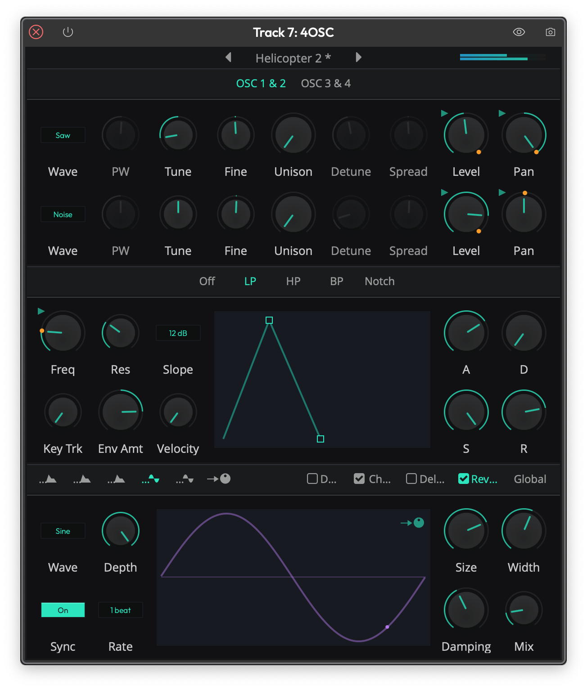

# 4OSC Synthesizer

4OSC is Waveform's built-in four-oscillator subtractive synthesizer. It gives you everything you need to build sounds from scratch -- four oscillators with unison, a multi-mode filter, amplitude and filter envelopes, two modulation envelopes, two LFOs, and a chain of built-in effects. If you need a quick synth sound without reaching for a third-party plugin, this is where to start.

*The 4OSC synthesizer showing oscillators 1 and 2, the low-pass filter, amp envelope, and global settings.*

## Oscillators

4OSC provides four independent oscillators, displayed in two pages: **OSC 1 & 2** and **OSC 3 & 4**. Click the page tabs at the top of the plugin to switch between them. Each oscillator has its own row of controls.

### Waveform Selection

**Wave** -- Selects the oscillator's waveform. Choose from None, Sine, Square, Saw, Triangle, or Noise. Setting an oscillator to None disables it entirely, which greys out its other controls. (Default: Oscillator 1 is Sine, Oscillators 2-4 are None)

> 💡 **Tip:** Start with a Saw or Square wave for rich, harmonically complex sounds, then use the filter to shape the tone. Sine works well as a sub-oscillator layered underneath.

### Per-Oscillator Controls

**PW** (Pulse Width) -- Adjusts the pulse width of the Square waveform. Only active when the oscillator is set to Square. Moving this away from center creates increasingly asymmetric square waves with a thinner, more nasal character. (Default: 50%)

**Tune** -- Coarse pitch tuning in semitones, from -36 to +36. Use this to set octave intervals between oscillators or create chord-like stacks. (Default: 0 st)

**Fine** -- Fine pitch tuning in cents, from -100 to +100. Slight detuning between oscillators (3-10 cents) adds warmth and movement. (Default: 0)

**Level** -- The volume of this oscillator in decibels, from -100 dB to 0 dB. (Default: 0 dB)

**Pan** -- Stereo position of the oscillator, from full left to full right. Panning oscillators apart creates a wider stereo image. (Default: center)

### Unison

Each oscillator can stack up to eight voices for a thick, detuned "supersaw" or "superwave" sound.

**Unison** -- The number of stacked voices, from 1 to 8. Higher values create a denser, more chorus-like sound at the cost of CPU. (Default: 1)

**Detune** -- How far apart the unison voices are detuned from each other. Small values give subtle richness; large values sound more like a detuned chorus. Only active when Unison is greater than 1. (Default: 0%)

**Spread** -- The stereo spread of the unison voices, from -100% to +100%. At higher values, voices are panned further apart across the stereo field. Only active when Unison is greater than 1. (Default: 0%)

> 💡 **Tip:** For a classic supersaw lead, set one oscillator to Saw with 5-7 unison voices, a small amount of detune, and spread around 50-70%.

## Filter

The filter section sits in the middle of the plugin. Select a filter type from the header bar: **Off**, **LP** (Low Pass), **HP** (High Pass), **BP** (Band Pass), or **Notch**. When set to Off, the entire filter section is bypassed and its controls are greyed out.

**Freq** -- The filter cutoff frequency, displayed in Hz. This is the most important filter control and responds beautifully to modulation. (Default: 440 Hz)

**Res** (Resonance) -- Boosts frequencies around the cutoff point, from 0% to 100%. Higher values create a sharper, more pronounced peak. Be careful above 80% as things get loud and resonant. (Default: 0%)

**Slope** -- Selects between 12 dB/octave and 24 dB/octave filter rolloff. The 12 dB slope is gentler and more natural; 24 dB is steeper and more aggressive. (Default: 12 dB)

**Key Trk** (Key Tracking) -- Controls how much the filter cutoff follows the note you play, from 0% to 100%. At 100%, the filter tracks the keyboard one-to-one, keeping the tonal character consistent across the range. At 0%, the filter stays at the same frequency regardless of what note you play. (Default: 0%)

**Env Amt** (Envelope Amount) -- Controls how much the filter's own ADSR envelope affects the cutoff frequency, from -100% to +100%. Positive values sweep the filter up from the cutoff on each note; negative values sweep it down. Setting this to zero disables the filter envelope controls. (Default: 0%)

**Velocity** -- How much note velocity affects the filter envelope depth. At 100%, playing softly barely moves the filter while playing hard opens it wide. (Default: 0%)

### Filter Envelope

The filter has its own dedicated ADSR envelope, shown both as knobs (A, D, S, R) and as a draggable visual graph. This envelope only takes effect when Env Amt is set to a non-zero value.

- **A** (Attack) -- Time for the filter to sweep from initial cutoff to peak, from 0 to 60 seconds. (Default: 100 ms)
- **D** (Decay) -- Time for the filter to fall from peak to sustain level, from 0 to 60 seconds. (Default: 100 ms)
- **S** (Sustain) -- The filter envelope level while a note is held, from 0% to 100%. (Default: 80%)
- **R** (Release) -- Time for the filter to return to initial cutoff after a note is released, from 0 to 60 seconds. (Default: 100 ms)

You can drag the square handles on the envelope graph directly to adjust Attack, Decay/Sustain, and Release visually.

> 💡 **Tip:** For a classic pluck bass, set the filter to LP with a low Freq, high Env Amt, short Attack, moderate Decay, low Sustain, and moderate Release.

## Amp Envelope

The amp envelope controls the volume shape of each note. Select the **A** tab (the first icon) in the bottom-left modulation header to see it. Like the filter envelope, it has both knobs and a draggable visual graph.

- **A** (Attack) -- Time for the note to reach full volume, from 1 ms to 60 seconds. (Default: 100 ms)
- **D** (Decay) -- Time to fall from full volume to the sustain level, from 1 ms to 60 seconds. (Default: 100 ms)
- **S** (Sustain) -- Volume level while the note is held, from 0% to 100%. (Default: 80%)
- **R** (Release) -- Time for the sound to fade out after the note is released, from 1 ms to 60 seconds. (Default: 100 ms)

**Velocity** -- How much MIDI velocity affects the note volume, from 0% to 100%. At 0%, every note plays at the same volume regardless of how hard you play. At 100%, soft notes are much quieter than hard ones. (Default: 100%)

**Analog** -- When enabled, the envelope uses an exponential (analog-style) curve rather than a linear one. This generally sounds more natural and musical. (Default: On)

> 💡 **Tip:** I'd recommend keeping Analog on for most sounds. Linear envelopes can sound stiff in comparison.

## Modulation Envelopes

4OSC includes two independent modulation envelopes, labeled **1** and **2** in the modulation header. These are additional ADSR envelopes that don't directly control anything on their own -- instead, you assign them as modulation sources in the modulation matrix to control any knob parameter.

Each modulation envelope has the same four controls:

- **A** (Attack) -- From 0 to 60 seconds. (Default: 100 ms)
- **D** (Decay) -- From 0 to 60 seconds. (Default: 100 ms)
- **S** (Sustain) -- From 0% to 100%. (Default: 80%)
- **R** (Release) -- From 0.001 to 60 seconds. (Default: 100 ms)

## LFOs

Two LFOs are available, labeled with wave icons (**1** and **2**) in the modulation header. Like the modulation envelopes, LFOs are used as modulation sources to add movement and animation to your sound.

**Wave** -- The LFO waveform: None, Sine, Triangle, Saw Up, Saw Down, Square, or Sample & Hold. Sample & Hold produces random stepped values, which is great for glitchy or retro-style effects. (Default: LFO 1 is Sine, LFO 2 is None)

**Depth** -- The intensity of the LFO, from 0% to 100%. This sets how far the LFO swings the modulated parameter. (Default: 100%)

**Sync** -- When enabled, the LFO rate locks to the project tempo instead of running freely. This switches the Rate control from a free-running Hz knob to a beat-division selector. (Default: Off)

**Rate** (free-running) -- The LFO speed in Hz, from 0 to 500 Hz. (Default: 1 Hz)

**Rate** (synced) -- The LFO speed as a beat division. Options range from 8 beats down to 1/32 beat. (Default: 1 beat)

The LFO panel shows an animated waveform preview with a moving dot that indicates the current LFO phase in real time.

> 💡 **Tip:** A slow Sine LFO modulating filter Freq is the quickest way to add life to a pad sound. Start around 0.5-2 Hz with moderate depth.

## Modulation Matrix

Click the arrow icon (the last tab in the modulation header row) to open the modulation source list. This is where you connect modulation sources to any knob in the synth.

### Available Modulation Sources

- **LFO 1** and **LFO 2**
- **Envelope 1** and **Envelope 2**
- **MPE Pressure** and **MPE Timbre** (for MPE controllers)
- **MIDI Note Number** and **MIDI Velocity**
- **MIDI CC 0-127** (any MIDI continuous controller)

### Assigning Modulation

1. Click a modulation source's assign icon in the source list, or click the assign icon on an envelope/LFO panel. The icon will flash to indicate it is active.
2. The active modulation source name appears in the title bar.
3. While a source is active, click and drag on any knob to set the modulation depth. A white arc appears around the knob showing the modulation range.
4. Drag right/up to increase depth, left/down to decrease it. LFOs are bipolar (modulate in both directions from the knob position), while envelopes and other sources are unipolar (modulate in one direction from the knob position).
5. Click the assign icon again to deactivate assignment mode.

When a parameter is being modulated, a small indicator icon appears on its knob. During playback, orange dots show the live modulated position on the knob arc.

### Removing Modulation

Right-click on a modulated knob while in assignment mode to see a list of its active modulation connections. Select a connection to remove it.

> 📝 **Note:** Hold Shift while clicking on a modulated knob to bypass the modulation overlay and adjust the knob's base value directly.

## Effects

The effects section is on the right side of the bottom panel. Four built-in effects are available, each with a checkbox to enable or disable it: **Dist** (Distortion), **Chorus**, **Delay**, and **Reverb**. Click the **Global** tab to access voice and level settings. Effects are applied in this order: Distortion, Chorus, Delay, Reverb.

### Distortion

A simple saturation-style distortion.

**Distortion** -- The drive amount, from 0% to 100%. Higher values push the signal into harder clipping. (Default: 0%)

### Chorus

A stereo chorus effect that thickens and widens the sound.

**Speed** -- The modulation rate in Hz, from 0.1 to 10 Hz. (Default: 1 Hz)

**Depth** -- The modulation depth in milliseconds, from 0.1 to 20 ms. Higher values create a more pronounced pitch wobble. (Default: 3 ms)

**Width** -- The stereo width of the chorus, from 0% to 100%. Higher values create more left/right separation. (Default: 50%)

**Mix** -- Wet/dry balance, from 0% (fully dry) to 100% (fully wet). (Default: 0%)

### Delay

A tempo-synced stereo delay with crossfeed between left and right channels.

**Delay** -- The delay time as a beat division, from 8 beats down to 1/32 beat. This syncs to your project tempo automatically. (Default: 1 beat)

**Feedback** -- How much of the delayed signal is fed back into the delay line, in dB from -100 to 0 dB. Higher values (closer to 0 dB) create more repeats. (Default: -10 dB)

**Crossfeed** -- How much the left delay feeds into the right channel and vice versa, in dB from -100 to 0 dB. This creates a ping-pong-like effect. (Default: -100 dB)

**Mix** -- Wet/dry balance, from 0% to 100%. (Default: 0%)

> 💡 **Tip:** Set Delay to 1/8 beat with moderate Feedback and a touch of Crossfeed for a rhythmic stereo echo that sits nicely in a mix.

### Reverb

A built-in reverb for adding space to the sound.

**Size** -- The room size, from 0% to 100%. Larger values create longer, more spacious reverb tails. (Default: 0%)

**Width** -- Stereo width of the reverb, from 0% to 100%. (Default: 0%)

**Damping** -- High-frequency damping, from 0% to 100%. Higher values roll off the highs in the reverb tail, creating a darker, more natural-sounding space. (Default: 0%)

**Mix** -- Wet/dry balance, from 0% to 100%. (Default: 0%)

## Global Settings

Click **Global** in the effects header to access the master voice and output settings.

**Mode** -- The voice mode for the synthesizer:
- **Mono** -- One voice at a time. New notes cut off the previous note immediately.
- **Legato** -- One voice at a time, but overlapping notes glide smoothly instead of retriggering the envelopes.
- **Poly** -- Multiple simultaneous voices.

(Default: Poly)

**Legato** -- The glide time in milliseconds when in Legato mode, from 0 to 500 ms. Only active when Mode is set to Legato. (Default: 0 ms)

**Level** -- Master output level in dB, from -100 dB to 0 dB. Use this to match the 4OSC's output volume with other instruments in your project. (Default: 0 dB)

**Voices** -- The maximum number of simultaneous voices in Poly mode, from 1 to 32. Lower values save CPU but may cause notes to be stolen when you play dense chords. (Default: 32)

## Presets

4OSC ships with a library of factory presets. Use the preset browser in the title bar at the top of the plugin to browse and load them. Click the left and right arrows to step through presets, or click the preset name to open the full browser.

You can save your own presets and reset the synth to its default state by right-clicking the preset name and selecting **Reset to default**.

## MPE Support

4OSC supports MIDI Polyphonic Expression (MPE) controllers. To enable MPE mode, right-click the plugin header and check **MPE**. When MPE is active, the synth responds to per-note pressure and timbre messages, which you can use as modulation sources in the modulation matrix.

## ⚡ Things to Watch Out For

- **Filter Resonance at high values.** Resonance above 80-90% can produce very loud, piercing peaks. Turn down the master Level or your monitoring volume before experimenting with extreme resonance settings.

- **Unison voice count and CPU.** Each oscillator can have up to 8 unison voices, and you have four oscillators. Running all four at max unison in Poly mode with 32 voices means the synth could be rendering over 1,000 oscillator voices simultaneously. If you hear crackling or audio dropouts, reduce the Unison count or the Voices setting.

- **Filter envelope controls appear greyed out.** The filter ADSR knobs are disabled when Env Amt is set to zero, since there is nothing for the envelope to do. Turn Env Amt away from zero to activate them.

- **Delay time is tempo-synced only.** The delay effect always locks to your project tempo. If you need a free-running delay with a specific time in milliseconds, use a separate delay plugin on the track instead.

- **Effects are post-voice.** Distortion, Chorus, Delay, and Reverb are applied after all voices are mixed together. You cannot process individual voices through separate effect settings.

## Moving On

4OSC is a capable synth for bread-and-butter sounds like basses, pads, leads, and plucks. Between the four oscillators with unison, the multi-mode filter with its own envelope, two mod envelopes, two LFOs, and the built-in effects, you have a lot of sound design territory to explore without ever leaving Waveform. When you are ready for wavetables, samples, or more advanced modulation, check out Waveform's other built-in instruments.
