# Audio Clips and Editing Audio

In this chapter, you are going to learn how to work with Audio clips.
and how to work with the integrated editing handles that are part of
each Audio clip.

## Parts of an Audio Clip

Notice that an Audio clip has several parts. It has a header that
includes trim and slip handles. It has a body that contains the waveform
thumbnail and fade handles.


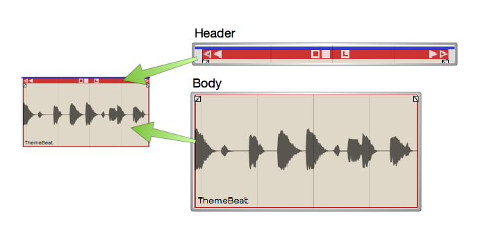

*Main Parts of and Audio Clip*

Header
- Move Audio clips by dragging from the header. The header includes
    the trim handles (hollow), slip handles (solid), and other tools.


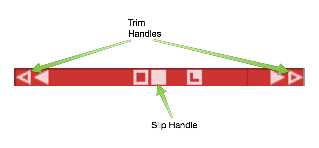

*Audio Clip Header*

Body
- The Audio clip body features the waveform thumbnail, fade handles,
    and the clip name.


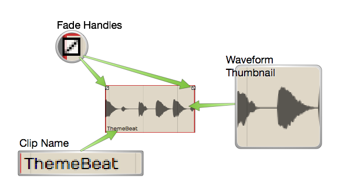

*Audio Clip Body*

Plugins
- Audio clips can host plugins directly, so you might see one or more
    plugins right on the clip body. Learn more about that in [Clip Effects](clip-effects.md).


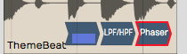

*Audio Clip Effects*

Properties
- Like most other objects in Waveform, Audio clips have lots of
    additional properties and controls in the Actions panel.


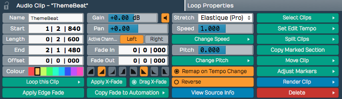

*Audio Clip properties*

> 📝 **Note:** If you accidentally move or edit an Audio clip, you can always
press *Undo* (Cmd + Z / Ctrl + Z) at the top of the Menu section.

## Moving Clips

As you move the mouse pointer over the Audio clip header, it changes to
a grabbing hand. Use that to drag the clip forward or backward in time.
If *Snap* is on, the beginning of the clip will snap by grid increments.


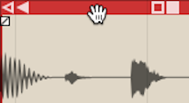

*Move Audio Clips by Dragging from the Header*

> 📝 **Note:** As we discussed previously, the grid resolution depends on the
zoom level.

You can also drag Audio clips from track to track. With snap enabled,
track-to-track drags will usually stay in sync. However, with snap
turned off, it is easy move the clip slightly off time. To prevent that,
hold down Shift as you drag track to track. The Shift key, constrains
the timing of track to track drag moves.

> 💡 **Tip:** Another way to move a clip track-to-track without changing the
timing is to use nudge. Select the clip the hold down Shift and press Up
Arrow or Down Arrow to nudge it to another track.

## Deleting Clips

The easiest way to delete a clip is to selected it and press Delete or
Backspace. The cut (Cmd + X / Ctrl + X) keyboard action does the same
thing. If you need yet another way to delete, locate and click the
convenient *Delete* button in properties.


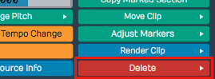

*Audio Clip properties *Delete* button*

> 💡 **Tip:** As you work with clips sometimes you just want clear the
selection. The fastest way is to just hit Esc.

## Audio Clip Handles

Each Audio clip header includes six handles that you use for trimming,
slipping, stretching. These are represented as four arrows and two
boxes.

Trimming
- Hollow left and right arrows on both of the upper corners of the
    clip are trim handles. Grab a trim handle and drag left or right to
    trim the start or end of the the clip. Notice that trimming this way
    directly changes the *Start* and *End* values in properties. With
    *Snap* turned on, trimming snaps to the grid. To trim freely, hold
    down Cmd / Ctrl as you drag or turn *Snap* off.


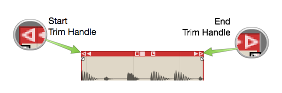

*Audio Clip Trim Handles*

Slip Editing
- Slip editing means moving the waveform within the clip without
    altering its *Start*, *Length*, or *End* values. Drag the solid box
    shaped handle left or right to slip edit. You can override
    snap-to-grid during slip editing by holding down Cmd / Ctrl.


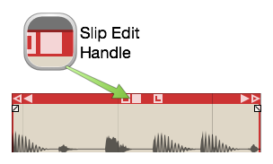

*Audio Clip Slip Handle*

Reframing
- The hollow box shaped handle allows reframing the clip. Drag it left
    or right and the clip moves but the waveform doesn't. It essentially
    allows you to reframe the audio without affecting its timing.

Slip Trimming
- The solid left and right arrow handles are for slip trimming. Try
    dragging the left solid arrow. Notice that it moves the clip *Start*
    while keeping the *End* planted. Now try the right solid arrow.
    Moving that one, moves the *End* while keeping the the *Start*
    planted. Although this operation seems similar to trimming, the
    difference is that the underlying waveform slips relative to the end
    that is not moving.

> 💡 **Tip:** With *Snap* on, hold down Cmd / Ctrl as you drag to temporarily
override snapping for most editing operations.

**Video Clip:** [Basic Audio
Editing](https://w-edstrom.wistia.com/medias/qr0fax85zn)

## Splitting a Clip

Splitting Audio clips, is essential for audio editing. Here is the
quickest way:

1.  Select the clip
2.  Position the cursor where you want to make the split
3.  Press slash (/)


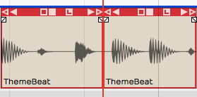

*Audio Clip, Right after Split*

> 💡 **Tip:** If you want to make numerous splits, you can keep holding down
the left mouse button as you drag the cursor and press slash (/) - never
lifting the mouse button.

Audio clip properties also include *Split Clips* actions. Look to the
far right in properties and find the *Split Clips* button. You will find
options to slip at the cursor along with options to split at the
in-marker or out-marker. Keep in mind that these actions will only
affect selected clips.


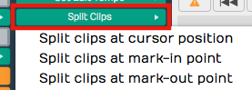

*Audio Clip properties, Split Clips actions*

## Duplicating Clips

To duplicate one or more clips, select the clip and press D. That will
copy the clip and paste it right after the original clip. Duplicate
works like copy and paste, all in one action.

> 💡 **Tip:** If you want to use a different key for the duplicate action,
you can change it in *Settings tab > Keyboard Shortcuts > Editing
Functions: Duplicate*.

## Fade-in/Fade-out

In the upper corners of the Audio clip body, notice the fade handles.
Each is shaped like a tiny box with a diagonally line through it. Grab a
fade handle and pull it inward. This action draws a fade-in or fade-out.


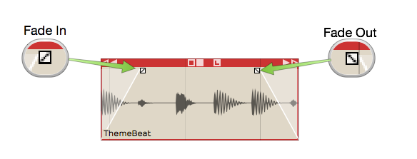

*Audio Clip Fades*

**Video Clip:** [Fade-in/Fade-out
Demo](http://vimeo.com/user356034/fades)

By default, you will get a linear fade, but there are other fade types
available in properties for the clip. For more control, directly edit
the *Fade In* and *Fade Out* numerical values in properties.


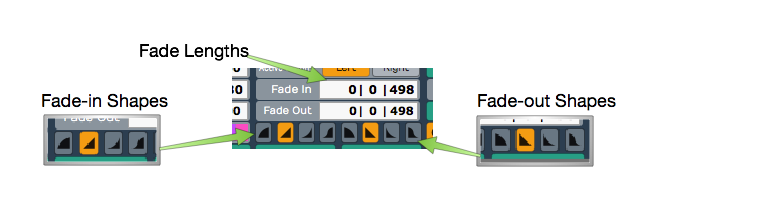

*Audio Clip, Fade properties*

## Pitch Fade

Right click on the fade handle, and you can select between a volume fade
and pitch fade. Pitch fade gives you a very cool tape stop effect or
tape run-up effect. The fade graphic is shaded darker than for volume
fades.


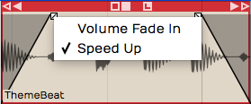

*Right-click Fade Handle, Pitch Fade Speed Up*

Here is a video tutorial demonstrating pitch fade:

[Pitch Fade Video
Tutorial](https://w-edstrom.wistia.com/medias/o2ff37pknl)

## Crossfades

A crossfade is fading out one Audio Clip while fading in another. Some
controls in Waveform are labeled "X-Fade" when referring to crossfade.
Here are the steps to create a crossfade:

1.  Drag a clip so that it it overlaps another one somewhat.
2.  Press X on the keyboard.


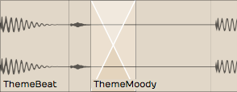

*Crossfaded Audio Clips*

That's it: a crossfade. It's a fade-out that overlaps the fade-in of the
next clip. You can adjust the fade shapes using the buttons in
properties, just like any other fade.


*Fade-in/Fade-out Shape Buttons*

> 📝 **Note:** Keep in mind that the fade shape buttons only operate on the
selected clip. You will need to select the clip on the appropriate side
of the crossfade for the fade shape buttons to work.

## Drag Crossfade

The Settings tab, General page has a setting labeled *Default
Drag X-Fade*. It has two possible settings: *On by default* or *Off by
default*. When set to *On by Default*, the simple act of dragging a clip
so that it overlaps another clip will create a crossfade. Other DAWs
call this "auto-crossfade."


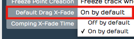

*Settings Tab, General page, Drag Crossfade Default*

> 📝 **Note:** In Waveform, *Drag-X Fade* is actually a property of each
Audio clip. When you change *Default Drag X-Fade* it will only take
effect for new clips you create or add to the Edit.

## Edge Fades

When editing, sometimes you need to apply short fades to both edges of
an Audio Clip to avoid popping. This is especially true if you split a
clip in the middle of a note. The solution is add as short fade-in and
fade-out to the clip. Waveform calls those "edge fades."


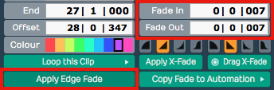

**Apply Edge Fade**

The good news is that you can instantly add edge fades by clicking
*Apply Edge Fade* in properties. This applies 7 ms fades to the start
and end of all selected clips.

## Copy and Paste

Typical cut, copy, and paste commands also work with with Audio clips:

-   Cut (Cmd + X / Ctrl + X)
-   Copy (Cmd + C / Ctrl + C)
-   Paste (Cmd + V / Ctrl + V)

## Clip Gain, Mute, & Pan

Adjusting the gain of an Audio clip is great tool for mixing. Simply
split out one phrase, or even one note and tweak the gain level.
Waveform has not only clip gain but also clip mute and pan - all
available in properties. When working with stereo Audio clips, *Pan*
works as a balance control.


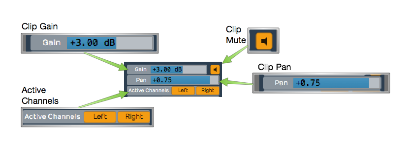

*Audio Clip Gain, Mute, Pan, & Active Channels*

Gain
- Drag the slider left or right to adjust the Gain value.
    Alternatively, click the slider and type in a value directly. The
    gain change is reflected right away in the height of the waveform
    thumbnail on the clip.

Mute
- Click the *Mute* icon to silence the clip. The waveform thumbnail
    will dim to gray.

Pan (Mono Clips)
- Drag the *Pan* slider left or right to adjust the stereo placement
    of the clip. You can also click and type in values directly. Full
    left is -1.00, centered is 0, and full right is 1.00.

Pan (Stereo Clips)
- With stereo Audio clips, *Pan* acts as a balance control. What that
    means is that as you slide it more right the left side gets quieter.
    Slide it left and the right side gets quieter. At the extreme left
    and right positions the opposite side is silent. The really cool
    thing about this is that the waveform thumbnail updates dynamically
    show to show the effect.

Active Channels (Stereo Clips)
- For stereo clips you can turn off either the left or right channels
    using the *Active Channels* buttons in properties. When you click
    *Left*, for example, it toggles the left side off. But it's not just
    muting the left side, it switches the clip to a mono version of the
    right side material. The great thing is that the waveform thumbnail
    updates to show this instantly.

## Reversing Audio Clips

Another cool thing you can do is reverse a clip so the audio plays
backwards. Simply click the *Reverse* button in properties. The waveform
thumbnail reverses and the sound will be backwards on playback.


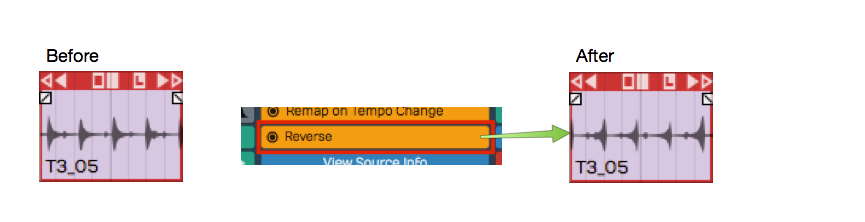

*Reversing an Audio Clip*

## Merging Clips to One Clip

Following editing, you may want to combine several clips back into to a
single clip. To do so, select all the clips using shift select or lasso
selection. Then choose *Render Clips > Merge the selected clips* in
properties.


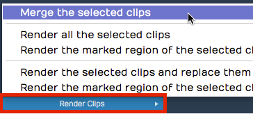

**Render Clips > Merge the selected clips**

In a few moments, Waveform combines them into a single contiguous clip.
There are many ways to merge, render, and export that we will touch on
later.


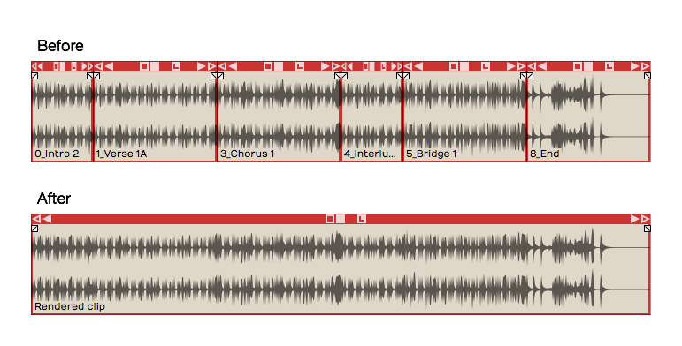

*Merge Clips, Before and After*

Here is video demo of merging clips:

[Merge Selected Clips Video
Demo](https://w-edstrom.wistia.com/medias/5h6bn8h3vg)

## Deleting a Section of Audio Removing Space

You can easily delete a section of audio from one or more clips and
remove the space between clips. While it's not entirely obvious how to
do this, it is easy if you follow these steps:

1.  Set the in-marker and out-marker over the section you want to
    delete.
2.  Select all the clips on all tracks (Cmd + A / Ctrl + A)
3.  In the properties, choose *Delete > Delete marked region of selected
    clips, and move up any selected clips* (Cmd + J / Ctrl + J).


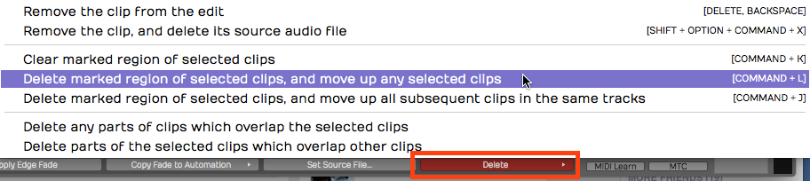

*Delete a Section Removing the Space*

## Editing with ARA

Waveform supports **ARA** (Audio Random Access) plugins for deep,
non-destructive pitch and time editing directly on a clip. Unlike a
conventional plugin, an ARA plugin has continuous access to the clip's
audio, so its edits stay perfectly in sync with Waveform's transport and
loop as you work.

The most popular ARA plugin is **Celemony Melodyne**, and a **Melodyne
Essential license is bundled** with Waveform — you will have received
information on how to install it, along with your Waveform order. The
workflow below uses Melodyne as the worked example, but **any ARA plugin
you install** (for example VocAlign, SynthV, or SpectraLayers) appears the
same way and is invoked by name.

> 📝 **Note:** ARA is available in all editions of Waveform, on **macOS and
Windows only**. Installed ARA plugins also appear in the **ARA** column of
*Settings > Plugins*.

### Invoke an ARA plugin

1.  Select an Audio clip.


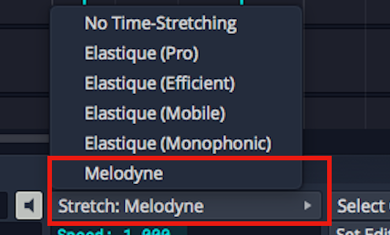

*Change *Stretch* Property to *Melodyne**

2.  In the properties change the *Stretch* property to the name of the ARA
    plugin you want to use. Installed ARA plugins are listed together under
    an **ARA** heading in the dropdown; choose *Melodyne* here. The clip's
    Stretch property now reads **ARA: Melodyne** and the plugin's name
    appears at the center of the clip.


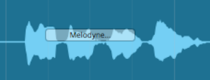

*Audio Clip with Melodyne Invoked*

3.  Click the plugin name at the center of the clip — or click **Show ARA
    plugin editor** in the properties — to open the plugin's editor.


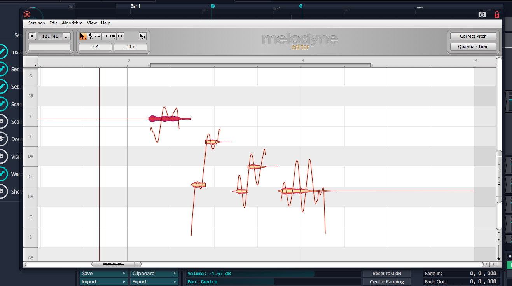

*The Melodyne UI*

4.  Edit pitch and time by manipulating the note "blobs" in the plugin's
    UI. Note that the transport and loop is synchronized between
    Waveform and the ARA plugin as you edit.

> 💡 **Tip:** To learn all about Melodyne click *Help > Manual* within the
Melodyne UI. Skip the section on Loading, Transferring and Saving, as
those operations are handled automatically by ARA.

> 📝 **Note:** While a clip is in ARA mode, warp time, reverse, and
Speech-to-Text are unavailable for that clip.

Here is how to remove an ARA plugin from a clip:

1.  Select an Audio clip that is using an ARA plugin.
2.  In the properties change the *Stretch* property to *No Time-Stretching*
    or a time-stretch algorithm such as *Elastique Pro*. The ARA plugin is
    removed from the clip.

### Reopen the editor from the clip

While a clip is in ARA mode, the clip strip shows a small **"<plugin>…"**
button (for example *Melodyne…*) — click it at any time to reopen the
plugin's editor. The pitches the plugin has detected are also drawn as a
**note overlay** on top of the clip's waveform, so any pitch and timing
edits you make in the plugin are reflected directly on the Waveform clip.

### Convert an audio clip to MIDI

When a clip is in ARA mode, the properties show a **Use ARA plugin to
convert this audio clip to MIDI** button. Clicking it uses the plugin's
note analysis to create a **new MIDI clip** — with the same name, start,
and length — and **replaces the audio clip** on that track. This is a quick
way to turn a monophonic part, such as a vocal or bass line, into an
editable MIDI performance.

**Video Clip:** Here is a video clip that explains [how to invoke
Melodyne in Waveform](https://youtu.be/N3T8G-qF4zQ).

## Group Clips

With Group Clips, you can combine clips on a track into a single grouped
clip without rendering. The advantage of this is that you can ungroup at
any time for access to the individual clips.

To create a Group Clip, select the clips you want to group on a track.
It doesn't have to be a contiguous selection, but the clips do need to
reside on the same track.


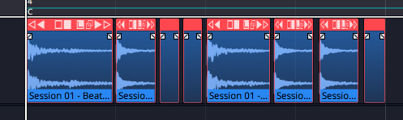

Next, click *Create Group Clip* in the Actions panel.


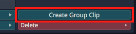

*Create a Group Clip from the Actions panel*

Notice that the resulting clip has a "Group" label and icon on the lower
left which indicates the number of clips it contains. It also has a
simplified header.


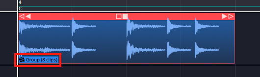

*A Group Clip*

To ungroup the clip back to the original state, select it and click
*Ungroup* in the Actions panel.


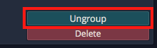

*Ungroup from the Actions panel*

If you like, you can create a macro and assign *Group Clips* and
*Ungroup* to keyboard shortcuts. In the Script Editor, locate the
actions under *Basic Actions > Editing > Group selected clips* and
*Basic Actions > Editing > Ungroup selected clips*.

Here is the code:


```js
// Group Clips Macro
Tracktion.groupSelectedClips();
```


```js
// Ungroup Clips Macro
Tracktion.ungroupSelectedClips();
```


Group Clips can be useful when working with beats created from sliced up
audio. You can treat the Group Clip as a single clip, making move and
duplicate operations straightforward. At any point you can ungroup it to
modify the various parts.

## Linked Clips

You can also easily create linked copies of clips that reference the
same underlying audio file or MIDI data. Changes to the original clip
are then reflected in any of the linked copies. This works for Audio
clips, MIDI clips and Step clips.

To create a linked clip, drag the *Linked Clip* handle from the clip
header. As you drag, you are dragging a copy referenced back to the
source clip.


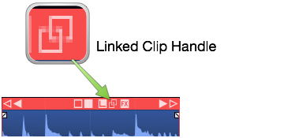

*Linked Clip Handle*

In the following image, we have dragged over a linked copy of an audio
file. Notice that the lower left of each clip shows a "link" icon
indicating that this is a linked clip.


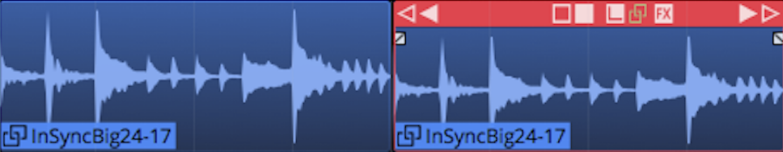

*Linked Audio Clips*

To test the link, we have reversed the audio on the first clip. Since
this changes the underlying file, the second clip is also reversed.


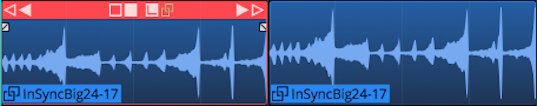

*Reversed Linked Audio Clips*

Non-destructive edits like splits and fades don't affect the linked
copy. However, anything that affects the underlying file will. For other
examples of this type of edit, select an audio clip then in the Actions
panel open *View Source Info > Edit Audio File > Basic Editing
Operations*.


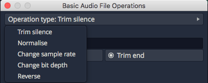

*Basic Audio Editing Operations*

From this dialog you can perform several kinds of edits to the
underlying file. These operations will affect all linked copies as well
as the original.

Linked clips might be even more useful for MIDI clips. Any changes made
to one of the linked clips are reflected in all the copies. This can be
useful when creating a beat that is used in many places in a song. If
you update one linked copy, they all get revised.


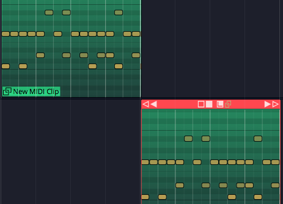

*Linked MIDI Clips on Separate Tracks*

While you could do something similar with looped clips, looped clips are
a series of continuous repeats on a single track. Linked clips appear as
separate clips and can even be placed on separate tracks.


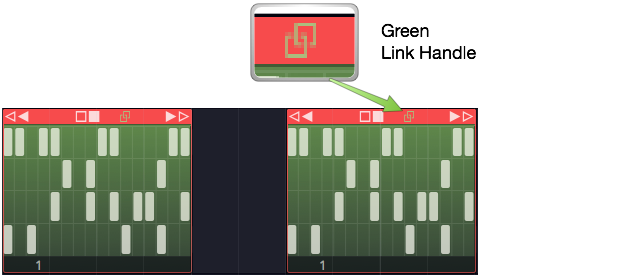

*Linked Step Clips Green Handle*

Step clips can also be copied using the *Linked Clips* handle.

> 💡 **Tip:** It's a bit more difficult to identify linked Step Clips because
they don't have clip names along with the link icon. You can identify
linked Step Clips because the *Linked Clip* handle in the header turns
green whenever there are linked copies present. This holds true for
linked Audio clips and MIDI clips as well.

## Moving On

Those are the simple but powerful tools in for editing Audio clips in
Waveform. We didn't even cover time stretching, Warp Time. But, these
are the fundamentals. Let's move on to looping Audio clips in the next
chapter.


