# Audio Device Setup

To use Waveform, it is essential to configure it to work with your audio
interface. It doesn't matter wether you want to use the internal audio
unit built into your computer, or an external audio interface connected
to it. Of importance is only to communicate with it in the right way. 
Waveform supports the following communication protocols:

- Windows: ASIO (recommended), and Windows Sound
- macOS:   Core Audio
- Linux:   JACK (recommended), and ALSA or PulsAudio/ALSA

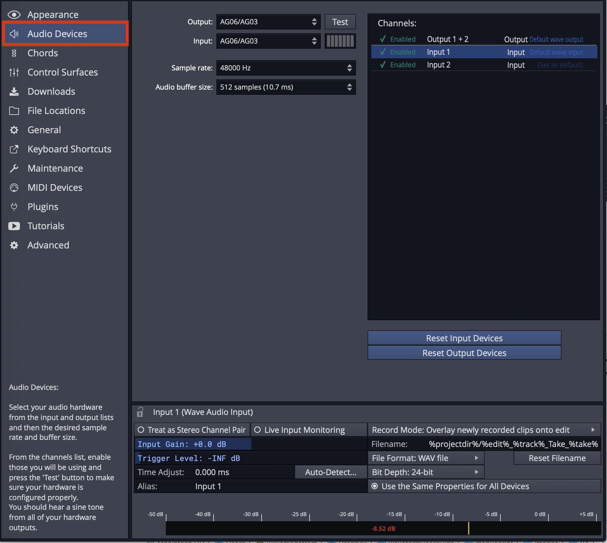

*Audio Device Page*

> ⚠️ **Warning:** To configure Waveform for recording, you must use the
Auto-Detect feature along with a hardware loopback. If you don't, then
your overdubbed tracks will not be in alignment with existing tracks.
While this is not difficult, it is essential to do this manual step
anytime you change the Audio Device Setup. The procedure to do this is
covered in this chapter.

This chapter covers the essential steps to get your audio interface
configured as an audio device in Waveform.

## Audio Device Setup in Windows

If you haven't already, navigate to *Settings tab > Audio Devices page.*

Audio Device Type:
 Waveform gives Windows users four choices for audio device type.

-   Windows Audio
-   Windows Audio (Exclusive)
-   DirectSound
-   ASIO

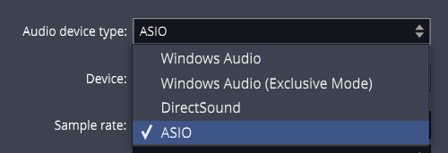

*Windows Audio Device Types*

Any of the above four options might work with your computer, but there
are definite differences, and best choices:

**ASIO**
- This is the best choice if you are using an external audio
    interface. The first step is to install the manufacturer's driver.
    Using ASIO will usually give you the best low latency performance
    for recording and playback. Many modern audio interfaces include a
    mixer app to control low latency mixing within the unit. When using
    ASIO, you simply choose the device and it is set for both inputs and
    outputs.

**Windows Audio**
- Use this if you are running Windows 10 and are using the internal
    sound on your machine. This solution is great for using a laptop
    directly while traveling. This device type uses WASAPI (Windows
    Audio Session API) which offers nicely optimized access from
    applications software to audio I/O. Windows Audio will also function
    with USB Audio Class 1 interfaces.

**Windows Audio (Exclusive Mode)**
- This is the same as Windows Audio, but Waveform will not allow any
    other application to use the audio interface while running. For the
    lowest latency and most critical applications, choose this option
    when using your internal sound.

**DirectSound**
- This is technology is deprecated in Windows 10 and there is no good
    reason to choose this option. Back in the day, this was the best
    choice when using Windows XP with your internal sound.
Tip: Stay away from the DirectSound device type.

> 📝 **Note:** Windows versions earlier than Win 10 are end of life and officially no more supported. While you might
be able to run Waveform on older Windows 64-bit systems, the Waveform development and support team run their Win tests on versions 10 and 11.
    
> 📝 **Note:** Starting with release 1703, Windows 10 supports USB Audio
Class 2 devices natively. For simple 2 x 2 interfaces or built-in audio
this is a workable alternative to using ASIO. For the full feature set
for most audio interfaces it is still recommended that you install and use
manufacturer's drivers and use ASIO if possible.

## Audio Device Setup on macOS

1.  Click on the Settings tab, then select the Audio Devices page.
2.  Select an output Device. Assuming you have the necessary drivers
    installed and the device hooked up, it should appear as an option
    for the *Output:* property.

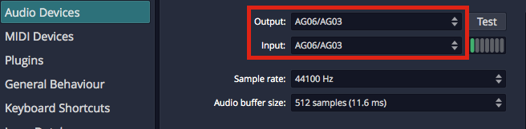

*OS X - Audio Device Output and Input Properties*

> 📝 **Note:** With macOS, USB audio interfaces that follow USB Audio Class 1
(1998) or USB Audio Class 2 (2009) will function without installing any
additional driver. In the product specs for such devices they are often
listed as "class compliant."

1.  Select an Input device

> 💡 **Tip:** We strongly suggest that you select the same device for the
output and the input. In this example, we are using a "USB iTwo" which
is a simple 2 in / 2 out interface.

> 📝 **Note:** On OS X, you can select the input device and output device
separately.

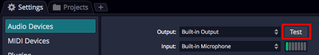

*Audio Device **Test** Button on Mac*

Test Button
- There is a convenient *Test* button next to the audio device
    parameter. Click it to send a short test tone to the audio device's
    output. If you hear the tone, you know your device has been
    configured correctly.

## Audio Device Setup on Linux

Waveform can connect to the Linux audio system by JACK or ALSA.

The usual requirement for low latency signal pathways and the extended
routing options recommend to configure Waveform for JACK usage, though.

**Settings tab > Audio Devices page > Audio Device Type = JACK**

While the configuration of Waveform is obviously quite easy, the
preparation of the Linux system itself and finding an audio device
being compatible with Linux requires some attention.

Concerning the audio interface: It is out of the scope for the Waveform development and support team to promise you anything about the Linux compatibility of your audio device. We do share some experience to give you an idea about the situation, though. Internal audio chips built into the motherboard of the computer, as in Laptops, are mostly supported by Linux. External audio devices connecting via USB, but only if said to be "USB" or "iOS" compliant, are usually also supported, at least in regard to accessing their basic input and output channels. If these USB devices would come with management software, then this is usually not supported in Linux and functionality only available through the management software stays hidden to Linux users. For internal cards, or audio interfaces connecting by other means (Firewire, for instance), generalized statements cannot be made at all. Independent of your audio device being integrated, or connected by USB, or whatever, we highly encourage you to contact your hardware vendor for clarification, or to consult the relevant Linux user communities about their experience with the hardware of interest. One of the possible addresses would be the following internet forum: https://linuxmusicians.com/viewforum.php?f=6

Concerning the Linux setup:
PipeWire is nowadays found to be the by default configured internal audio data (and video data) transportation mechanism in mayor Linux distributions.
Hence, instructions are in the following given with regard to PipeWire. The Ubuntu LTS (24.04) distribution of Linux is taken as for a test run.

Some background information: PipeWire was developed as a low latency capable replacement for the proven, but expandability and integration limited JACK, ALSA, PulseAudio and GStreamer protocols.
It provides the necessary compatibility layers for staying interoperable with applications programmed to connect to those software interfaces. Regarding ALSA it is noteworthy to mention,
that its user space features are intended to be replaced, while the ALSA parts providing the hardware drivers remain untouched.

Out of the box, Ubuntu (or a flavor of it like Kubuntu) comes with the
audio system being based on PipeWire, being provided by the preinstalled packages
*pipewire* and *pipewire-pulse*.
Basically, the following audio signal pathway is then usually in use:

**App** (Multimedia Player) **--> pipewire-pulse --> basic management layer --> pipewire --> ALSA --> audio device**

The user just runs the app of interest. All the rest stays hidden to the
user and is cared for by the Linux operating system.

However, for running **Waveform** in Ubuntu, the compatibility
layers for interfacing the **JACK** or **ALSA** protocols have to be added to
the PipeWire environment, after they are not found to be preinstalled
in Ubuntu. The required packages are:

- *pipewire-jack*
- *pipewire-alsa*
- *wireplumber*

The *pipewire-jack* and *pipewire-alsa* packages are obviously providing the compatibility
layers. WirePlumber replaces the basic, not being sufficient
anymore management layer found initially in service in the basic
PipeWire setup of Ubuntu, providing some under the hood
required more sophisticated management capabilities.

Up to here things are pretty much the same in all Linux derivatives which are somehow building on top of the Debian distribution, like SparkyLinux, Ubuntu, LinuxMint, etc. .
However, the additional to the package installation necessary configuration steps may vary.

The easiest way to get Ubuntu ready for advanced audio works and to connect to Waveform is to simply install the following package:

- *ubuntustudio-pipewire-config*

This package in Ubuntu draws in all above mentioned packages and also puts all necessary configurations into place.
Now restarting the Linux system eliminates having to hassle with any further configuration steps.
In principal, after the reboot, you are ready to go, and the following signal pathways are now usable:

**App** (Multimedia Player) **--> pipewire-pulse --> wireplumber --> pipewire --> ALSA --> audio device**

**App** (Waveform) **--> pipewire-alsa --> wireplumber --> pipewire --> ALSA --> audio device**

**App** (Waveform) **--> pipewire-jack --> wireplumber --> pipewire --> ALSA --> audio device**

They can be used in parallel, and each of them with its particular feature set.
For instance, JACK interfacing applications can have signal routing in-between JACK capable apps, allowing to build up sophisticated audio app networks. As a graphical patch bay for a JACK based audio network, i.e. *qpwgraph* could help with the audio network administration.
Or, to give another example, several applications interfacing to PulseAudio, and several interfacing to JACK, can be in use in parallel, also all of them streaming in parallel to the same audio interface. PipeWire will mix the streams with almost zero latency.
Using the ALSA pathway for Waveform is the same possible as in the past. However, after setting up JACK for PipeWire is nowadays so easy and straight forward, contrary to the configuration hassles in the past, and as JACK allows for a lower latency signal pathway, configuring Waveform to use the JACK pathway is highly recommended.

For convenience, the apps **Ubuntu Studio Audio Configuration** and **Ubuntu Studio Installer** could be installed from package:

- *ubuntustudio-installer*

The app Ubuntu Studio Audio Configuration aids in the configuration of the principal audio system options. It is especially useful for easily changing the so called PipeWire Quantum, which cares to balance latency and system load depending on the parameter set of buffer size and sample rate. The default parameter set is "1024 48000". For changing it system wide and immediately, simply run the tool and enter the wished values.
The app Ubuntu Studio Installer would allow to proceed much more specialized configurations. For instance, it allows by the tip of a finger to install a low latency kernel and to proceed with all related configurations automatically. This app could also install curated bundles of software to the system, not only targeting creatives working with audio (bundle *ubuntustudio-audio*) but also targeting the topics of video and photography. Offerings by the Ubuntu Studio Installer are for many users and modern computers not essential. Of mayor interest is the Ubuntu Studio Audio Configuration tool, though.

## Choosing the Audio Interface

With the audio device type set, you can choose any audio interface
connected to your computer or the internal sound. Select your device if
it's not already shown for the *Device:* property.

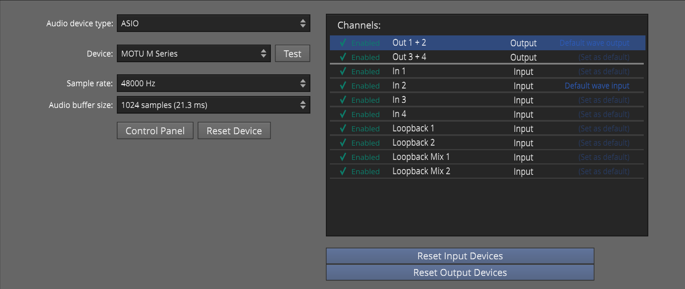

*ASIO Device Setup on Windows*

Control Panel
- On some but not all audio interfaces, clicking the *Control Panel*
    button will open the manufacturer's driver control panel to set the
    buffer size. Many audio interfaces don't allow you to set the buffer
    size or the sample rate through host software. If that is the case,
    locate the control panel software on your system, and open it. Set
    the *Sample Rate* and *Audio buffer* size there. In some cases, you
    will need to restart Waveform for the change to take effect.

## Setting the Sample Rate

The default for the sample rate is 44100 Hz, which matches the sample
rate for CDs. We suggest choosing this sample rate or 48000 Hz unless
you have a specific reason to choose a different sample rate.

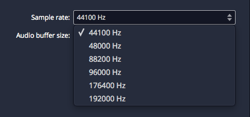

*Setting the Sample Rate*

## Testing for Audio Playback

It is a good idea to test playback to make sure you get sound as well as
a complete stereo image. Here is one way to do that:

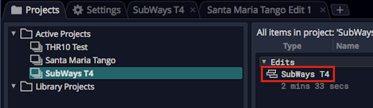

*Loading the SubWays Demo*

1.  Go back to the Projects tab and select one of the demo tunes -
    Subways is a good choice.
2.  Locate the Edit on the right (SubWays T4) and double-click to open
    it.
3.  Click *Play* (spacebar) and you should hear music!

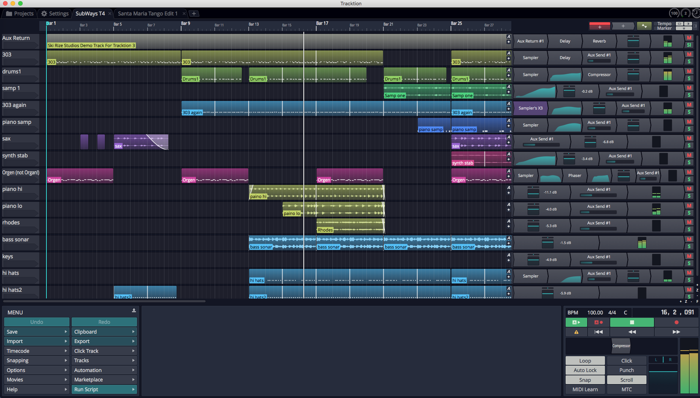

*Successful Play Back*

## About Latency

The process of mixing your tracks together, calculating digital effects,
and triggering instrument samples takes time in any DAW. It is
impossible for digital mixing to happen instantly. The amount of time
your computer needs to compute, process, mix and playback from input to
output is called 'latency.' Latency is the amount of time you allow the
computer think and is normally measured in milliseconds - from just a
few to several hundred milliseconds.

During playback, latency is detected only as a delay between hitting
play and hearing playback. This results in a barely detectible lag in
the transport functions, and doesn't cause much trouble.

Latency during overdubbing is more of an issue. If you are hearing
playback of existing tracks a bit late, then what you are recording is
not going to line up correctly because your timing reference is shifted,
either late or early. Even a few milliseconds will effect feel. At 30 or
60 milliseconds, the timing will be off. This can have an impact on the
feel of the recording or even make the timing seem completely off.

For these reasons, all DAWs include a "latency compensation" feature.
Following recording, the audio tracks are essentially shifted to
compensate for latency in the A/D process, mixing, and plugin DSP
processing.

## Managing Latency

*Audio buffer size* by default is 512 samples (11.6 ms) on macOS, 256
samples (5.8 ms) on Windows, and 1024 on Linux (21.3 ms).
On modern computers, you can usually run with the buffer size set to
256 or even lower.

> 📝 **Note:** The choice of available buffer size options varies. It depends
on what what audio interface, connection type, and driver technology you
have access to.

Let's consider a latency of 11 ms. In reality, 11 ms is a very short
period of time. In the real world if you are playing a MIDI controller
into a virtual instrument, there will be an 11 ms lag between when you
play a note and when you hear the note. It's the same thing if you're
working with a virtual guitar amp or amp simulator. When you play a note
the guitar you hear the sound 11 ms later. Sound travels through air at
the rate of approximately one foot (0.34 meters) per millisecond. So
this latency is like playing with your guitar amp or keyboard monitor 11
feet (3.4 meters) away. There is a delay but you might get by. At 6 ms
delay, usually the delay is barely noticeable.

With computer recording, we alway aim to strike a balance between
noticeable latency and getting clean playback. Why not just lower it all
the way down? Because, the computer needs time to 'think' and produce
the sounds and process effects. If we get too aggressive with lowering
the buffer, the computer starts to complain in the form of pops, clicks,
dropouts, and the like. So during recording you might keep this lower,
during editing and mixing you can increase it.

> 💡 **Tip:** Try 256 samples when you get started. While your songs are
simple, this should work fine on most modern systems. If you feel there
is too much delay when playing virtual instruments, try a lower buffer
value. If the audio starts to break up, try higher settings.

> 📝 **Note:** When using Melodyne Essential for editing audio, you will need
to increase the buffer size to at least 1024 samples, in order to
prevent getting a warning message and to have clean playback.

## Calibrating Input Latency Compensation

If you use Waveform for any overdubbing, **this is possibly the most
important lesson in this book. Waveform requires you to run
Auto-Detect** using a loopback connection on your audio interface.

> ⚠️ **Warning:** This test sets up up a deliberate feedback loop. Switch
your speakers off during this test.You will be connecting an output to
an input using a patch cord, so be careful.

Here are the steps:

1.  Turn off your monitor speakers!
2.  Make sure any input monitoring knobs, buttons, or mixers or off or
    turned down.
3.  Connect one output back to one of the inputs. To make it simple,
    connect the left output to input one.
4.  Turn the gain up about half way on the input.
5.  In Waveform go to *Settings > Audio Devices.*
6.  In the Channels list click on one of the Inputs

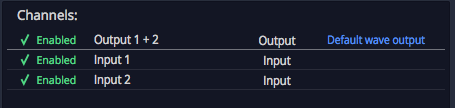

*Select an Input*

1.  In the Actions panel click *Auto-Detect.*

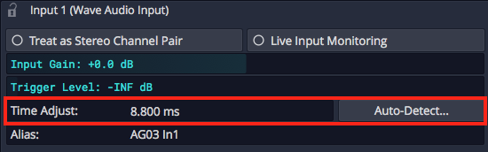

*Auto-Detect & Time Adjust Parameters*

1.  Click *Run Test.* Waveform will send a short test signal from the
    output to the input. It will calculate the delay between output and
    input.

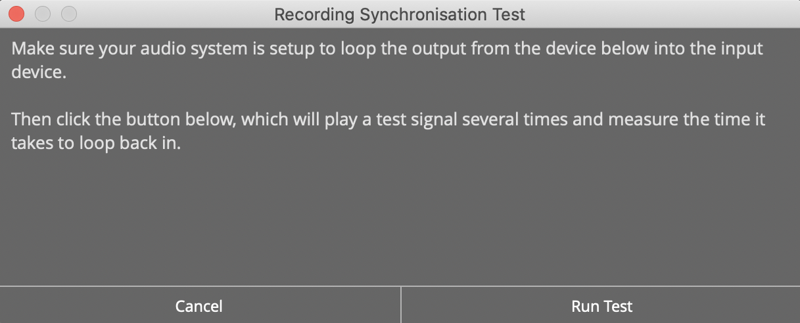

*Recording Synch Test Dialog Box*

1.  Click *Apply* and Waveform will copy the delay value to the Time
    Adjust property.

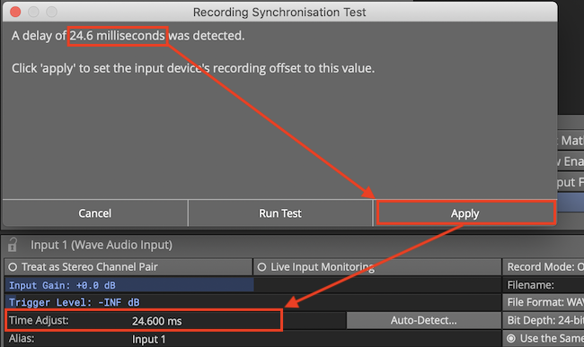

*Applying the Auto-Detect Result to *Time Adjust**

For recordings to be aligned during overdubs, you must repeat this every
time you make a change to the *Sample rate* or *Audio buffer size.* If
you don't, your recordings will be several milliseconds out of alignment
with existing tracks.

> 📝 **Note:** Instead of a loopback cable, you could connect a microphone to
the input and point it at one of your speakers to run Auto-Detect. This
will work just fine however make sure that Live Input Monitoring is off
AND that direct input monitoring on your audio interface is also off. If
you leave either on it will cause feedback potentially damaging your
speakers if not your ears!

> 💡 **Tip:** You can keep a note of the *Time Adjust* values at different
settings an enter it manually for the settings you commonly use.

> ⚠️ **Warning:** To configure Waveform for recording, you must use the
Auto-Detect feature along with a hardware loopback. If you don't then
your overdubbed tracks will not be in alignment with existing tracks.
While this is not difficult, it is essential to do this manual step
anytime you change the Audio Device Setup.

## Resetting to the Defaults

If at any point you want to reset these settings to the defaults, click
either of these two options:

Reset Input Devices
- Resets *Input gain*, *Trigger level*, *Time adjust*, and recording
    options.

Reset Output Devices
- Resets *Treat as stereo pair*, *Dithering Enabled*, *Left/Right
    Reversed* and *Alias* parameters.

## Advanced Audio Device Settings

There are additional options for Low Latency Mode and audio performance
on the Advance page of the Settings tab. Refer to [Reference: Settings > Advanced](reference-settings.md#advanced).

## First Run Setup

When you run Waveform for the first time, you will see the *First Run
Setup Progress* panel over on the left. As you click each item, it takes
you directly to the page and feature on the Setup tab needed to complete
the task. The tasks are designed to streamline setup and get new users
configured and running quickly.

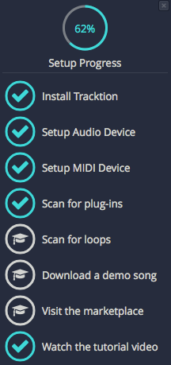

*First Run Setup Progress Panel*

If you close the panel and wonder how to get it back, navigate to *Help
> Show First Run Setup*.

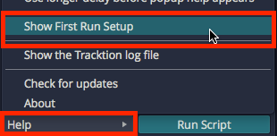

*Turning First Run Setup On*

## Moving On

Audio device setup is straightforward, apart from running the
Auto-Detect loopback test. Follow the guidelines in this chapter and you
will be ready to move on.

