# Automation

This chapter is an introduction to the automation features in Waveform.
Automation allows you to program changes to many of the parameters that
exist within a track. You can easily program changes to volume, pan, and
plugin parameters. You can program automation using external hardware,
like controllers that have knobs and faders. Alternatively, you can
program automation by adding points and changing the shape of the
graphic automation curve that appears as a line on or below the track.

Waveform has excellent features designed to keep all of your automation
nicely organized. For example, you can add Automation Tracks that nest
under your track. You can also open them when you're working on
automation changes and edits, and then close them when you move onto
other parts of your project.

In this chapter, we're going to focus on *Volume & Pan* automation and
then offer an example of how to extend automation to parameters within
other plugins.

## Activating Automation on a Track

The keys to automation are the A icon and the 'plus' icon that reside at
the far right of each track.

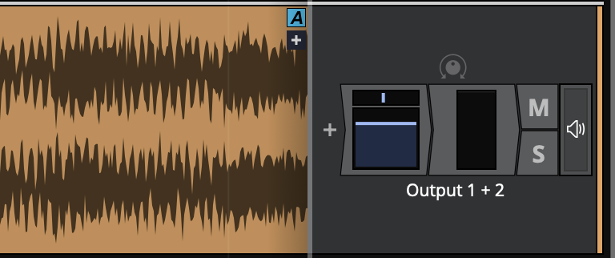

*The A and Plus Automation Icons*

The first step is to click the plus sign, to add an Automation Track.
You'll instantly see the Automation Track appear below your original
track. The Automation Track will have minus, A, and plus icons.

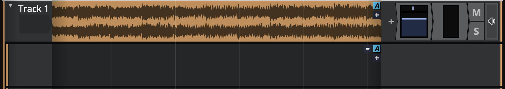

*Track with One Automation Track*

The minus icon will remove the Automation Track, the A icon allows you
to set up the track, and the plus icon will add yet another Automation
Track below this one.

### Smart Automation Shower

When showing automation on an *audio* track (i.e. not an *automation* track), you will see a "pin" icon next to the "A" button. When this pin is disabled, the displayed curve on this track will change when a plugin parameter changes. This can make it much quicker to show the relevent curve as you can just unpin the current curve, move the parameter in the plugin's UI and the curve will change. If you want to keep this curve visible you can either pin it or click the "A" button and choose to move it to a dedicated automation track.

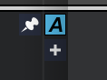

*Unpinned*

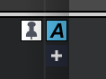

*Pinned*

## Choosing What to Automate

For this example, we're going to automate volume on the track. To do
that, click the A icon. Then select the menu item, *Automatable
parameters for this track > Volume & Pan Plugin > Volume*.

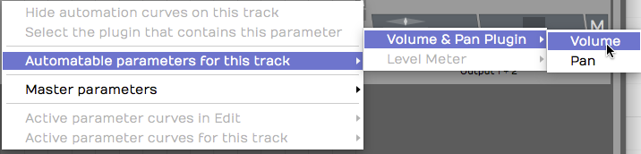

*Select the Parameter to Automate*

You'll see an automation line appear. The line is labelled with the name
of the parameter, and the value of the parameter is listed over on the
right. This line is the "automation curve." There's no literal curve to
it yet, because it's just a line. As you will see shortly, it's easy to
draw curves, steps, and ramps.

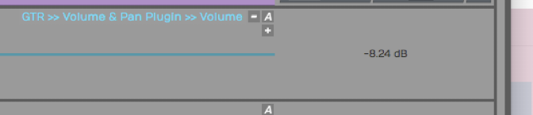

*The Automation Curve Line*

Click the curve to select it, then check out its properties. You can
change the *Name* or choose from several actions. Those make more sense
once you have some automation points on the curve.

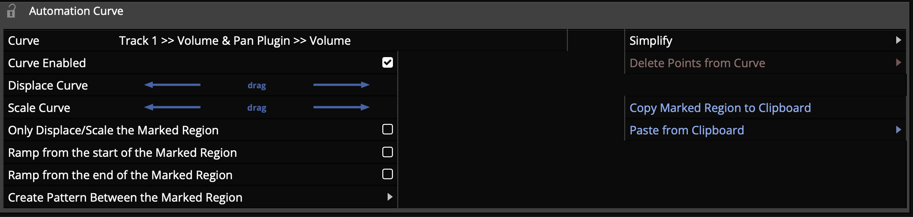

*Automation Curve properties*

> 💡 **Tip:** A fast way to set the automation parameter for the track is to
grab the A icon and just drop it on the thing you would like to
automate. Then choose the parameter from the list. So, to automate
panning, drag the A and drop it on the *Volume & Pan* plugin and then
choose *Pan* from the list. This also works for third party plugins.

## Adding Points to the Automation Curve

To give your Automation Curve some shape, you need to add some points on
it. Add points with either double-click or Opt-click / Alt-click. Here
is how to work with the automation points:

Creating a Ramp
- To draw a ramp add two points and the drag one of them up or down.
    This adjust the steepness of the ramp. Drag the points left or right
    to adjust the start and ending of the ramp.

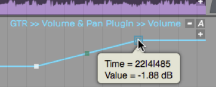

*Drawing an Automation Ramp*

Shaping with Curvature
- To shape the line segment between points you can use the *Curvature*
    the point. A Curvature point is automatically inserted midway
    between two automation points. Adjust Curvature by dragging
    diagonally.

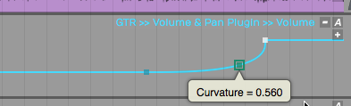

*Adjusting a Curvature Point*

> 💡 **Tip:** The automation point can also be adjusted in properties using
the *Value* parameter slider. You will also find a slider for
*Curvature* in properties.

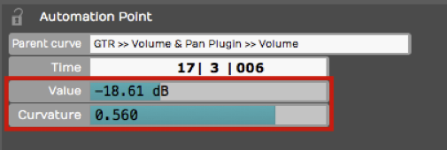

*Value* and *Curvature* properties

Drawing an Automation Step
- Insert two points that define the position of the step. Hold down
    Cmd / Ctrl and drag the line segment between the points up or down.
    You'll see that the line segment moves separately from the overall
    automation curve. This makes it really easy to draw in a step shape
    on your automation. If you don't hold down Cmd / Ctrl, then the
    entire automation curve moves.

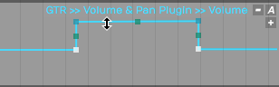

*Hold Cmd / Ctrl to Draw a Step*

## Editing Automation

If you select a range in a track showing automation, the automation edit handles will appear. You can drag the centre handles to shift or scale all the existing points, of the handles in the corners to shift or scale the points anchored from one of the ends. This allows you to quickly adjust many points or add musical effects like ramps.

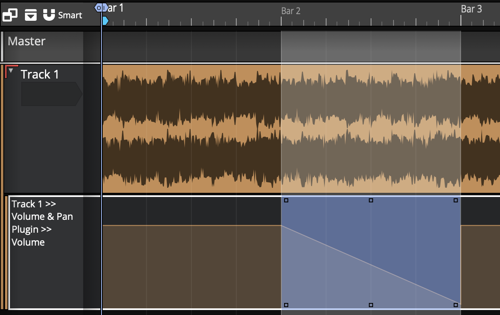

With a range selected you can also right click and choose the "Insert automation shape" option to create a shape withing the range. Once the shape is chosen, you can choose the number of repotitions, either a specific number to fit inside the range or the shape repeating at a musical period.

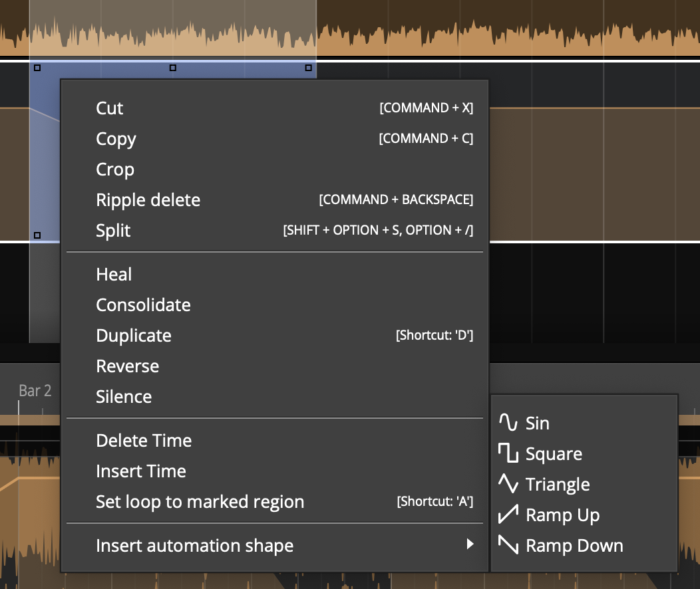

You can combine shape inserting with the scale/offset handles to quickly create interesting and rhythmical patterns.

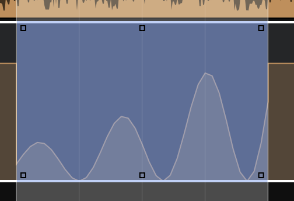

## Automating Fade-ins and Fade-outs

To program a fade shape with automation, add a point where you'd like
the fade to start, then add another point where you'd like the fade to
end. Drag the second point all the way down until the value reads zero.
Adjust the speed of the fade by dragging point down to the left for a
quicker fade or up to the right for a more gradual fade. Dragging the
Curvature point to adjust the shape of the fade ramp. Of course, you
always have the option to adjust that parameters directly in properties.

As we discussed in a earlier, if you program an automation curve for
a track folder, you can apply a fade across all the tracks together.

## Converting a Clip Fade-in or Fade-out to Automation

As you've already learned you can easily apply fade-ins or fade-outs to
Audio Clips with the fade handles on the upper left and right corners of
the clip. If, for some reason, you'd like more control over the fade
shape you can convert a clip level fade to and an automation curve.

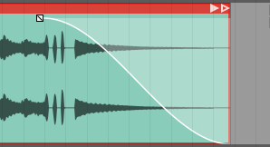

*Clip Fade*

To convert a clip fade to automation, first select the clip and then
click *Copy Fade To Automation > Transfer Fade-in to Automation,
Transfer Fade-out to Automation* in properties.

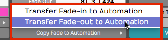

*Copy Fade to Automation*

That will redraw the automation curve in the shape of the fade and
remove the clip fade from the clip. Now you can apply additional points
and shaping using the automation tools.

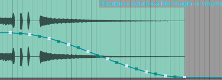

*Result of Copy Fade to Automation*

## Reading Automation

Once you've drawn automation like this, Waveform performs the automation
dynamically during playback, as long as you have *Automation Read*
enabled on the Transport.

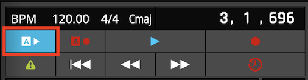

*Automation Read Enabled*

As you playback, watch the controls changing in real time as the cursor
moves through the Edit. If you go back about three decades that feature
would cost you about a million bucks!

## Automation Curve properties

The automation curve has several of its own properties. Click on the
curve to selected it and look at properties. Here is a rundown of the
controls:

*Automation Curve properties*

Curve
- The *Curve* property is the name that appears above the automation
    curve. This is here for reference only. You can't change it
    directly. It is made up of the track name, the plugin name, and the
    parameter.

Curve Enabled
- Allows you to disable the curve. A disabled curve has no effect on the parameter and can be used to quickly test what affect the automation is having. A disabled curve will show greyed out in the track. If you write automation it touch or latch modes, this will re-enabled the curve.

  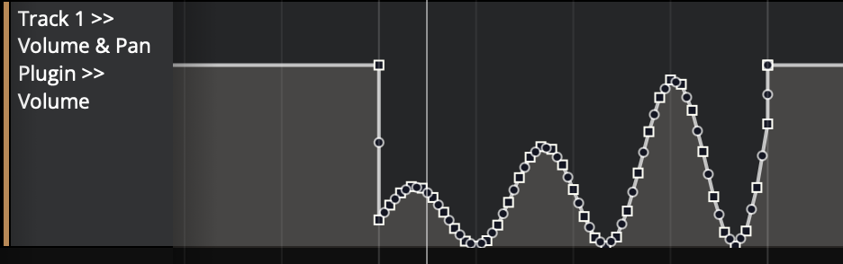

Displace Curve
- *Displace Curve* allows you to drag left or right which offsets the
    curve up or down. It basically takes the entire programmed curve and
    set of points, and moves them down if you drag left or up if you
    drag right. This is very useful to make minor mix changes after the
    automation is already programmed.

Scale Curve
- Think of *Scale Curve* to function like an intensity control. As you
    drag to the left, it proportionately lowers all of the points on the
    curve, squashing the shape of the curve. Dragging to the right
    expands the curve, scaling it upward.

Only Displace/Scale the Marked Region
- This parameter works along with *Displace Curve* and *Scale Curve*.
    When enabled, any scaling or displacing, only occurs between the
    In-marker and the Out-marker.

Simplify
- If your automation curve becomes very complex with lots and lots of
    points, you use *Simplify* to thin out the points. You can usually
    choose *Simplify the entire curve* and then pick from *Light*,
    *Medium*, and *Strong*. The *Light* option does the least thinning
    where *Strong* thins the most. This is particularly useful if you
    recorded automation from a hardware controller that added hundreds
    of points.

  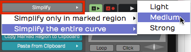
  
  *Automation Curve Simplify*

  You also have the option to *Simplify only in marked region.* You can
use this if you want to simply just simplify a section that was recorded
from hardware, leaving the rest of the curve unchanged.

Delete Points from Curve
- This set of options allows you to completely reset the automation
    curve. If you delete all points from the curve, you've basically
    taken it back to a flat line. Sometimes this results in the
    automation value being set very low, so you might need to drag the
    curve line back to a good starting position.

  You can also *Delete points within the marked region* which means you'll
delete all the points between the In-marker and the Out-marker. You can
do the same thing and "close the gap," means to take out the time within
the marked region.

Copy the Marked Region to the Clipboard
- Set the In-marker and the Out-marker over a region of automation and
    click *Copy Marked Region to the Clipboard* to copy that region of
    the curve. Then, position the cursor to the destination and select
    *Paste From Clipboard > Paste Curves at Cursor Position* and that
    pastes the automation. This makes it fast to create repeating
    patterns of automation.

  This is also useful if you've created a very specific effect using
automation and want to reproduce that effect in a later part of the
song.

*Paste from Clipboard* has two options.
- Most of the time I would use
*Paste curves at cursor position*. You can alternatively do that with
Cmd + V / Ctrl + V.

  Alternatively, choose *Paste curves to fit between the in/out markers*.
That allows targeting the destination only within the merged region.
Normally you paste at the cursor position.

> 💡 **Tip:** You don't need to manually copy automation when moving or
duplicating clips on a track. Enable *Auto Lock* in the transport bar
and the automation follows along as you move or duplicate clips.

## How to Find Out What Automation is Active for a Track

It's pretty easy to program a lot of automation, but sometimes you don't
have all of the automation curves visible. To see which ones are
available click the A icon and select *Active Parameter Curves for This
Track*. This shows all automation curves for the track and you can
choose which one to make visible.

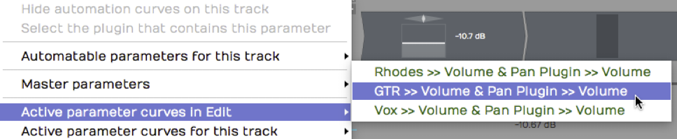

*Active Parameters for a Track*

This is particularly helpful if you don't have each parameter on a
separate Automation track.

## Remap on Tempo Change

Each plugin has a *Remap on Tempo Change* setting in properties. With
that enabled, as you change the tempo of the song, the automation will
track the tempo changes. That means it will get smaller if you speed up
the tempo or it will get longer in order to match the clips in your
Edit. This is a great feature but is not enabled by default; You need to
turn it on for each plugin.

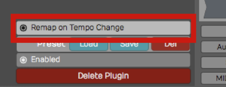

*Remap on Tempo Change*

> 💡 **Tip:** We suggest you turn *Remap on Tempo Change* on as a global
option for all new Edits. To do so, enable *Timecode > Default
remapping options > Remap plugin automation* from the Menu section.

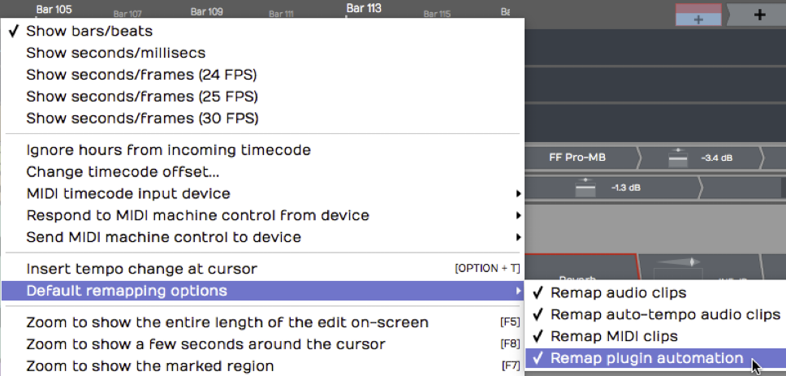

*Make Remap the Default*

> 📝 **Note:** Remap Plugin Automation is not set as the default or turned on
by default, to maintain compatibility with older projects. This setting
and the new default option were new for T6.

## Writing Automation on the Fly

During playback, you can adjust a parameter in real time and have
Waveform record it as automation. You can do this with a MIDI
controller, or simply by manipulating plugin controls on-screen during
playback. All you need to do is setup your automation track and enable
*Automation Write* mode.

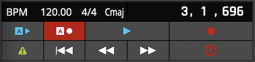

**Automation Write* Enabled*

To go into write mode, enable the *Automation Write* button on the
Transport. Now, during playback, Waveform will record any dynamic
changes you make to the parameter.

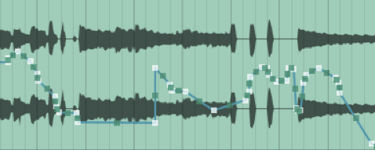

*Automation from Write Mode*

> 📝 **Note:** You don't need to be in Record mode to record automation
changes. All you need is to have automation write turned on during
playback.

> 💡 **Tip:** When you've written automation this way, it's often a good idea
to use *Simplify* to thin out the automation points. You may find you
get good results with the *Medium* option.

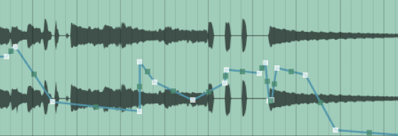

*Automation with Medium Simplification*

### Automation Modes

Each track has several different automation modes it can be in. These can be set from the A button and the "Automation Mode" menu. The A button on the track will change colour based on the current mode.

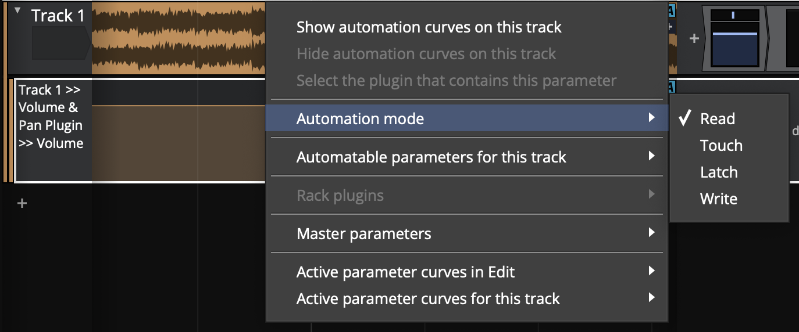

- **Read:**

  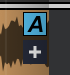
  
  In read mode automation is only read. The global automation read mode must also be enabled. If this is not, the A button will be greyed out to indicate automation won't be read.

- **Touch:**

  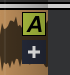

  In touch mode, automation is written whilst the parameter is actively being used. This usually means whilst the mouse is down on a control or an external controller is being touched.

- **Latch:**

  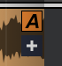

  In latch mode, automation is written from the time a parameter is first changed. If the mouse is then lifted, whatever the last value written was will overwrite any points on the curve until playback is stopped.

- **Write:**

  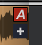

  In write mode, automation is continously written. This can be dangerous as as soon as you start play back, whatever value the parameters have will overwrite the existing automation. You should prefer touch or latch modes.

> 📝 **Note:** For modes that enable writing (touch/latch/write), global automation write must also be enabled. If it is not, the A buttons will be greyed out to indicate automation won't be written.

> 💡 **Tip:** When a track has a parameter that is being written, the track's A button and the global automation write button will flash to indicate this.

## Automation Lock

Notice in the transport bar, there is an *Auto Lock* button. By default
that button is not engaged. If you move a clip around on a track, the
automation will not follow it to the new position.

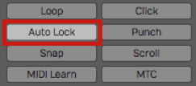

*Automation Lock Engaged*

With *Auto Lock* engaged, automation will follow as you drag the clip to
a different place in time. It's a great feature, assuming that's what
you want to do.

## Clip Automation

You can also add automation curves to specific clips. These can control parameters from clip, track or master plugins within the clip's scope (i.e. not a parameter from a plugin on a different track to the clip).

These curves are slightly different to track automation curves in that they are always played back relative to the clip (i.e. they move with the clip) and there are actually three separate curves to control the parameter: absoulte, relative and scale.

Using a combination of these curves and different timing settings you can quickly create complex and rhythmic patterns. We'll go through the settings next.

### The Clip Automation Editor

The clip automation editor can be found from the MIDI/clip editor. You can make this visible from the "eye" button or by double clicking the clip. If you don't see the clip automation properties above the "background audio clip" property, increase the height of the panel.

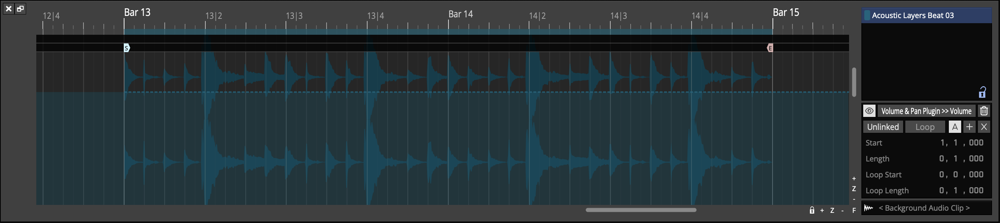

With the clip selected, you should see its contents in relation to the Edit's timeline. (Clip launcher clips are always relative to time 0). Ensure the "eye" button here is enabled to show the automation editor. The clip's content will dim.
Next, select the plugin and parameter you want to automate from the box next to the "eye" button. If there is no automation on the curve already, you'll see a dashed line indicating the parameter's current value.

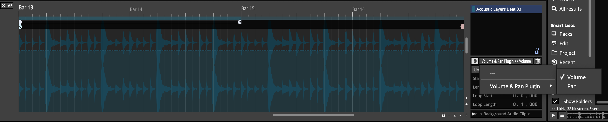

If the "Absolute" curve is selected and the "Unlinked" button disabled, the value of the parameter can be set by adding points to the curve. If the clip is looped, you'll see the looped region under the time bar along with the start/end points of the clip on the timeline.
if you make a simple curve like a ramp you'll see the automation line ramp down and stay low but in the looped region, the shaded area shows the value of the automation once the clip loops.

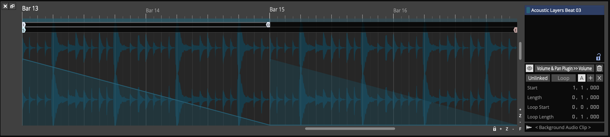

The playhead here shows the position of the automation being read rather than the overall timeline which can be useful when determining what automation points coresspond to what time.

To remove all automation curves from this clip for the parameter being shown, click the trash can button to the right of the parameter selector button.

#### Linked/Unlinked Mode
In "linked" mode ("Unlinked" button disabled), the start/length and loop start/length properties of the curve are tied to the clip. You can see these indicated under the time bar but can't edit them. The properties to the right of the curve editor are also greyed out.

In "Unlinked" mode, these properties are separate from the clip. Enabling "Unlinked" mode allows you to edit the start/length with the timecode properties or by dragging the start/end flags below the timeline.

The "Loop" setting is also separate from the clip's loop setting and can be turned on/off. If enabled the loop start/end properties are editable and the loop in/out flags can be dragged in the timeline. There is no "end" flag in looped mode as automation will continue until the clip ends.

The "Unlinked" mode and corresponding properties are separate for each automation curve type.

#### Curve Types (Absolute/Relative/Scale)
As mentioned, there are three types of curve that can be programmed.
- Absolute: Controls the base value of the parameter, overriding any track automation that might be present
- Relative: Modifies the base value of the parameter by shifting it up or down 50%
- Scale: Modifies the base value of the parameter by scaling 0-100%

Having these three curves, each with different timing information means you can create complex patterns using very few points.

E.g.
- A single absolute point creating a straight curve
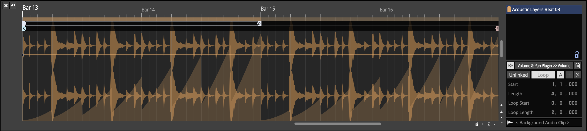
- A short relative loop creating a repeating ramp
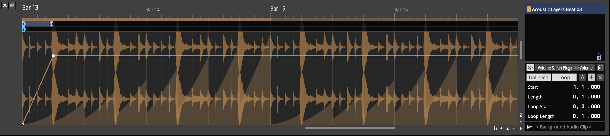
- A longer scale ramp controlling the peak of each relative loop
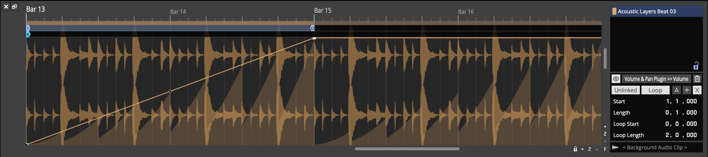

The result is the 1 beat repeating ramp you can see in the filled section of the editor.

#### Curve Editing

Clip automation curves can be edited in the same way as track automation curves.
Selecting a range shows the curve edit handles in the corners which can be dragged to shift or skew the points in the range.

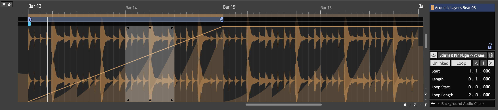

Right clicking the curve shows the popup menu where points can be deleted, copied or pasted. The options available will depend on if a range is selected or not.

Finally, you can use the "Insert automation shape" option to create pre-defined shapes such as sin/saw/square repeating a number of iterations or at a musical interval.

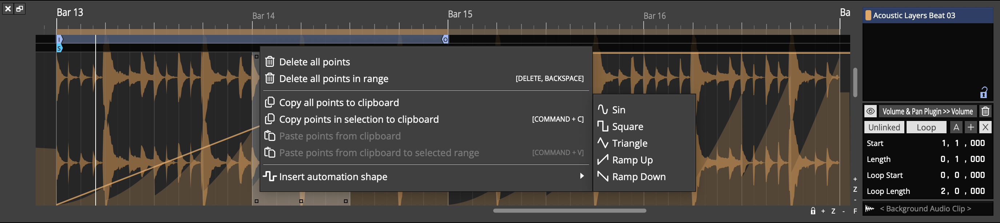

## Automation Patterns

Waveform lets you quickly create repeated automation patterns between
the In-marker and the Out-marker.

1.  To get started, create an automation curve for a parameter you would
    like to modulate. In this example we are using a simple volume
    curve.
2.  Then, set the In-marker and Out-marker over the range to which you
    want to apply the pattern.

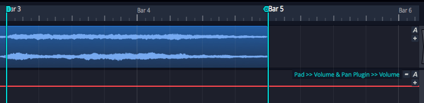

*Volume Automation Between In-marker and Out-marker*

1.  Select the automation curve, then in the Actions panel click *Create
    Pattern Between the Marked Region*.

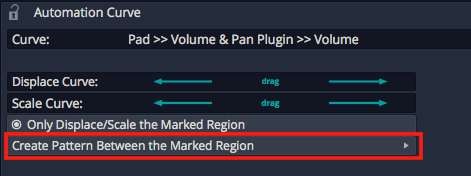

**Create Pattern Between the Marked Region**

1.  Next, choose from the various pattern shape options. For this
    example we chose *Triangle*.

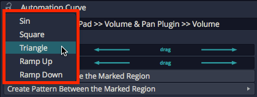

*Select the Pattern Shape*

1.  Choose a note division for the pattern or number of repeats. In
    typical Waveform fashion, we chose *1/2 beat* in order to repeat the
    pattern every 1/8th note.

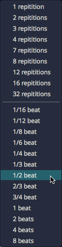

*Select Beat Division or Repetitions*

Here is the resulting automation.

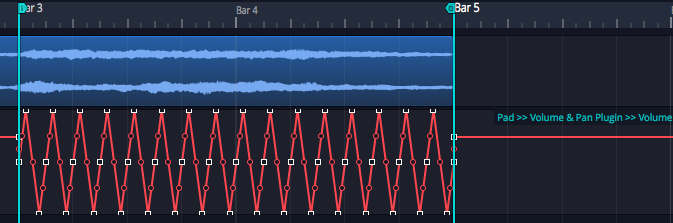

*Repeating Triangle Automation*

1.  Adjust the curve using the *Displace Curve* and *Scale Curve* drag
    controls or by editing the automation points in the usual way.

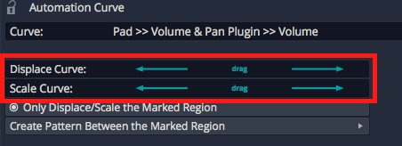

*Displace and Scale Curve Controls*

Here are examples of the other automation pattern shapes:

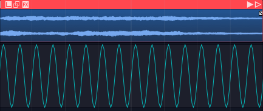

*Sine Wave*

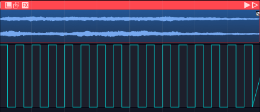

*Square Wave*

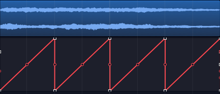

*Ramp Up*

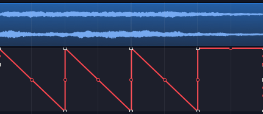

*Ramp Down*

## Automation Ramps

As a companion to automation patterns, Waveform allows you to ramp
patterns up or down in a very simple and effective way. This works in
conjunction with patterns to allow you to increase or decrease the
intensity of a pattern over time. The two *Ramp* options work as
modifiers to the existing *Displace* and *Scale* tools.

Automation Ramps are best explained with an example:

1.  Set the In-marker and Out-marker over a segment of automation you
    would like to ramp in.

*Selected Region of an Automation Pattern*

1.  Click on the automation curve to select it.
2.  In the Actions panel, click *Ramp from the start of Marked Region*
    to enable the ramp behavior.

*Enable *Ramp from the start of Marked Region**

1.  In the Actions panel, manipulate the *Displace Curve* and *Scale
    Curve* sliders. Notice how these affect the left side of the curve
    allowing you to fade in the automation pattern.

*Taper the Curve using *Displace Curve* and *Scale Curve* Sliders*

The companion *Ramp from the end of the Marked Region* allows you to
taper automation down.

**Ramp from the end of the Marked Region**

These features are easy to miss at first glance, but they provide
tremendous creative potential when programming automation.

> 💡 **Tip:** The automation ramp features are also available when working
the *Volume & Pan* Clip Layer effect which is explained in [Clip Layer Effects](clip-layer-effects.md).

**Video Clip:** Here is a [video clip](https://youtu.be/koDUoO3XD-0)
that demonstrates the automation ramp modifiers.

## Moving On

There is a lot more you can do with automation, because you can automate
almost any parameter. You can automate sends to effects. You can even
automate your Master plugins. Simply create a separate track then drag
the A icon from that track over to the master track's plugins to
automate them.

