# Basic Navigation

This chapter is an overview of how to operate Waveform. You will also
learn how to set up Waveform for an efficient workflow, as well as how
to change the tempo of your song.

## Tabs and Menus

With Waveform open, you can see the Projects tab and the Settings tab.
Click on the tab name or icon to switch to that tab.

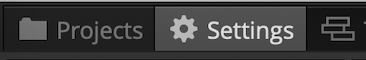

*Projects Tab & Settings Tab*

Waveform's menus are in the standard menu bar at the top of the window
(the macOS menu bar on Mac, or the menu bar along the top of the window
on Windows and Linux). The available menus change depending on whether
you are on the Projects tab or an Edit tab.

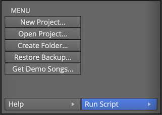

*Menus in the Projects Tab*

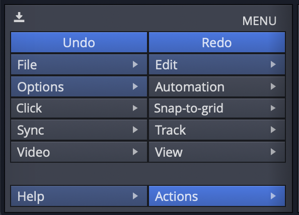

*Menus in the Edit Tab*

## Window Layout

When working on a song, the main areas of the Edit window are:

- The **menu bar** along the top of the window.
- The **Browser** down the side, which also hosts the **Actions panel**.
- The **arrangement** (and the optional **Mixer**) in the centre.
- The **transport bar** along the bottom, with the playback controls,
  cursor position, tempo, and the master controls.

The **Actions panel** shows the settings and actions for whatever you
have selected -- a clip, track, plugin, automation point, and so on. It
is a context-sensitive list and is central to working in Waveform, so
you will see it referred to throughout this guide.

## Pop-up Help

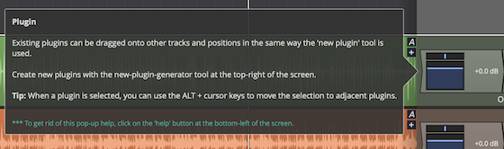

*Example of a Pop-up Help Message*

Pop-up help is helpful for the first few minutes, but you may not wish
to use it after you are more familiar with the program. If you are using
the default Waveform key-mappings, you can see available pop-up help
by pointing at an item on screen and pressing F1.

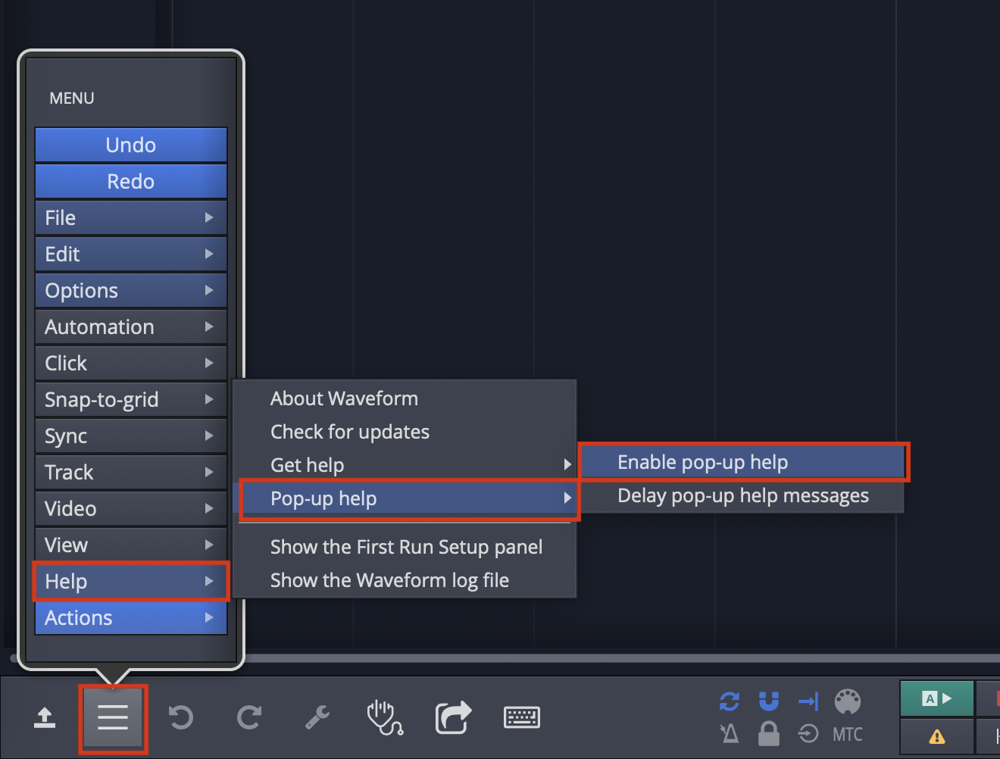

*Disabling Pop-up Help*

Disable pop-up help from the Menu section using *Help > Pop-up help*.
De-select *Enable pop-up help*.

## Roll-over Help

In addition to pop-up help, Waveform also offers roll-over help.
Rollover help messages appear in the upper right for controls and
objects. The messages appear automatically as you roll over items on the
screen.

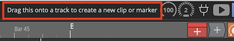

*Example of Rollover Help*

> 💡 **Tip:** If you find any help messages wrong or unclear, please a
message and screenshot to support@tracktion.com

## Creating a Project

The very first step to produce a song in Waveform is to create a
project. To do so:

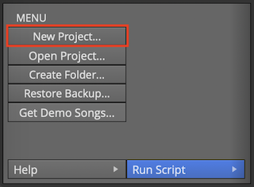

*The *New Project* button on the Projects tab*

1.  Go to the Projects tab
2.  Click *New Project* and the New Project dialog box appears
3.  Fill in the *Name*
4.  Select the *Location*
5.  Click *Create Project*

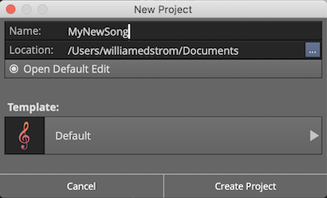

*The New Project Dialog Box*

Click *Create Project* it will open to the Edit where you can compose,
record, and mix. Click back to the Project tab and you will see the
contents of the project in a list to the right with the title *All items
in project: projectname*.

For now, the most important entry in the "All Items" list follows the
word "edit"; that file is called an Edit. In our example, the Edit name
is "SummerSong100 Edit 1."

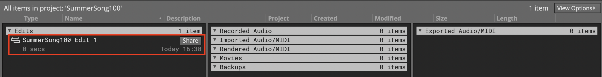

*All Items List*

> 📝 **Note:** Creating a project creates a folder, that in turn contains
sub-folders that contain the project media, a Project file (`.Waveform`)
and an Edit file (`songname.tractionedit`). The folder, Project, and
Edit all use the name you provided in the New Project dialog box.

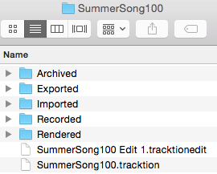

*Project Folder on Disk*

## Opening the Edit

An Edit is the workspace in Waveform where you record, edit, and mix
your songs. Double-click the Edit in the All Items list; and it opens to
a new tab. This type of tab carries the name of the Edit and is called
an 'Edit tab.'

**Edits and Revision Control:** In Waveform you can have as many Edits
per Project as you want. This gives you a great system for revision
control. At key milestones in your workflow, go back to the Project tab
click *Create a Copy.* This copies the Edit to a new file. Rename the
copy appropriately and resume work using the new Edit. You can return to
the previous state of the Project at any point by opening an earlier
Edit. Important note: all Edits within a project use the same underlying
source files. Creating a copy of the Edit does not in anyway make new
copies of the underlying files.

## The Edit Tab

The Edit tab is where most of the action occurs while working in
Waveform. What other DAWs call a "project" or "song", Waveform calls an
Edit. In a way, this is similar to the terminology used in many video
editing programs. You have a collection of media that you organize into
an Edit. In concept, you can organize the same media into other Edits.
In music production, having multiple edits gives you revision control
and flexibility to have multiple mixes all contained within the project.

## Basic Navigation

What you need to know to navigate an Edit:

Start and Stop Playback
- The obvious way to play and stop is to use the Play/Stop button
    located on the transport bar. Alternatively, press
    the Spacebar to toggle between start and stop.

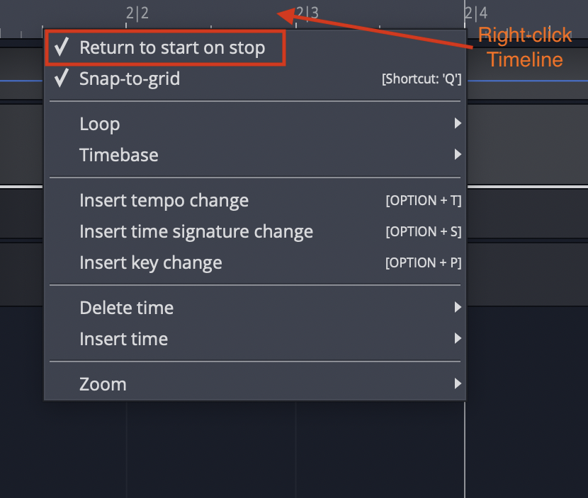

*Return to Start on Stop*

> 💡 **Tip:** By default, the cursor will jump back to the start position
when you stop playback. If you would like the cursor to instead remain
at the stop position, there is a setting for that in the menu *Options
> Return to start on stop*. Disable that and the cursor will pause at
the point you hit stop. The same setting is also available when you
right-click the Timeline.

## Zooming In and Out

Here are some basic ways to control zooming:

-   Use the Up and Down keys to zoom in and out
-   Use the zoom controls in the lower right corner
-   On the timeline just above the cursor, grab and drag up or down

> 💡 **Tip:** There are a full set of zoom actions that can be assigned to
keyboard shortcuts. These are also available from the Zoom menu by
right-clicking the Timeline.

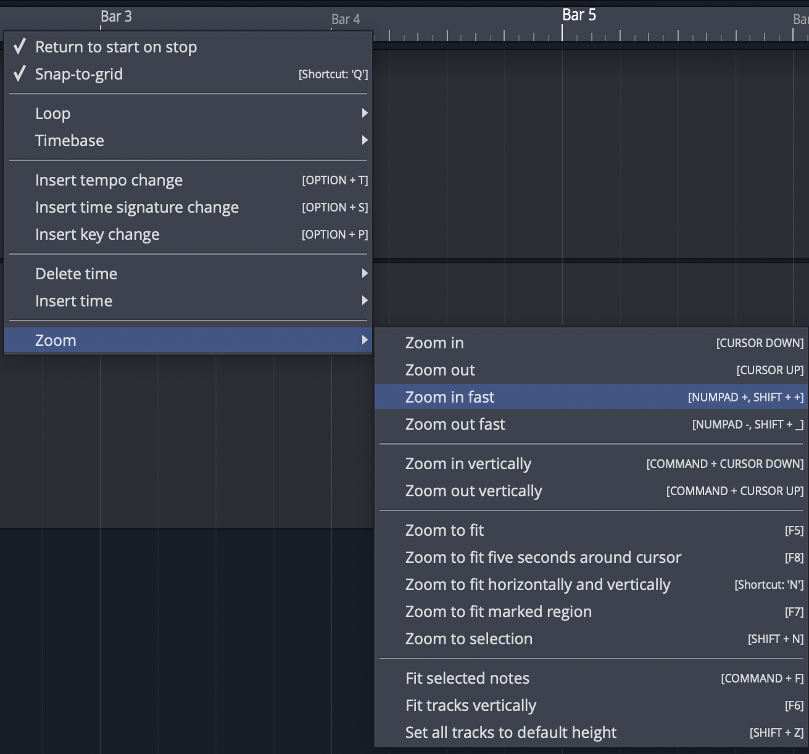

*Zoom Actions on Timeline Context Menu*

You can also use the quick zoom tool:

-   Hold Cmd + Opt / Ctrl + Alt and drag to draw an area. The pointer
    changes to a magnifying glass. When you release, the view zooms in
    to your selection.
-   To step back from that zoom level, once again hold Cmd + Opt /
    Ctrl + Alt and click in the arrangement.
-   Waveform remembers the zoom levels, so you can zoom in repeatedly.
    Then, press Cmd + Opt / Ctrl + Alt click to zoom back out.

## Positioning the Cursor

The cursor position is used as the playback start time, and is also used
to reference many of Waveform's editing functions. In other DAWs it is
called a playhead, now time, or playback cursor. In Waveform it's simply
the 'cursor.'

There are numerous ways to position the cursor, including:

-   On the timeline just above the cursor, grab and drag it left or
    right
-   Click the timeline and the cursor will jump to that spot
-   Click in the background of the track area
-   Click within the body of clips
-   Use the left and right arrow keys to move the cursor backward and
    forward

> 📝 **Note:** If you don't want the cursor to be positioned when clicking on
the background or the body of clips, de-select the option "Clicking the
background locates the cursor" in Settings > General > Editing

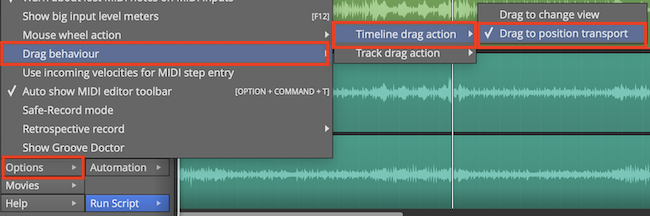

*Drag to Position Cursor Setting*

> 💡 **Tip:** You can change the way clicking on the Timeline works by
selecting *Options > Timeline drag action > Drag to position
transport.* With this set, when you click in the timeline, the cursor
jumps to that position. If you drag in the timeline, the cursor follows
as well.

> 📝 **Note:** In this mode, to drag zoom, you need to hold down Opt / Alt.
Since you can still zoom in and out with the mouse wheel or the up and
down arrow keys, this mode is a great way to get around in Waveform.

## Changing the Tempo

Tempo in Waveform is managed using the Tempo track at the top of the
screen. You can hide or show the Tempo track using the *Eye* panel
selector at the upper right F9.

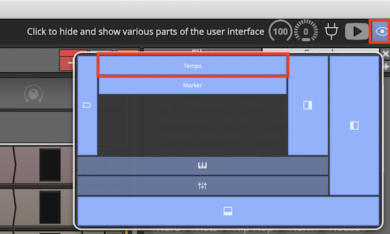

*Show or Hide the Tempo Track with the *Eye* Panel Selector F9*

The Tempo is represented as a line in the Tempo track. This line is
called the "Tempo Curve." For a fixed tempo tune it will appear as a
line set to a beats-per-minute (BPM) value.

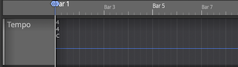

*Fixed BPM Tempo Curve*

For tunes with tempo changes it might appear with step ups or step downs
in tempo, or even gradual tempo changes represented as curves (thus the
name Tempo Curve). In other software this is often called a "tempo map."

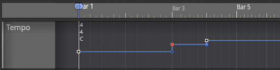

*Varying BPM Tempo Curve*

To change the tempo of your Edit:

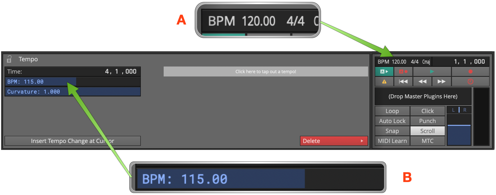

*Changing Tempo: *A*, Click BPM Readout. *B*, Adjust BPM property.*

1.  Click the tempo BPM readout in the transport bar. The Actions panel
    will show the tempo properties
2.  Adjust the *BPM* parameter to the desired tempo. Either click and
    type it in, or drag the slider.
3.  Alternatively, open the tempo track and drag the tempo curve line up
    and down.

> 📝 **Note:** Setting the tempo this way changes the tempo only for the
segment of the tempo curve that is under the current cursor position.

**Video Clip:** To learn how to use the tempo track to map tempo changes
to an existing recording, Check out my video on [Creating a Tempo
Map](https://youtu.be/leqRsEZRUJI)

## Changing Tempo at a Specific Bar

To change the tempo at a specific bar, use the action *Insert tempo
change at cursor* (Opt + T / Alt + T). Here are the steps:

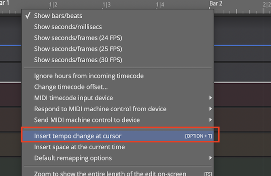

*Right-click Timeline: *Insert tempo change at cursor**

1.  Position the cursor where you want the tempo change to occur
2.  Right-click on the timeline, and select *Insert tempo change at
    cursor*
3.  In the Actions panel, adjust the *BPM* parameter to the new
    tempo.
4.  To see the results of the tempo change, open the tempo track to see
    the step up or down on the Tempo Curve

> 📝 **Note:** The Tempo Curve can also be adjusted with more detail in the
Tempo track in much the same way as automation. Click to add points
(nodes) to the curve and drag them to shape your tempo changes along
with an adjustable *Curvature*. To shape the transition between two
points, drag the small handle on the *midpoint* of the segment between
them: dragging it bends the line from concave, through linear, to convex.
<!-- code: TempoCurveEditor.cpp:290-334 -->

> 📝 **Note:** New points snap to the nearest beat, and the BPM is limited
to the range **20–300**. The very first point (at the start of the Edit)
is locked — it can't be moved or deleted. <!-- code: tracktion_TempoSetting.h:42-45; TempoCurveEditor.cpp:456-478 -->

**Tap Tempo:** Select a single tempo point and the properties show a
*Tap Tempo* control reading *"Click here to tap out a tempo!"*. Click it
in time with the beat, then press *Apply* to set that point to the tempo
you tapped. <!-- code: TempoSettingPropertyPanel.h:388-419 -->

Removing Tempo Changes
- Click on any tempo point, to select it. In the properties, click *Delete
    > Delete this tempo setting.*

Removing all Tempo Changes
- Click on the Tempo curve line. In the properties, click *Delete points
    from curve > Delete all points from the curve.* The same *Delete*
    menu can also delete only the points *within the marked region*, with
    an option to close the gap left behind. <!-- code: TempoSequencePropertyPanel.h:205-207 -->

## Offsetting and Scaling the Tempo Curve

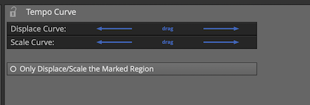

*Displace Curve and Scale Curve Controls*

Displace Tempo Curve
- Click anywhere on the Tempo Curve. In the properties, drag left or right
    over `Displace Curve` to move the entire tempo curve up or down.

Scale Curve
- Select the Tempo Curve, then drag left or right over *Scale Curve*
    to reduce or emphasize the amount of tempo variation across the
    entire Edit.

> 📝 **Note:** By default Displace and Scale affect the whole curve. Turn
on *Only Displace/Scale the Marked Region* to limit them to the
loop / in-out range instead. <!-- code: TempoSequencePropertyPanel.h:41,70,427 -->

Copying and Pasting Tempo Curves
- With a region marked, *Copy the marked section of the curve to the
    clipboard*, then *Paste* it back in at the cursor position. The paste
    menu also offers *Paste curves in to fit between in/out markers*,
    which stretches the pasted curve to fill the marked range.
    <!-- code: TempoSequencePropertyPanel.h:44-45,100-105 -->

## Scroll Behaviour

Scroll behaviour options are found on the Options menu under the *Scroll
Behaviour* submenu.

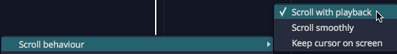

*Options > Scroll Behaviour*

The Scroll Behaviour menu features the default option *Scroll with
playback*. Here is a rundown of what each option does:

Scroll with playback (default)
- During playback the cursor stays on screen. As the cursor goes past
    the right edge, the tracks page over keeping the cursor in view.

Scroll smoothly
- During playback, when the cursor arrives at a fixed position near
    the center of the screen, the tracks scroll under the cursor. This
    is a matter of personal preference.

Keep cursor on screen
- During playback the cursor will stay on the screen. Even while
    editing or manually panning, the cursor always stays on screen. As
    you pan over right the cursor stays at the left edge of the screen.

No options selected
- During playback the cursor will move past the right edge of the
    screen and then move out of sight.

> 💡 **Tip:** For most users we suggest leaving *Scroll with playback*
enabled and the other two options off.

## Moving On

This chapter was a basic introduction to the operation of Waveform. You
can now operate the transport; you can open the demo files; you can
create a new blank project; and you can adjust the playback volume and
tempo.

That is enough to start exploring Waveform. Stay tuned, there is a lot
more to come!

