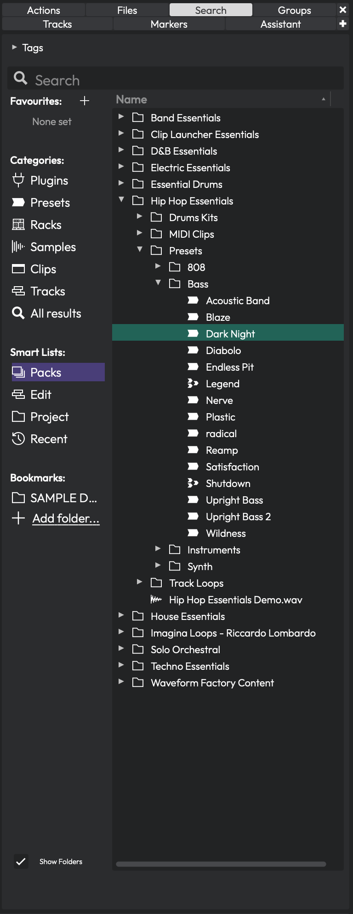
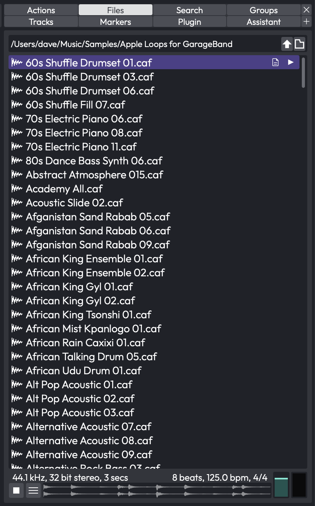
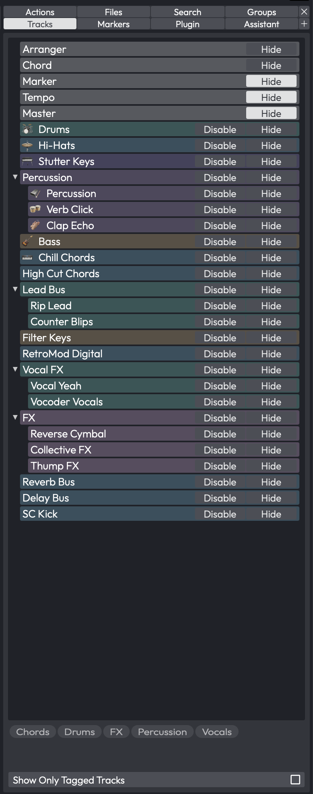
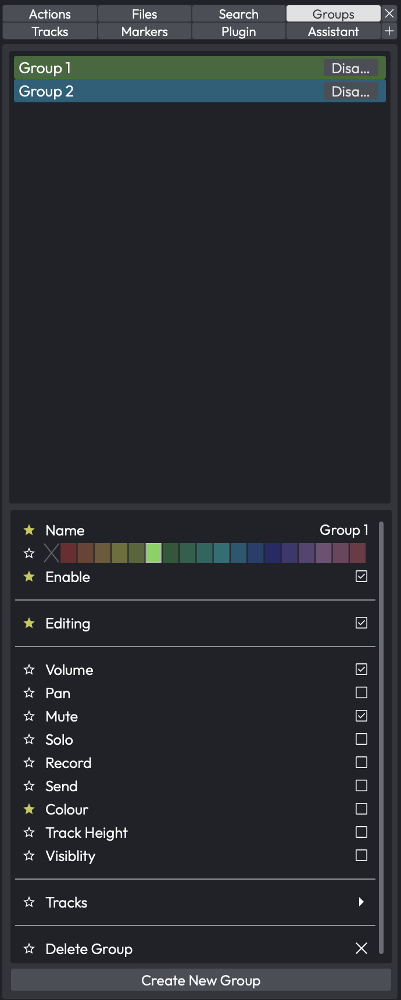

# The Browser

The Browser is your central hub for finding and auditioning content -- plugins, presets, samples, clips, tracks, and more. It lives in the sidebar panel on the right side of the edit view, under the **Search** tab.

*The Browser panel showing Packs content with folders expanded. The sidebar on the left lets you filter by category, and the results area on the right displays matching items in a tree view.*

## Opening the Browser

The Browser is one of several sidebar panels available in the edit view. Look for the **Search** tab at the top of the sidebar. Click it to reveal the Browser. If the sidebar is not visible, you can toggle it from the view options or by dragging it open from the right edge of the edit area.

## Tags

At the very top of the Browser, you will find a collapsible **Tags** bar. Tags are metadata labels attached to your samples, presets, and other library content. They let you narrow down results without typing a search query.

You can resize the tags area by dragging the divider just below it. Drag it all the way up to hide the tags section entirely. Tags that appear here are dynamically populated based on whatever results are currently showing, so you will only see relevant tags.

> 💡 **Tip:** If you use tags heavily, keep the tags bar open and give it some vertical space. It becomes a powerful way to cross-filter results -- for example, selecting "Packs" in the sidebar and then clicking a "Bass" tag.

## The Search Box

Below the tags bar sits the **Search** box. Type any text here to filter the results list in real time. The search applies across whatever category or source you have selected in the sidebar.

A spinning icon appears while results are being fetched. Results update as you type, so you do not need to press Enter to search.

> 💡 **Tip:** Press the Return key while the Browser has focus to restart preview playback of the currently selected item. Handy for re-listening without reaching for the mouse.

## The Sidebar

On the left side of the Browser is a narrow sidebar divided into four sections. Only one item can be selected across all four sections at a time -- clicking an item in one section automatically deselects items in the others.

### Favourites

The **Favourites** section shows tags you have marked as favourites. This gives you one-click access to your most-used tag categories. If no favourites are set, it displays "None set."

To add a favourite, click the **+** button next to the Favourites heading. A menu appears listing all available tags. Click a tag to add it; click it again to remove it. Favourite tags show a filled colour dot next to their name.

You can right-click any favourite tag to access two options:
- **Remove from favourites** -- removes the tag from this list
- A colour picker that lets you assign a custom colour to the tag, making it visually distinct in both the sidebar and the results list

When you select a favourite tag, the results area shows all content tagged with that label.

### Categories

The **Categories** section lets you filter by content type. The available categories are:

- **Plugins** -- all installed audio plugins (VST, AU, etc.)
- **Presets** -- saved plugin chain and track presets
- **Racks** -- rack filter presets
- **Samples** -- audio and MIDI files in your libraries
- **Clips** -- clip presets
- **Tracks** -- track presets
- **All results** -- everything, unfiltered by type

Each category has its own icon to help you identify it quickly. When you first open the Browser, it defaults to *All results*.

### Smart Lists

**Smart Lists** provide context-aware views into your content:

- **Packs** -- shows content packs you have installed. These are the bundled and downloadable sound libraries
- **Edit** -- shows all assets used in the currently open edit. A **Consolidate** button appears at the bottom when this is selected, letting you copy any external files into the project folder
- **Project** -- shows all assets in the current project. A **Consolidate Project** button appears when this is selected
- **Recent** -- shows recently used items for quick access

> 💡 **Tip:** The Edit and Project smart lists are great for auditing your session before sharing it. If the Consolidate button is active, it means some files live outside the project folder and could go missing if you move the project.

### Bookmarks

The **Bookmarks** section lets you pin any folder on your computer for quick browsing. Click **Add folder...** at the bottom to open a folder picker and bookmark a new location.

When you select a bookmark, the results area shows the contents of that folder. Right-click any bookmarked folder to **Remove Bookmark**.

> 💡 **Tip:** Bookmark your sample library folders, loop collections, or any directory you frequently pull sounds from. It saves a lot of navigating.

## The Results Area

The main area of the Browser displays your results in a tree view. Depending on what you selected in the sidebar, you might see a hierarchical folder structure or a flat list of items.

### Columns

The results header can display up to five columns:

- **Name** -- the item name, shown with a type-specific icon (waveform for audio, MIDI icon for MIDI files, plugin icons, etc.)
- **Tags** -- any tags assigned to the item
- **Location** -- the file path on disk
- **Size** -- the file size
- **Date** -- the creation date

You can click column headers to sort results by that column. Click again to reverse the sort direction.

### Show Folders Toggle

At the bottom-left of the Browser, below the sidebar, is the **Show Folders** checkbox. (Default: on)

- **On** -- results are displayed in their natural folder hierarchy, with expandable folders
- **Off** -- results are displayed as a flat list, which can make it easier to scan through a large number of items

### Browsing and Selecting

Click any item in the results list to select it. The preview area at the bottom will automatically update to show information about the selected item and (depending on your auto-play setting) begin playing it.

Double-click an item to insert it directly into your edit at the current insert point. For audio and MIDI files, this creates a new clip. For plugins, this inserts the plugin on the selected track.

### Drag and Drop

You can drag items from the results area directly onto tracks in your edit. This is the most common way to use the Browser:

1. Find a sample, preset, or plugin in the Browser
2. Click and drag it onto a track
3. Release to place it

Hold **Shift** while dragging audio files to place them on consecutive tracks instead of the same track.

You can also drag files *into* the Browser from your operating system's file manager. Audio files dropped onto the Browser are added to your loop library. Preset files are imported into your preset library.

### Right-Click Menu

Right-clicking an item in the results list opens a context menu with options that vary by item type:

**For all items:**
- **Set tags...** -- opens a dialog to edit the item's tags
- **Set tags from favourites** -- a submenu showing your favourite tags as quick toggles. Filled dots indicate tags already assigned; click to add or remove

**For audio/MIDI files:**
- **Delete file** -- permanently deletes the file from disk
- **Open the folder containing this file...** -- reveals the file in your system's file manager

**For presets:**
- **Edit Preset...** -- opens the preset editor
- **Delete Preset** -- removes the preset
- **Export Preset...** -- saves the preset to a file
- **Import Preset...** -- imports a preset from a file
- **Open the folder containing this file...** -- reveals the preset file in your file manager

> ⚠️ **Warning:** Deleting a file or preset from the right-click menu is permanent. There is no undo.

## The Preview Area

At the very bottom of the Browser is the preview strip. It shows information about the currently selected item and provides playback controls.

### Audio and MIDI Preview

When you select an audio or MIDI file, the preview strip displays:

- Two info labels showing file details (format, sample rate, bit depth, duration, etc.)
- A waveform or MIDI thumbnail showing the content at a glance
- A **Play** button to start playback (switches to a **Stop** button while playing)
- A **Menu** button (three horizontal lines) for playback options
- A **Volume** control for the preview output level
- A **Level meter** showing the preview output level

### Preview Playback Options

Click the menu button (the three-line icon) in the preview area to access these settings:

- **Play all** -- starts playback of previews across all open Browser panels
- **Stop all** -- stops all previews
- **Match tempo** -- time-stretches the previewed audio to match your edit's tempo. Useful for auditioning loops at your project's BPM
- **Match pitch** -- pitch-shifts the preview to match your edit's key
- **Re-trigger on play** -- restarts the preview when your edit begins playback
- **Sync to Edit** -- synchronises preview playback with the edit's transport position
- **Auto-play** -- automatically plays a file when you select it in the results list. (Default: on)
- **Loop** -- loops the preview continuously. (Default: on)
- **Preview all MIDI clips as drums** -- forces all MIDI previews to use a drum sound, which is helpful when browsing MIDI patterns intended for drum kits

> 💡 **Tip:** I recommend keeping Auto-play on and Loop on for most workflows. It lets you audition content just by clicking through the results list, which is much faster than manually hitting Play each time.

### Preset Preview

When you select a plugin or track preset (rather than a raw audio file), the preview area switches to a different mode. It shows:

- A text description of the preset
- A visual thumbnail showing the plugin chain (each plugin displayed as a shaped block with its name)
- A **Preview** button to enable live auditing through your audio inputs
- An **Inputs** button to choose which MIDI inputs feed the preview
- An **Outputs** button to select the audio output for preview playback

Live preset preview lets you play a synth preset through your MIDI controller before committing to it.

> 📝 **Note:** For live preset preview to produce sound, at least one of your selected MIDI inputs must have input monitoring enabled. If no inputs have monitoring on, a warning icon appears.

## The Files Panel

Alongside the Search browser, the sidebar has a separate **Files** tab. Where the Search browser organises your library by category and tags, the Files panel is a plain filesystem browser -- a folder tree you navigate just like your operating system's file manager. It is the quickest way to pull in audio that is not part of your tagged library.

*The Files panel browsing a folder of audio files*

### Choosing What to Browse

The folder button at the top of the panel opens a menu of starting locations:

- **Project files** -- the audio files registered in the current project
- **Project folder** -- the project's folder on disk
- **Drives** -- the drives and volumes on your system, so you can browse anywhere
- **Refresh** -- re-scan the current folder to pick up files you have just added
- **Bookmark current folder** -- pin the folder you are viewing for one-click access later (and **Delete bookmark for current folder** to remove it again)

Use the up-arrow button to move up to the parent folder.

> 💡 **Tip:** Bookmark the folders where you keep your loops and one-shots. A bookmarked folder is the fastest route to a sample library that has not been tagged into your Browser content.

### Auditioning and Inserting

The Files panel lists audio files -- plus SoundFont `.sf2` and `.sfz` files -- and shares the same preview strip at the bottom as the Search browser, so you can audition a file before using it. Drag a file onto a track to place it, double-click to insert it at the cursor, and hold **Shift** while dragging to spread several files across consecutive tracks, exactly as in the Search browser.

> 📝 **Note:** The Files panel browses your filesystem directly, so it shows files whether or not they have been tagged or added to your library. Dragging a new file in from here does not add it to your loop library -- use the Search browser for tagged, searchable content.

## The Tracks Panel

The **Tracks** panel is a compact track list that lets you tag your tracks and then show only the ones you are working on. On a large arrangement -- dozens of tracks across drums, vocals, synths and busses -- it is an easy way to focus the timeline on, say, just the "Drums" tracks without manually hiding everything else. The panel is available in every edition.

*The Tracks panel, showing the track tree, the tags bar, and the Show Only Tagged Tracks button at the bottom*

### Opening the Panel

Look for the **Tracks** tab at the top of the sidebar and click it. <!-- code: waveform/common/Source/ui/edit/sidebar/SidePanel.cpp:67 / TracksPanel.h:26 --> The panel lists every track in the edit as a tree, with folder tracks expandable. Each row shows the track's colour, icon and name, plus a **Hide** button and a **Disable** button on the right; clicking these mirrors the show/hide and enable/disable state in the track header. <!-- code: TracksPanel.h:386-387 --> Selecting a row here selects the track in the edit, and vice versa.

### Tagging Tracks

Tags live on the tracks themselves, so you assign them from the track properties rather than from this panel:

1. Select one or more tracks (Cmd/Ctrl-click to multi-select).
2. Open the track properties and find the **Tags** field. <!-- code: TrackPropertyPanelBase.h:598,893 -->
3. Type one or more tags, separated by commas (for example `Drums, Verse`). The same tags are applied to every selected track.

Only audio, folder and automation tracks can be tagged. <!-- code: TrackManager.cpp:224 -->

### Filtering by Tag

The tags bar in the middle of the panel lists every tag currently in use across your tracks. Click a tag to toggle it on; click more than one to combine them. With at least one tag enabled, turn on **Show Only Tagged Tracks** (the button at the bottom of the panel) and the timeline collapses to show only tracks carrying an enabled tag -- their tagged parent folders and tagged child tracks stay visible too, so folder structure is preserved. <!-- code: TracksPanel.h:37,91 / TrackManager.cpp:109-127 --> Turn the button off to bring every track back; the tag selection is remembered.

### Control Reference

- **Track tree** -- lists all tracks; selection is synced with the edit. Each row has a **Hide** and a **Disable** button. <!-- code: TracksPanel.h:386-387 -->
- **Tags bar** -- the in-use tags; click to enable/disable a tag for filtering.
- **Show Only Tagged Tracks** -- toggle; when on, only tracks with an enabled tag (and their tagged folders/children) are shown in the arrangement. Default: off.

> 💡 **Tip:** Tag tracks by role ("Drums", "Vox") and by section ("Verse", "Chorus"), then enable a couple at once to zero in on exactly what you need.

> 📝 **Note:** If no tags are enabled, or you have not tagged any tracks, the Show Only Tagged Tracks button has no effect -- the filter only kicks in once at least one enabled tag exists. <!-- code: TrackManager.cpp:111 -->

## The Groups Panel

The **Groups** panel is the sidebar's home for [Edit Mix Groups](edit-mix-groups.md) -- the feature that links several audio tracks so that an action on one (a fader move, a mute, and so on) is mirrored on the rest. It gives you a single place to see every group in the edit, create new ones, and switch them on and off.

*The Groups panel, listing the edit's mix groups*

> 📝 **Note:** The Groups panel only appears in **Waveform Pro**, since Edit Mix Groups are a Pro feature.

The panel lists every group in the edit. Each row shows the group's name drawn in that group's colour, and a small `*` appears next to any group that contains a track you currently have selected, so you can tell at a glance which groups your selection belongs to.

- **Create New Group** -- the button at the bottom of the panel makes a new group from the audio tracks you currently have selected (and selects the new group so you can name it and set its options straight away). See [Creating and Managing Groups](edit-mix-groups.md#creating-and-managing-groups) for the other ways to build a group.
- **Disable** -- each row has its own Disable button that bypasses just that group, leaving the others untouched. This is handy for nudging a single track without breaking it out of the group permanently.
- **Open a group's properties** -- double-click a row to open that group's property page, where you choose exactly which operations the group links (volume, mute, pan, solo, and so on). The full list is described in [What Gets Linked](edit-mix-groups.md#what-gets-linked).
- **Select and delete** -- single-click selects a group (Cmd/Ctrl-click to select several); press **Delete** to remove the selected group(s). Deleting a group never deletes its tracks.

> 💡 **Tip:** A track can belong to more than one group at once -- the coloured circle in the track header shows a slice for each group it is in. See [The Track Header Group Icon](edit-mix-groups.md#the-track-header-group-icon) for details.

## ⚡ Things to Watch Out For

- **Large libraries can be slow.** If you have thousands of samples, the first time you open a category or type a search may take a moment while results load. The spinning search icon lets you know it is still working.

- **Tags are shared across your library.** When you tag a sample or preset, that tag is stored globally. Removing a tag from one Browser view removes it everywhere.

- **Consolidate before sharing projects.** If the Edit or Project smart list shows a Consolidate button, some of your assets live outside the project folder. Always consolidate before sending a project to someone else or moving it to a different machine.

- **Deleting files is permanent.** The right-click Delete option removes files from disk, not just from the Browser. Double-check before confirming.

- **Preview volume is independent.** The preview volume control in the Browser is separate from your edit's master volume. If you cannot hear previews, check this control first.

- **Shift-drag for multi-track placement.** When dragging audio files from the Browser, hold Shift to spread them across consecutive tracks instead of layering them on one track.

## Moving On

Now that you know your way around the Browser, you can quickly locate any sound, plugin, or preset in your library without leaving the edit view. Combine favourites, tags, bookmarks, and the search box to build a workflow that gets you to the right content fast -- and switch to the Files panel whenever you want straightforward folder-by-folder browsing. Next, you might want to explore how presets and racks work in more detail.
