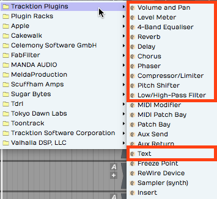
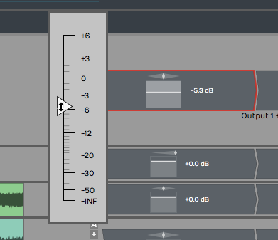
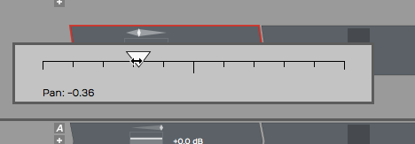
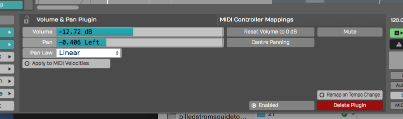
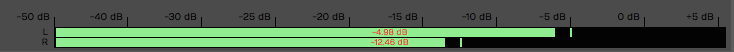
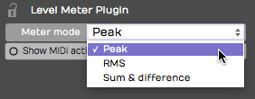
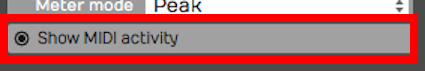
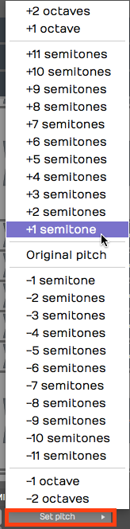
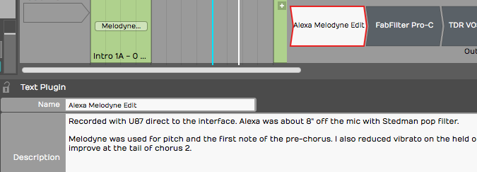
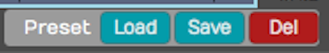

# Built-in Effects Plugins

The Waveform built-in effects are really quite simple. They act as
plugins that you can combine to build up more complex effects chains in
the mixer, or within plugin racks. While we won't touch on every single
effect here, we will go over the essential ones. Let's get started.

## Waveform Effects

Drag the plugin object to the mixer and select *Waveform Plugins.*
You'll see the list of built-in effects.

*Built-in Plugin Effects in Waveform*

In this chapter, we will go into more detail about the plugins
hightailed in the image above. The other effects provide specialized
functions, or are not typical audio effects. We'll get into some of
those in later chapters.

## Volume & Pan Plugin

Whenever you create a track, you will see a *Volume & Pan* plugin at the
right in the mixer section. This gives you basic level and pan controls
like you'd expect to find on any mixer channel. Since the Waveform mixer
is made up of plugins, the *Volume & Pan* plugin can be moved before
other plugins or deleted entirely. You can even add another *Volume &
Pan* and use it as a trim control for gain staging.

Adjusting Volume
- To control volume, click and drag the volume slider up and down. A
    large volume slider appears as drag giving you nice readable dB
    markings for fine level adjustment. The numeric value for *Volume*
    setting appears in properties.

*Volume & Pan Plugin, Adjusting Volume*

Adjusting Panning
- The pan adjustment works similarly. Click the panner graphic then
    drag left or right to adjust left to right stereo positioning.

*Volume & Pan Plugin, Adjusting Panning*

Resetting Controls
- To reset either *Volume* or *Pan* to their default position, hold
    down Opt / Alt as you click the control.

Properties
- With a *Volume & Pan* plugin selected its values and actions appear
    in properties.

**Volume & Pan* Plugin properties*

The *Volume* slider is repeated in properties along with buttons for
*Reset* and *Mute*. *Pan* is repeated in properties along with a *Centre
Panning* button that resets panning.

Pan Law
- The properties also include a setting for *Pan Law*. By default this is
    set to *Linear* but you can change it to other popular formats. For
    example, many DAWs use a -3 dB pan law so that as you pan to the
    center it lowers the volume slightly to make it easier to keep a
    track in balance as you adjusting panning.

> 💡 **Tip:** To apply a velocity offset to notes going into a virtual
instruments, insert a *Volume & Pan* plugin before it and enable *Apply
to MIDI velocities*. Adjust the fader to offset MIDI velocity to
increase or reduce the velocity. This is a quick way make your MIDI
drums hit harder - much easier than going back to editing the MIDI data.
This only works if you insert *Volume & Pan* ahead (to the left) of the
virtual instrument.

## Level Meter

The *Level Meter* plugin is also at the right end of the mixer for every
track by default. *Level Meter* is stereo and shows what the left and
right levels are doing.

*Level Meter Plugin*

When you select a *Level Meter*, its properties display a large horizontal
version of the meter, that also includes dB markings.

*Large Meter in properties*

The meter indicates signal overload with a red indicator at the top of
the meter. You can reset the meter by clicking the red overload
indicator.

> 💡 **Tip:** To clear all overload indicators in the Edit, right-click any
level meter and choose *Reset all overload indicators* ( Backslash ).

By default the *Level Meter* is set to peak mode. This is typical of the
metering in most DAWs. You may change the meter mode in properties or
from the right-click menu. Here is an explanation of each of the modes:

*Meter Modes for the *Level Meter* Plugin*

Peak Mode
- Peak mode shows the digital peak. This is the normal mode for
    Waveform and most other DAWs. From a technical point of view, you
    want to keep this out of the red to prevent ugly digital clipping.

RMS Mode
- To get a sense of the overall perceived volume your signal, try RMS
    mode; it emulates the response of legacy VU meters and gives you a
    better indication of how loud one track is perceived, compared to
    others.

Sum & Difference Mode
- *Sum & difference* is a specialized mode that gives you a visual
    representation of both the level and the stereo spread. The left
    part of the meter shows the level of sum of left plus right. This
    represents the combined level of the stereo signal.

The right side of the meter shows the difference between left and right.
The more difference you see the wider the stereo spread between the two
channels. This gives you a visual indication of stereo spread. If both
channels are playing exactly the same thing, then left minus right will
cancel to zero and the right side of the meter will show no activity: a
mono signal.

> 💡 **Tip:** The level meter will also indicate MIDI activity if you enable
*Show MIDI activity* in properties. This can be a very useful diagnostic
if you ever wonder why a virtual instrument is not triggering.

*Level Meter, *Show MIDI activity**

## Equalisers

Waveform's equalisers come in three sizes — *1-Band*, *3-Band*, and
*8-Band* — so you can reach for exactly as much EQ as the job needs. Each
one has a graphical frequency-response display in properties where you
drag nodes to shape the sound: drag a node up or down for *Gain*, left or
right for *Frequency*, and around the node to set its *Q* (width).

*1-Band Equaliser* is the smallest — a single band you can set to a bell
or a shelf. It's perfect for a quick surgical cut or a gentle tone tweak
without the clutter of a full EQ.

*The 1-Band Equaliser*

*3-Band Equaliser* gives you a low shelf, a sweepable mid bell, and a
high shelf — the classic three-band tone stack. Set the *Frequency* and
*Gain* of each band by dragging its node.

*The 3-Band Equaliser*

*8-Band Equaliser* is the full parametric EQ. It has eight bands — a low
shelf, six peaking bands, and a high shelf — each with its own
*Frequency*, *Gain*, and *Q*, and each able to be switched on or off
individually. It also offers a *Stereo* or *Mid/Side* mode: in *Mid/Side*
mode you equalise the centre (mono) and the sides (stereo) of the signal
independently, which is handy for mastering and stereo-width work.

*The 8-Band Equaliser*

> 📝 **Note:** The older *4-Band Equalizer* from earlier versions now lives
in the *Legacy* folder. See the *Legacy Plugins* chapter if you need it to
open an old project.

## Reverbs

Waveform includes three algorithmic reverbs, each tuned for a different
kind of space: *Natural Reverb*, *Plate Reverb*, and *Non-linear Reverb*.
They share the same set of controls, so once you learn one you know them
all.

- *Natural Reverb* models real rooms and halls — the go-to for adding
  believable depth and ambience to a track.
- *Plate Reverb* recreates the bright, dense sound of a classic studio
  plate, a long-time favourite on vocals and snares.
- *Non-linear Reverb* is a gated/non-linear effect whose tail cuts off
  abruptly rather than fading away — the big drum sound of the '80s.

*The Natural Reverb*

*The Plate Reverb*

*The Non-linear Reverb*

The controls are:

- *Pre Delay* — a short gap before the reverb starts, which helps keep the
  dry signal clear and present.
- *Size* — the dimensions of the simulated space, from a small room to a
  large hall.
- *Decay* — how long the tail takes to fade out.
- *Density* and *Diffusion* — the thickness and smoothness of the reverb
  tail.
- *Low Cut* / *High Cut* — filters that trim the bottom and top off the
  reverb.
- *Low Damp* / *High Damp* — how quickly low and high frequencies die away
  in the tail, for a warmer or brighter sound.
- *Slope* — (*Natural* and *Plate*) tilts the overall tonal balance of the
  tail.
- *Pan* — positions the reverb in the stereo field.
- *Mix* — blends the wet reverb against the dry signal.

> 💡 **Tip:** Assign *Mix* as the quick control parameter so you can dial
reverb in and out while mixing. More reverb pushes a track further back;
less brings it forward. Combine that with left and right panning for more
spacious mixes.

## Delay

The *Delay* is a full stereo, ping-pong-capable delay with completely
independent left and right channels. Each side has its own delay time,
feedback, cross-feedback, pan, and trim, so you can build everything from
a simple slapback to wide bouncing stereo echoes.

*The Delay*

For each channel (*L* and *R*):

- *Delay* — the delay time in milliseconds, or, with *Sync* on, locked to
  a musical note value at the project tempo.
- *Feedback* — how much of the delayed signal is fed back into itself to
  create repeats.
- *Cross FB* — cross-feedback, which sends each channel's echoes into the
  other side. This is what creates the classic ping-pong bounce.
- *Pan* and *Trim* — the position and level of that channel's output.

The shared controls are:

- *Sync* — switches the delay times between free milliseconds and
  tempo-locked note values.
- *Low Cut* / *High Cut* — filters in the feedback path, so the repeats get
  progressively darker (or brighter) as they fade.
- *Mix* — the balance of wet delay against the dry signal.

> 📝 **Note:** The original simple mono *Delay* now lives in the *Legacy*
folder.

## Chorus

The *Chorus* plugin gives you that classic shimmering, doubling effect —
great on guitars, pads, electric pianos, bass, and vocals. It works by
modulating a short delay so the pitch drifts gently up and down.

*The Chorus*

- *Mode* — *Normal*, *Wide*, or *Wider*, setting how far the effect spreads
  across the stereo field.
- *Delay* — the base delay time the modulation works around.
- *Depth* — how far the delay is modulated; more depth means a stronger,
  more obvious warble.
- *Rate* — the speed of the modulation, or, with *Sync* on, a *Note* value
  locked to the tempo.
- *Sync* — switches *Rate* between free Hz and tempo-locked note values.
- *Mix* — the blend of dry and chorused signal.

> 📝 **Note:** The older *Chorus* lives in the *Legacy* folder. The two share
a name, but the new one — in the *Effects* folder — is the default.

## Phaser

A phaser gives you that instantly recognisable swirling, sweeping motion —
popular on guitars, synths, and electric pianos, or any track that needs
some movement. It works by sweeping a set of notches up and down through
the frequency spectrum.

*The Phaser*

- *Stages* — the number of filter stages (4 to 12); more stages give a
  richer, more pronounced sweep.
- *Floor* and *Ceiling* — the lowest and highest frequencies the sweep
  travels between.
- *Rate* — the speed of the sweep, or a tempo-locked *Note* value with
  *Sync* on.
- *Sync* — switches *Rate* between free Hz and tempo-locked note values.
- *Feedback* — feeds the output back to intensify the resonant peaks for a
  more dramatic effect.
- *Mix* — the blend of dry and phased signal.

> 📝 **Note:** The older *Phaser* lives in the *Legacy* folder.

> 💡 **Tip:** As you work with effects you can easily change the order of
effects on any track by grabbing the plugin and dragging it left or
right. As you drag, a red drop target will glow in the spot where the
effect will be inserted when you drop it.

## Dynamics: Compressor, Gate, and Limiter

Waveform's dynamics processing is split into three focused plugins, each
doing one job well.

**Compressor** evens out the level of a signal by turning down anything
that rises above a threshold.

*The Compressor*

- *Threshold* — the level above which compression starts.
- *Ratio* — how hard the signal is turned down once it crosses the
  threshold.
- *Attack* and *Release* — how quickly the compressor reacts, and then
  recovers once the signal falls back below the threshold.
- *Knee* — softens the transition around the threshold for a gentler, more
  transparent action.
- *Output gain* — make-up gain to bring the level back up after
  compression.
- *Sidechain gain* — trims the level of an external sidechain. Route
  another track into the *Compressor*'s sidechain input to make it duck —
  for example, a kick drum pumping a bass line.

**Gate** does the opposite — it turns the signal *down* when it falls
*below* the threshold, silencing quiet passages, bleed, or hiss between
notes.

*The Gate*

- *Threshold* — the level below which the gate closes.
- *Attack* — how fast the gate opens when the signal returns.
- *Hold* — how long it stays open after the signal drops.
- *Release* — how fast it closes again.

**Limiter** is a brick-wall limiter that stops the signal from ever
exceeding a set ceiling — ideal on the master bus to catch peaks and
maximise loudness.

*The Limiter*

- *Gain* — drives the signal into the limiter; more gain means more
  limiting and a louder result.
- *Release* — how quickly the limiter recovers after catching a peak.
- *Ceiling* — the absolute maximum output level; nothing passes above it.

> 📝 **Note:** The classic combined *Compressor/Limiter* from earlier
versions is now in the *Legacy* folder.

## Distortion

*Distortion* adds harmonic grit and saturation, from gentle warmth to
full-on fuzz.

*The Distortion*

- *Type* — the flavour of distortion: *Light*, *Medium*, *Hard*, *Clip*,
  *Tube*, or *Fuzz*.
- *Drive* — how hard the signal is pushed into the distortion.
- *Post Gain* — output level, to compensate for the volume change the
  distortion adds.
- *Tone* — shapes the brightness of the distorted sound.
- *Emphasis* — sharpens the character of the distortion by emphasising
  certain frequencies before the waveshaping.
- *Mix* — blends the distorted signal with the dry input.

## Pitch Shifter

The *Pitch Shifter* plugin uses DSP processing to change the pitch of
the signal in real time. For audio tracks, this uses the *Elastique Pro*
algorithm, or whichever algorithm you select in the *Type* parameter.

*The Waveform Pitch Shifter Plugin*

*Pitch Shifter* is set in semi-tones; if you want to go up an octave,
set *Pitch* to 12. If you want to go down one octave set it to -12. To
reset back to the original pitch, select *Pitch* and type in zero.

**Pitch Shifter, Set Pitch**

> 💡 **Tip:** You nay find it's usually a lot easier to control the *Pitch*
value by typing in the digits than it is to use the slider.

> 📝 **Note:** If you insert *Pitch Shifter* ahead of a MIDI instrument, it
works on the MIDI data stream to transpose notes up or down by the value
you set in the *Pitch* parameter.

## DJ EQ and DJ Filter

*DJ EQ* and *DJ Filter* are two performance-oriented effects built for
quick, hands-on tone sweeps.

*DJ EQ* is a three-band EQ with *Low*, *Mid*, and *High* faders that boost
or fully cut each band — turn a band all the way down to kill it
completely, the way a DJ drops the bass out of a track. Two crossover
controls, *Freq 1* and *Freq 2*, set the frequencies where the bands
divide.

*The DJ EQ*

*DJ Filter* is the classic single-knob DJ filter. The *Freq* control sits
at *Off* in the centre: turn it left and a low-pass filter sweeps the
highs away; turn it right and a high-pass filter sweeps the lows away. *Q*
sets the resonance at the filter's edge, and *Mix* blends the result with
the dry signal.

> 📝 **Note:** The simple *Low/High-Pass Filter* from earlier versions now
lives in the *Legacy* folder. For everyday filtering reach for the *1-Band
Equaliser*, or, for sweeps, the *DJ Filter*.

## DJ Tools

The *DJ Tools* — *Fader* and *Crossfader* — come with the **DJ Mix Tools
Expansion** (included in the *Pro* edition, and the same add-on that
unlocks Stem Separation). They turn Waveform's tracks into a DJ-style
mixer.

*Fader* is an automatable volume fader with a *Position* control and an
adjustable response *Curve*, so you can ride or program smooth level
changes.

*The Fader*

*Crossfader* blends between two stereo sources, *A* and *B*. It takes two
stereo inputs and produces one stereo output; the *Position* control fades
from full A on the left, through the centre, to full B on the right.
*Curve* shapes the blend — from a smooth equal-power fade to a sharp cut —
and *Centre Gain* sets the level at the midpoint.

*The Crossfader*

## Text Plugin

The text plugin is a convenient tool to keep your Edit organized as you
record, edit, and mix. Drag *Text* it to a track, give it a *Name* and
then type in a *Description*.

*Text Plugin Example*

You can type in as much text as you'd like describing how the recording
was made, the kind of microphones used, the artist name, and really
anything you'd like to make a note of. *Text* plugin *Name* appears
right in the mixer on the thumbnail. While *Text* doesn't do anything to
your audio path it can help you remember what you were doing when you
come back to a project later on.

> 💡 **Tip:** You can enable or disable several plugins at once by simply
selecting all of them and using the keyboard shortcut F.

## Guitar IR

> 📝 **Note:** *Guitar IR* and *Dual Guitar IR* are *Pro* features, available in
Waveform 12 and later.

*Guitar IR* is a convolution plugin that loads an impulse response (IR) — a
short WAV recording that captures the sound of a guitar cabinet, speaker, or
room — and stamps that character onto whatever passes through it. It pairs
naturally with an amp-simulation plugin: run your DI guitar into the amp sim,
then into *Guitar IR* to model the cabinet and miking.

*The Guitar IR*

Load a WAV file using the IR field, then shape the result with the controls:

- *Gain* — output level, from −12 dB to +6 dB.
- *Low Cut* and *High Cut* — high-pass and low-pass filters that trim the
  response, each adjustable from 10 Hz to 20,000 Hz.
- *Filter Q* — the resonance of the cut filters (0.1 to 14).
- *Mix* — blends the convolved (wet) signal against the dry input, from 0 to
  1.0. It defaults to fully wet (1.0).
- *Normalise* — evens out the loudness of the loaded IR so swapping impulses
  doesn't change your level. On by default.
- *Trim Silence* — removes leading silence from the IR. Off by default.

### Dual Guitar IR

*The Dual Guitar IR*

*Dual Guitar IR* works the same way but hosts **two** impulse responses (A and
B) at once, so you can blend two cabinets or mic positions for a wider, more
complex tone. In addition to the controls above it adds:

- *Width* — spreads the two IRs across the stereo field (defaults to 0.5).
- *Delay* — offsets one IR against the other by up to 200 ms (defaults to 0),
  useful for subtle thickening or comb-filter effects.

## Artisan Collection

The *Artisan Collection* is a large built-in library of effects — over 180 of
them — based on the AirWindows plugins by Chris Johnson. They're grouped into
categories in the plugin picker: *Delay*, *Dither*, *Distortion*, *Dynamics*,
*Emulation*, *EQ*, *Filter*, *Imaging*, *Modulation*, *Reverb*, and *Utility*.

Rather than document each plugin individually, it's enough to know that every
*Artisan Collection* effect shares two common controls — a *Dry* level and a
*Wet* level — alongside its own specific parameters, so you can always dial in
how much of the processed signal is blended with the original.

To use them, enable the collection in *Settings > Plugins* with the *Enable
Artisan Collection Plugins* option (on by default). After enabling it you'll
need to restart Waveform. Once enabled, the effects appear under the *Artisan
Collection* folder in the plugin picker.

> 📝 **Note:** The *Artisan Collection* is a *Pro* feature.

## Master Mix

*Master Mix* is an integrated mastering plugin designed to sit at the end of
your signal chain — typically on the master or output bus — to polish a
finished mix. It combines several mastering stages in a single plugin.

- *Pre EQ* and *Post EQ* — parametric equalizers before and after the dynamics
  processing, for corrective and final tonal shaping.
- *Crossover compression* — a 3-band crossover splits the signal into low, mid,
  and high bands, each feeding its own compressor with a graphical transfer
  curve you can edit by dragging nodes.
- *Dynamics* — a final stage offering soft clipping and a noise gate.
- *Input and Output gain* — independent left/right input and output levels, each
  with metering.
- *DC filter* — removes any DC offset from the signal.

You can store up to 100 presets, and use the *Mem A* / *Mem B* A/B buttons to
compare two settings instantly while you fine-tune the master.

> 📝 **Note:** *Master Mix* is available in the *Pro* and OEM editions of
Waveform.

## Saving Presets

Most of the built-in plugins allow you to load, save, and delete
presets. Once you have your favorite presets saved, you can search for
presets on the Presets tab or the Search tab of the Browser.

*Load, Save, or Delete Presets*

As you create presets you can also add tags to make it quick to filter
to exactly what you are looking for; Vocal EQ, Guitar Focus, Bass Boost
for example.

## Moving On

Now we've touched on most of the built-in plugins in Waveform. The
built-in effects, along with third-party plugins give you tremendous
creative potential when composing or mixing.

