# Clean-up Editing

After you have some basic tracks recored, you can use the Waveform
editing tools to clean up the clips and fix small problems with the
takes. We covered Audio clip editing in [Audio Clips and Editing Audio](audio-clips-and-editing-audio.md). In
this chapter we will show you a few practical examples of how to use
them.

> 📝 **Note:** Sometimes it is easier to make timing edits if you move the
part you're working on near the drum part. That way you can see the
timing of your notes compared to the timing of the essential rhythmic
elements of the song.

## Trimming

The trim handles are a great way to clean up the beginning and ending of
recording takes. Trim the beginning to keep the track silent until the
part actually comes in. Then trim the end to silence any extra noise
that happens after the song is done.

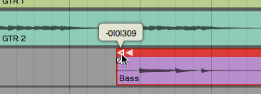

*Trimming an Audio Clip*

To use the trim handle just grab and drag. If you leave *Snap* on,
trimming will snap to the grid. With *Snap* turned off, you can trim
freely.

> 💡 **Tip:** You can temporarily override snapping by holding Cmd / Ctrl
while trimming.

You can also trim multiple Audio clips at the same time. Just select
several clips using Opt-drag / Alt-drag and then adjust the lengths
using the trim handles on any of the select clips.

## Correcting Small Timing Problems

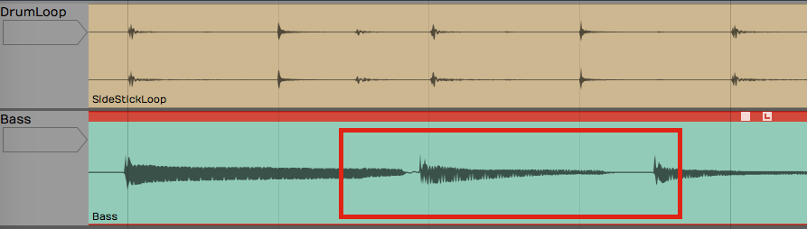

*Bass Note Timing is Early*

Look at this example baseline compared to the drum loop. One of the bass
notes is early. Ideally, you would re-record this part. If that's not an
option you can easily correct small issues like this. The strategy is to
separate the out-of-time note to its own Audio clip, them move it
slightly.

1.  Turn off *Snap*.
2.  Select the Audio clip you want to fix.
3.  Position the cursor just at the beginning of the note that needs
    fixing and press slash ( / ) to split the clip.

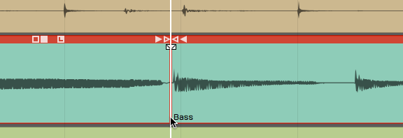

*Split the Beginning of the Note*

4.  Position the cursor just after the note and press slash ( / ) again.
    The bad note is now separated to its own Audio clip.

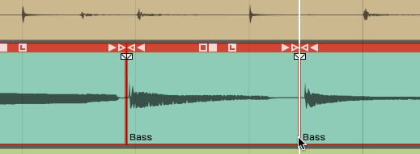

*Split After the Note*

5.  Click to select the single note. Trim the clip to shorten it a bit.

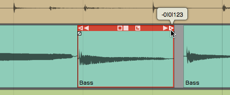

*Trim the Clip*

6.  Zoom in enough so you can see the alignment between the note and the
    drums. Grab the note and slide it to line up with the correct drum
    hit.

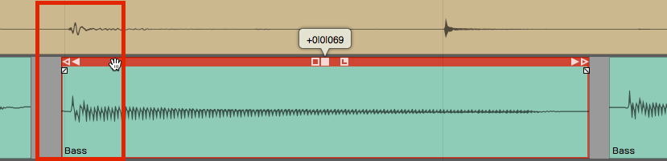

*Drag the Clip to the Correct Time*

7.  Complete the edit by trimming and crossfading into the other notes.

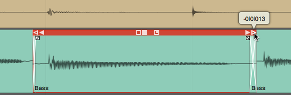

*The Completed Correction*

**Splitting & Selecting**. Right after you split a clip, you'll notice
that the two resulting clips are both selected. If you trim, slip or
move a clip the action will apply to all selected clips. That might not
be what you want. To select a single clip, just click one of the clips.
At any time, you may hit Escape to de-select everything.

## Correcting Timing by Slip Editing

Another way to correct timing is with slip editing. With this approach
you "slip" the waveform within the Audio clip rather than moving the
clip. The key to this approach is to put the initial split exactly where
you want to the note to start.

1.  Turn *Snap* off
2.  Zoom in enough to see where the note should start and select the
    clip to fix.
3.  Position the cursor at the exact spot you wish the note had started
    and press slash ( / ) to split the clip.

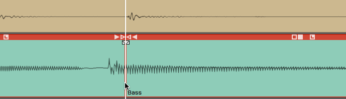

*Split the Clip Where the Note Should Start*

3.  If the note was early, trim back the previous clip to get rid of the
    extra bit.

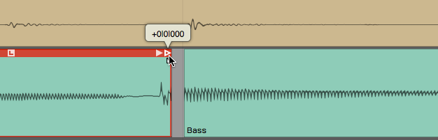

*Trim Back the Extra Bit From the Previous Clip*

4.  Position the cursor at the end of the note and press slash to split
    it again. The bad note will will have a separate Audio clip.

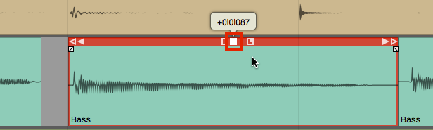

*Split After the Note*

5.  Select only the note you want to adjust. Grab and drag the slip
    handle (solid box). The waveform will slip within the window of the
    Audio clip. Align the waveform so it starts just after the leading
    edge of the clip.

*Drag the Slip Edit Handle to Adjust Timing Within the Clip*

6.  Clean up the edges with trimming and crossfading.

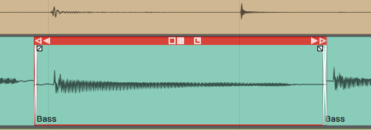

*The Completed Edit*

> 📝 **Note:** If you have automatic crossfade turned on then as you move one
clip to overlap another, a crossfade will be created automatically. See
[Audio Clips and Editing Audio](audio-clips-and-editing-audio.md) for more about crossfades.

## Fade-outs

You can also adjust the fade-outs at the end of takes simply by using
the fade handle and dragging it to the left for each track
appropriately.

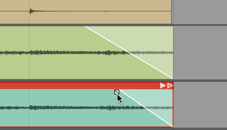

*Adjusting Fade-outs*

Remember, you can adjust the shape of the fade-out by selecting one of
the four preset shapes in the Actions panel.

*Fade-out Shapes in properties*

## Stretch an Ending Note

If a note at the ending isn't held out long enough, you can apply a time
stretch quite easily. Re-recording the take would be preferable, but if
that's not an option, here's how you can do a quick time stretch to
lengthen an ending note.

1.  First, separate out the note that you want to stretch using split as
    in the other examples.
2.  Hold Opt /Alt and drag the right trim handle to extend the note to
    the desired length.

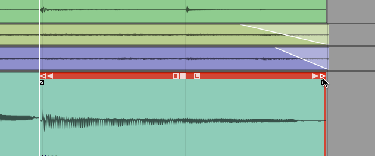

*Hold Opt / Alt While Trimming to Stretch a Clip*

3.  Audition the playback to make sure that it sounds clean. The more
    you stretch it the more chance you have to degrade the audio
    quality, but you might be surprised at how well this really works.

> 📝 **Note:** Besides just simply cleaning up the takes, you can do detailed
editing on Audio clips to completely change the timing or even the
arrangement. While writing songs, you can use these tools to compose
bass lines that tightly lock in with the drums. You can do this by
adjusting the timing, removing notes, or shortening notes; It all
depends on the nature of your music production. When writing a song, you
can use these tools to try many different ideas.

## Fixing Clicks at the Edit Points

When you do this type of editing, you might occasionally hear a click at
the beginning or ending of a clip. This occurs when you split across a
waveform that's actually got some energy present. You can easily correct
those by putting a very tiny fade at the beginning of the clip.

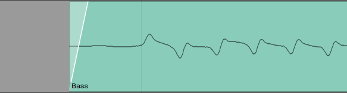

*Example of and Edge Fade*

You could zoom way in and add tiny fades to the beginning and ending of
each clip. The easier way is to select the clip and click *Apply Edge
Fade* in properties. This instantly puts 7 ms fades at the beginning and
ending of all selected clips.

**Apply Edge Fade* in properties*

## Rendering to a Single Audio Clip

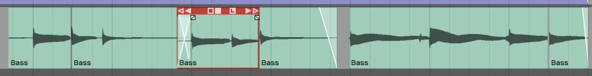

*Chopped Up Audio Clip Following Editing*

If clean-up editing leaves your track looking like a shredded mess, you
can quickly render all the clips back to a singled clip. To do so:

1.  Select all the clips you want to combine to one clip. One way to do
    that is to click the first clip, hold down Shift, then click on the
    last one.

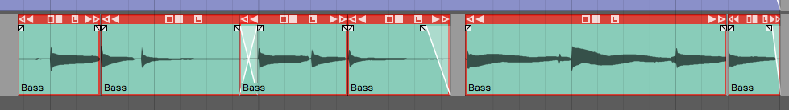

*Selected Clips before Rendering*

1.  In the properties select *Render Clips > Merge the selected clips*. In
    Waveform 6, merging is a single command, which is a great
    enhancement to the workflow.

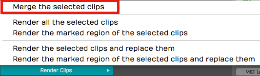

**Render Clips > Merge the selected clips**

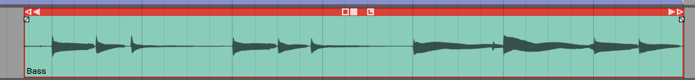

*Audio Clip After Rendering*

## Moving On

Those are some of the basic techniques you can use to clean up your
recorded tracks. Use these techniques to trim clips, apply fade-outs,
make minor timing adjustments, and then render all the changes to a
single clip.

