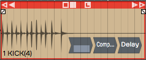

# Clip Effects

In Chapters 29 through 31 we covered using effects plugins in a variety
of ways. Now, we want to show you how to apply plugins to individual
Audio clips. Let's get started.

## Inserting Plugins on Clips

To insert a plugin on an Audio clip, drag the plugin from the Browser or
the plugin object, and drop it onto the Audio clip. You'll notice that
the plugin thumbnail appears in the lower right corner of the clip. You
can add as many plugins as you'd like to create a chain of effects, all
operating on that one clip.

*Plugins Using Clip Effects*

> 📝 **Note:** Clip effects work with Audio clips, but not MIDI clips or Step
clips.

The rest of the operation is pretty much the same as using plugins in
the mixer. Select a plugin and hit F to enable or disable it. You can
also enable or disable the effect with the *Enabled* button in
properties.

For third-party plugins, clicking or double clicking on the plugin opens
its user interface.

> 💡 **Tip:** How plugins open, depends on a setting in the Settings tab
Plugins page: *Opening Plugin Windows.* It can be set to either
*Single-click on a plugin to open its GUI window* or *Double-click on a
plugin to open its GUI window.*

## Removing Clip Plugins

To remove a plugin, simply click on the plugin and press Delete or
Backspace. You can also select multiple plugins by holding down Cmd /
Ctrl to select multiples, and then press Delete to remove them.

## Creative Uses

One of the reasons to use clip effects is if you want to put an effect
on just part of a track, even a single word or a single phrase. Without
using clip effects, you'd need to move a piece of the clip to another
track to apply a different type of an effect. This is really useful for
something like an echo throw where you're applying an echo effect to a
single word, or if you want to process one phrase of a vocal line with a
lo-fi effect. Just separate the phrase or word to its own cli, then
apply the effect only to that short clip.

## Echo Throw Example

An echo throw is taking one word, usually the last word of a phrase and
then applying an echo to it. Here are the steps:

1.  First, separate the final word of the phrase from the rest of the
    phrase. To do that position the cursor where you'd like to make the
    split and hit the slash (/) key.
2.  Now that clip is separated into its own clip, drag in the *Delay*
    plugin.
3.  Dial in the *Delay* parameter so it echoes out in a musically useful
    way, maybe using eighth notes or quarter notes. Add a little bit of
    *Feedback* so you get some echoes that die out over time.
4.  Playback and tweak the *Delay* parameters until you get the echo
    throw effect that you like.

## Moving On

The same technique is great for lo-fi effects as well. Apply a high pass
and a low pass filter in order to cut the highs and the lows, or even
apply chorusing to a few words in a vocal line. Clip effects are super
easy to use in Waveform, and they unlock all kinds of creative options!

