# Clip Launcher

## Playback

> 🎥 [Video explaining clip launcher playback](https://youtu.be/19Wd7HAWzlA)

New in Waveform 13 (Pro and Launcher expansion) is the clip launcher.
This allows triggering clips to play and stop rather than having their
start/end times predefined on the arrange timeline.

The clip launcher can be found in the mixer panel which can be bought
into view with the M key. You can then enable the clip launcher with the
grid button. The mixer and arrange panels can also be toggled between
using the tab key.

Clips can be dragged into slots in the same ways as the arranger, i.e.
from the Finder/Windows Explorer or one of the browsers. You can also
copy/paste and drag clips between the clip launcher and arranger.

The clip sizes can be toggled between standard and larger row views with
the mixer view button.

By default audio thumbnails only appear in the larger row view but you
can also make these appear on standard row heights from the Settings >
Appearance page.

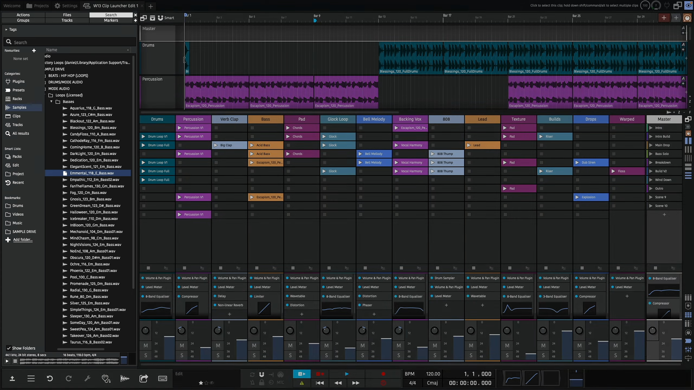

*Clip Launcher Playback*

## Playing and stopping clips

Once you have a clip in a slot, you can trigger it by pressing its play
button. This will also start play back in the arranger.

If the project is already playing, the clip will be triggered but won't
start playing until the next launch quantization point. By default this
is set to 1 bar but can be changed from the master track.

An already playing clip can be re-triggered which will start it from the
beginning.

You can stop a clip by pressing the track's stop button below the slots,
this is also quantised.

The clip launcher supports all types of clips so you can play back MIDI,
step and Edit clips as well as audio. Just make sure you add instruments
to the relevant tracks for MIDI and Step Clips.

## Scenes

A row of slots across multiple tracks is called a scene. You can trigger
all clips in a scene with the scene buttons on the master track. They'll
all be triggered to start at the same time.

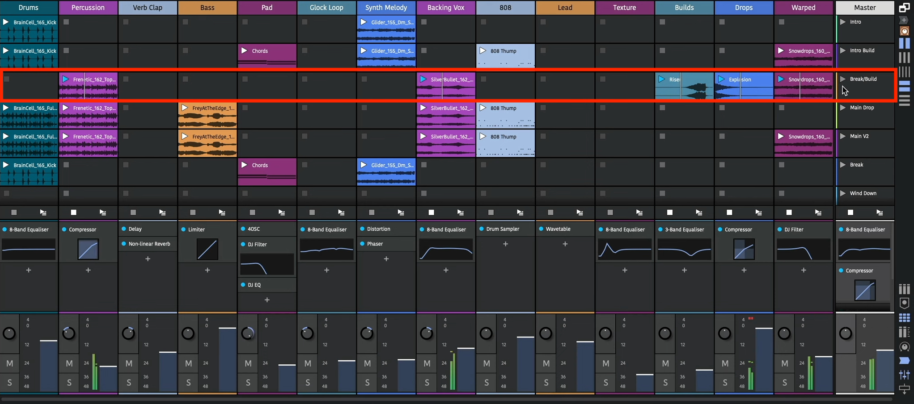

*Clip Launcher Scenes*

If you have content in multiple scenes, triggering clips in another
scene will stop the playing clip. With this, you can move through
sections of your song keeping everything in sync.

Launching clips also plays back the arranger transport. To keep launched
clips in sync with the arranger, changing the transport position whilst
playing back is now delayed until an appropriate time.

This time is also determined by the global quantisation. Shorter
quantisation times will cause quicker jumps but your bar positions may
become out of sync.

If you have clips on the arranger tracks, you can play these by using
the "back to arranger" buttons. Launching a clip will disable the
arranger track's clips again.

## Clip/Slot properties

Clips in the launcher have most of the same properties as arranger
clips. You can't however adjust their start, or lengths if they're
looping, as this is determined by when and how long they are launched
for.

Changing the offset property will determine what position in the
launched clip playback starts from.

You can adjust the loop start/end points using the Actions panel or the
[Detail editor](detail-editor.md) (Clip tab).

By default, clips follow the global quantisation but this can be
overridden so a clip has its own launch quantisation.

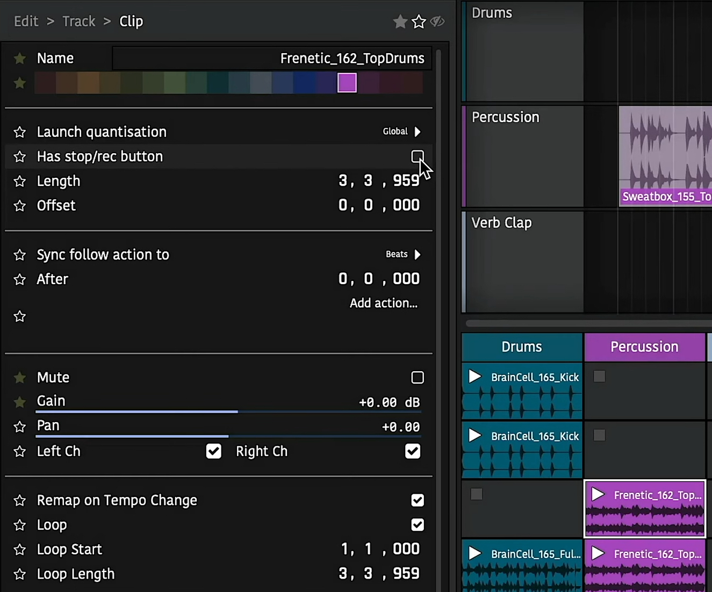

*Clip properties*

### Legato and Nudge

- **Legato:**

  If a legator is enabled for a slot, playing that slot will take over the previous playing clip's position. This can be useful if you have several variations of the same clip and want to seamlessly switch between them.

- **Nudge:**
  
  Moves a clip's playhead forwards/backwards by the global quantisation amount.

  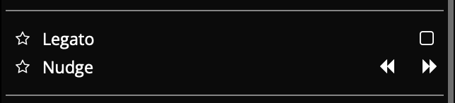

### Launch Modes

- **Trigger:**

  Default mode. Launches a clip on the mouse/controller down press, lifting is ignored.

- **Gate:**

  Launches a clip on the mouse/controller down press, stopping it again when lifting. Often used for sound effects or single-shot samples.

- **Toggle:**

  Launches a clip on the mouse/controller down press, and the next down press stops it. Lifting is ignored.

- **Repeat:**

  Holding down the mouse/controller repeatedly launches the clip at the global quantisation period.

  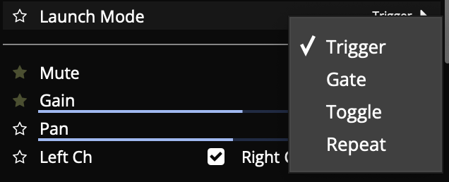

### Slot properties

Slots have a "has stop/rec button" property. Disabling this means that
when a scene is launched, if a track is already playing a clip but
doesn't have a clip in the newly launched scene and that slot doesn't
have a stop button, the already playing clip in that track will
continue. This can be useful if you have a longer clip or a loop that
repeats through a whole song.

## Recording

> 🎥 [Video explaining recording to the clip launcher](https://youtu.be/sQ3Epfh1zFY)

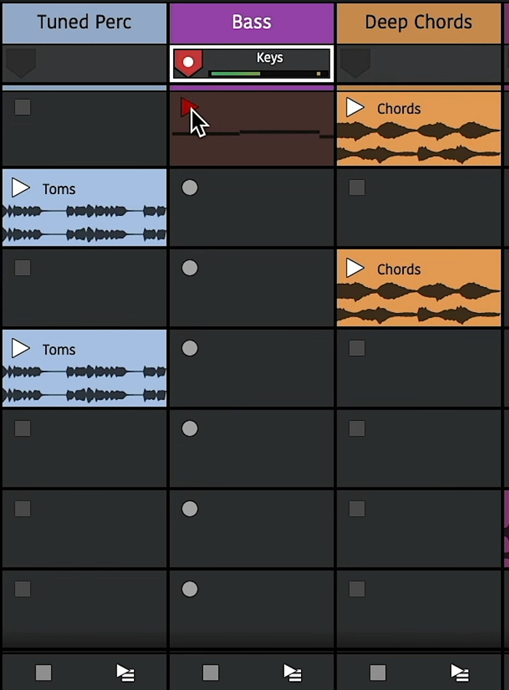

*Clip Launcher Recording*

Recording into empty slots works in much the same way as playback. First
however, you need to assign an input to a track and arm it. This can be
done in the arranger or mixer panels. The stop buttons will change to
record buttons to indicate they are armed.

Now to record to a slot, simply press its record button. It will be
quantised the same way as triggering playback and you'll also hear any
count-in you have set globally. Once the clip appears you can play the
input to record it. You'll see a preview of the content as you play.

Once you're done, you can either press the track's stop button to stop
recording or the recording clip's play button to have it launched.
Recorded clips will be quantised so they play back in time with the
song.

Recording to a new scene in a track will stop the previous one so you
can use this to create multiple takes or versions across different
scenes.

### Record Length

If you select an empty slot, you can enable the "Limit record length" property to set the length of recorded material. Then, when recording to that slot, recording will automatically stop after the elapsed duration. This allows you to quickly record loops in to an arrangement.

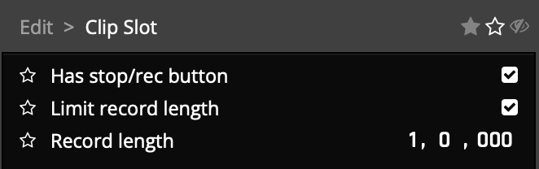

*Record Length Property*

## Performance Recording

> 🎥 [Video explaining capturing a clip launcher performance to the arranger](https://youtu.be/IVMlTjLriuY)

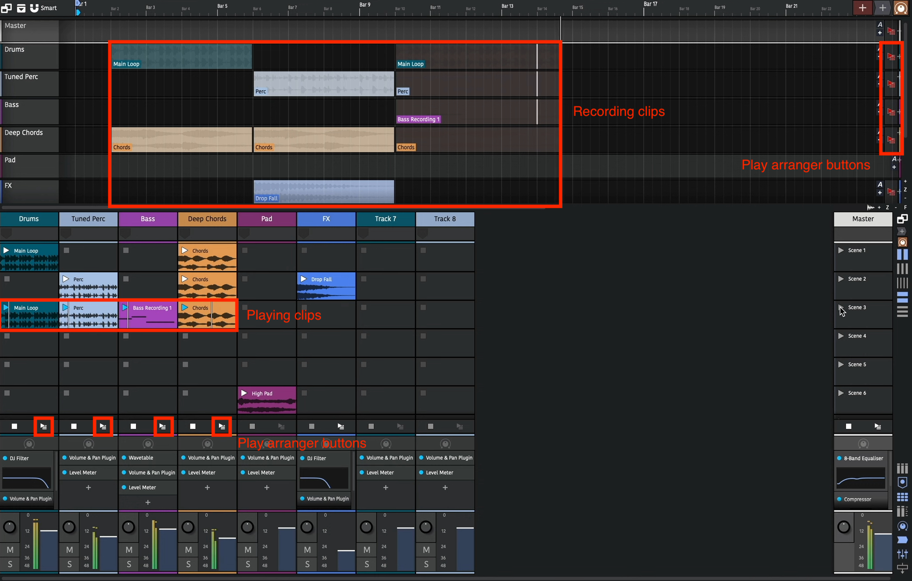

*Clip Launcher Performance Recording*

The clip launcher can be used in a live setting to create rich
performances. Sometimes though, you want to capture this live
performance in a way that enables you to edit it later. This is called
performance recording. To record a performance, simply enable the global
record button. Launched clips will now be copied to the arranger as they
play.

When you stop the launched clip, the recording arranger clip also stops.
This newly added clip won't be active at the moment as playback is still
in the launcher. Press the "play arranger" button to hear the newly
recorded clip.

This will sound the same as if you launched the clip as you did
previously. The clip's start/end/offset and loop boundaries are all
maintained.

Multiple tracks can be recorded at the same time and launching different
clips or scenes will also be reflected.

These arrange clips can then be fine tuned or the session can be
rendered out.

## Sequencing (Follow Actions)

> 🎥 [Video explaining clip launcher sequencing and follow actions](https://youtu.be/JYDDkxRHXtM)

In the above section we've seen how to manually trigger slots and scenes
but it's also possible to automate this with Follow Actions. These
enable you to specify which clips to launch and when allowing for
algorithmic sequence creation.

The follow actions can be found in the Actions panel once you have a
clip selected.

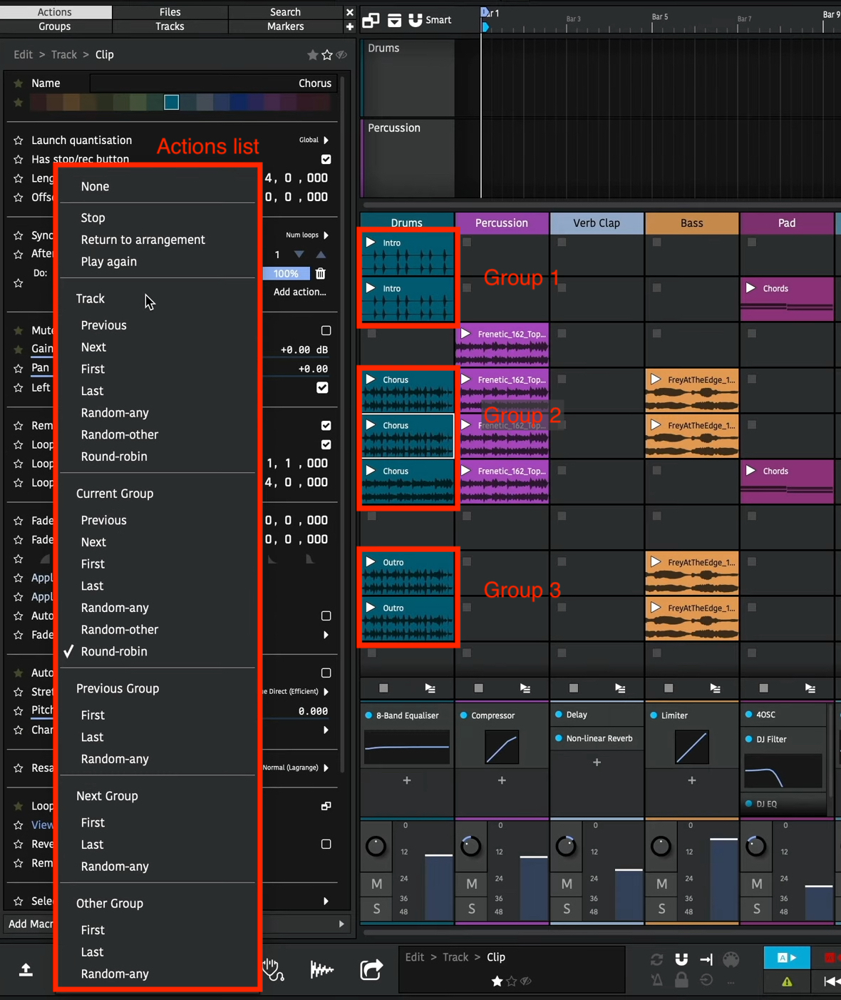

*Clip Follow Actions*

The first property determines if the action should be performed after a
duration of beats or a number of loops have been played. If the clip
isn't looping, this second option will just trigger at the clip's end.

## Global Actions

The row below shows the action to be performed and clicking on the
button shows the actions menu. At the top there is ***Stop***, ***Return
to arrangement***, and ***Play again***. These enable you automatically
stop a clip, play back the arranger track or start the clip from the
beginning.

Next there is a list of clip navigation in various scopes.

## Track Scope

The "track" scope means all launcher clips on the track are considered
for the action.

Then there is the choice of the previous or next slot, the first or last
slots in the track, any random slot in the track, any random slot in the
track other than the currently playing slot or round-robin (which is the
same as next except it will loop round to the first slot once it reaches
the end).

The follow actions for multiple clips can be set at the same time by
selecting them all.

If the action results in a slot that has no clip being selected, the
currently playing clip will just stop. In the image above, after the
last clip is played, playback on that track will stop. To loop back
round to the first clip, select round-robin.

## Other Scopes

The other scopes reduce the number of possible clips to choose from. A
group is any number of consecutive clips in the track. For example,
there are three groups in the above image.

Changing the action to "Group: Round-robin" for all these clips will
mean starting playback in any of them will loop round the clips in that
group. For example, playing the last clip in the first group will play
the first clip in the first group next and so on.

You can see now how the other group scopes work. ***"Previous/next
groups"*** pick clips in adjacent groups and ***"Other group"***
randomly selects from a different group to the currently playing one.

By grouping together related clips, for example, variations of a chorus
bar, you can use the scene triggers to move through sections of a song.

## Action Probabilities

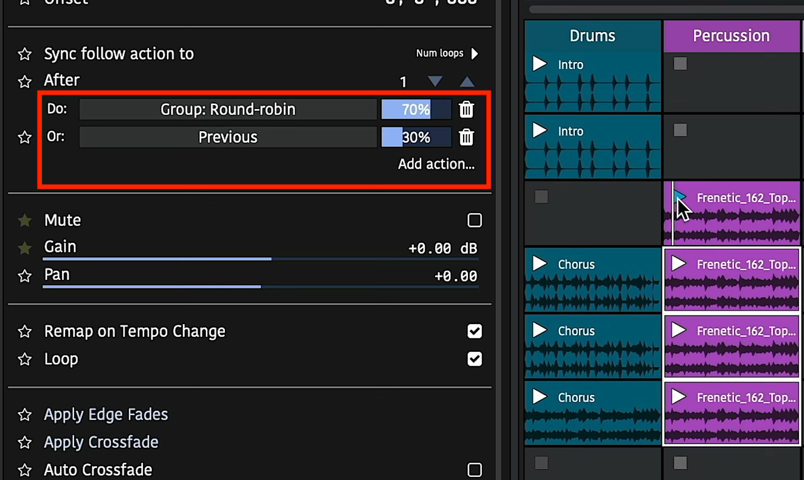

*Clip Follow Action Probabilities*

In the above image you can see two actions have been added to the clip.
The slider next to each action is the "weight" or probability that each
action will be performed.

An action can be added using the ***"Add action"*** button. Changing the
slider will change the probability that action will be triggered. All
the probabilities for actions will always add up to 100% so changing
one's probability will also change the others. If you want to remove an
action, press the ***"delete"*** trash can button.

By using different actions with different probabilities you can set up
interesting musical progressions. For example, a random walk can be
configured by setting the last three clips to have a 70% chance of
performing the ***"round-robin"*** action and a 30% chance of the
***"previous"*** action. If the first clip is played subsequent clips
are likely to play but sometimes play moves backwards a scene.

These clip changes can be recorded to the arranger using the global
record button as explained above. This enables you to replay the clips
without worrying about the randomness.

## External Controllers

> 🎥 [Video explaining using the clip launcher with external controllers](https://youtu.be/hW3aw1sACdc)

External controllers can be used to control the launching of clips in
much the same way the arranger section.

## Configuration

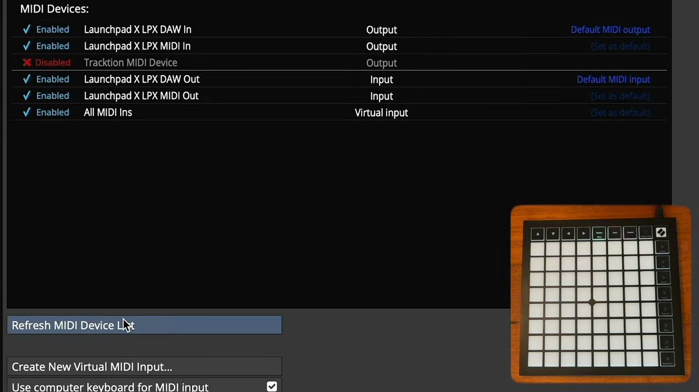

*Controller MIDI Settings*

First, go to the ***\"MIDI Devices\"*** settings page and if your device
is not shown, press the ***\"Refresh Devices\"*** button. Once visible,
ensure all the input and output devices are set to ***\"Enabled\"***
from the list.

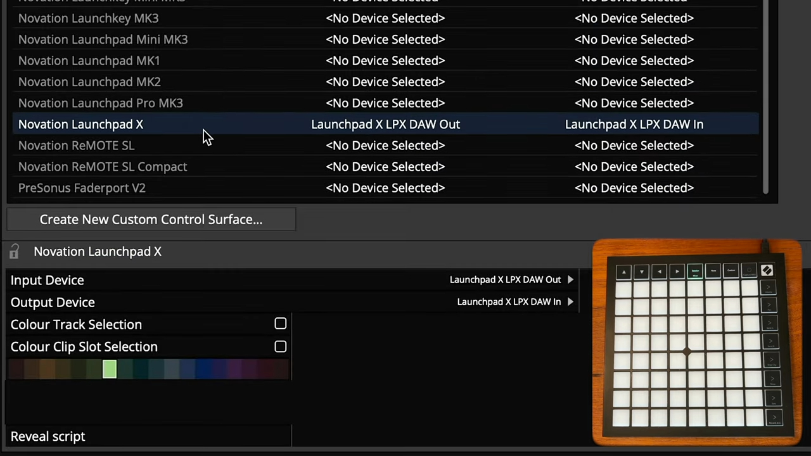

*Control Surface Settings*

Next go to the ***\"Control Surfaces\"*** settings page and select your
device. Ensure the correct ***\"Input Device\"*** and ***\"Output
Device\"*** are selected from the control surface properties.

Here you can also select the highlight colour to indicate the controlled
clips in the launcher panel. Select a colour and enable the ***\"Colour
Clip Slot Selection\"*** option to enable this.

## Playback and Recording

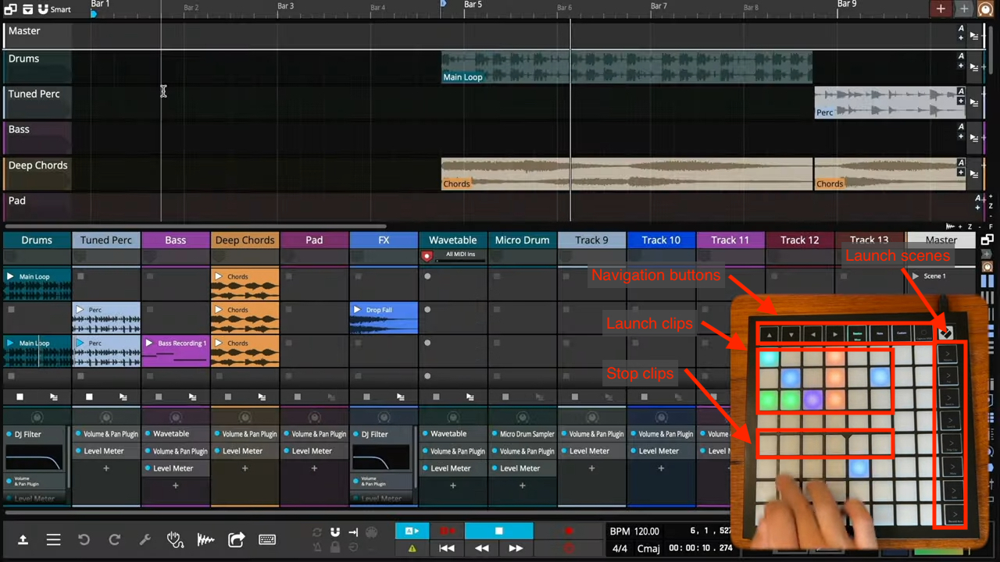

*Control Surface Buttons*

Control surfaces vary by model but most have buttons to launch clips,
launch scenes and navigate around the session.

Pressing an empty button on a track will stop playing clips on that
track.

If the track is armed for recording, pressing the button corresponding
to an empty slot will start recording in to that slot.

Most controllers can also be used as MIDI input devices. Pressing the
***\"Note\"*** button at the top will change the device to MIDI input
mode. The cells can then be used to record MIDI notes in to the
recording slot. Pressing the ***\"Custom\"*** button can change the
layout to a drum grid.

## Mixer Control

Some devices have a ***\"Mixer Mode\"*** which, when enabled lets you
adjust track and plugin parameters in your session. Please refer to your
hardware device user manual for specific capabilities.

---
