# Clip Layer Effects

Clip Layer effects were introduced with T7. They offer quick offline
rendering of many common audio processes but arranged as layers. You can
add or remove layers at will and the effects are rendered in quickly.
You can even rearrange the layers. Effects are applied from the top down
through the layers.

You may find Clip Layer effects to be most useful for things like
applying clip based volume automation, conversion to mono, and
normalizing. However, those are just a few example of Clip Layer effects
capabilities.

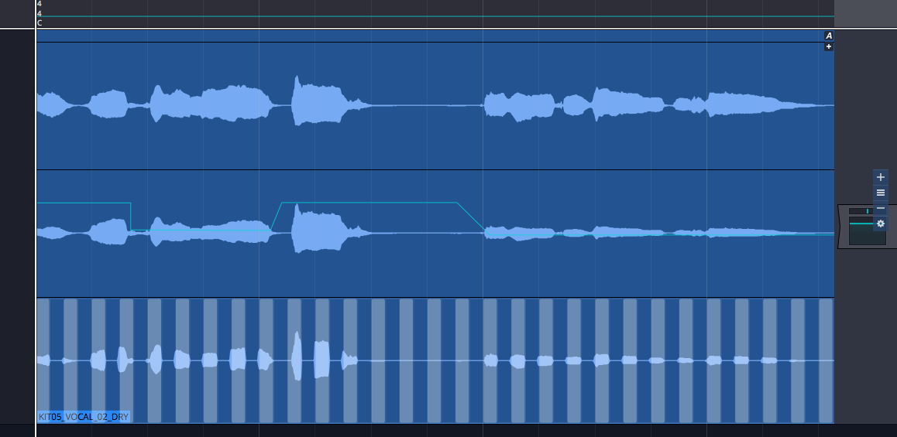

*Example Clip Layers*

To use Clip Layer effects, click on new FX icon in the header for any
Audio clip.

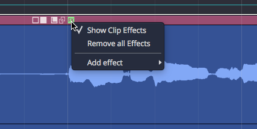

*Audio Clip Header FX Menu*

From there, select from any of effects. More details on each of these
options follows.

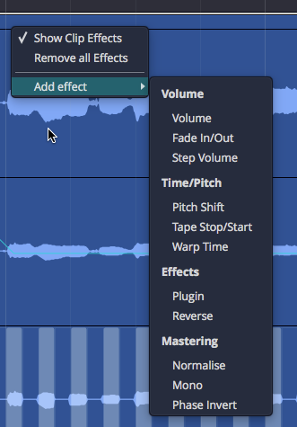

*FX Menu Add Effect Options*

The Clip Layer will appear. As you hover your mouse over it, a set of
controls appears to the right. The following diagram illustrates the
available options.

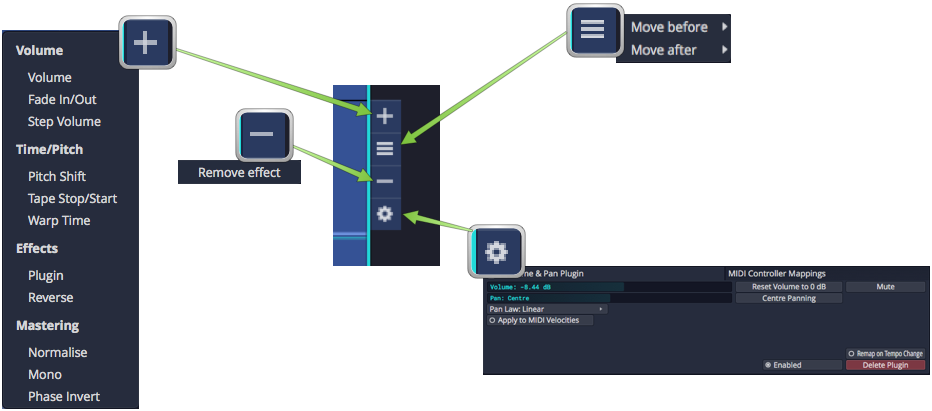

*Clip Layer Controls Diagram*

## Volume - Volume

Adding a volume layer is the Waveform way to do clip based volume
automation. You may find yourself using this instead of track automation
when it comes to automating volume.

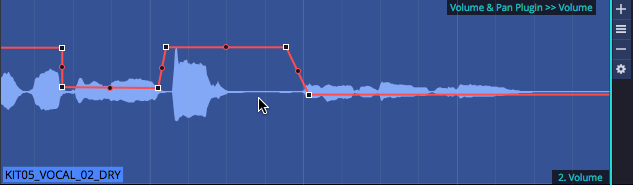

*Volume Clip Layer*

When you click the "gear" icon for a volume layer, you will see the
*Volume & Pan* control values in properties.

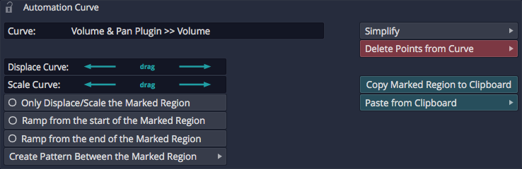

*Volume Clip Layer properties*

While somewhat useful, you are probably more interested in working with
the volume automation curve itself. To do so, click on the volume curve
(which initially shows up as a line) and then you have access to the
properties for that.

> 💡 **Tip:** See [Automation](automation.md) for more on editing the
automation curve. Everything about editing automation curves for tracks
applies to volume Clip Layers as well.

## Volume - Fade

Fade-ins and fade-outs are also available as layers. After creating the
fade layer, drag the left or right fade handles to create the fade in or
fade out.

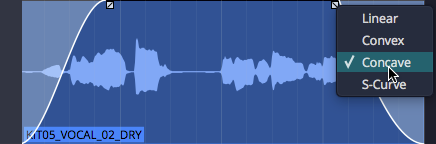

*Fade In/Out*

> 💡 **Tip:** Right click a fade handle to set the fade shape.

## Volume - Step

Add a step volume layer to rhythmically gate the clip.

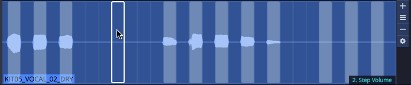

*Step Volume Layer*

With the step Clip Layer in place, click the gear icon at the right of
the layer and then work with all the properties to set the step size and
divisions. You can then click on the steps to turn them on or for
unlimited synced gating options.

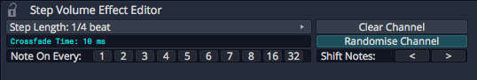

*Step Volume properties*

## Time/Pitch - Pitch Shift

Add a pitch shift Clip Layer to get access to an automation curve for
pitch. Add points and automate like any other effect to apply anything
from simple pitch offsets to dramatic pitch sweeps.

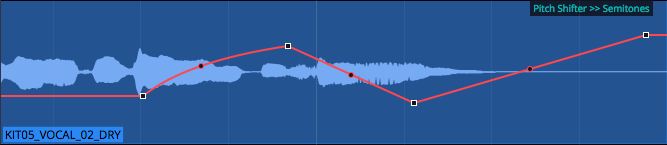

*Pitch Shift Layer*

When you select the pitch curve on the clip, its properties give you access
to the normal range of controls for automation curves.

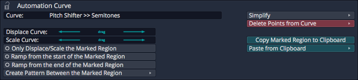

*Pitch Curve properties*

## Time/Pitch - Tape Stop/Start (Pitch Fade)

You probably already know that you can right-click the fade handles on
any Audio clip to apply pitch fades. Now you can do the same thing as a
Clip Layer effect.

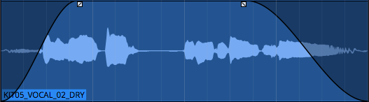

*Tape Stop/Start Layer*

Right-click the fade handle to choose the shape for the curve.

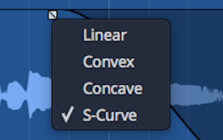

*Tape Stop/Start Fade Options*

## Time/Pitch - Warp Time

Before Clip Layers, you had to enable *Warp Time* on the clip itself
(from the Actions panel or the [Detail editor](detail-editor.md)). While
that still works, it's much easier with the clip layers feature; just
add a warp time Clip Layer.

The header area of the Clip Layer will appears shaded. Click anywhere in
the shaded area to add a warp marker.

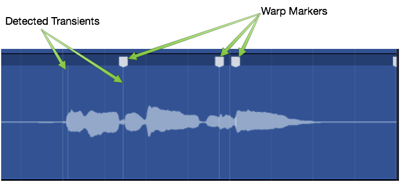

*Warp Time Clip Layer - Click to Add Marker*

Drag a warp points to time stetch audio between warp markers.

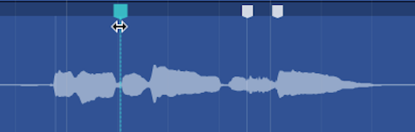

*Drag to Warp*

If you want to remove a warp marker, right-click and remove it or all
markers.

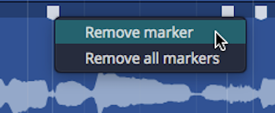

*Right-click to Remove Warp Markers*

You may find this implementation of Warp Time much more convenient,
especially if you want to align transients to things happening on other
tracks in the Edit. With the old way, you couldn't really see timing in
relation to the rest of the Edit.

## Effects - Plugin Layer

A plugin Clip Layer allows you to add any plugin including 3rd-party
effects to a layer.

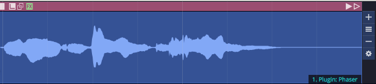

*Plugin Layer*

You will be prompted to select a plugin as you add the layer. The name
of the plugin appears on the Clip Layer at the lower right when the
layer is selected.

Here are the key things to know when working with the plugin Clip
Layers:

1.  Click the gear icon at the right to open the plugin UI. When you
    tweak parameters, a few second later the change is rendered in.

> 📝 **Note:** Because of the way rendering works, it is a bit hard to
audition changes to plugin parameters. You may find plugin Clip Layers
are best for applying known presets. If you want to do a lot of real
time tweaking, then you will probably be better off to use a Clip effect
or normal track plugin.

1.  Click the A at the top right to show automation curves. Any exposed
    automation parameter can be selected which makes its curves visible.
    Use all your standard automation editing tools to draw in
    appropriate automation.

## Effects - Reverse Clip Layer

Using the reverse Clip Layer is really easy. Add the layer and the audio
within the clip will now play backwards.

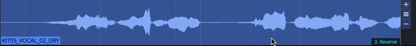

*Reverse Layer*

## Mastering - Normalise Layer

Normalise adjusts the gain of audio so that it use all of the available
the bit depth. The concept is analogous to "zoom-to-fit" in image
editing software.

To use it, first add Normalize layer.

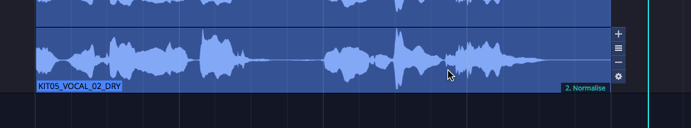

*Normalise Layer*

Then adjust the *Normalize* value to keep peaks where you want. In
voiceover work, many customers request the audio to be normalized to
-3db.

*Normalise Property*

## Mastering - Mono Layer

To convert to mono, the mono Clip Layer is a greta feature. It is much
more convenient to use this than other approaches in Waveform.

First add a mono Clip Layer:

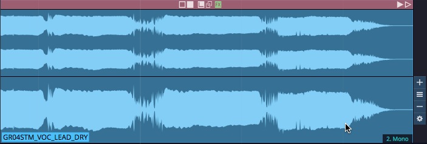

*Mono Layer*

The choose one of options for determine how to render to mono from
stereo:

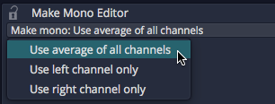

*Mono Options*

> 📝 **Note:** Most of the time you will probably select *Average of all
Channels*. This mixes the left and right channels to to create a mono
version.

## Mastering - Phase Invert Layer

The phase invert Clip layer is pretty straightforward. It flips the
polarity of the wave.

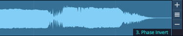

*Phase Invert Layer*

## Moving On

We think you will enjoy exploring and working with Clip Layers. It is
really only from experimenting with this approach that you will
understand how it works. There are likely many new editing workflows
that have yet to be discovered, that leverage the power of Clip Layers.

