# Comping

In this chapter, we're going to go over the cool comping features in
Waveform. Comping is an editing technique where you select the best
phrases from numerous takes to build a composite or "comp." The idea is
to create the best possible take. Engineers have been doing this for
years, but Traction makes it much easier than the traditional methods.

Comping typically starts with takes recorded in *Loop* mode, covered in
[Loop Recording](loop-recording.md).

Loop recording used to be a prerequisite for doing comping. Starting
with T6, Waveform also allows you to build composites from any
collection of tracks, using the new *Comp Groups* feature. More on that
later in the chapter.

## Copy Your Edit

Before you start comping, it is a good to create a copy of the Edit.
This is so you can return to the raw takes, in the event you later wish
to do the composite a different way.

> 📝 **Note:** We are assuming that you have already recorded using the
technique in the previous chapter. If not, go back to [Loop Recording](loop-recording.md) and get some takes recorded!

1.  When you finish loop recording, make sure to save the Edit with
    *Save > Save edit* (Cmd + S / ctrl + S).
2.  Go to the Projects tab and select the correct Edit. In the Controls
    panel, click *Create a Copy*.
3.  It is recommended to keep your Edits organized by adding a revision
    number. Do so by clicking on each Edit, then editing the *Name*
    property.
4.  On the original Edit, add a comment that says, "This version is
    before comping" or similar.
5.  Close the tab for the original Edit and open the new copied version.

Strategically creating copies of your Edits and naming them in a logical
way, works like a revision control system. You can always roll back if
something goes wrong, or if you just change your mind.

## Comping Takes

Now that everything is setup, it's time to get to the creative, part of
the process.

1.  Select the Audio clip that contains the takes you want to comp.

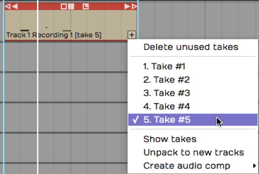

*Takes Follow Loop Recording*

1.  Click on the plus (+) icon in the lower right corner of the clip and
    select *Show takes.* That expands the clip to show all of the
    individual takes. If you play back over this section of the Edit,
    you will hear the very last take you did during loop recording.

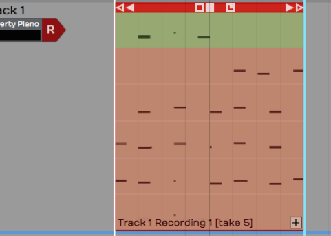

*Takes in the Expanded View*

3.  To build a composite take, click and drag a range over a phrase from
    any take. That phrase is instantly promoted to the active take. This
    drag-to-select action is called "swiping."

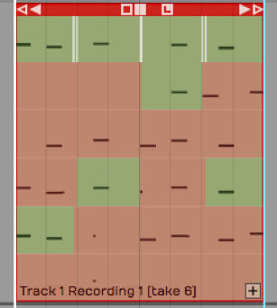

*Swipe a Phrase to Add it to the Active Take*

> 💡 **Tip:** While comping, sometimes it's helpful to have the cursor return
where you started playback whenever you stop playback. Do so by enabling
*Options > Return cursor to start position when play stops*. This makes
it easier to audition phrase by phrase without needing to constantly
reposition the cursor.

4.  Continue swiping and auditioning to build up the composite. If you
    want to switch a selected phrase to a different take, just click
    another take. The selection instantly moves to that take.

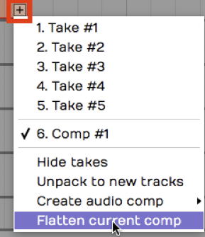

*Building the Composite Take*

5.  If the swipe selection doesn't fully enclose a phrase, adjust either
    edge of the selection by simply dragging the edge to trim it.

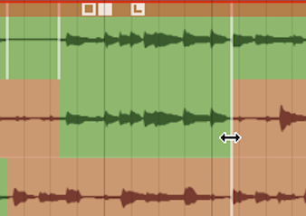

*Trim the Edges of a Selection*

> 📝 **Note:** While comping sometimes you'll use a little bit from every
take. Other times you'll predominantly use one take and just fix a
couple of bad phrases.

Once you have finished, click the plus (+) icon and select *Hide takes*.
At that point, you're finished comping!

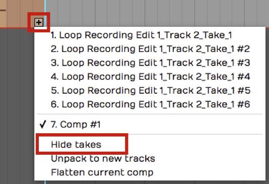

*Hide Takes*

> 💡 **Tip:** After comping, it is a great time to create another copy of the
Edit and add a note that this was saved after comping. This gives you
the option to roll back if you ever want to make some changes.

## Flatten Comp

If you feel compelled to remove the underlying takes from the Edit,
click the plus (+) icon on the clip and select *Flatten current comp*.
This gives you the option to delete the source files. Keep in mind that
this operation is permanent.

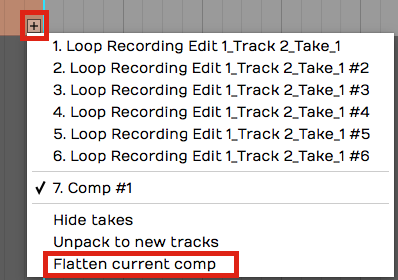

*Flatten Current Comp*

> 💡 **Tip:** Don't flatten the comp without first saving a copy of the Edit.
Also, we do not recommend selecting the option to delete the source
files as this will remove them for your other saved Edits.

## Setting up a Comp Group

T6 introduced *Comp Groups*, a feature that allows you to use swipe
comping with any group of tracks. This works similarly to the techniques
described above for comping takes. The difference is that you first add
the tracks involved to a Comp Group.

**Select Tracks to Comp**

Select all the tracks you want use to build the composite. These are typically recorded as various takes of a lead vocal or solo instrument. However you can use any collection of tracks you want.

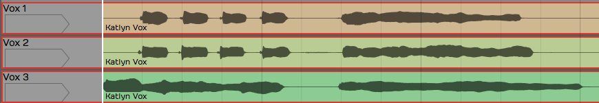

*Select the Tracks to Comp*

**Create a Comp Group**

In the properties, open the *Comp Group* menu and select *Add group.* This opens the *Comp Group Name* dialog box. The name will default to *Comp Group 1* which is fine. You can change it to something more descriptive if you want. Click *OK*.

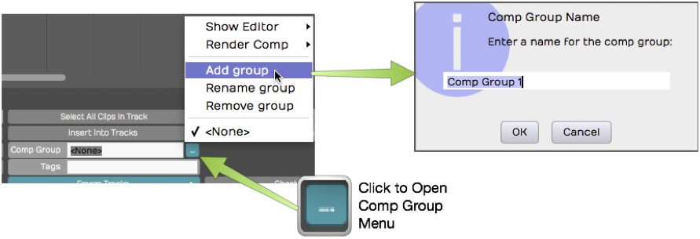

*Creating a Comp Group*

**Add a Track to a Comp Group**

 Any tracks pre-selected at the time you created *Comp Group 1* are automatically added as you create the Comp Group. To add another track to *Comp Group 1*, select the track, open the *Comp Group* menu and select *Comp Group 1*.

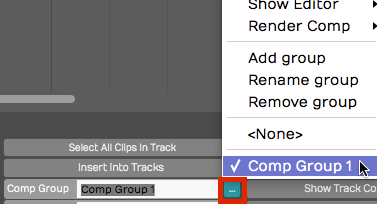

*Adding Another Track to *Comp Group 1**

**Removing a Track from a Comp Group**
To take a track out of a comp group, first, select the track. In the *Comp Group* menu, select *None*.

## Comping Tracks Using a Comp Group

With some tracks added to a Comp Group, it is easy to start comping.

1.  Select one of the tracks then in the *Comp Group* menu select *Show
    Editor > Edit track comps*. This puts the tracks in to comp mode.

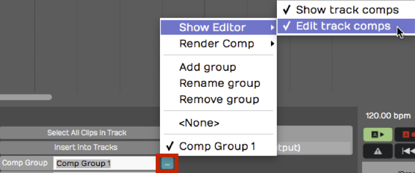

*Enable Comp Mode*

2.  Now you can start swiping to select phrases from any of the tracks.
    On playback only the selected phrases are played back.

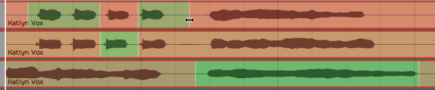

*Swiping Phrases to Create a Composite*

3.  You can adjust the window of your selection by dragging either edge
    of range. This works very similarly to comping takes which we
    covered earlier in the chapter.

> 💡 **Tip:** If you want to have good control over the silent parts of a
comp, it helps to add a blank track to the Comp Group. For the parts you
want to silence, simply swipe over that range on the blank track.

## Comp Group Editor

Here are few more things to know about the Comp Group Editor.

**Show Track Comps**
- When you enable comp group editing using *Show Editor > Edit track
comps,* another option, *Show track comps* is also turned on. This
enables the color coding of the swipe selections on the tracks. You
can turn this on separately if you want. This way you can see the
comp selections but leave *Edit comp groups* turned off so you don't
accidentally change them.

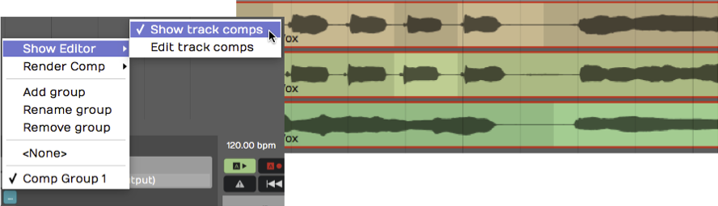

*Show Track Comps*

**Render Comp**
- When you have the composite complete, you can render the result to
    single track. The *Comp Group* menu gives you two options for this.
    *Render and replace comp group* replaces the all the comp group
    tracks with the resulting track. *Render comp group to a new track*
    leaves the existing tracks in place and adds a new track with the
    composite.

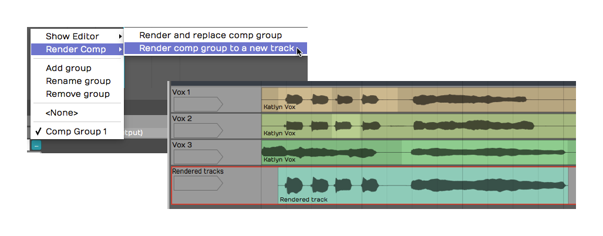

*Rendering a Comp to a New Track*

**Add, Rename, Remove**
- These options on the *Comp Group* menu give you all the features
    need to manage your comp groups.

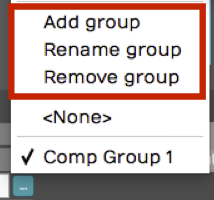

*Comp Group Management Features*

One interesting thing about comp groups is that you can have as many of
them active in the Edit as you want. There are many uses beside typical
comping, for example you could comp silence with tom tracks instead of
gating. Comping is also a fast way to mash up two beats or two different
songs.

## Moving On

The comping features in Waveform are very easy to use. As you are
learning Waveform, make sure to explore these powerful features.

