# The Edit Tab

In this chapter you will learn the layout of the Edit tab. The Edit tab
is where most of the action occurs during recording, editing, and
producing your song. This chapter is important, as you will learn the
terminology for the Waveform interface and objects used throughout the
rest of this book.

> 📝 **Note:** The keyboard shortcuts used in the chapter are based on the
alternative key mappings under *Settings > Keyboard Shortcuts > Reset
to Defaults > Use alternative Waveform key-mappings.* We've already
mentioned this several times and this might not be the last! If you want
to follow along with the keyboard shortcuts used in this book, make sure
to load the alternative key-mappings.

## The Parts of a Waveform Edit

The Edit tab is made up of four main parts: The Browser, the
Arrangement, the Mixer, and the transport bar. The Browser also hosts
the Actions panel.

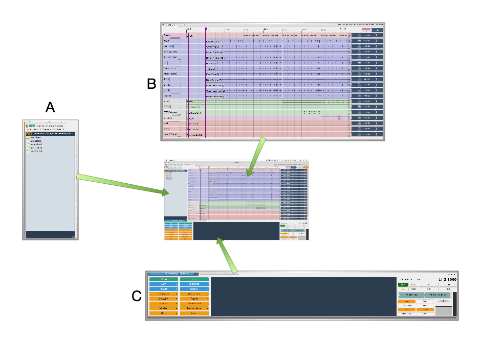

*Parts of the Edit Tab: A, Browser. B, Arrangement. C, transport bar*

## The Browser

The Waveform Browser resides along the left side of the Edit. You can
open or close it by clicking its icon or by pressing B. The Browser
includes a collection of tabs, giving you quick access to actions,
media, plugins, tracks, and markers.

> 💡 **Tip:** Starting with T7 and higher , you can move the Browser to the
top or right side of the Edit, by dragging its icon to the appropriate
edge of the screen.

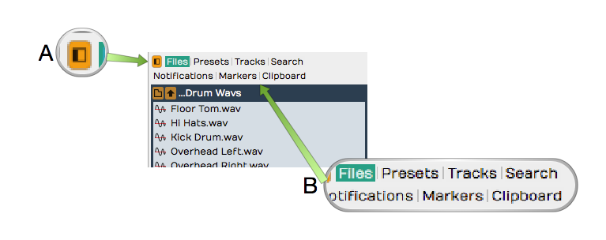

*Browser Open/Close Icon, A. Browser Tabs, B.*

Here is a short description of each Browser tab:

Actions
- The Actions tab shows context-sensitive actions and properties for
    whatever you currently have selected. See [The Actions
    Panel](actions-panel.md) for full details.

Files
- The Files tab is a filesystem browser for navigating directly to
    audio files on your system, the project folder, or your drives. You
    can bookmark folders for quick access to your loop libraries, and
    audition files before dragging them in. See *The Files Panel* in
    [The Browser](browser.md).

Search
- The unified Search tab lets you search loops, presets, plugins,
    racks, clips, and tracks in one interface, filtered by category and
    by tags. This is the main content browser -- see [The
    Browser](browser.md).

Groups
- (Waveform Pro) The Groups tab lists your Edit Mix Groups and lets you
    create and manage them. See [Edit Mix Groups](edit-mix-groups.md).

Tracks
- Use the Tracks tab to filter tracks in the arrangement by tag.
    First, you need to tag them by selecting one or more tracks and
    setting tags in properties.

Markers
- Use the Markers tab to add bars & beats or timecode markers to the
    Marker track. Navigate to any marker by simply clicking on the
    marker name. You can also quickly delete the selected marker, change
    its name or marker type in properties.

Assistant
- (Waveform 14) The Assistant tab hosts the AI Assistant -- a chat
    panel where you can make natural-language requests. It appears once
    you enable it on the Settings tab under AI.

For much more about the Browser check out [The Browser](browser.md).

> 💡 **Tip:** Resize the Browser by dragging the right edge left or right.
This is particularly helpful when working with the Search tab, which has
numerous search columns that might be hidden.

## The Arrangement

The Arrangement is made up of the Timeline, Track Headers & Inputs,
Tracks, and the Mixer.

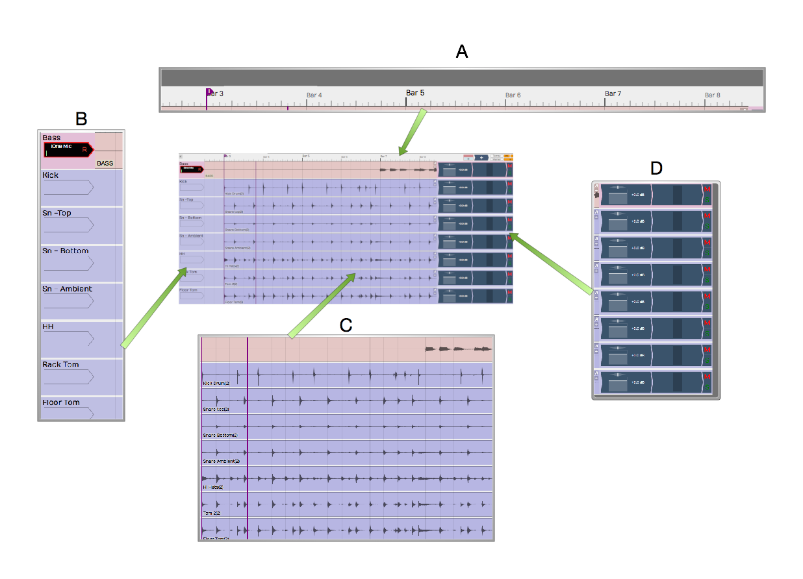

*Parts of the Arrangement: A, The Timeline. B, Track Headers & Inputs. C, Tracks. D, The Mixer*
Timeline. B, Track Headers & Inputs. C, Tracks. D, The

## Timeline

The Timeline acts as a ruler, measuring the time of the edit. While it
is commonly set to show the bars and beats of your song, it can also
show seconds and milliseconds or seconds and frames with a simple
right-click selection.

The Timeline is related to several other onscreen features:

In-marker & Out-marker
- The range between between the In-marker and the Out-marker defines
    what is called the "marked region" in Waveform. In other DAWs this
    is called often called the "loop" or "cycle." The marked region
    defines looped playback, loop recording, and many of Waveform's
    editing options. The keyboard shortcuts are I to position the
    In-marker, and O to position the Out-marker.

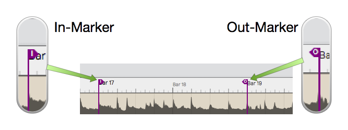

*In-marker & Out-marker*

Tempo Track
- The Tempo track appears below the timeline, when open. Here you
    define the the tempo and tempo changes. Open and close the Tempo
    track using F9.

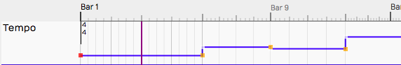

*Tempo Track*

Marker Track
- There are actually two marker tracks that can be opened below the
    Timeline. One is for bars & beats markers, such as song sections.
    The other is for absolute time in terms of hours:minutes:seconds and
    milliseconds. Cycle through the options with F10.

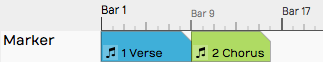

*Marker Track*

The Clip Object
- Above the right side of the Timeline you find the Clip object. Some
    Waveform users call the *Clip object* a "clip dragger" or "clip
    maker." All of the terms are descriptive of how it works. Drag it to
    a track to create an empty clip of any of the four types - MIDI
    clip, Audio clip, Edit clip, or Step clip.

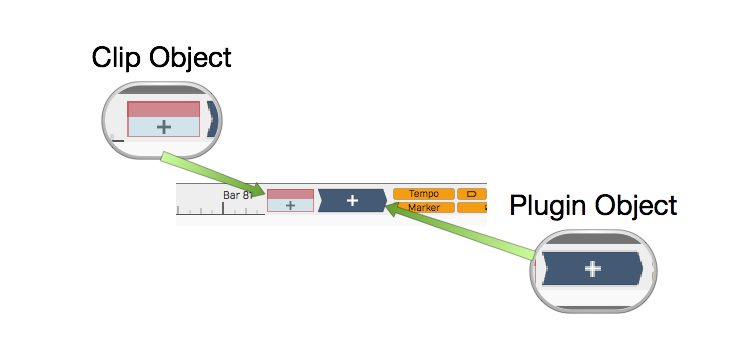

*Clip Object and Plugin Object*

The Plugin Object
- Drag the plugin object to the mixer section of any track to insert
    an audio effect plugin or virtual instrument. When you drop the
    Plugin object, you get a menu of all available plugins and
    instruments. You can control the organization of the menu from the
    Settings tab Plugins page. Refer to [Using
    Plugins](using-plugins.md) for much more about inserting and using
    plugins.

Show/Hide Buttons
- Several areas of the Edit tab can be opened for use or closed to
    declutter the screen. Here are the buttons to control those filled
    by the corresponding keyboard shortcuts.

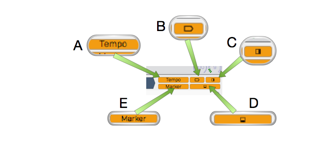

*Show Hide Buttons. A, Show/Hide the Tempo track. B, Show/Hide the Inputs. C, Show/Hide the Mixer, D, Show/Hide the Actions panel, E, Show/Hide the Marker Track*
track. B, Show/Hide the Inputs. C, Show/Hide the Mixer, D, Show/Hide the

-   Show/Hide Tempo Track (F9)
-   Show/Hide Marker Track (F10)
-   Show/Hide Inputs Section (Shift + F12)
-   Show/Hide Mixer Section (M)
-   Show/Hide Actions panel (F11)

## The Track Section

Tracks appears as parallel lanes that contain and organize clips of
audio and MIDI. Signal flow follows from left to right from Inputs, to
Clips for recording, to the Mixer and any plugins it uses, then on to
the master output. There is really only one kind of track in Waveform.
Tracks can hold any kind of clip: Audio clips, MIDI clips, Step clips,
or Edit clips. To create a new Track simply press T.

Track Headers
- The leftmost column of the Arrangement forms a list of track
    headers. Select a track by clicking directly on the track name
    within the header. Additional track properties including the Name
    became available in properties. To rename a Track, simple edit the
    *name* property. Tracks can be reordered by grabbing any track from
    the header and dragging it to a new location.

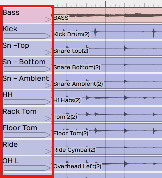

*Track Headers*

Inputs
- Inputs appear as right facing rectangular arrows. Click on an input
    for a menu of options that includes a selection of available inputs.
    Use the menu to set up a track for recording. Additional input
    options are available in properties. You can even drag an input to
    another track to continue recording.

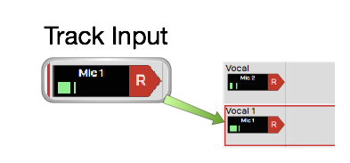

*Inputs*

> 💡 **Tip:** Resize tracks using the zoom tools in the lower right corner of
the arrangement.

## Clips

You can drag in audio files and loops to build your Edit, or record them
directly. The same goes for MIDI clips. Step clips are a unique in-line
step sequencer. Step clips are variation on MIDI Clips. While Edit clips
allow you embed an entirely different Edit into your song as single
clip. Selection an of the kinds of clips to access more properties and
actions in properties.

Audio Clips
- Audio clips are created during recording or can be dragged in from
    the Browser or desktop. Audio clips are one of the key elements of a
    Waveform arrangement. Waveform gives you a rich set of tools to work
    with Audio clips to split them, combine them, reverse them, or
    change the pitch, timing, or speed. You can also edit Audio clips
    with Melodyne to adjust the intonation of recorded notes. T7 gives
    you Clip Layer Effects for even more options to manipulate audio
    clips. See [Clip Layer Effects](clip-layer-effects.md) to learn
    about this new type of audio processing.

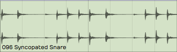

*Audio Clip*

MIDI Clips
- MIDI clips are the Waveform container for MIDI performance data. The
    clips have many of the same editing features as Audio clips. Expand
    MIDI clips vertically to see the full in-line piano roll MIDI
    editor. The MIDI editor comes with a full set of tools for editing,
    entering, and modifying MIDI notes.

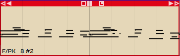

*MIDI Clip*

Step Clips
- Step clips are a unique type of inline step sequencer that gives you
    amazing flexibility to enter MIDI notes on a grid. Step clips are
    ideal for programming drum beats and rhythms, they can also be used
    for baselines, synth leads or just about anything else. Some
    Waveform users program complete compositions entirely with Step
    clips.

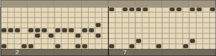

*Step Clip*

Edit Clips
- Edit clips are another unique Waveform concept. You can embed and
    entire Edit into a clip. You can also use Edit clips to separate out
    all your drum programming to another Edit as an aid when doing
    complex drum programming. Use Edit Clips to compose songs in
    blocks - develop the verse, chorus, and bridge in separate Edits and
    bring them together in another Edit. Teachers use it when recording
    several students singing over the same underlying track. It is a
    very unique feature and uses for it are still being discovered!

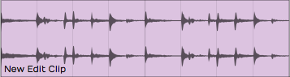

*Edit Clip*

Edit clips behave in the arrangement just like Audio Clips. How can you
tell the difference? They have an additional section in the Actions panel
to manage the link to the underlying Edit.

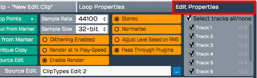

*Edit clip properties*

## The Mixer

Waveform's default Mixer view is one of it's unique, defining features.
For each track, signal flows from left to right - Input to Track, Track
to Mixer, Mixer to Master. The Mixer is where you arrange plugins to
create whatever channel strip you need for the track. If you have MIDI
clips on the track then insert virtual instrument as a sound source. If
you need to EQ a vocal, drop in an EQ.

The Volume & Pan and Level Meter plugins are installed by default,
however you can remove, reorder, or even add more instances of them. You
will find the following things on every track by default:

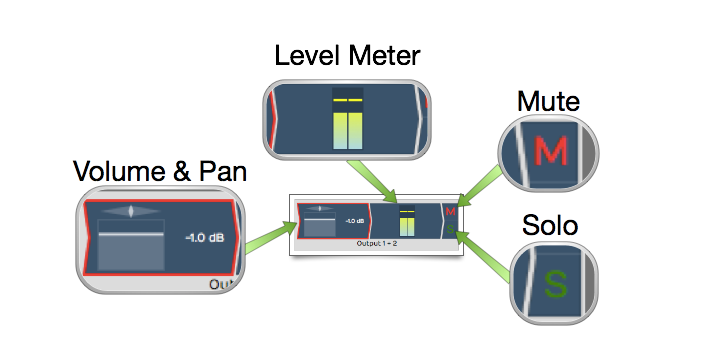

*Mixer Default Setup: Volume & Pan Plugin, Level Meter Plugin, Solo Button, Mute Button*

Volume & Pan Plugin
- This acts as like the channel fader and pan controls on a
    conventional mixer. When you click either element, a larger version
    pops up allowing you to easily adjust level or panning. When
    selected, the full set of properties appear in properties.

Level Meter Plugin
- The level meter shows the level of audio on the track. You can add
    additional instances or put the meter anywhere in the track using
    drag and drop. You can change the meter response between Peak, RMS,
    and Sum & difference from the right-click menu or from properties.

Mute
- The *Mute* button mutes and un-mutes the track. You can also mute by
    selecting a plugin and then right-click. The keyboard shortcut for
    mute is Shift + M.

Solo
- The *Solo* button silences all other tracks so you can hear one
    track at a time. *Settings > General > Solo Behavior*
    allows you to customize exactly how *Solo* works. Choose from
    *Cumulative* or *Exclusive* modes. From the right-click menu you can
    choose *Solo Isolate* which allows the track to continue to play if
    another track is soloed. This is particularly useful if a track is
    configured as an effects bus.

> 💡 **Tip:** Right-click on either *Mute* or *Solo* to access a menu. From
here you can reset all the solo and mute states for all tracks.

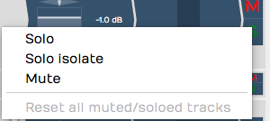

*Mute/Solo Right-Click Menu*

Note that starting with Waveform version 8, there is also an alternative
"traditional" mixer view available, that displays the mixer channels
vertically as seen on a real-world, hardware mixer. To use this mixer
view instead, click on the *show/hide mixer panel* button in the upper
right corner of the Waveform interface.Further details of the mixer
panel will be included in a future review of the user's manual.

## Menus

A full set of menus related to the Edit are available in the menu bar at
the top of the window. Of particular importance are the Export, Click
Track, Snapping, and Options menus. In this manual, we make numerous
references to these menus using a path syntax separated by
"greater-than" symbols. For example, "to set a one bar count-in choose
*Click Track > Pre-record count-in length > Use a 1 bar count-in.*"

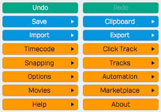

*The Edit menus*

## The Actions Panel

What is shown in the Actions panel depends on what object you have
selected. Each track, input, clip, plugin, rack, and automation point
has its own set of properties and actions. Click to select any object
and the Actions panel automatically switches to show the values and
actions relevant to whatever you have selected. This is a key concept
when using Waveform, and is central to its design. The Actions panel is
a flat list at the side of the window, and can also be opened from the
Browser.

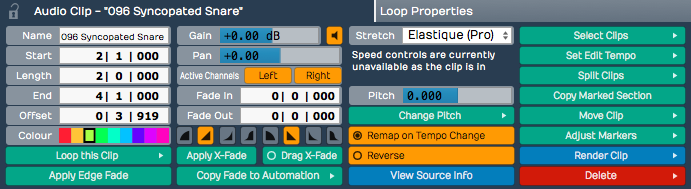

*The Actions Panel*

## The Transport Bar

The transport bar runs along the bottom of the window and contains
cursor position information, the Transport, the master volume control,
and a set of global control buttons. Final master plugins live on the
master track or in the mixer's master channel.

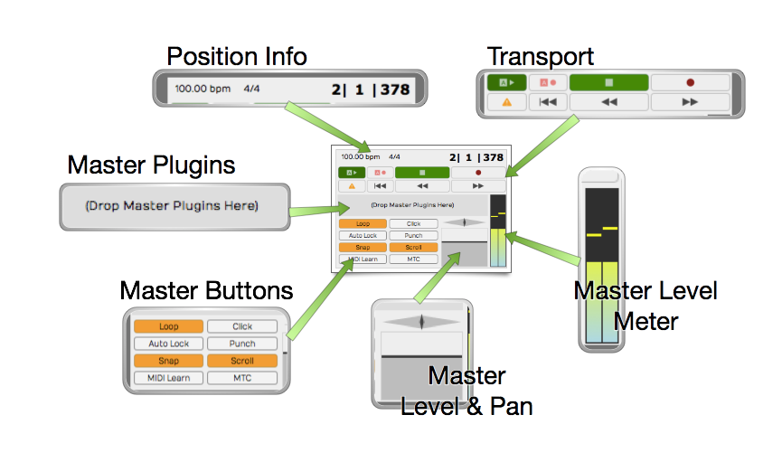

*The Transport Bar*

Cursor Position Info
- At one end of the transport bar, you will notice three key pieces
    of information about the current cursor position: The tempo, the
    time signature, and the location counter.

-   Click the tempo display to see tempo properties.
-   Click the time signature for time signature properties.
-   Click and edit any of part of the location counter to move the
    cursor to that location.

You can also drag any of the components of the location up and down to
move the cursor. The location counter format will change to match what
you have set for the Timeline.

The Transport
- The Transport is made up of a set of eight buttons that include all
    the usual suspects: *Play/Stop, Record, RTZ, Rewind,* and *Fast
    Forward.* In addition, there are buttons for *Automation Read,
    Automation Write,* and *Panic.* The *Panic* button restarts
    Waveform's audio engine. All of these can be assigned to keyboard
    shortcuts for fast access.

Master Plugins
- Final processing like compression and limiting goes on the master
    track or the mixer's master channel. Drag plugins from the Browser
    or the Plugin object onto the master, or right-click to add them.

Transport Bar Buttons
- The transport bar includes eight buttons to access commonly used
    global on/off functions. More on these buttons in a moment.

Master Level
- The Master level provides the final volume adjustment for the
    entire mix. The corresponding pan control provides control of the
    balance between the left and right signals. For most applications
    the Pan control will remain centered.

Master Meter
- The Master meter shows the final output level. Right-click the meter
    to set the meter mode or reset any overload indicators.

## Transport Bar Buttons

The transport bar buttons include some of the most used functions in
Waveform. This is a description of what these buttons are for along with
the shortcut used to toggle the button.

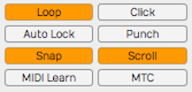

*The Transport Bar Buttons*

Loop
- *Loop* (L) turns looping between the In-marker and Out-marker on and
    off. This is for both playback and loop recording.

Click
- *Click* (C) turns the metronome click on and off.

Auto Lock
- *Auto Lock* is short for "Automation Lock." As the name implies,
    this button locks automation to clips. When on, as you move clips
    around the automation curves follows along.

Punch
- With *Punch* (P) tuned on, Waveform will only record when the cursor
    is between the In-marker and the Out-marker.

Snap
- *Snap* (Q) button turns snap-to-grid on and off.

Scroll
- With *Scroll* (S) turned on, Waveform pans the screen to keep the
    cursor on screen during playback and recording.

MIDI Learn
- Click *MIDI Learn* to enter MIDI Learn mode. In this mode you can
    easily assign external knobs and faders to on-screen controls.

MTC
- With *MTC* enabled, Waveform will chase sync to incoming MIDI Time
    Code. Unless you are still syncing to tape or hardware sequencers,
    leave *MTC* off.

## Moving On

That was a broad overview of sections, controls, and buttons on the Edit
tab. Next, we start to break all this down so you can have fun making
music with Waveform.

