# Effects Bus Tracks

In this chapter, you'll learn how to set up an effects bus track in
Waveform. A *bus track* is configured to be shared by multiple tracks
within your Edit. Sometimes this is called a master effects bus. This is
an extremely common production technique that originated when recording
was done using large mixing consoles. When mixing with a console,
effects like reverb and delay are created using outboard hardware. In
the early days, studios only had a limited number of reverbs and
chambers to use. The solution was to use a common bus for the effect and
then send the desired amount of each track over to the effect bus.

It works the same way in Waveform. You dedicate a track to the effect
and then use a special *Aux Send* plugin to send part of the signal from
your instrument, vocal, or drum tracks to over to the effects bus track.

## Create the Bus Track

To get started create a new track. The fastest way is select any track
and hit T. That creates a new blank track right after the one that you
started with. You can drag the new track anywhere you'd like.

Next, click on the track name, and rename the track by editing *Name* in
properties. In this example you can use a reverb effect and name it
"Master Reverb."

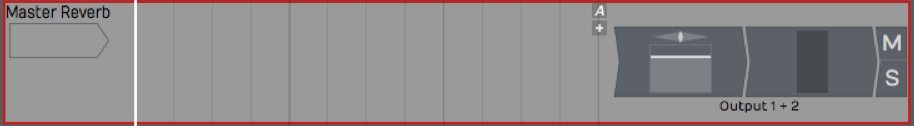

*New, Blank Track*

## Adding the Effect Plugin

The next step is to insert an effect plugin on the bus track. In this
example we're using Waveform *Reverb*.

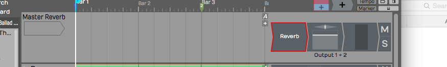

*Insert the Reverb Plugin*

Check that the *Dry Mix* fader is turned all the way down. You want only
the wet signal to go through *Reverb*. You can tweak the other
parameters later, after you get some sound going through it.

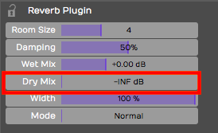

*Set the Mix to 100% Wet*

> 💡 **Tip:** If the plugin you're using has a mix control, make sure it's
turned to the 100 % wet position. The critical thing here is you don't
want any dry signal being mixed back in through a different, parallel
path.

## Aux Return Plugin

So this seems like a pretty ordinary track. How do you make this track
behave like a bus? You do so by inserting the *Aux Return* plugin, one
of the built-in plugins in Waveform. It pairs up with the *Aux Send*
plugin for just this purpose.

Insert the Waveform *Aux Return* plugin to the left of *Reverb.*

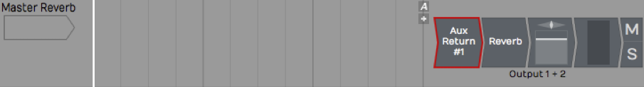

*Insert the *Aux Return* Plugin*

Notice that it is labeled *Aux Return #1* in properties. Also, you can
see it is automatically assigned to the next available bus: in this case
\*Bus #1.

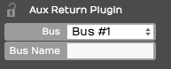

*Automatic Bus Assignment for *Aux Return**

It's optional but you can type in something descriptive for the *Bus
Name* property. In this case *Verb 1*.

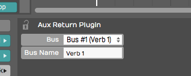

*Adding a Descriptive *Bus Name**

The descriptive name appears right on the plugin thumbnail in the mixer,
making things much clearer. This will help even more when you have
several effects buses configured.

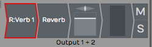

*How the *Bus Name* Appears in the Mixer*

## Adding Aux Sends to the Channels

Now that your effects bus track is set up, all you need to do is insert
an *Aux Send* plugin on each track where you would like to apply this
effect.

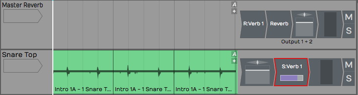

*Insert *Aux Send* on a Track*

This is important. Insert *Aux Send* after the *Volume & Pan* plugin.
This way as you adjust the track volume, you're also adjusting the
amount sent to the bus track proportionally. Even if you lower the
volume all the way down, you won't hear a ghosting of the effects bus
from that track playing in your mix.

> 📝 **Note:** On a conventional mixing console, this position is called
"post fader." Hardware consoles will have a special switch or maybe even
a special knob that allows you to send post fader. In Waveform you do
this in a very direct way: rearrange the order of the fader so that it
comes before the *Aux Send* plugin.

## Adjusting the Send Level

Now that it's all set up, as you play back, adjust the send level by
clicking on the *Aux Send* plugin, and adjusting the *Send level* slider
that pops up.

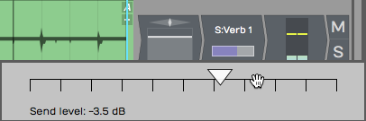

*Adjust the *Aux Send* Level*

Alternatively, you can just click on the *Aux Send* plugin and adjust
*Send* in the Actions panel. The more you turn it up the more
effect you'll get. As you turn it down, you get less and less of the
effect.

## Assigning the Aux Bus

You can create as many effects bus tracks as you need for your mix. You
might want a reverb for drums, a different reverb for vocals, a delay
for vocals, and other delay for guitars. The steps to set up the
additional buses are the same as outlined above. You just need to make
sure your *Aux Sends* and *Aux Returns* are assigned to the correct bus
numbers.

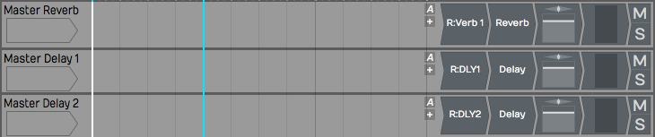

*Setup with Three Bus Effects Tracks*

When we set up Verb 1, we used *Bus #1.* For DLY1 WE HAVE used *Bus #2*
and gave it a unique name.

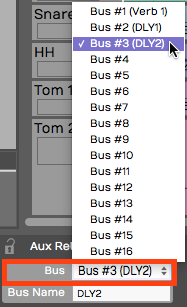

*Assigning Buses to the *Aux Returns**

As you insert the *Aux Send* plugin onto each track, select which effect
you want to use by choosing the correct bus.

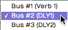

*Selecting the Effects Bus for Aux Send*

> 💡 **Tip:** Feel free to assign more than one *Aux Send* to the same track.

Your effects tracks aren't limited to a single plugin. You can create an
entire effects chain, for exampling combining compression, EQ, reverb,
or delay on a single bus track.

## Solo Isolate

There's a special solo mode that you will likely to want to use on bus
tracks, called *Solo isolate*. To do so, right-click the *Solo* button
on one of your bus tracks and choose the option *Solo isolate*.

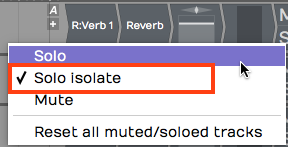

*Enable Solo Isolate on Your Effects Tracks*

Notice how that the *Solo* button changes from "S" to "SI." With *Solo
isolate* enabled, if you solo any track, this track will also be soloed.
This is useful because when you solo a track, you usually want to hear
it along with its send effects. If you don't use *Solo isolate* on your
bus tracks, the effects get muted when you solo a track.

> 💡 **Tip:** Waveform includes a track tagging feature that allows you to
quickly view any tracks that share a tag. You can tag all of the effects
buses with the tag "FX.", which makes it really easy to pull up a view
of all of your effects bus tracks using the Tracks tab in the Browser.
Take organization one step further by giving your bus tracks a specific
color.

## Effects Bus Track Presets

If you commonly use a similar set of send effects, you can create some
presets for your bus tracks, and then recall them for your next project.
To do so, right-click the track name and select *Save preset > whole
track*.

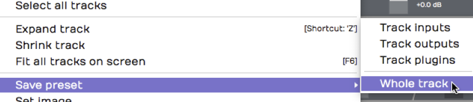

*Saving an Effects Track Preset*

In the *Preset Details* dialogue box, put in an appropriate name for
your preset such as "Master Reverb." In the tags area, the tag *Track*
will automatically be entered. You can also add another tag such as
*Effects Bus*.

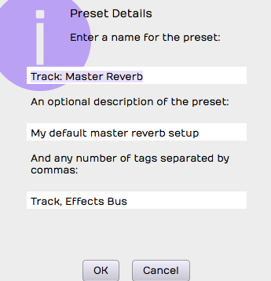

*Preset Details Dialog Box*

Remember to separate tags with a comma. Click *OK*, then the next time
you want to create a very similar effects bus track, go to the Presets
tab in the Browser and filter by *Effects Bus*. Drag the preset onto any
track to instantly configure your favorite master effects set up.

## Moving On

In a full mix, you may have four or more effects buses configured at
once, such as two reverbs and two delays: drum reverb, vocal reverb,
stereo delay, and a mono slap back delay.

One key is to group the bus tracks together and to put them at the top
of the Edit. You can also make them a unique color, tag, and label them
appropriately.

Once you get a hang of the set up, using effects bus tracks in Waveform
is very straight forward.

