# Folder Tracks

With the Folder Tracks feature, you collect a group of tracks into a
folder, allowing to you work with them together as unit. The obvious
advantage is to collapse the view so that related tracks, like your drum
tracks, can be viewed as a single entity.

Folder Tracks also give you a convenient way to apply volume automation,
so that you can do a fade across a number of tracks at the same time.
Folder Tracks allow you to solo every track that is contained within it
with a single click. You can also do basic editing across the included.
Let's take a closer look.

## Creating a Folder Track

To create a Folder Track, right-click the track name for any existing
track and select *Create a new Folder Track*. The Folder Track appears
below the original track.

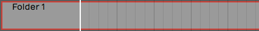

*New Empty Folder Track*

Alternatively, right click on the background of the Track section and
choose *Create a new Folder Track*.

Either of these methods will create a new empty Folder Track. There are
easy ways to create a Folder Track containing existing tracks, which we
will cover that shortly.

## Working with Folder Tracks

Putting Tracks into a Folder Track
- To put a track into a Folder Track, simply grab the track by the
    track name, drag it, and drop it on the folder. Just before you drop
    it, the Folder Track will glow, usually with a red color, indicating
    it's ready to receive your track.

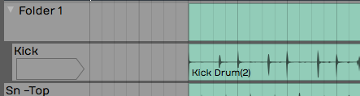

*Folder Track after Dropping in One Track*

If you already have some tracks in the folder you can drag it over the
folder and then downward; You'll notice a red glowing insertion point,
where you can put your track between other tracks to get the order you
would like.

Naming a Folder Track
- Naming a Folder Track works exactly like any other track. Click on
    the header part of the track where the name is, and then edit *Name*
    in properties. By default, it will have a name similar to *Folder 1*
    or *Folder 2*.

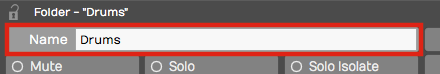

*Naming a Folder Track*

> 💡 **Tip:** One of the most common uses of Folder Tracks is to organize all
of your drum parts into a single folder. In this case, you might want to
name it 'Drums' or 'Drums Folder.'

Reorder Tracks within a Folder Track
- To reorder the tracks within your Folder Track, grab any track and
    drag it to the correct position. The red insertion line shows the
    target, so you know exactly where the track is going to go. When you
    drag a track directly onto the Folder Track and drop it, that track
    goes to the topmost position.

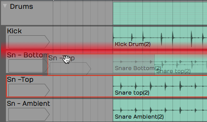

*Reordering Tracks within a Folder*

Collapsing and Expanding a Folder Track
- Click the small triangle to the left of the Folder Track name to
    expand or collapse the folder. When the folder is collapsed it
    doesn't affect playback. All the tracks that are contained within
    the folder still play and respond as normal.

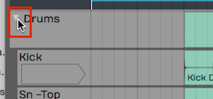

*Expand/Collapse a Folder by Clicking the Triangle*

Soloing/Muting a Folder Track
- Folder Tracks have *Solo* and *Mute* buttons, just like any other
    track. However, they operate on all of the tracks that are contained
    in the folder. So if you have a Folder Track set up for your drums
    and you click *Solo*, you will solo all of your drum tracks.
    Likewise, *Mute* mutes all the tracks with in the folder

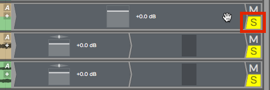

*Folder Track Solo*

> 📝 **Note:** When you solo a Folder Track, the tracks contained in it are
soloed with a blinking *Solo* button. This indicates that the track is
being soloed by the Folder Track and not directly. If you click the
blinking *Solo* it will change to the standard solo state with a steady
indicator.

The *Solo* and *Mute* functions are really good reasons to set up Folder
Tracks for the different instrument types. You can set up Folder Tracks
for drums, for guitars, for keyboards, and another for vocals.

## The Folder Track VCA

VCA stands for "voltage controlled amplifier." For those of you with
experience with analog gear, that name relates to a similar feature on
automated mixing consoles. In essence, the VCA on the Folder Track
remotely controls the level of all the included tracks proportionally.
This gives you level control for the everything in the folder.

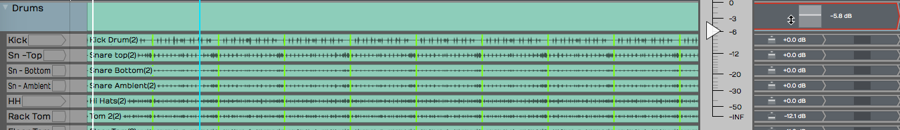

*Folder Track VCA*

Keep in mind that no audio passes through the Folder Track itself. The
VCA acts as a remote control, proportionally controlling the volume of
all of the individual *Volume & Pan* plugins of the tracks contained
within the Folder Track. It's a very convenient way to add high-level
mixing to your groups of instruments, without going through the
complexity of adding numerous additional bus.

> 📝 **Note:** You can't insert plugins on Folder Tracks, since no audio
actually passes through the track. To do so you would need to create a
Submix Track, which we'll cover in the next chapter. \# Creating a
Folder Track with Existing Tracks

With multi-track drums, you often have 10 tracks or more that you need
to put into a Folder Track. Rather than drag each track individually,
there is a quick way to pack all of them into a Folder Track at once:

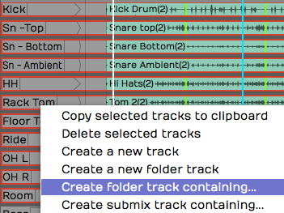

*Create a Folder Track Contain Existing Tracks*

1.  Select the first track by clicking on the track name. Hold down
    Shift and click on the last track. All of the drum tracks will then
    be highlighted.
2.  Next, right-click on the track name for any of the tracks and choose
    the option *Create new folder track containing*. This instantly
    creates a Folder Track containing all of your drum tracks.
3.  Finally, select on the Folder Track and give it a descriptive name
    in properties.

> 💡 **Tip:** This isn't limited to drum tracks. *Create new folder track
containing* is a great way to create Folder Tracks for any related
selection of instruments or vocals.

## Editing With Folder Tracks

Folder Tracks get even cooler when you discover the editing
possibilities. Here is a rundown of what's possible:

Splitting Contained Clips
- To split clips across all of the contained tracks by simply
    selecting the Folder Track clip, position the cursor, then press
    Slash.

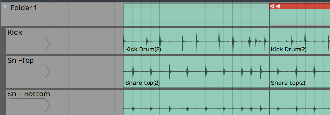

*Split All Clips Within a Folder Track*

Rearranging
- After splitting the Folder Track clip, you can rearrange everything
    within the folder by dragging the Folder Track clips to any order.
    You can use this rearrange a song or just swap verse 1 and verse 2.
    If you put all your tracks in to a Folder Track you can use this for
    block arranging of the song.

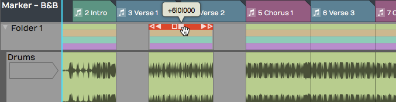

*Rearranging Clips within a Folder Track*

Trimming
- The beginnings and the endings of the Folder Track clips have trim
    handles. Drag to trim all the included clips.

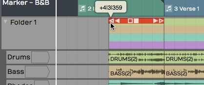

*Trimming Using the Folder Track Clip*

Deleting
- In addition to moving and splitting clips, you can delete entire
    sections of the contained tracks by separating out a section,
    selecting it, and pressing Delete or Backspace.

## Automating a Fade within a Folder Track

You can automate the VCA fader to create fade-outs or fade-ins on Folder
Tracks. We'll get into more detail about automation in a later chapter,
but here is a step by step recipe for creating fade-outs:

1.  Grab the little "A" icon. That is the automation icon for the track.
    Drag it and drop it on the VCA fader. A red line appears on the
    Folder Track. That is the automation curve for the VCA fader.

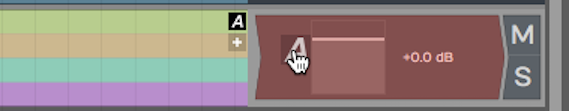

*Activate Automation for the VCA*

1.  Double-click on automation curve add points. Add two points: one
    before and one after the section you would like to fade.

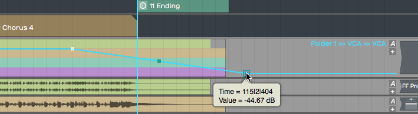

*Add Automation Points to the VCA Curve*

1.  Drag the last point all the way down to the bottom of the clip to
    draw in your fade-out.
2.  Between the two points you added, notice an additional point was
    automatically added. This is a curvature point. Drag the curvature
    point to adjust the shape of the fade.

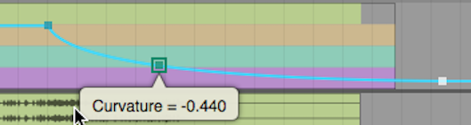

*Customizing the Fade with *Curvature**

You can further adjust the speed of the fade by dragging all these
points until it sounds like what you want. The automation points snap to
the current snap increment. Turn *Snap* off for finer adjustment.

This technique is really a time-saver because you don't have to go in
and edit each individual clip in order to do a fade-out.

## Moving On

Folder Tracks are a powerful feature in Waveform. You may have seen this
concept in other digital audio workstations. Once you get the hang of
how it works in Waveform, you will be amazed at the creative things you
can do with Folder Tracks.

