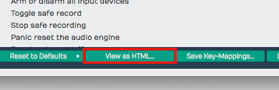
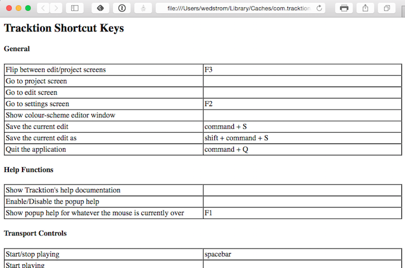
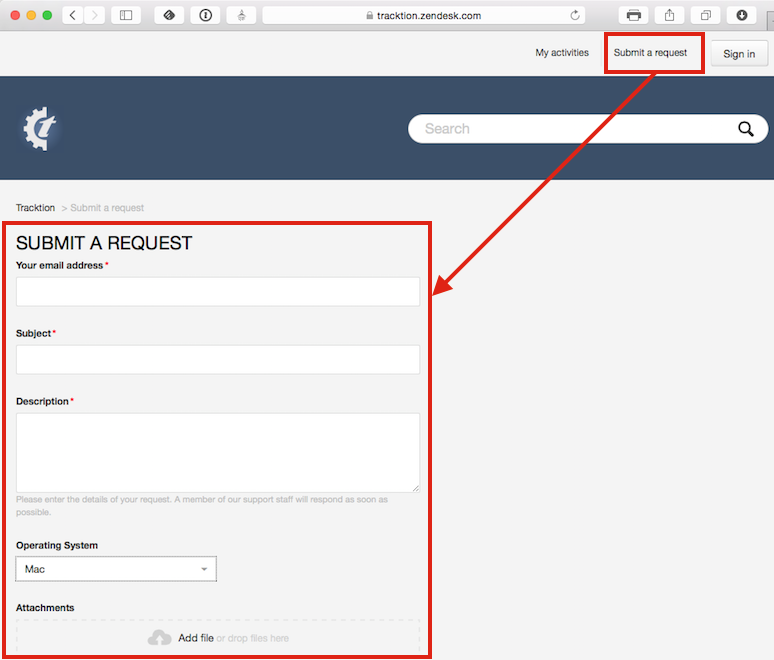

# Getting Help

This chapter is a summary of the various ways to get help when working
with Waveform.

## Pop-up Help

The first source of help is pop-up help. While useful at times, you can
also turn off pop-up help with *Options > Help > Turn off pop-up
help*. Press F1 to view pop-up help for the item under the pointer.
Refer to [Pop-up Help](basic-navigation.md#pop-up-help) for an illustrated guide to pop-up
help.

## Roll-over Help

Roll-over messages appear in the upper right for items under the
pointer. These messages give you a description of the object under the
mouse pointer.

## Quick Start

If you are new to Waveform, the [Quick Start](quick-start.md) chapter at the
front of this manual is the fastest way to get set up and making music. It
walks you from install through your first recording and export, linking to
the fuller chapters as you go. You can also open this manual at any time from
*Help > User guide PDF*.

## Keyboard Shortcut List

Studying the keyboard shortcut list, is a great way to get more familiar
with Waveform. Navigate to the Settings tab, Keyboard Shortcuts page.
Here you will see all the assignable actions grouped by category.

*View as HTML Button*

For a searchable list click *View as HTML* to load the current list in
your web browser. From here you can search it with Cmd + F / Ctrl + F or
print it out.

*HTML View of Keyboard Shortcuts Assignments*

## Tracktion Videos

The official [Tracktion YouTube channel](https://www.youtube.com/@TracktionSoftware)
is the best place for video tutorials, feature walkthroughs, and update
overviews - new videos are added regularly as Waveform evolves. Browse the
[playlists](https://www.youtube.com/@TracktionSoftware/playlists) to find
videos grouped by topic.

The [Waveform videos page](http://www.tracktion.com/support/videos) also has
a selection of training videos, and a *Tracktion T7 Update Explained* series
is available from [Groove 3, Inc](http://goo.gl/GKbdlM) - a deep resource for
all things music production.

## Tracktion Forums

The long term official [forum for Waveform
Software](http://goo.gl/YaygV6) is hosted at [KVR](https://www.kvraudio.com). This
the most active Waveform forum that exists. Here you can interact with
the other users, TSC staff, and developers.

There is also a growing private [Tracktion Users
Group](https://www.facebook.com/groups/Tracktion/) on FaceBook. If you
use FaceBook it's a great idea to request to be added to the group. The
TSC team are also members of that group.

Also check out the [Waveform Software official Facebook
page](http://goo.gl/Hv3Xjr) for updates, news about Waveform, promo
offers, and profiles of Waveform artists - "Tracktioneers."

## Tracktion Support

In large part, your success with getting issues resolved, requesting
features, and reporting bugs, depends on following the recommended
guidelines, when filling out the request form.

[Waveform Request Form](https://tracktion.zendesk.com/hc/en-us/requests/new)

*Waveform Request Form*

Request Form Checklist:

-   Use "FR:" in the title for feature request
-   Use "BR:" Bug Report in the title for bug reports
-   Include the Waveform version number (from the Waveform About box)
-   Include your operating system and version
-   Note your system specs like processor type and the amount of RAM
-   List the steps to recreate the bug
-   Attach the log file (*Help > Show the Tracktion log file*)
-   Attach or link to screenshot or screen video
-   Report one issue at a time

Follow these same guidelines when posting bugs and feature requests to
the [KVR Waveform Software forum](http://goo.gl/YaygV6).

## Moving On

Those are the key ways to get help when learning and using Waveform.
Next let's get into more detail on using Waveform!

