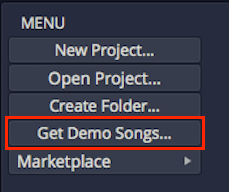
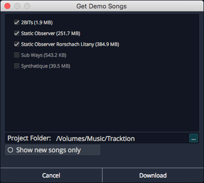
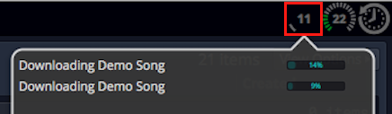
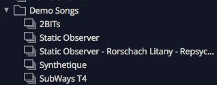

# Installing the Demo Projects

This chapter walks through the process of installing the Waveform demo
songs. The demos are very useful because they give you something to
experiment with, as you learn the basics of the application.

## Establish a Waveform Projects Folder

It's a good idea decide where you want to keep your Waveform projects on
your system.

One method would be to create a Waveform folder, under the Documents
folder on your system. So, decide on a location and create your Waveform
folder using the Finder (macOS) or File Explorer (Windows).

## Project Tab: Get Demo Songs

The Menu at the lower left of the Project tab includes a button - *Get
Demo Songs*. Click that for a quick way to download the demos.

*Get Demo Songs Button*

*Get Demo Songs Dialog Box*

Select the songs to download from the list, choose the destination
folder then click *Download*. We suggest using your newly created
Waveform project folder as the destination. You also have the option to
show only new songs, meaning those you haven't yet downloaded.

Demo song downloading will be handled in the background. You can use the
Progress Meter in the upper right corner to see how the downloads are
progressing.

*Checking the Progress of Demo Downloads*

When the downloads are finished, the demo songs will appear at the
bottom of your Active Projects.

> 💡 **Tip:** We like to reorganize the demos into a folder to keep them
separate from my own projects.

*Demo Songs in a Folder*

## Moving On

With Waveform installed, and a few demo files ready to play with, it's
time to move on to configuring your audio interface.

