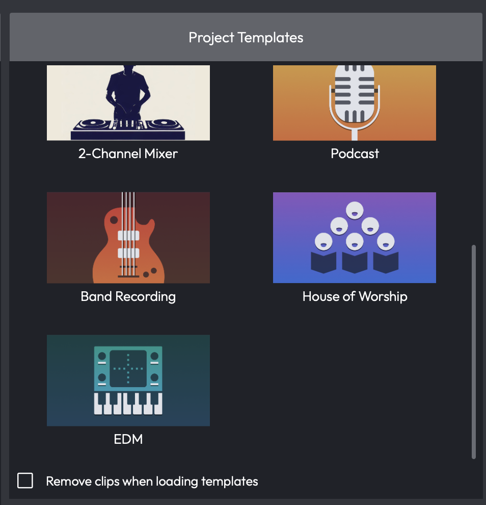
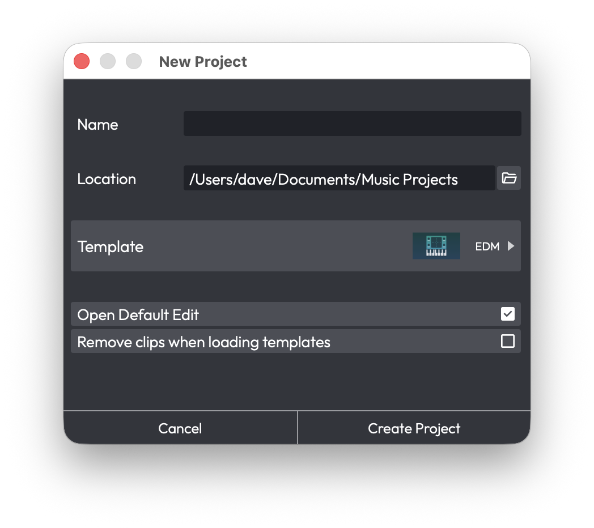
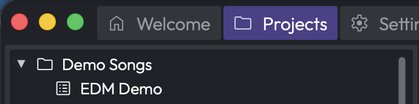

# Demo Projects and Templates

This chapter shows you how to get started with ready-made content. Demo
projects and templates are very useful because they give you something to
experiment with, as you learn the basics of the application.

## Establish a Waveform Projects Folder

It's a good idea decide where you want to keep your Waveform projects on
your system.

One method would be to create a Waveform folder, under the Documents
folder on your system. So, decide on a location and create your Waveform
folder using the Finder (macOS) or File Explorer (Windows).

## Starting From a Template

The quickest way to get something playable is to start from one of the
built-in templates. These include demo songs as well as ready-to-use
starting points for new projects.

Open the **Welcome** tab and look at the **Templates** list. Each entry
is a complete project you can open with a single click.

*The Templates List in the Welcome Tab*

Click a template to create a new project from it. Waveform copies the
template into your Active Projects and opens the new Edit, leaving the
original template untouched so you can reuse it as often as you like.

> 💡 **Tip:** If you'd rather keep the template's track and plugin layout
but start with an empty arrangement, enable **Remove clips when loading
templates** before you click. This opens the project with its routing in
place but no clips on the tracks.

*A New Project Created From a Template*

## Demo Songs in Your Projects

Any demo songs bundled with your installation are added to your projects
automatically the first time you run Waveform - there's nothing to
download. They appear in the **Projects** tab alongside your own work.

> 💡 **Tip:** We like to reorganize the demos into a folder to keep them
separate from our own projects.

*Demo Songs Collected in a Project Folder*

## Moving On

With Waveform installed, and a few projects ready to play with, it's
time to move on to configuring your audio interface.

