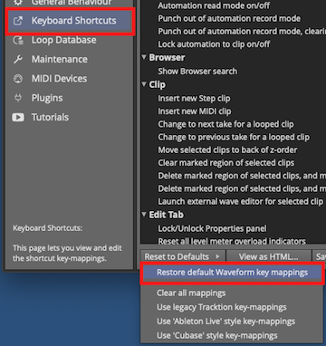

# Introduction

Welcome to the *Waveform User Guide*. The goal of this guide is to help
you learn Waveform. If you are coming to Waveform from another DAW, or
learning computer recording from the ground up, you will find this guide
useful. This should serve as a useful and handy reference. For those who
already use Waveform or its successor *Tracktion* you can learn the many
advancements in the software. While this book was originally written as
a step by step guide, it has been expanded to become a reference manual.

Waveform has the full range of modern DAW features along with numerous
innovative features designed to help with music creation.

Waveform runs on 64-bit versions of macOS and Windows as well as Linux.
All versions are maintained in parallel; as a result the latest revision
is usually identical (or close to it) across all three platforms.

Waveform is also available in Free, OEM and Pro editions. Waveform Free
has all the core functionality while Waveform Pro includes additional
creative tools like the chord track, Groove Doctor, instruments,
effects, pattern generator, Quick Actions panel, and MIDI effects. The
Free edition has no limitation on the number of tracks and supports
third-party plugins just like the Pro edition. The OEM edition is
included with mixers and audio interfaces from various manufactures
including Mackie and Behringer.

Waveform, like its predecessors, is unique in that it has a single
screen user interface, with a mixer channel integrated to the right of
each track. This left-to-right workflow is what fans of this DAW have
loved for years. For many it just makes more sense than other designs.

In recent years, Waveform has gained a traditional mixer view. While it
is optional it gives you a familiar console style view. In addition the
mixer view can be detached and positioned on another monitor screen.
There is no need to flip back and forth between a track view and mixer
view unless you really want.

Waveform has a very flexible plugin architecture, that includes native
plugins, plugin racks, and third party plugins supporting VST, VST3 and
AudioUnits.

## What's in the Book?

In this book you will learn:

-   How to install and set up Waveform
-   How to record audio to tracks
-   How to record MIDI and use virtual instruments
-   How to record with guitar amp simulators
-   How to edit audio
-   How to edit MIDI
-   How to mix with the inline mixer section
-   How to insert and use plugin effects
-   How to mix down to Wave or MP3 files
-   A reference to settings and options used to configure and customize
    Waveform.

## Video Resources

There are numerous tutorial videos for Waveform available from my
YouTube channel and from Tracktion. Videos usually precede the updates
in this document so we recommend that you subscribe to both channels:

My YouTube Channel - [Inventive Creation](http://goo.gl/YnaOMd)

Tracktion YouTube Channel - [Tracktion
Software](https://www.youtube.com/user/TracktionSoftware)

Groove3.com has some older but useful content on Tracktion. Look for
videos there on plugin-racks, MasterMix, and videos on the Tracktion
DAW.

Groove 3 - [Groove3.com](https://www.groove3.com)

## Setting Tracktion Keyboard Shortcuts

This guide uses the default keyboard shortcut layout within Waveform. If
you have changed away from the default setup you would need to change it
back in order to follow along.

To do that follow these steps:

1.  Navigate to the Settings tab, Keyboard Shortcuts page
2.  Click *Reset to Defaults* at the bottom of the page
3.  Select *Restore default Waveform key-mappings*

*Settings Tab: Set the Keyboard Shortcuts to Match this Book*

This set of keyboard shortcuts was carefully designed for efficient
workflow, and keeps the commands consistent between Mac and Windows.

## Modifier Keys Conventions

The book uses the following abbreviations for modifier keys:

-   Command: Cmd
-   Control: Ctrl
-   Option: Opt
-   Alt: Alt

In most cases, Cmd on macOS will translate to Ctrl on Windows. In this
user's manual, we present both using the convention Mac / PC. For
example: Cmd + C / Ctrl + C.

Here is another example:
- Click to select the clip, then copy it using Cmd + C / Ctrl + C.
- Next, position the cursor in the Arrangement where you want to place
    the copy and paste it, using Cmd + V / Ctrl + V.

> 📝 **Note:** Most Linux users will use the 'Meta' key in place of Alt. On a
typical PC keyboard, Meta is usually the Windows key.

> 📝 **Note:** In some parts of the world Mac keyboards use Alt rather than
*option*. This shouldn't offer much confusion but I did want to
acknowledge this.

## Moving On

With those things set, your Waveform installation will match the
examples here. Get ready to explore the world of Waveform!

