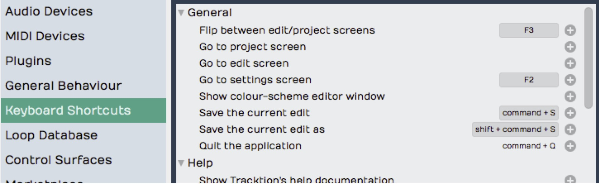
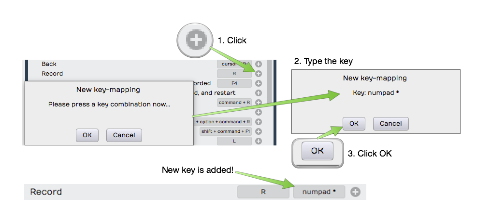
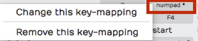
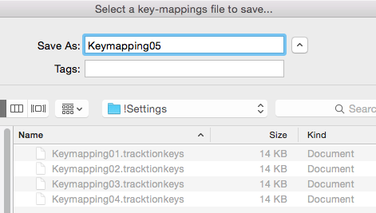
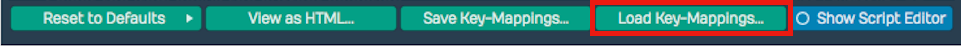
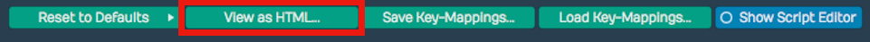
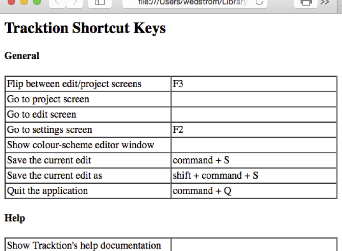

# Keyboard Shortcuts

In this chapter you will learn how to customize the keyboard shortcuts
in Waveform. In [Introduction](introduction.md) we covered how to change the
default keyboard mapping. In short, go to the Settings tab and select
the Keyboard Shortcuts page. Then near the bottom of the page click
*Reset to Defaults*, and choose *Restore default Waveform key-mappings*.

> 📝 **Note:** The default Waveform key-mapping is used for all examples
in this book.

## Keyboard Shortcuts Page

The Keyboard Shortcuts page on the Settings tab shows all of the
key-mappings. You can easily change those to your liking or match them
to a DAW you are already comfortable with.

*Keyboard Shortcuts Page on the Settings Tab*

Waveform allows you to have more than one shortcut tied to a single
action. This is really helpful if you want to have a way to do something
on your laptop, but then take advantage of the extended keypad when
you're working on a desktop computer.

## Setting a Keyboard Shortcut

*Map Record to the Asterisk on the Keypad*

Let's take a look at an example. To start recording you click the
*Record* button in the transport or press keyboard shortcut R. When
working on a computer that has a full size keyboard, you may prefer to
start recording by hitting the asterisk (\*) key on the keypad. To do
so:

*Setting a Keyboard Shortcut*

1.  To the far right of each action there's a plus icon. To create or
    add a keyboard shortcut to an action, click the corresponding plus
    icon. The *New Key-mapping* dialogue box opens up.
2.  Type the key or key combination that you want to trigger this
    action. The key or key combination will be identified in the
    dialogue box and it will also show you if there's a conflict with an
    existing mapping. For our example, press asterisk (\*) and then
    click OK.

Now, both R and the keypad asterisk (*) are assigned to the Record
action. Back in the Edit test this by turning \*Record* on and off using
either R or asterisk (\*).

> 📝 **Note:** Keyboard mappings are global. Any changes you make will be
active for all your Edits.

## Changing a Keyboard Shortcut

To change an existing shortcut, click directly on the key-mapping at the
far right of the action. Choose between *Change this key-mapping* and
*Remove this key-mapping*. If you choose the *Remove* option, the
key-mapping disappears. If you choose the *Change* option the *New
key-mapping* dialog appears and you can enter a new assignment.

*Click to Change or Remove a Key-mapping*

## Saving Keyboard Shortcuts to a File

Once you have your keyboard shortcuts set up the way you want, you can
save the entire key-mapping to a file, a very good idea. If you run
Waveform on a different computer, you can simply import the file, and
will then have all your familiar assignments ready to go.

**Save Key-Mappings* Button*

To save your shortcuts setup, click *Save Key-Mappings* and Waveform
presents a dialogue box requesting a file name and path. You can store
the key-mapping file anywhere you like. Waveform key-mapping files have
the `.Tracktionkeys` extension.

**Save Key-Mappings Dialog* Box*

> 💡 **Tip:** You could create a 'settings' folder under your main Waveform
folder to hold such files, naming the key-mapping files with a version
number at the end. This gives you the ability to easily roll back to a
previous version if you ever change your mind about a new keyboard
layout.

## Loading Keyboard Shortcuts from a File

If you're working on a new installation or move to a new computer you
can load your custom key-mapping file. Go to the Keyboard Shortcuts page
on the Settings tab and click *Load Key-Mappings*. Find your exported
key-mapping file then click *Open*. All your key-mappings are restored.

**Load Key-Mappings* Button*

## Printing a List of Keyboard Shortcuts

If you want to print a list of all your current keyboard shortcuts,
click *View as HTML* at the bottom of the Keyboard Shortcuts page. This
loads a nicely formatted, searchable view of all the current
key-mappings into your browser. From there you can search it or print it
using normal web browser features.

**View as HTML* Button*

*HTML View of the Keyboard Shortcuts List*

## Moving On

At this point you should have a good handle on how to customize the
keyboard shortcuts in Waveform. Since T6, Waveform offers powerful macro
scripting you can use to further customize keyboard shortcuts. For more
about that, see [Macros](macros.md).

