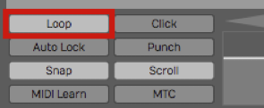
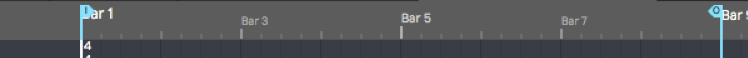
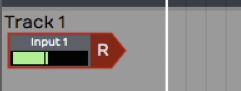
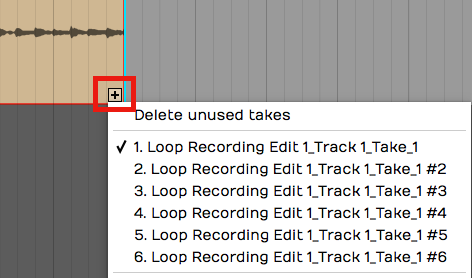
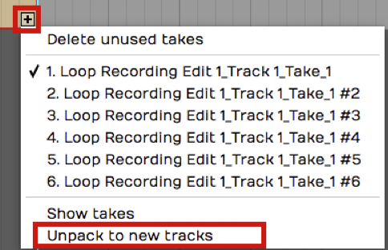

# Loop Recording

Loop recording is a really cool way to quickly record multiple takes of
a part onto a single track. Following loop recording, you can easily
pick the best take and make it active, so that it is the one you hear
during playback.

Loop recording also sets you up to use the track comping tools that are
built into Waveform. Comping allows you to go phrase by phrase through
the different takes and choose the best parts and create a composite
best take. We cover comping in detail in [Comping](comping.md).

## Getting into Loop Recording Mode

Getting into loop recording in Waveform is simple - enable *Loop* (L) in
the Transport. Now when you click *Record*, recording will only occur
between the In-marker and Out-marker. The transport will "loop" between
the In-marker and Out-marker allowing you to automatically record take
after take, until you hit *Stop*.

*Turn on __Loop__ for loop recording mode*

## Loop Recording Step-by-Step

1.  Set the In-marker and the Out-marker over the range that you would
    like to do the loop recording. To set the In-marker, position the
    cursor and press I. To set the Out-marker, position the cursor at
    the end of the loop and press O.

*Set the In-marker & Out-marker*

> 📝 **Note:** The *Click* count-in works for loop recording. If you want a
running start for each take, set *Click Track > Pre-record count-in
length* to one or two bars.

2.  Configure the input and check your levels just like we did for
    standard recording.

*Configure the Input for Recording*

3.  Click *Record* (R) on the transport to start recording.

While recording when the cursor hits the Out-marker, Waveform will
automatically loop back for the next take. You can do as many takes as
you like.

## Selecting the Best Take

After loop recording, you will have a number of takes stacked within the
Audio clip. The very last take you recorded is what you will hear during
playback. That is called the "active take." To select a different take
for the active take, click the plus (+) sign in the lower right corner
of the clip. You will see a list of all takes there. Pick the one you
want to promote to the active take. You can audition all the takes and
make your favorite one the active take.

*Choosing the Active Take*

> 💡 **Tip:** With your takes recorded this way, it is perfectly set up for
comping, which we will cover in the [next chapter].

## Unpacking Takes to Tracks

If you want to work with your loop recorded takes as separate audio
tracks, it is easy to unpack the takes to tracks. To do so, click the
plus (+) sign and then select *Unpack to new tracks.*

*Unpack Takes to Tracks*

That instantly coverts an Audio clip full of takes to a series of tracks
containing separate Audio clips. Now you can use normal audio editing to
move them around, chop them up, or arrange them into a song.

## Moving on

The secret to loop recording is to set the In-marker and Out-marker over
the section you want to record, make sure *Loop* is turned on, and then
record like you normally would. Loop recording also sets you up for
comping, which is covered in the next chapter.

