# Macros

Waveform includes not only programmable shortcuts, but also a full macro
programming environment. You can develop keyboard shortcuts that combine
actions in new ways to streamline your workflow. If the standard
keyboard shortcuts don't meet your needs, you can create custom macros
and assign keyboard shortcuts to them.

While you might think of macros as keyboard macros, you don't have to
assign them to keyboard shortcuts. You can always launch them from the
*Run Script* button in the Menu section. This approach can be useful
because you don't have to remember the shortcut to macros you only use
occasionally.

## Script Editor

To open the Script Editor, go to the Settings tab, and select the
Keyboard Shortcuts page. Enable *Show Script Editor* at the bottom right
of the Keyboard Shortcuts page. The Script Editor will open.


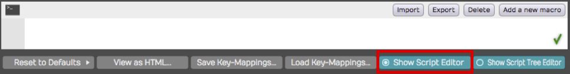

*The Script Editor*

You can resize the height of the Script Editor by dragging the line that
separates it from the keyboard shortcuts list. The Script Editor is a
basic text editor that you use to enter and edit macro scripts.

> 💡 **Tip:** With the Script Editor open, try clicking on some of the
existing keyboard shortcuts. The Script Editor will show you the
underlying code, you can use this to get familiar with the syntax of the
actions triggered by each shortcut.

## Creating a Macro

To create a new macro, click *Add a new macro* on the Script Editor.
This adds a new macro named "Untitled Macro" to the bottom of the
keyboard shortcuts list under the Macros section.


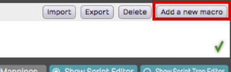

*Adding a New Macro*

As soon as the new macro is created, the name defaults to *Untitled
Macro* and is selected. Start typing to give it a suitable name.

In the body of the macro, you can type in a list of actions to create
the script. The easiest way is to build your macros using the
right-click menu; more on that in a bit! Actions are separated by
semicolons.

## Deleting a Macro

While you can't delete the built-in keyboard shortcuts, you can delete
any custom macros you create. To do so, select the macro to delete in
the keyboard shortcuts list, and click *Delete macro* in the Script
Editor.

## Programming a Macro

The simplest macro is made up of a single action. You can pick any
available action by right-clicking the Script Editor and navigating
through the three collections of actions. When you find an action you
want to use, select it and the appropriate code will be inserted into
the script.


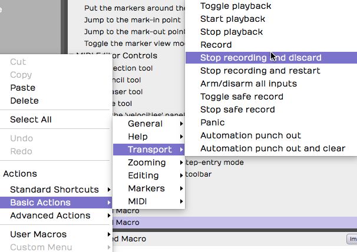

*Selecting Actions from the Script Editor Right-click Menu*

-   *Actions > Standard Shortcuts* includes all the built-in keyboard
    shortcuts shown on the Keyboard Shortcuts page.
-   *Actions > Basic Actions* includes available actions that are not
    necessarily available as pre-assigned shortcuts.
-   *Actions > Advanced actions* includes actions that allow you
    manipulate selected objects and even display messages on the screen.
    Advanced actions are provided as tools for more advanced script
    programming.

## Running a Macro

There are several ways to run a macro:

1.  Assign it to a keyboard shortcut. Keyboard shortcuts are assigned to
    macros in the very same way as the built-in shortcuts. Find the
    macro in the list and click the "+" to the far right and enter the
    desired key combination.
2.  Click *Run Script > User Macros* from the Menu section of the Edit
    tab. All your custom macros appear there automatically. Select the
    one you want to run.


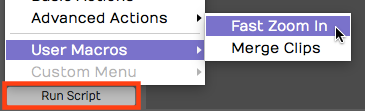

*Running Macros using *Run Script > User Macros**

1.  Add macros to the Custom Menu. At the bottom of the Keyboard
    Shortcuts page, click to enable *Show Script Tree Editor*. Then drag
    your macros (or any built-in actions) to the tree editor. Arrange it
    using drag and drop, add groups, and rename groups. Access the
    Custom Menu from the menu in the Edit: *Run Script > Custom Menu*.


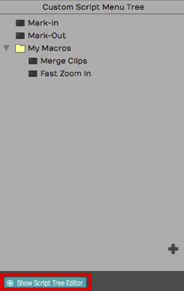

*The Script Tree Editor*

## Javascript Programming

Beyond creating simple step-by-step lists of actions, you can take macro
programming to the next level using the power of Javascript. The Script
Editor allows you to program loops and conditions using Javascript
syntax. It even provides color coding for the elements of the script.


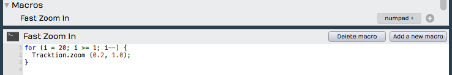

*Javascript Macro Example*

> 📝 **Note:** Waveform actions are exposed as methods using 'dot' notation.
By that, we mean that they start with the word Waveform, then a dot,
then the method. Following the method you can provide one or more
parameter in parenthesis.


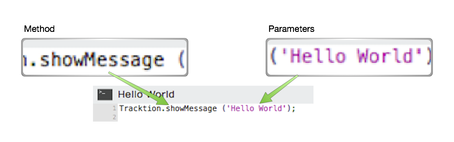

*Macro Actions 'dot' Notation Syntax*

## Hover Tooltip

If you hover over an action in the script editor for a second or two,
you will see a tooltip bubble explaining what parameters the action
takes. If the action returns values, you will see the syntax of that.
These tooltips give you key information when programming macros.
Waveform's developers use this to give you meaningful clues about how
each of the actions work.


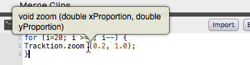

*Hover Over an Action for a Tooltip*

In the above example, the the tooltip shows that the zoom action takes
two double precision numeric parameters. The first is the x-proportion
(the amount of vertical zoom), and the second is the y-proportion (the
amount of horizontal zoom).

## RTZ Macro Example

By default Waveform doesn't have a true return-to-zero (RTZ) keyboard
shortcut. The built-in command stops first if it encounters the In-mark
so you need, to hit it twice to really get back to zero. However, you
can create a macro that performs does the action twice, always returning
the cursor to the start of the Edit.


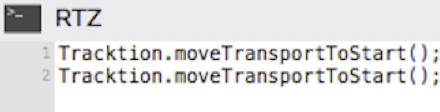

*True Return-to-Zero Macro Example*

For example, you couldassign the RTZ macro to the Home key.

## Merge Clips Macro Example

Another feature that you may use often is *Merge Clips*. Normally you
use this by selecting a few clips on a track that you want to combine to
a single clip. Then you select *Render Clips > Merge the Selected
Clips* from properties. If you do this frequently, you could do it with
a single keyboard shortcut, for example assigning it to Cmd + G / Ctrl +
G.


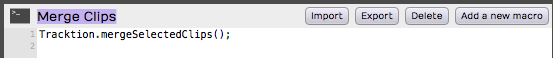

*Merge Clips Macro Assigned*

## Importing and Exporting Macros

Macros are actually just simple text. You can easily copy and paste the
text directly in and out of the script editor. In addition, Waveform has
dedicated buttons to import and export macro scripts as XML files with a
`.Waveformscript` extension.


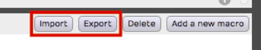

*Script Input and Export Buttons*

## TSC Code Samples

Waveform's engineers have supplied code samples of several macro scripts
to get you started:


```js
// Rename Clips From Track
var tracks = Waveform.getSelectedEditElements ('track');

for (var i = 0; i &lt; tracks.length; ++i)
{
   var track = tracks[i];
   var trackName = Waveform.getName (track);
   var clips = Waveform.getClipsFromTracks (track);

   for (var c = 0; c &lt; clips.length; ++c)
   {
      var clipName = trackName + &quot; &quot; + (c + 1);
      Waveform.setName (clips[c], clipName);
   }
}
```


```js
// Reset Tracks Solo/Mute
var tracks = Waveform.getEditElements ('track');
Waveform.setSolo (tracks, false);
Waveform.setSoloIsolate (tracks, false);
Waveform.setMute (tracks, false);
```


```js
//Next Active Automation Parameter
var track = Waveform.getTrackFromSelectedObject();
Waveform.changeActiveAutomationParameter (track, 1);
```


```js
// Insert Plugin with Preset
var track = Waveform.getTrackFromSelectedObject();
var plugin = Waveform.insertPlugin (track, &quot;Massive&quot;, 0, &quot;AudioUnit&quot;);
var preset = Waveform.getPresetFromLibrary (&quot;Massive All Souls&quot;);
Waveform.setPluginPreset (plugin, preset);
```


```js
// Jump to tab 2
var index = Waveform.getWindowTabIndex();
var delta = 2 - index;
Waveform.changeWindowTabIndex (delta);
```


```js
// Rename Selected Tracks
var tracks = Waveform.getSelectedEditElements ('track');
Waveform.setName (tracks[0], 'Kick');
Waveform.setName (tracks[1], 'Snare');
Waveform.setName (tracks[2], 'Hats');
// etc.
```


```js
// Save Selected Plugins as Preset
var plugins = Waveform.getSelectedEditElements ('plugin');
Waveform.saveObjectsAsPreset (plugins);
```

## My Code Samples


```js
/* Park the In-Marker & Out-Markers
Parks the In-marker and Out-marker at Zero then Restores Cursor Position. I wrote this macro to help a KVR forum member find a quick way to hide the In-marker and Out-marker.
*/
var SavePosition = Waveform.getPosition ('cursor');
Waveform.moveTransportToStart();
Waveform.moveTransportToStart();
Waveform.markIn();
Waveform.markOut();
Waveform.setPosition ('cursor', SavePosition);
```


```js
 /* Search Plugins
 Opens the Browser to the Search tab, enables the Plugin searching while disabling searching for Presets and Loops.
 */
 Waveform.showSidePanel ('search'); // Opens Browser to the Search tab
 Waveform.enableSearchLibrary ('plugin', true);
 Waveform.enableSearchLibrary ('preset', false);
 Waveform.enableSearchLibrary ('loop', false);
 Waveform.setSearchPanelText ('');  // loads blank text so you can start typing the search term right away
```


```js
// Rename selected clips to 'Drums'
var clips = Waveform.getSelectedEditElements ('clip');
for (var i = 0; i &lt; clips.length; ++i)
    Waveform.setName (clips[i], 'Drums');
```


```js
// Rename selected tracks to 'Drums'
var tracks = Waveform.getSelectedEditElements ('track');
for (var i = 0; i &lt; tracks.length; ++i)
    Waveform.setName (tracks[i], 'Drums');
```

## Moving On

These are fairly simple examples. Waveform users are only just starting
to explore the powerful capabilities of macro programming in Waveform.


