# MIDI Editing

In this chapter you will learn MIDI editing. There are two aspects to
MIDI editing. You can, of course, edit individual MIDI notes, but you
can also edit the MIDI clip. Editing a MIDI clip is similar to editing
an Audio clip, but with a few key differences. We will go over both
approaches in this chapter.

Many of the tools for working with clips work much like they do with
Audio clips. Each MIDI clip header has several drag handles. Let's take
a look at how they work.

## Trimming MIDI Clips

To trim a MIDI clip, drag one of the trim handles left or right. The
trim handles are the hollow arrows at the left and right of the MIDI
clip header.

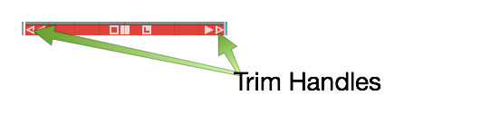

*Trim MIDI Clips by Dragging a Trim Handle*

> 📝 **Note:** One difference between Audio clips and MIDI clips is that the
MIDI clips don't have fade handles.

## Moving MIDI Clips

To move a MIDI clip forward or backward in time, drag from the header
area. Don't drag starting from any of the icons, but instead drag from
the blank space in the header area.

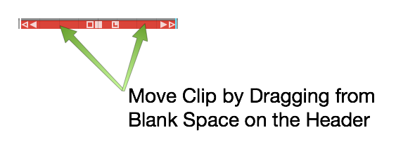

*Moving a MIDI Clip*

## Moving a MIDI Clip Track-to-Track

To move a MIDI clip track-to-track, grab the header area and drag it up
or down. To move track-to-track without affecting the timing, hold down
Shift as you drag.

## Slip Editing MIDI Clips

The three solid color handles are used for slip editing: left arrow,
right arrow, and the box. The essential tool for slip editing is the
solid box in the center of the header. Grab the solid box and drag, in
order to slip edit the notes within the frame of the window.

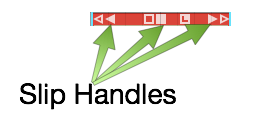

*MIDI Clip Slip Handles*

Use the left solid arrow to slip the notes later in time, while leaving
the ending of the clip anchored. The right solid arrow works the
opposite way. You can slip the end of the clip, while leaving the
beginning of the clip anchored.

## Reframing a MIDI Clip

The hollow box tool in the center of a MIDI clip allows you to reframe
the entire window of the clip, leaving the notes in their original
place. This is done by dragging the hollow box left or right.

## Splitting a MIDI Clip

To split a MIDI clip, select it then position the cursor at the time you
want to make the split. Press the slash key (/). This is the exact same
workflow you use for splitting Audio clips.

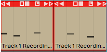

*Split MIDI Clips Using the Slash Key*

You can also split using the *Split Clips* actions at the right side of
properties. The various actions give you more control over splitting.

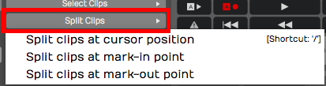

*Split Actions Button in properties*

> 📝 **Note:** As you split MIDI clips, any notes that are sustained across
the split area are separated into two notes.

You can even split a mixture of Audio clips and MIDI clips across
multiple tracks, by selecting a combination of them at once.

## The MIDI Note Editor

As you increase the vertical size of a track holding MIDI clips, you'll
see that there's a point at where it switches to the inline MIDI note
editor. This gives you a comprehensive view of the notes contained
within the MIDI clip. This type of view is commonly called a piano roll
view (PRV).

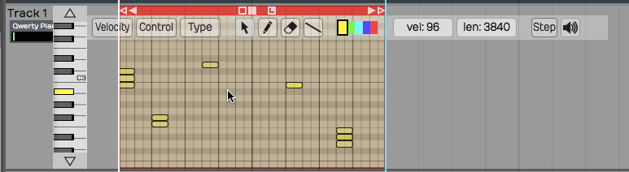

*The MIDI Note Editor*

Another way to see the MIDI note editor is to double-click on the MIDI
clip header to toggle track height.

> 📝 **Note:** Clip header double-click behavior is dependent on a global
setting. Go to the Settings tab, General page and find the
*Track Resizing* property. You can choose a number of options, based on
how you would like that resizing to occur when you double-click. This
setting also holds for audio tracks.

## Setting the Number of Octaves & Note Height

You can adjust how many octaves you see on the MIDI editor in the
*Options* menu. By default *Options > Default MIDI editor vertical
scale* is set to *2 octaves*, a reasonable starting point. If you want
you can set this to show more or fewer octaves.

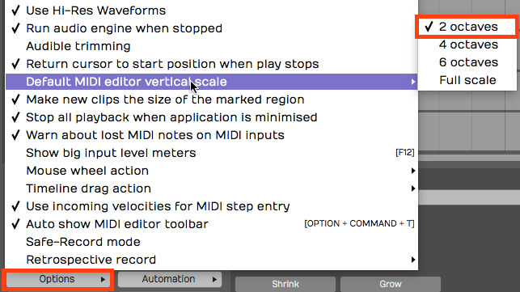

*Default MIDI Editor Vertical Scale Setting*

To fine tune the vertical size of MIDI notes, drag the arrows above and
below the piano graphic.

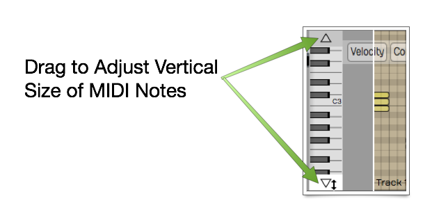

*Use Arrows to Adjust Vertical Size*

## Mouse Wheel Options for MIDI Editing

You can use your mouse wheel to scroll vertically within the MIDI
editor. During mixing you may prefer to disable this function, in order
to prevent scrolling within the MIDI clips unintentionally.

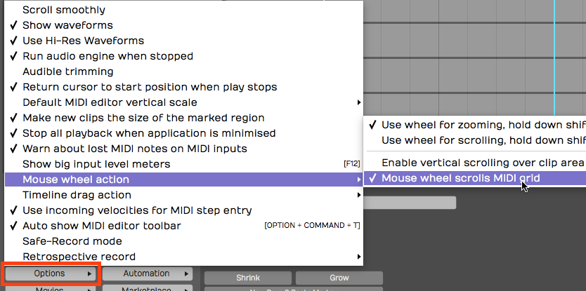

*Mouse Wheel MIDI Scrolling Setting*

You may find it's generally helpful to have MIDI scrolling on during
MIDI editing. You'll find this setting in the menu under *Options >
Mouse wheel action > Mouse wheel scrolls MIDI grid.*

## Basic MIDI Editing - Pitch

Next, let's look at the tools for editing the actual MIDI notes. In
general, editing works by selecting notes and then doing an action.

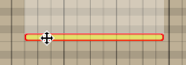

*Select a Note and Drag Up or Down to Change Pitch*

The most basic edit? Click a note to select it. Drag it up or down to
change the pitch.

## Per Note Automation

As you start to drag MIDI notes around, you will immediately see the
per-note controller editing area appear above or below selected notes.

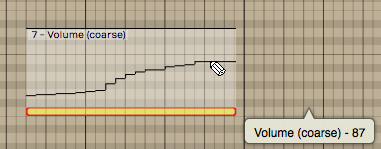

*Drawing Per Note Automation*

If you don't see the per-note automation editing area, you can turn it
on and off in properties.

*Turn Per Note Automation Editing On or Off*

To begin, select any single note. The automation editing area will
appear for the full length of the note. By default you will be editing
Volume (controller 7). Select the pencil tool and draw in the desired
automation curve by click-dragging over the editing area.

> 📝 **Note:** You need to select the pencil tool to draw in the per-note
automation.

The curve will appear as steps based on the current snap resolution. The
snap resolution is set by the zoom level; To draw in a more detailed
curve, zoom in more.

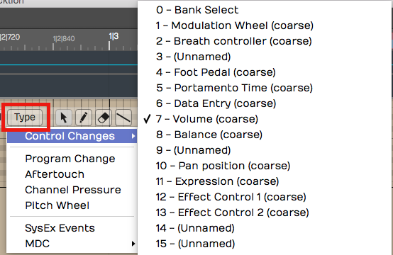

*Selecting the Controller Type for Per Note Automation*

You can select any other control by clicking the *Type* button on the
MIDI editor toolbar. This type of editing gives you detailed control
over performance details and articulations.

> 📝 **Note:** Not all virtual instruments respond to this type of data.

## Nudging Notes

Nudging works much like it does for Audio clips and MIDI clips. You hold
down Shift and use the arrow keys. Shift-up and Shift-down change the
pitch. Shift-left and Shift-right change the timing.

Nudging is particularly helpful when changing the pitch, since there
there's no chance of altering the timing of the note.

> 💡 **Tip:** Cmd + Z / Ctrl + Z works as undo for most editing operations.

## Note Length

You can trim the length of a note by grabbing the right edge and
dragging it left or right.

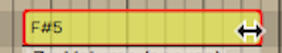

*Trimming a MIDI Note*

## Snapping During Note Editing

Many of these editing operations will snap to the grid as long as you
have *Snap* enabled. To edit freely, disable *Snap*. The keyboard
shortcut Q enables or disables snapping.

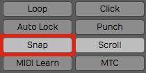

*Note Editing Will Snap if *Snap* is On*

## Copying and Duplicating Notes

To copy a note, hold down Cmd / Ctrl and drag the note to create a copy.
Another way to do this is with the *Duplicate* keyboard shortcut. First
select the note that you would like to copy, make sure the cursor is
where you'd like the copy placed and then hit the keyboard shortcut D.

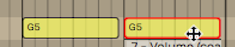

*Copying a Note*

## Adjusting Pitch and Velocity

Another way to adjust pitch and velocity is to select the note and then
edit the values directly in properties. Both *Pitch* and *Velocity* can
easily be edited this way.

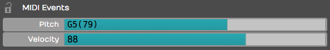

*Adjust Pitch and Velocity in properties*

## Note Start, Length, & End

You can also make very precise adjustments to the *Length*, *Start
Time*, and *End Time* by editing the values directly in properties for
the selected note.

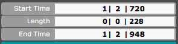

*Start, Length, & End Settings in properties*

## The Pencil Tool

The pencil tool is used to draw in notes. Simply select the pencil tool
and then start painting in notes where you'd like them to appear on the
piano roll.

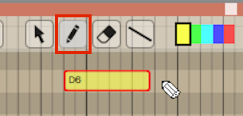

*Draw in New Notes with the Pencil Tool*

## The Eraser Tool

Use the eraser tool to swipe over any series of notes that you would
like to erase.

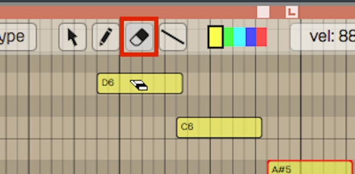

*The Eraser Tool*

## The Line Tool

There's also a line tool. We usually recommend using this for drawing in
controllers, but it is also possible to use it for notes as well. Draw a
line to create a stepped series of notes.

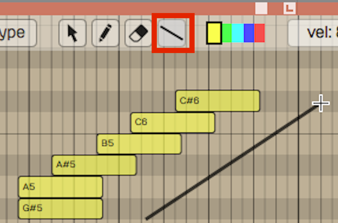

*Draw a Series of Notes with the Line Tool*

## Note Colors

The color selection along the top edge of the MIDI editor allows you to
select set a note color. Select a group of notes, click on a color and
then it will change those notes to that color. It doesn't affect
playback, but it gives you a way to visually organize a sequence. For
example, when programming drums you could make snares, hi-hats, and kick
drum all different colors.

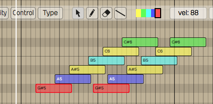

*Note Colors*

## Selecting Multiple Notes

Selecting multiple notes is easy. Use the arrow tool and drag a
selection around any group of notes that you'd like to select together.

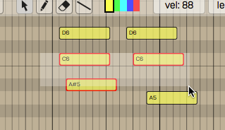

*Note Multiple Selection*

You can also add or remove notes from a multiple selection by holding
down Shift (or Cmd / Ctrl) then clicking additional notes you'd like to
toggle in and out of the selection.

To select an entire row of notes that are the same pitch, hold down Cmd
/ Ctrl and click on the PRV keyboard key corresponding to that row of
notes; doing so selects the full row of notes.

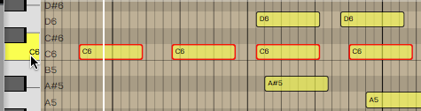

*Selecting a Row of Notes with Cmd / Ctrl*

Once you have a multiple selection, move all the notes in time or by
pitch by dragging with the arrow tool. Alternatively, you can change
values in properties that will apply to all notes in the selection.
Nudge also works on well on a multiple selection of notes (Shift plus
the arrow keys).

## Editing the Note Velocity

To quickly change the velocity of a note, select the note and then
select a value from the *Velocity* drop down menu. This gives you a
variety of preset values at popular levels.

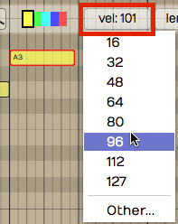

*Quickly Set Note Velocity*

If you choose *Other*, from the velocity drop down, you can type in
whatever value you want from 0 to 127.

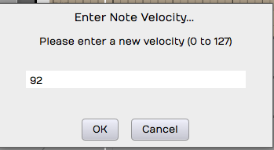

*You'll See this if you Select *Other**

> 💡 **Tip:** Here's another trick way to adjust velocity. Select a note then
hold Shift as you drag up and down over the note. Notice the *Velocity*
value changing in properties as you drag.

## Step Entry Mode

When the *Step* button is toggled on, the MIDI clip goes into step entry
mode. In this mode, any notes you play to the track will be entered at
the cursor position. Then, the cursor will advance to the next step
based on the Snap grid resolution. You can adjust that based on the
level of zoom.

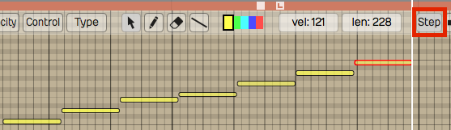

*Step Entry Mode*

## Hearing Notes While Editing

You have the option to trigger notes that are being moved so you can
hear the pitch. You can enable or disable this using the speaker icon at
the far right at the top of the MIDI editor tool bar.

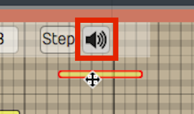

*Enable Speaker Button to Trigger Notes During Editing*

## The Velocity Editor

You can edit MIDI note velocity from the velocity area below the PRV.
Click the *Velocity* button at the left of the MIDI editor toolbar to
expose the velocity editor. For the selected note, grab the stalk which
represents the velocity and drag it up or down. You will notice the
*Velocity* parameter moving in properties for that note as you drag.

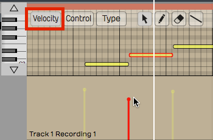

*The Velocity Editor*

You can also edit multiple velocities together by first selecting
several velocities. Say we want to edit the velocity of all the C4s.
Hold down Cmd / Ctrl and select all the C4s, then, just grab one of them
and they will all adjust together.

## Editing other Controller Data

You can use a view similar to the velocity editor with any kind of
controller. Click the *Control* button and then click *Type* to choose
which controller to edit.

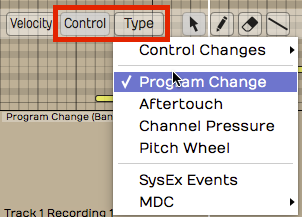

*Editing Other Controller Data*

Example editing aftertouch: In the MIDI editor click *Control > Type >
Channel Pressure*. Now the channel pressure data will appear in the same
way velocity appears.

## The MIDI Event List

For surgical, numbers-first editing, open the **MIDI Event List**. It's
a floating, resizable table of every event in the currently selected
MIDI clip, and it follows your selection — click a different clip and
the list updates to match. The list and the piano roll share a
selection, so a note you highlight in one is highlighted in the other.

This is a Waveform Pro feature (version 12 and later).
<!-- code: waveform/common/Source/ui/midi/MidiEventList.cpp:116-124; Features.cpp promidi (Pro v12+) -->

Open it with the command **Show or hide the MIDI Event List window**, or
from the View menu's **Show MIDI Event List** item.
<!-- code: StandardShortcuts.h:636 -->

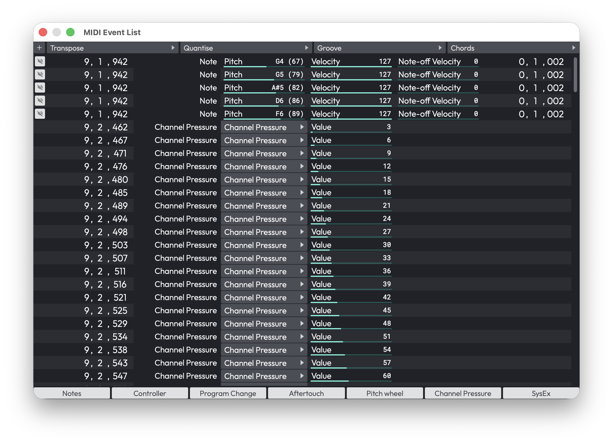

*The MIDI Event List window*

Across the top is an **add-event** menu (Add note, Controller, Program
Change, Aftertouch, Pitch Wheel, Channel Pressure, or SysEx) alongside
**Transpose**, **Quantise**, **Groove**, and **Chords** menus that act
on the selected events. Along the bottom are seven filter toggles —
**Notes, Controller, Program Change, Aftertouch, Pitch wheel, Channel
Pressure, SysEx** — all on by default, so you can hide event types you
don't want to wade through.
<!-- code: MidiEventList.cpp:185-237,763-793 -->

The columns change with the event type:

- **Notes** — a mute toggle, Time, Type, Pitch (0–127), Velocity
  (0–127), Release velocity (0–127), and Length.
- **Controllers** — Time, Type, Controller type (Program Change,
  Aftertouch, Pitch Wheel, Channel Pressure, or CC 0–127), and Value
  (0–16383).
- **SysEx** — Time, Type, and an editable Data field.
<!-- code: MidiEventList.cpp:357-449 -->

> 💡 **Tip:** The Event List is the place to type exact values — handy
> when you need a controller at precisely 64, or a note nudged to an
> exact tick that's awkward to hit by dragging.

## MIDI Controller Mappings

The **MIDI Controller Mappings** window lets you drive plugin parameters
from a hardware MIDI controller's knobs and faders. Each row binds one
incoming MIDI controller (CC) to one parameter in your edit.

Open it from the Automation menu's **Create MIDI controller mappings…**
item, or with the command **Show MIDI controller mappings window**.
<!-- code: waveform/common/Source/ui/edit/ParameterControlMappingsEditor.h:16,35-45; StandardShortcuts.h:626 -->

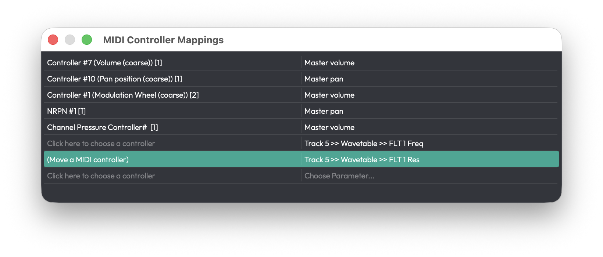

*The MIDI Controller Mappings window*

When you first open it the window looks empty -- that is normal. There is
always one blank row waiting at the bottom of the list, and that row is how
you add a mapping. Click either half of it to begin (see below); as soon as
you fill a row in, a fresh blank row appears beneath it, ready for the next
mapping. So the "empty" window already contains everything you need to start.

Each row has two halves:

- **Left half (the controller)** — Click it to enter MIDI-learn (the
  cell reads **(Move a MIDI controller)**); the next CC that arrives
  from your hardware is captured and bound to this row.
- **Right half (the parameter)** — Click **Choose Parameter…** for a
  hierarchical menu of everything you can map: Master Plugins, Racks,
  and each track's plugins and their parameters, plus an **Add all
  parameters** shortcut. The same menu saves, loads, and deletes
  presets.
<!-- code: ParameterControlMappingsEditor.h:116-132; tracktion_ParameterControlMappings.cpp:375-533 -->

> 💡 **Tip:** To set up a controller quickly, click the right half of the
blank row, open a plugin's submenu, and choose **Add all parameters** -- a
row is created for every parameter of that plugin in one step. Then just
MIDI-learn the hardware controllers you want for each.

Press **Delete** with a row selected to remove that mapping. There's
always a blank row at the bottom ready for the next binding. Mappings
belong to the edit you set them up in, while presets are global and
available to every edit.

> 📝 **Note:** The window shows mappings for the focused edit only, and
> it doesn't switch when you change focus to a different edit.

## The SysEx Lane

System Exclusive (SysEx) messages are manufacturer-specific MIDI data —
often used to recall a hardware synth patch or send a device-specific
command. Waveform shows them on a dedicated controller lane in the MIDI
editor, where each SysEx event appears as a **diamond** on a timeline.

Open the lane from the MIDI editor's controller-lane menu and choose the
SysEx option. The lane header has a **Close** button and a **Menu**.
Use the Select, Pencil, and Eraser tools to place, move, and delete
events — a pencil click creates a new event with four zero bytes — and
snapping applies just as it does elsewhere in the editor.
<!-- code: waveform/common/Source/ui/midi/MidiSysexEditorPanel.cpp:29-299; MidiLaneEditorWindowBase.h:23-57 -->

> 📝 **Note:** The lane is for placing and timing SysEx events. To edit
> the actual bytes of a message, use the **Data** field in the MIDI
> Event List (described above).

## Moving On

Those are the fundamentals of MIDI editing. We're going to get into
quantizing MIDI notes in the next chapter.

