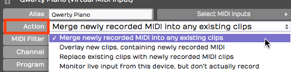
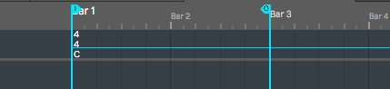
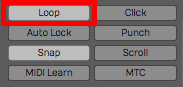
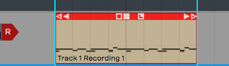
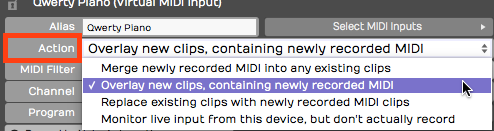
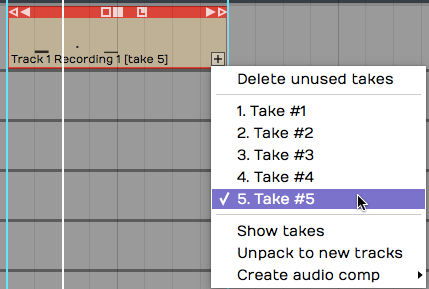
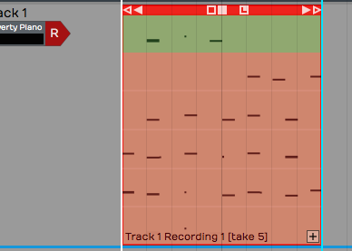
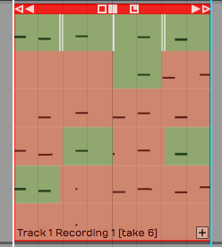
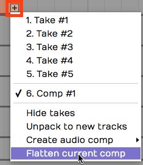
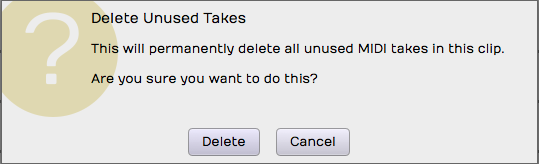

# MIDI Loop Recording

In this chapter you'll learn about loop recording and MIDI. Loop
recording in merge mode can be useful for layering up a drum part, or
building a chord over a couple of passes through the loop.

Waveform also supports MIDI loop recording to layers, which gives you
the capability to build a composite MIDI performance in the same way you
can do with audio.

## Loop Recording in Merge Mode

In the last chapter you learned about MIDI merge mode. Here are the
steps again:

1.  To put your track into MIDI merge mode, click on the track input,
    then in properties set *Action* to *Merge newly recorded MIDI into
    any existing clip*.

*MIDI Merge Mode*

1.  To prepare for loop recording, set the In-marker and the Out-marker
    over the area you want to loop.

*Set the In-marker & Out-marker*

1.  Toggle the *Loop* button to until it's enabled.

*Enable *Loop**

1.  As Waveform cycles through the loop, you'll immediately hear the
    results of what you played in previous passes. Keep adding passes
    until you're happy with the part.
2.  To stop recording, either click *Record* again or hit Spacebar.

*MIDI Clip After Recording*

Following loop recording, you'll have a single MIDI clip containing the
part you built up over successive recording passes.

This technique is particularly useful for programming drum parts,
especially if drumming is not your main skill. For example, on the first
pass play in the high hat. Then, on the second pass add the kick and
snare. Finally, strategically add a crash on the downbeat.

## Recording to Prepare for MIDI Comping

Comping is usually associated with audio recording and editing. With
comping, you record multiple takes of a part then use simple editing
tools to select the best phases from the various takes.

To prepare to comp with a MIDI recording, leave everything set up the
same way as for merge mode, but change the *Action* parameter to
*Overlay new clips containing newly recorded MIDI*.

*Enable Overlay Mode*

Set the In-marker and Out-marker and turn *Loop* on. Hit *Record* and
record a performance during each cycle through the loop.

When you hit *Stop* you'll have separate takes in the MIDI clip for each
loop pass, just like in audio loop recording.

## Comping MIDI Takes

To see the takes, click the plus icon in the lower right corner of the
MIDI clip; You'll see a list of all your takes. From here, you can
choose the best take from the list and that will make it active.

*Takes Following Loop Recording*

You can also expand the view to show all the takes below the track.
Click the plus icon and select, *Show takes*.

*View following *Show takes**

Not only does this show the takes, but it puts you in comping mode.
Swipe over the phrases you want to keep and build a composite from the
best parts of each take.

*Comping the Takes*

## Flattening the Composite to a Single Clip

Once you have the composite assembled, you can convert it to a single
MIDI clip. Click the plus icon and select *Flatten current comp*. You
will need to press *Delete* on the *Delete Unused Takes* dialog box to
proceed.

*Flattening the MIDI Composite*

> 📝 **Note:** When you select *Flatten current comp* Waveform asks if you
want to delete the unused takes. If you want to flatten the takes to a
single MIDI clip, you need to accept this. Note that you can use *Undo*
following this action.

*Delete Clips Warning Message*

## Moving On

Loop recording and comping are really powerful tools for MIDI
composition, just as they are when working with audio. Next up, learn
how to edit MIDI clips and MIDI notes.

