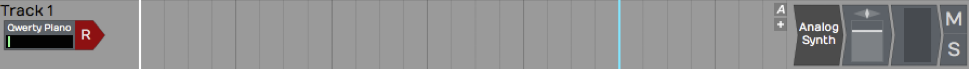
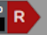
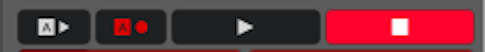
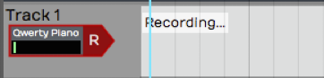
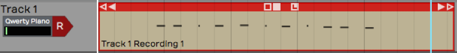
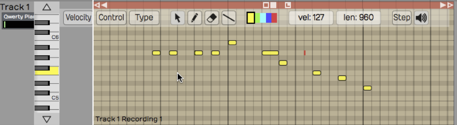
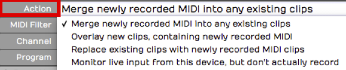
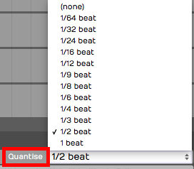

# MIDI Recording

In this chapter you'll learn how to record a MIDI performance from your
controller. Your controller could be a keyboard or any other sort of
instrument that you can use to generate MIDI note data. We covered how
to set up a MIDI controller in the previous chapter.

In this chapter, we'll go further and cover the details of how to record
your MIDI performance. You will also learn about the various MIDI
recording modes. The MIDI implementation in Waveform is fairly
comprehensive while also being quite easy to use. Let's get started.

## Setting up a Track

There isn't a special type of MIDI track in Waveform. Any track can be
used for audio, MIDI, or Step Clips. To record MIDI, pick any unused
track or create a new track. On the track, set up the input by selecting
your MIDI controller. Play a few notes on your MIDI controller to see if
you have MIDI activity.

*A Track Set Up for MIDI Recording*

To hear any sound, you'll need to insert a virtual instrument. Do so by
dragging the plugin object to the mixer section, or search for the synth
plugin in the Search tab on the Browser. When you find it, drag it over
to the mixer section of your track. We usually recommend dropping it to
the left of the *Volume & Pan* plugin. As soon as you drop it, the user
interface will open up for the instrument plugin. Choose a suitable
preset for the part.

We covered all of this in the previous chapter. If when you play notes
on your controller you don't hear anything, go back to [MIDI Setup](midi-setup.md) and make sure the MIDI input is set up correctly.

## Recording a MIDI Performance

Recording MIDI is very much like recording audio:

1.  Enable the track for recording by clicking the red R on the track
    input

*Enable Recording*

1.  In the Transport, click the red *Record* button to start recording.
    You can also do this using the keyboard shortcut R.

*Start Recording*

1.  Record your MIDI performance

*MIDI Recording in Process*

1.  To stop, either press R again or just hit the space bar.

> 💡 **Tip:** To record your MIDI performance with a metronome click,
configure and enable *Click* using the procedure outlined in [MIDI
Editing](midi-editing.md).

## Playing Back a MIDI Performance

If everything went according to plan, you'll have created a MIDI clip.
Notice, the MIDI notes on the clip. If you zoom the track vertically,
the MIDI clip will, at one point, flip to the MIDI editor mode. In this
mode, you can edit MIDI notes, which we cover in [MIDI
Editing](midi-editing.md).

*MIDI Clip Following Recording*

Position the cursor before the newly recorded MIDI clip, the press the
spacebar again to playback. You should be able to hear the exact
performance.

> 💡 **Tip:** If you don't like what you recorded, simply select the MIDI
clip and press backspace to delete it.

## Piano Roll View

As I mentioned above, as you expand the track vertically, you'll notice
that at a certain point MIDI clips will switch to edit mode. The
Waveform MIDI editor is what is commonly called a piano roll view (PRV).
In this view, you can clearly see the notes along with a vertical piano
graphic located along the left.

*Track Expanded to the MIDI Editor*

> 📝 **Note:** The PRV in Waveform allows you to see the timing of notes as
they relate to the timeline, and the pitch of notes as they relate to a
piano keyboard. The graphic length of a note represents how long that
note is held in musical time.

The MIDI editor PRV includes everything you need to edit MIDI data. You
can add notes, delete notes, copy notes, and duplicate them. You can
also work with velocity and other controller values. We'll get into the
details later when we go deeper into [MIDI editing].

## MIDI Record Modes - The *Action* Property

Select a MIDI input and look in properties at the item labeled *Action*.
The drop down menu for *Action* gives you a variety of record modes.

*MIDI Record Modes*

## Merge Mode

By default, *Action* is set to *Merge newly recorded MIDI into any
existing clips*. If you rewind and record in some more notes, you will
find that they're merged into the MIDI clip that you created in the
first pass. It doesn't replace notes that you recorded before; it just
adds new notes and and merges them with the original MIDI clip.

If you mess up an otherwise good performance in merge mode, undo the new
notes by pressing Cmd + Z / Ctrl + Z.

> 💡 **Tip:** Merge mode can be very helpful if you're building up a part
pass by pass, particularly when layering a drum part and adding
additional drum hits in each pass.

## Replace Mode

If you wanted to replace what you played previously, change *Action* in
properties for the input to *Replace existing clips with newly recorded
MIDI clips*. Now when you start to record, the new recording will create
an entirely new MIDI clip and it will gradually overwrite what you had
before. It doesn't exactly erase the original clip. If any portion of
the clip is still visible, you can trim the edges of it and expose the
original data. Of course, *Undo* will get you back to where you started
from if things don't go well.

> 📝 **Note:** You can envision replace mode as being similar to tape
recording. As you record something new onto tape, you are erasing the
section you are recording over.

## Overlay Mode

In overlay mode, as you record you'll get a new MIDI clip stacked on top
of the original clip. After you have recorded this way, you'll hear the
output from both clips mixed together.

During playback, you will hear the overlapping MIDI clips merged
together.

## MIDI Input Quantize

To find MIDI Input Quantize, click on the input and locate the
*Quantize* property. The drop down menu for *Quantize* offers a wide
variety of beat subdivisions.

Notice how this works; you are selecting a subdivision of the beat (not
the bar). For example, if you want to quantize your input to the nearest
eighth note, you don't select *1/8 beat* from this list, you select *1/2
beat*, because an eighth note is half of a quarter note (when working in
4/4 time).

*Input Quantize Options*

As you record, you're going to hear the notes however you play them, but
on playback all of your notes will be snapped to the value you set in
*Quantize*.

Note that the results of quantizing can sound somewhat unnatural,
because this approach quantizes both the note start and the note ending.
Notes get stretched out and tend to sound mechanical. In general, input
quantize is more useful for drum programming than playing something like
a piano part.

> 📝 **Note:** Input quantizing does not happen in real time. You hear the
result during playback.

There are other ways (Apply Groove) to quantize after the fact. We'll be
getting into that in [Quantizing MIDI Notes](quantizing-midi-notes.md).

## Moving On

That's an introduction to MIDI recording. You learned the essential
options to set up a MIDI input. You learned about the MIDI record modes.
We also took a quick look at input quantizing. Next up, loop recording
with MIDI!

