# MIDI Setup

We're going to move on to MIDI recording and editing in this and the
next few chapters. The first step is to set up a MIDI keyboard so that
you can play notes into Waveform. If you don't have a MIDI keyboard, you
can enter notes manually into the MIDI editor, or you can use the
computer keyboard as a virtual MIDI device.

The setup is quite simple. We are using a USB external keyboard
controller, but the setup works much the same for other types of
controllers.

## MIDI Drivers

Before you dive in here, you might need drivers for your controller.
Check the manufacturer's website for drivers for the controller model
and your operating system. With Waveform closed, download and install
the drivers. Once you've done that, the rest is easy.

## Set Up the MIDI Inputs

Go to the Settings tab, MIDI devices page. You will see a list of all
available MIDI inputs and outputs that are connected to your system. In
this example I have four of them. To enable the MIDI inputs and outputs,
click to toggle between *Enabled* and *Disabled* next to each entry.

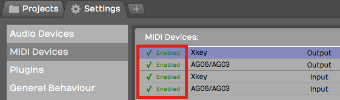

*Click to Enable/Disable MIDI Inputs and Outputs*

> 💡 **Tip:** If you don't see your devices listed, make sure the controller
is connected and has power. If that checks out, then make sure the
latest drivers are installed. At any time you can click *Scan for new
MIDI devices now* to initiate a scan for connected MIDI devices.

## Naming MIDI Inputs/Outputs

From the Settings tab, MIDI Devices page, click on a MIDI input or
output in the MIDI devices list. Notice that in properties, there is an
*Alias* value. Edit that to give your MIDI input or output a friendly
name. I often make this match the name of the controller that is
connected.

> 💡 **Tip:** You can customize *Alias* for a specific Edit, by selecting the
input in the Edit tab and changing it in properties. Changing *Alias* on
the Edit tab takes precedence over the *Alias* property in the Settings
tab.

## Disabling Unused MIDI Inputs

Your audio interface might also include MIDI in and out hardware
connections. Those allow connecting legacy controllers that don't
support USB. If you don't plan to use the hardware MIDI in and out
connections, you can leave them disabled. In this example we have
disabled.

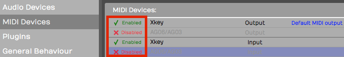

*Disable Unused MIDI I/O*

This hides those from the selection list when setting up a track.

## Configuring the Track

Back in your Edit, choose a blank track or create a new one.

1.  Click on an input and select the MIDI input that matches the
    controller you just configured.

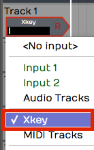

*Select the MIDI Input Device*

1.  Play some notes on your keyboard. You will see the meter registering
    the MIDI activity on that track.

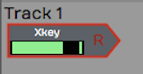

*Input Meter Activity*

1.  With the input selected look in properties. Turn on *Enable Input
    Monitoring* if it isn't already on.

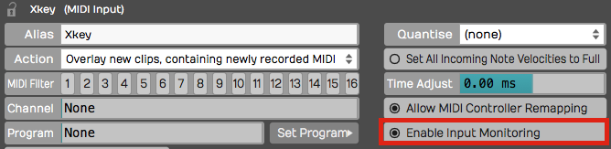

*Enable MIDI Input Monitoring*

With this done, MIDI events come into the track from your keyboard and
the pass through to the virtual instrument that we're going to setup
next.

## Insert a Synth Plugin

To hear what you play, you will need to insert a virtual instrument. Use
the *Browser Search* tab to locate a synth plugin. In this example we
are using the Waveform FM Synth.

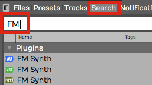

*Search for a Synth Plugin*

1.  Insert your synth plugin ahead of the *Volume & Pan* plugin. By
    ahead, we mean ahead in the signal path. So in this example, we have
    dropped *FM Synth* to the left of *Volume & Pan*.

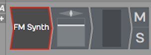

**FM Synth* Installed in the Mixer*

1.  Play some notes on your keyboard and at this point you should hear
    synth notes.

> 📝 **Note:** There is no difference between a MIDI track and an audio track
in Waveform. To configure a MIDI track, just set a MIDI input and insert
a virtual instrument plugin as a sound generating source. Then, as you
record your performance, you'll create a MIDI clip instead of an audio
clip like we did in the previous examples.

## Using a Virtual Keyboard

If you don't have a physical MIDI keyboard, you can use your computer
qwerty keyboard to play notes. Here is how to set it up:

1.  Go to the Settings tab, MIDI Devices page
2.  Click *Create New Virtual MIDI Input*

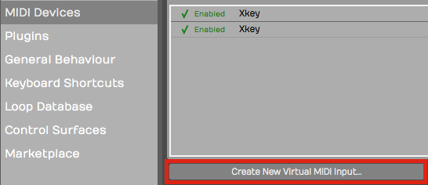

*Create New Virtual MIDI Input*

1.  Enter a name such as 'Qwerty Piano' into the *Virtual MIDI device*
    dialog box

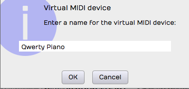

*Name the Virtual MIDI Device*

1.  Back in your Edit create a track
2.  Choose *Qwerty Piano* as the input

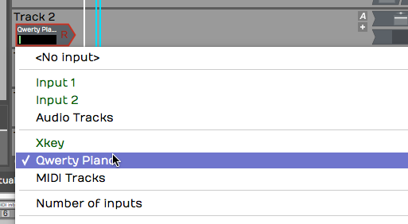

*Select the Virtual Device as the Input*

1.  Notice the piano keyboard along the bottom of the screen. To play
    the keyboard first click on any key with the mouse then use keys
    A,S,D,F,G,H,J,K,L as white keys. Use W, E,T,Y,U,O,P as black keys.
    This virtual keyboard lets you play notes in the range from C4 to
    E5.

> 💡 **Tip:** Click the 'lock' icon in the upper left corner of properties. This
locks the Waveform keyboard to the Virtual MIDI Piano feature. Also,
when attempting to record, it helps to start recording using a keyboard
shortcut. If you click record, the qwerty piano loses focus until you
click a key on the virtual keyboard.

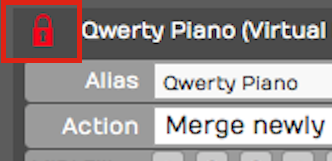

*Lock the Input properties While Playing the Virtual*

> 📝 **Note:** When you are finished using the virtual keyboard, unlock
properties by clicking on the lock icon again. It will stay stuck on the
virtual keyboard until you do that.

## The MIDI Typing Window

The virtual keyboard along the bottom of the screen is one way to play
notes from your computer keyboard. The **MIDI Typing** window is
another — a small floating window with a wider key range and on-screen
octave and velocity controls. It's handy when you want to audition or
record an idea and don't have a controller plugged in.

This is available in Waveform 14 and later, in all editions.
<!-- code: waveform/common/Source/model/MidiTyping.cpp:175-176 (channel hard-coded); Features.cpp midiTyping (v14+, all editions) -->

Show it with the command **Show or hide the MIDI Typing window**, or
from the View menu's **Show MIDI Typing** item (which appears only when
the *Use computer keyboard for MIDI input* setting is on — see
Reference: Settings > MIDI Devices).
<!-- code: StandardShortcuts.h:635; EditTab.cpp:1279 -->

*The MIDI Typing window*

Typing is armed by **Caps Lock** (or by giving the window focus). Once
armed, the keys `a w s e d f t g y h u j…` play a piano layout. The
window also has:

- **Octave** — Press Z or X to shift down or up. (Range 0–9, Default: 5)
- **Velocity** — Press C or V to lower or raise it in steps of 5. (Range
  0–127, Default: 98)
<!-- code: MidiTyping.cpp:81-82,188,197,206,215 -->

A gear icon opens a list where you can remap the keys to your liking.

> 📝 **Note:** Notes from the MIDI Typing window always play on MIDI
> channel 1. There's no channel selector.

## Managing Hardware Patch Names

If you play external hardware synths, Waveform can show their patches by
name instead of by raw program number. The **MIDI program names** dialog
manages these named patch lists.

There's no menu command or shortcut — you reach it from a MIDI output
device. Go to Settings > MIDI Devices, click a MIDI **output** device,
and in properties open the **Program Names** dropdown. **Add** creates a
named set from a preset, **Edit** opens the dialog to modify the
selected set, and **Delete** removes one.
<!-- code: waveform/common/Source/ui/settings/MidiOutputDevicePropertyPanel.h:108-147 -->

*The MIDI program names dialog*

Inside the dialog:

- **Bank name** — A combo box for the 16 banks, with a **Rename**
  button.
- **Program name list** — 128 editable rows; press Tab to advance to
  the next one.
- **MSB / LSB** — The bank-select bytes for the current bank. (MSB
  0–128, LSB 0–256)
- **Options** menu — Use zero based numbering, Set current bank to
  General MIDI names, Reset, Clear, **Export all banks…** (to a
  `.trkmidi` file), and **Import all banks…** (from `.trkmidi` or
  `.midnam`).
<!-- code: waveform/common/Source/ui/midi/MidiProgramManagerDialog.cpp:139-515 -->

Click **Done** to save. These patch lists are shared across all your
edits.

## Moving On

In the next chapter, you'll learn how to record a MIDI performance onto
the track!

