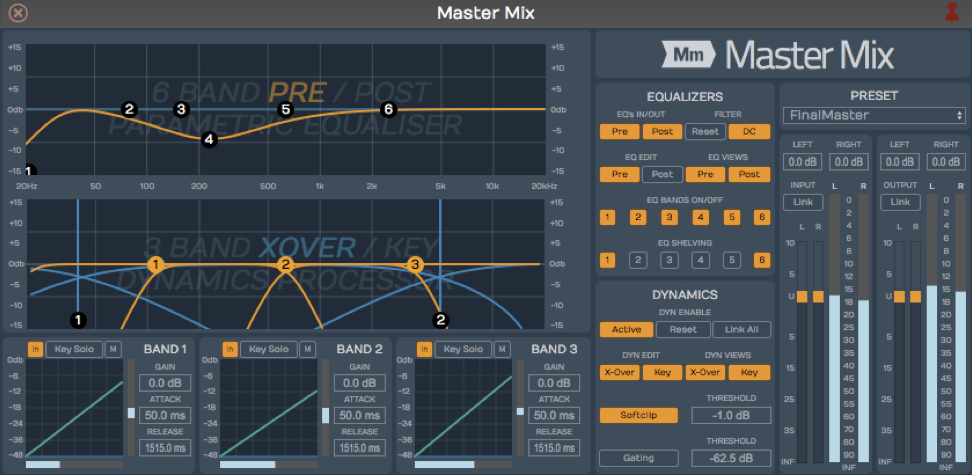
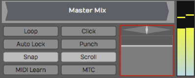
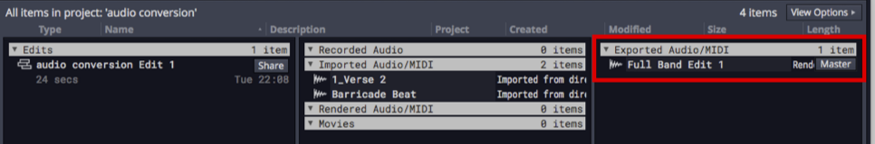
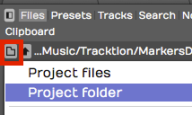
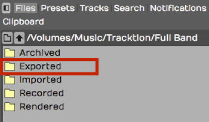

# Mixing Down

Mixing down is the last step: turning your Edit into a finished audio file. This
chapter covers getting the mix ready to be rendered and finding the file once
it's written. The render dialog itself — formats, stems, loudness targets, file
naming and the render queue — is covered in the Rendering and Stems chapter.

## Master Processing

Before you mix down, you might want to add some Master effects, so that
the entire stereo mix is processed. Master plugins often include a
compressor and a limiter to give the final mix a professional sound.

We won't get into the details about exactly what you'd apply there,
although the included Waveform *Master Mix* plugin is a nice choice.
It's a multi-band compressor, EQ, and limiter all in one.

*Waveform Master Mix*

Make sure that the master metering is not going into the
red before you export the mix. Exactly how you process the mix depends
on what you plan to do with the file after it's mixed down.

*The Waveform master*

If you're having professional mastering done, then you probably don't
want to put any plugins on there. However, if you are immediately going
to upload to your website or SoundCloud, you will want to put some
mastering effects on to make your mix into a finished product.

> 💡 **Tip:** If you're aiming at a streaming platform, you don't need a loudness
> plugin on the master to hit their target — the render dialog can normalise to
> a LUFS target with a true-peak ceiling as it writes the file. See the Rendering
> and Stems chapter.

## Setting the Export Region

The render dialog can write the whole Edit, or just the marked region. If you
want control over exactly where the file starts and ends, set the region before
you open it:

1. Set the In-marker exactly at the beginning of the song. Adjust its position
   to skip any extra bars or count-in at the start of the Edit.
2. Set the Out-marker right after the end of the song. We recommend leaving a
   couple of extra milliseconds after the final fade so nothing is clipped
   short.

Then choose *Marked Region* as the **Range** in the render dialog. See the Using
Markers chapter for more on placing markers.

## Rendering Your Mix

Open the **Menu** at the top of the Edit tab and choose *Export: Render to a
file*. For a straightforward stereo mixdown, set **Render** to *Whole Mix*, pick
your format, check the folder and name, and click *Add to Queue and Start*.

That's the short version. The Rendering and Stems chapter covers the rest: MP3
and the other formats, rendering stems for each track or submix, tagging the
files with title and artist, normalising to a loudness target, naming batches
with patterns, saving presets, and rendering from the command line.

## Locating the Exported File

Unless you change it, the file is written to your project's *Exported* folder.
You can find it either on the Projects tab or from the Browser.

Locating the Export on the Projects Tab
- Click the Projects tab and look at the *Exported Audio/MIDI* list at
    the right. Your rendered file will be there, named after the Edit unless you
    gave it a name of your own.

*The Exported File on the Project Page Files List*

To locate the file in Finder or File Explorer on your computer, select
the exported file and look at properties. In the properties, click the *...*
button to the right of *File* and choose *Open the folder containing
this file.* That opens the folder on your system, giving you direct
access to the file.

Locating the Export in the Browser
- Open the Browser and go to the Files tab. Click the folder icon and
    select *Project folder*.

*Locate the Project folder from the Browser*

Double-click the folder named *Exported* and you will see your file. To
located it in Finder or File Explorer, right-click and choose *Open the
folder containing this file*.

**Exported* Folder in the Browser*

> 💡 **Tip:** You don't have to come here at all — each finished render in the
> queue has a button that reveals the file on your computer directly.

## Moving On

We have gone all the way from installing the program, to recording,
editing, adding virtual instruments, to using guitar amp sims, mixing,
and mixing down. There's still a lot more that you can learn and explore
about Waveform and your own music. Have fun, and make a lot of music.

For everything the render dialog can do beyond a simple stereo mixdown, see the
Rendering and Stems chapter.
