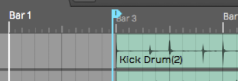
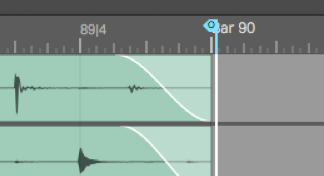
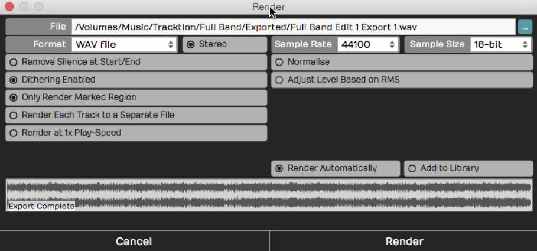
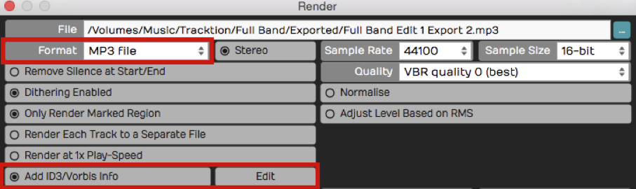
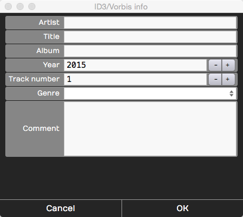
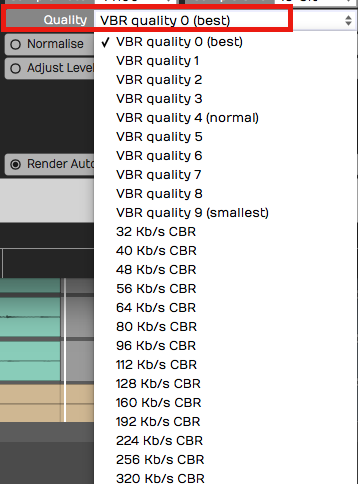
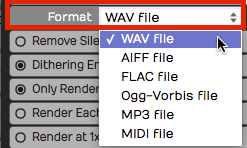
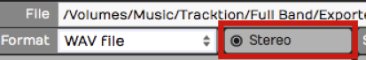
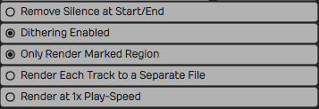
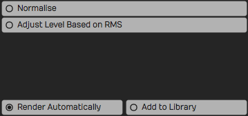

# Mixing Down

In this chapter we're going to go over the steps required to mix down
your Edit to a WAV file or MP3 file.

## Master Processing

Before you mix down, you might want to add some Master effects, so that
the entire stereo mix is processed. Master plugins often include a
compressor and a limiter to give the final mix a professional sound.

We won't get into the details about exactly what you'd apply there,
although the included Waveform *Master Mix* plugin is a nice choice.
It's a multi-band compressor, EQ, and limiter all in one.

*Waveform Master Mix*

Make sure that the master metering is not going into the
red before you export the mix. Exactly how you process the mix depends
on what you plan to do with the file after it's mixed down.

*The Waveform master*

If you're having professional mastering done, then you probably don't
want to put any plugins on there. However, if you are immediately going
to upload to your website or SoundCloud, you will want to put some
mastering effects on to make your mix into a finished product.

## Exporting to a WAV File

Here are the steps to export your song as a WAV file:

1.  Set the In-marker exactly at the beginning of the song. This defines
    the start of the export. Adjust the position of the In-marker to
    skip any extra bars or count-in at the beginning of the Edit.

*Set the In-marker Just Before the Song Start*

2.  Set the Out-marker right after the end of the song. This allows you
    to control the exact length of the exported file. We recommend
    leaving a couple of extra milliseconds after the final fade.

*Set the Out-marker Just After the Song Ending*

3.  Select *Export > Render to a file* from the Menu section. The
    *Render* dialog box appears.

*Export Render Dialog Box*

The above example shows the most common settings for exporting a WAV
file. You can customize the file location and name if you want. Also,
make sure to select *Only Render Marked Region* so that the In-marker
and Out-markers are used to define the export region.

4.  Click *Render* and the export will begin. Waveform starts processing
    in the background as you adjust the settings. Much of the time
    export is already done as soon as you click *Render*!

## Locating the Exported File

Unless you change the file path, the file saves to the project folder.
You can find the file either on the Projects tab or from the Browser.

Locating the Export on the Projects Tab
- Click the Projects tab and look at the *Exported Audio/MIDI* list at
    the right. Unless you have changed the filename, your exported file
    will be there with the word "Export", and an export number appended.

*The Exported File on the Project Page Files List*

To locate the file in Finder or File Explorer on your computer, select
the exported file and look at properties. In the properties, click the *...*
button to the right of *File* and choose *Open the folder containing
this file.* That opens the folder on your system, giving you direct
access to the file.

Locating the Export in the Browser
- Open the Browser and go to the Files tab. Click the folder icon and
    select *Project folder*.

*Locate the Project folder from the Browser*

Double-click the folder named *Exported* and you will see your file. To
located it in Finder or File Explorer, right-click and choose *Open the
folder containing this file*.

**Exported* Folder in the Browser*

## Exporting to an MP3 File

The steps to create an MP3 file are almost identical. Follow the same
steps above except when you get to the *Render* dialog box select MP3
for *Format*. That selection gives you a few extra options for
Rendering.

Add ID3/Vorbis Info
- With MP3 exports you can select this option to add metadata to the
    file.

*Add ID3/Vorbis Info*

To enter the metadata, click *Edit* to the right of the option. That
gives you the *ID3/Vorbis Info* dialog box. Fill in any information you
want to include in your MP3 and click *OK*.

*ID3/Vorbis Info Dialog Box*

This information is not required. So, if you don't care to include the
information, leave the *Add ID3/Vorbis Info* deselected.

Quality
- You can choose from common MP3 quality settings. VBR stands for
    "Variable Bit Rate" and helps optimize the file size in exchange for
    a bit more complicated decoding. CBR stand for "Constant Bit-rate"
    and gives you slightly larger files that are encoded consistently.

*MP3 Export *Quality* Options*

With today's fast internet speeds, including for mobile users, we
recommend choosing the maximum 320 KB/s CBR. Those will give you good
sounding MP3 files to upload to various sites or use in your own player.

## Additional Render properties

The *Render* dialog box has numerous settings. Often you can skip
looking at all of this stuff and just hit *Render* and you will get an
output file. However, it is a helpful to know what the other properties
do:

File Name and Location
- The first line is the file name and the location of the output file.
    You can edit that to name the file with the song name. You can also
    update the destination folder location on you system. By default it
    will be export to an "Exported" folder location in the project
    folder.

Format
- While exporting to WAV and MP3 files are the most common choices,
    Waveform supports several other file types:

*Export File Format Options*

Stereo
- For music it is most common to export to stereo files. If you
    deselect *Stereo* the file is exported as mono. You can use mono
    exports for voiceover files, fore example.

*Export Stereo/Mono Selection*

Channel Layout
- This dropdown sets the channel format of the rendered file: *Mono*,
    *Stereo*, *5.1 Surround*, *7.1 Surround*, or *From Edit*. *From Edit*
    (the default) derives the layout from the Edit's own output, so most of
    the time you can leave it there. Choose *Mono* to force a single-channel
    file, or one of the surround presets to write a multi-channel file.
    <!-- code: PropertyIDs.cpp:617; GeneralExporter.cpp:1191; tracktion_ChannelConfiguration.cpp:403-413 -->

Remove Silence at Start/End
- This does, as it says. If there is excess silence before the song or
    if there is a long silence at the end, Waveform will take that out.

*File Export Options*

Dithering Enabled
- If you don't know anything about dithering, then leave this enabled
    and move on. If you do know about dithering, then you can turn this
    off and add a third-party dither plugin on the master track,
    configuring it to dither as you please.

Only render the marked region.
- Whenever Waveform indicates "marked region", it means the range
    between the In-marker and the Out-marker. When enabled, the exported
    file only includes the audio between the In-marker and the
    Out-marker.

Render Each Track to a Separate File
- If someone else is going to mix your song in a different digital
    audio workstation, then you might want to export every single track
    in a fashion that can be imported into another system. If that's the
    case, turn this option on and you'll wind up with a whole collection
    of files: one for each track of your project. For a normal stereo
    export, leave this turned off.

Render at 1X Play-Speed
- If you are using the Insert plugin to mix through some external
    hardware effect, turn this option on when exporting your mix.
    Normally, you leave this option turned off. When enabled the Edit
    will render in real time, meaning, it will mix it down in exactly
    the same amount of time it would take to play back once. Some feel
    you will get the best sound quality rendering at 1X and for that
    reason, some Waveform users enable 1X rendering for the final master
    exports.

Normalize
- Normalize adjusts the overall gain of the file so that the highest
    peak fills up the available bit depth. Most of the time you will
    leave this turned off.

*More File Export Options*

Adjust Level Based on RMS
- Adjusting the level based on RMS is a way to set the output to match
    a perceived volume level. Modern broadcast standards require your
    files not to exceed standards based on the country and use.
    When you enable this option an *RMS Level* field appears where you set
    the target average level (−30 to 0 dB, default −12 dB); Waveform scales
    the whole mix so its integrated RMS reaches that figure. This is the
    counterpart to *Normalize*, which instead scales so the loudest *peak*
    reaches the *Peak Level* field (−30 to 0 dB, default 0 dB). Only one of
    the two fields is shown at a time, depending on which option is active.
    <!-- code: PropertyIDs.cpp:613,619-621; GeneralExporter.cpp:1207-1223; RenderOptions.cpp:107-108 -->

Add ACID Tempo/Note Info
- Available for WAV exports only. When enabled, Waveform embeds ACID
    metadata — the tempo in BPM and the root note — into the file. Loop
    browsers and other DAWs read this so the loop automatically matches the
    tempo and pitch of the project it's dropped into. Off by default.
    <!-- code: PropertyIDs.cpp:628; GeneralExporter.cpp:1286-1291 -->

Pass Through Plugins
- When you export to a *MIDI file*, this option (on by default) decides
    whether the notes first run through each track's plugin chain. With it
    on, instruments and MIDI effects such as arpeggiators or chord players
    transform the data before it is written; with it off the raw MIDI is
    exported. Note that many plugins swallow incoming MIDI, so if your
    exported file comes out empty, try turning this off. (When you render an
    individual track or clip rather than the whole Edit, the same option
    also governs whether audio plugins process the signal.)
    <!-- code: PropertyIDs.cpp:624; GeneralExporter.cpp:1238-1242,1329-1341; RenderOptions.cpp:95,118 -->

Render Automatically
- With this feature, in the background, as soon as you open the
    *Render* dialog box, it starts mixing down. It even shows you the
    progress on the lower waveform display. If you don't make any
    changes to the settings, as soon as you hit *Render* it's done
    instantly. Waveform already created the file in the background. It's
    sort of like working ahead. If you do make changes, it will start
    re-rendering right away. If you have a slower computer you can turn
    *Render Automatically* off.

Add to Library
- Add to library means you will add what you are mixing down to your
    loop library, so that you can search for it and use it in another
    project. It's a useful feature if you are mixing a lot of things to
    add to your library to build it up.

## Moving On

We have gone all the way from installing the program, to recording,
editing, adding virtual instruments, to using guitar amp sims, mixing,
and mixing down. There's still a lot more that you can learn and explore
about Waveform and your own music. Have fun, and make a lot of music.

