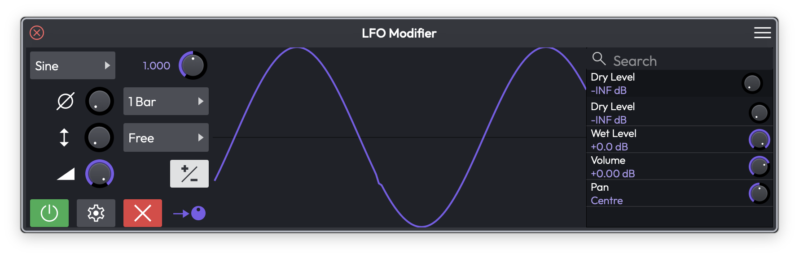
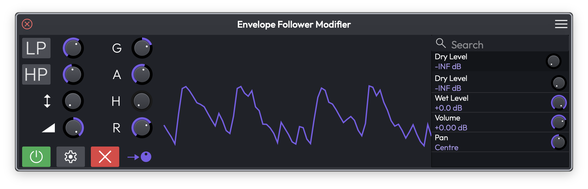
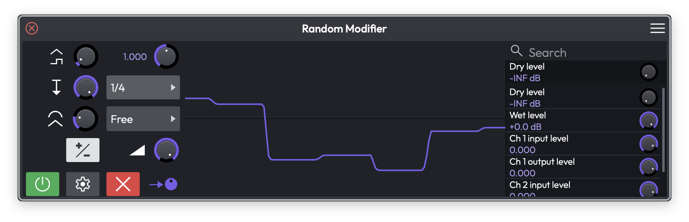
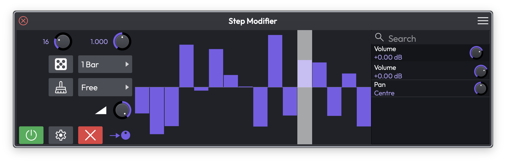
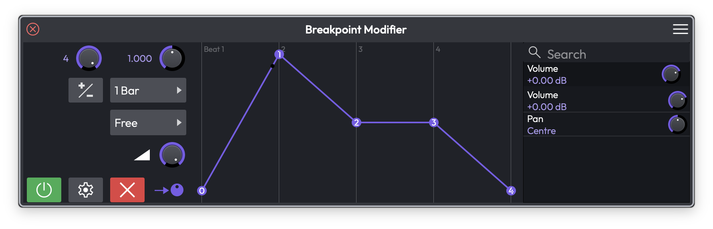
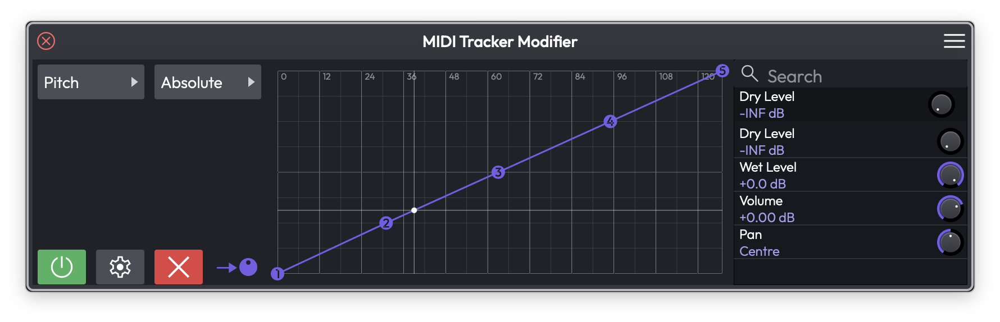

# Modifiers

Modifiers are modulation sources that automatically vary plugin parameters over time. Instead of drawing automation by hand, you attach a modifier to a parameter and let it move continuously — perfect for tremolo, filter sweeps, auto-pan, side-chain-style ducking, and rhythmic effects.

Waveform includes six modifier types: the LFO, the Envelope Follower, the Random modifier, the Step modifier, the Breakpoint modifier, and the MIDI Tracker. This chapter covers how to add them, the controls they share, and what makes each one different.

## Adding a Modifier

You create a modifier by dragging the **New Modifier Generator** button onto a track. You can drop it onto the top of a track to add it without an assignment, or drop it directly onto a plugin to choose the parameter to modulate right away. Modifiers can also live inside a Plugin Rack — see the Plugin Racks chapter.

Once added, a modifier appears as a small object above the plugins in the track's mixer area, alongside any Track LFOs. You can add as many modifiers to a track as you like, and a single modifier can drive several parameters at once.

Double-click a modifier object to open its editor window, where you adjust its settings and see a live display of its output.

There are three places to work with a track's modifiers: the small objects in the track's mixer area, a modifier's own editor window, and the **Plugins** tab of the Detail editor, which shows every modifier on the track alongside its plugins as a row of panels. See [The Plugins Detail Editor](plugins-detail-editor.md).

## Assigning to Parameters

Every modifier outputs a value that you map onto one or more plugin parameters. The editor window is split into three pages — **Modifier Settings** (the controls and live display), **Parameters**, and **Assignments**.

The list down the right side of the editor is the **Parameters** list: every automatable parameter on the track's plugins, with a search box at the top to find one quickly. Each entry has its own knob that sets how far the modifier moves that parameter.

There are two ways to make an assignment:

- **Drag the assignment handle** — the arrow-and-dot icon at the bottom-left of the editor — onto any parameter, or drop the modifier object straight onto a plugin and pick the parameter from the menu.
- **Click the assignment handle** to put the modifier into assignment mode, then click the parameters you want to control in the list on the right. This is the quickest way to assign several parameters in one go.

In the **Plugins** tab of the Detail editor, where a track's modifiers and plugins sit side by side, there is a third route: drag a modifier's tile onto any plugin panel and pick a parameter from the menu that opens. See [Assigning a Modifier to a Plugin](plugins-detail-editor.md#assigning-a-modifier-to-a-plugin).

The **Assignments** page lists everything the modifier currently controls, so you can review and adjust each mapping in one place. To remove an assignment, clear it from the Assignments page, or right-click the modifier object and choose the parameter under **Remove assignment**.

> 💡 **Tip:** A parameter can be driven by more than one modifier at once, and the modifier's movement is added on top of any automation or manual setting you have for that parameter.

## Controls Common to Several Modifiers

Most of the modifiers share a small set of controls, so it is worth learning them once.

**Enable** — The green power button turns the modifier on or off. Disable a modifier to silence its effect without losing it or its assignments.

**Delete** — The red X removes the modifier and all of its assignments.

**Sync** (Choices: Free, Transport, Note) — How the modifier's timing is referenced. *Free* runs continuously at its own rate, *Transport* locks the cycle to the playhead position so it repeats consistently against the bars and beats, and *Note* restarts the cycle whenever a new MIDI note arrives. (Default: Free)

**Rate Type** (Choices: Hertz, 4 Bars, 2 Bars, 1 Bar, and the musical divisions from 1/2 down to 1/64, each available as triplet (T) and dotted (D)) — Sets the unit for the rate. Choose *Hertz* for a free speed in cycles per second, or a musical division to lock the speed to tempo. (Default: 1 Bar)

**Rate** — The speed of the modifier. When Rate Type is Hertz this is a frequency; when it is a musical division this acts as a multiplier on that division. (Default: 1.000)

**Depth** — How far the modifier pushes the assigned parameter. At zero the modifier has no effect; turn it up for a stronger sweep.

**Bipolar / Unipolar** — The +/- button switches between *Uni-polar* output (the value moves in one direction, from the parameter's setting upward) and *Bi-polar* output (the value swings both above and below the parameter's setting). Use bipolar for symmetrical movement like vibrato, and unipolar when you only want to push a parameter one way.

### The Options Menu

The gear button opens an **Options** menu with a few more settings that apply to any modifier:

**Colour** — Picks the colour used for the modifier object and its live display. This is worth setting when you have several modifiers on one track, so you can tell them apart at a glance. The same colour is used to highlight the plugins it controls.

**Remap on Tempo Change** — When the rate is locked to a musical division, the actual speed is worked out from the tempo. Leave this on (the default) to have that speed recalculated whenever the tempo changes, so the modifier stays in time. Turn it off to freeze the speed at its current value.

**Highlight Controlled Plugins** — Draws a coloured outline (in the modifier's colour) around every plugin that has a parameter driven by this modifier. Handy for seeing what a modifier is affecting across the track.

**Select Plugins** — Selects all the plugins this modifier controls, which is a fast way to jump to them.

## The LFO Modifier

*The LFO Modifier editor, showing a sine wave, the wave and sync menus, and the parameter assignment list on the right*

The **LFO** (low-frequency oscillator) repeats a chosen waveform to give smooth, regular movement. It is the go-to modifier for tremolo, auto-pan, and rhythmic filter wobbles.

**Wave** (Choices: Sine, Triangle, Saw Up, Saw Down, Square, 4 Steps Up, 4 Steps Down, 8 Steps Up, 8 Steps Down, Random, Noise) — The shape of the modulation. The stepped and random shapes produce sample-and-hold-style jumps rather than a smooth curve. (Default: Sine)

Alongside Wave, the LFO offers the shared Rate, Rate Type, Sync, and Bipolar controls, plus:

**Phase** — Shifts the starting point of the waveform within its cycle. (Default: centre)

**Offset** — Shifts the whole output up or down before it reaches the parameter. (Default: centre)

> 💡 **Tip:** The LFO is the quickest way to add tremolo or auto-pan — assign it to a Volume or Pan parameter, pick a Sine wave, set the Rate Type to a musical division, and turn up the Depth. We have a [video tutorial](https://youtu.be/9UVEAJAvFZ0) showing the LFO in action with a virtual instrument.

## The Envelope Follower Modifier

*The Envelope Follower Modifier, tracing the amplitude of the track's audio*

The **Envelope Follower** watches the loudness of the audio on its track and turns that into modulation. As the signal gets louder the output rises; as it fades the output falls. This is how you build side-chain-style effects — for example, ducking a reverb's wet level whenever a vocal is present, or opening a filter in time with a drum hit.

**Gain** — Boosts or cuts the incoming audio before the envelope is measured, so quiet signals can still drive a strong response. (Range: −20 to +20 dB, Default: 0 dB)

**Attack** — How quickly the output rises as the audio gets louder. Shorter times react snappily to transients. (Range: 1 to 5000 ms, Default: 50 ms)

**Hold** — How long the output stays at its peak before it starts to fall. (Range: 0 to 5000 ms, Default: 50 ms)

**Release** — How quickly the output falls once the audio quietens. (Range: 1 to 5000 ms, Default: 50 ms)

**Low-pass** and **High-pass** filters — The LP and HP buttons let you filter the audio before it is measured, each with its own frequency knob. Use them to make the follower respond only to a part of the signal — for example, only the kick drum's low end. (Default: both off; frequency 700 Hz)

**Depth** — How far the envelope pushes the assigned parameter, and in which direction. (Range: −1 to +1, Default: 0)

**Offset** — A fixed amount added to the output, so you can set where the parameter sits when the audio is silent. (Default: centre)

> 📝 **Note:** The Envelope Follower reacts to the audio on its own track, so it only does something when that track is actually playing audio.

## The Random Modifier

*The Random Modifier producing a smoothed stream of random values*

The **Random** modifier generates ever-changing random values. It is great for adding subtle human-style drift to a parameter, or for chaotic, unpredictable movement when pushed harder.

**Type** (Choices: Random, Noise) — *Random* produces a new value each cycle (sample-and-hold), while *Noise* produces a continuously fluctuating signal. (Default: Random)

**Shape** — Adjusts the character of the generated curve. (Default: centre)

**Step Depth** — Sets how much each new random step differs from the last, controlling how jumpy the output is. (Default: centre)

**Smooth** — Rounds off the transitions between values. Turn it up to glide between random points instead of jumping. (Default: centre)

The Random modifier also offers the shared Rate, Rate Type, Sync, Depth, and Bipolar controls. Use Rate and Sync to decide how often a new value is chosen.

## The Step Modifier

*The Step Modifier with a drawn sequence of step values*

The **Step** modifier is a step sequencer for a parameter. You draw a row of bars, and the modifier scrubs through them at a tempo-synced rate — like a classic analog sequencer lane. It is ideal for rhythmic, repeating patterns.

**Steps** — The number of steps in the pattern. (Range: 2 to 64, Default: 31)

To set each step's value, drag its bar up or down in the grid. The highlighted column shows which step is currently playing.

Two buttons sit next to the sequence:

- The **dice** button fills the pattern with random step values — a quick way to find a happy accident.
- The **broom** button clears the pattern back to its default.

The Step modifier also uses the shared Rate, Rate Type, and Sync controls to set how fast it advances, plus **Depth** to scale how strongly the steps move the parameter. (Depth range: −1 to +1, Default: 0)

## The Breakpoint Modifier

*The Breakpoint Modifier with a custom drawn shape across one bar*

The **Breakpoint** modifier lets you draw your own modulation shape from a handful of points. Think of it as a custom LFO waveform: you place the points, bend the segments between them, and the modifier plays that shape back on a loop. Good for bespoke envelopes and one-off rhythmic curves.

**Num points** — How many breakpoints make up the shape. (Range: 1 to 4 active points, Default: 2)

To edit the shape, drag the numbered points in the graph to move them in time and value, and drag the small handle on a segment to curve it. The grid above shows where each beat of the cycle falls.

The Breakpoint modifier also offers the shared Rate, Rate Type, Sync, Depth, and Bipolar controls, which set how long the drawn shape takes to play through and how strongly it moves the parameter.

## The MIDI Tracker Modifier

*The MIDI Tracker Modifier mapping MIDI pitch onto a modulation output*

The **MIDI Tracker** turns incoming MIDI performance data into modulation. Instead of mapping a knob, you map the notes you play — so the pitch or velocity of what you perform can drive any parameter. For example, higher notes could open a filter, or harder hits could add more distortion.

**MIDI Type** (Choices: Pitch, Velocity) — Whether the modifier tracks the note's pitch or its velocity. (Default: Pitch)

**Mode** (Choices: Absolute, Relative) — How the incoming MIDI value is mapped to the output. (Default: Absolute)

In **Absolute** mode you draw a curve directly across the MIDI range (0–127 along the bottom), placing points to shape exactly how each input value maps to the output. Drag the numbered handles to reshape the curve.

In **Relative** mode you set two handles instead:

- **Root (R)** — The MIDI value that sits at the centre of the output.
- **Spread (S)** — How wide a range of notes around the root is covered before the output reaches its limits.

A crosshair marks the current incoming value live as you play, so you can see the mapping in action.

## ⚡ Things to Watch Out For

- A modifier's effect is layered on top of a parameter's existing value and any automation — it nudges the parameter rather than replacing it. If a parameter does not seem to move, check the **Depth** is above zero.
- You cannot assign a modifier to itself.
- The **Envelope Follower** only responds while audio is playing on its track, and the **MIDI Tracker** only responds while MIDI notes are arriving.
- **Note** sync restarts the cycle on each new note, so it needs incoming MIDI to do anything useful — on an audio-only track, use *Free* or *Transport* instead.
- Disabling a modifier (the green power button) keeps it and its assignments intact; deleting it (the red X) removes everything. Disable first if you only want to A/B the effect.

## Moving On

Modifiers are the quickest way to add living, evolving movement to a mix without drawing a single automation point. Combine a few of them — an LFO on a filter, an Envelope Follower on a reverb send, a Step modifier on pan — and a static track comes to life.

For hand-drawn parameter changes see the Automation chapter, and for grouping several controls under one knob see the Macros chapter.
