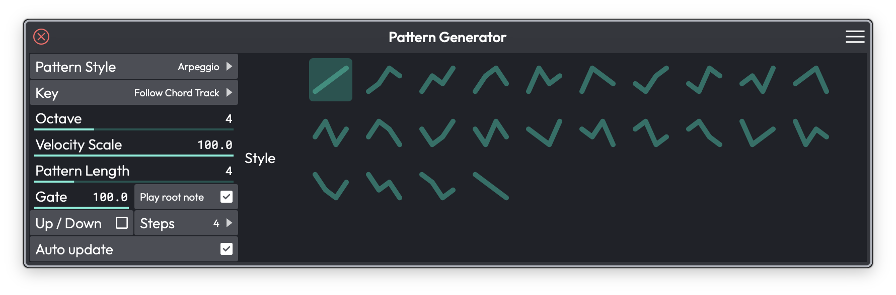

# Pattern Generator

The Pattern Generator builds MIDI notes for you — arpeggios, chords,
basslines, and melodies — directly inside any MIDI clip. It's a great
way to sketch ideas quickly, follow your project's harmony, or get past
a blank canvas. The notes it creates are real, editable MIDI; once
they're generated you can tweak them like anything else you'd draw by
hand.

This is available in all editions. The one exception is the *Follow
Chord Track* key option, which needs Waveform Pro.
<!-- code: waveform/common/Source/ui/propertypanels/MidiClipPropertyPanel.h:2819-2828,2864-2883 -->

*The Pattern Generator tab in a MIDI clip's properties*

## Opening the Pattern Generator

Select a MIDI clip, then open the **Pattern Generator** tab in
properties. Everything happens in that one panel — there's no separate
window.
<!-- code: MidiClipPropertyPanel.h:1813,1978 -->

## Choosing a Pattern Type

The **Type of pattern to generate** menu sets what the generator
produces. (Choices: None, Arpeggio, Chords, Bassline, Melody) (Default:
None)
<!-- code: MidiClipPropertyPanel.h:1980,2822-2826 -->

- **None** — Generation off. The clip keeps whatever notes are already
  in it.
- **Arpeggio** — Spreads the current chord into a stepped pattern.
- **Chords** — Lays the chords down as block chords.
- **Bassline** — Builds a single-note bass part from the progression.
- **Melody** — Generates a melodic line within the key.

When you pick a type, a set of controls appears below it. Some are
shared by every type; others are specific to the mode you chose.

## Shared Controls

These appear for every pattern type (except None).

**Key** — Where the generated notes get their pitch reference. (Choices:
Follow Chord Track, Follow Global Track, or one of the twelve chromatic
roots) (Default: Follow Global Track). *Follow Chord Track* ties the
pattern to the harmony you've laid out on the Chord Track and needs
Waveform Pro; *Follow Global Track* tracks the edit's global key.
<!-- code: MidiClipPropertyPanel.h:2864-2883 -->

**Scale / Mode** — The scale used when you've chosen a fixed root rather
than following a track. (Only shown when Key is set to a specific root.)

**Progression** — A chord-progression builder shared with the Chord
Track. Add chords (triads, 6ths, 7ths, 9ths, or custom), drop in popular
3- and 4-chord progressions, and save or load presets. A **Suggestion**
predictor sits alongside it, showing likely next chords as a bar chart
so you can build a progression a chord at a time. See the Chord Track
chapter for the full walkthrough of this builder — it works the same
way here.

**Octave** — Shifts the generated notes up or down by octaves.

**Velocity** — Sets the velocity of the generated notes.

**Gate** — How long each note plays relative to its step (shorter gates
give a more staccato feel).

**Auto Update** — Regenerates the pattern automatically whenever you
change a setting. (Default: on)

> ⚠️ **Warning:** With *Auto Update* on, regenerating the pattern
> overwrites any manual edits you've made to the notes. If you want to
> hand-tweak the result, turn *Auto Update* off first.

## Arpeggio

In addition to the shared controls, Arpeggio adds:

- **Style** — A grid of arpeggio patterns to choose from.
- **Pattern Length** — How many steps before the pattern repeats.
- **Play Root** — Includes the chord's root note in the pattern.
- **Up / Down** — The direction the arpeggio travels.
- **Steps** — The number of steps in the pattern.
<!-- code: MidiClipPropertyPanel.h:2010-2094 -->

## Chords

- **Pattern style** — How the chords are voiced and placed.
- **Octave Up / Octave Down** — Doubles the chord an octave above or
  below.
- **Spread** — Widens the spacing between the chord's notes.

## Bassline

- **Pattern style** — The rhythmic and melodic shape of the bass part.

## Melody

- **Note Length** — The length of the generated melody notes.
- **Add all notes in key** — Lets the melody use every note in the key
  rather than a restricted set.
- **Randomise** — Generates a fresh variation of the melody.
<!-- code: MidiClipPropertyPanel.cpp:90-152,406-471 -->

> 💡 **Tip:** The first time you use Melody mode you'll see a hint to
> paint notes in and out with the paint tool — you can steer which
> pitches the generator favours by drawing them in or erasing them.

## ⚡ Things to Watch Out For

- **Auto Update overwrites your edits.** This is the big one. If you've
  spent time refining the generated notes, turn *Auto Update* off before
  touching any other control.
- **Follow Chord Track is Pro only.** In Free and OEM editions you can
  still follow the global key or pick a fixed root — you just can't lock
  the pattern to the Chord Track's harmony.
- **The generator only fills the selected clip.** It works on one MIDI
  clip at a time, not across the whole edit.

## Moving On

The Pattern Generator shares its Progression builder with the Chord
Track, so the two work nicely together — set up your harmony on the
Chord Track, then have each clip's generator follow it. See the Chord
Track chapter for the progression builder in detail.
