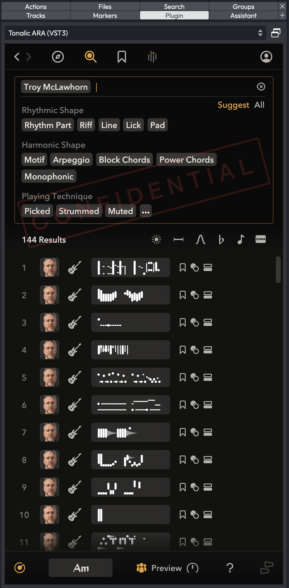
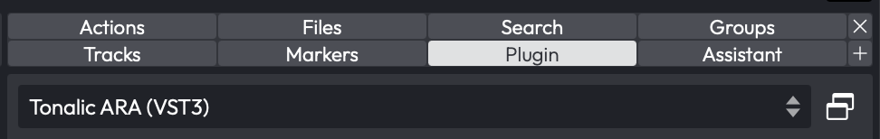

# The Plugin Side Panel

The Plugin panel lets you keep a single plugin running live in the side panel, right alongside the Browser, Actions, and other tabs. Unlike a plugin inserted on a track, the one in this panel isn't part of any track's signal chain. It runs on the Edit's main output, so it hears your project's tempo, key, and chord context as it plays. That makes it a handy home for a tool you want on hand while you work: a tuner, an analyser, a chord-detection plugin, or a reference utility you'd rather not clutter a track with.

Because the plugin lives in the side panel rather than on a track, it stays put as you click around the arrangement, and it's saved with the Edit so it comes straight back the next time you open the project.

*The Plugin panel hosting a plugin's editor in the side panel*

> 📝 **Note:** The Plugin panel is available in Waveform 14 and later, in all editions.

## How to Access It

The Plugin panel appears as a tab in the left-hand Browser, next to Actions, Files, Search, Markers, and the rest. Open the Browser and click the **Plugin** tab to show it.

The tab only appears if it's enabled. Open the Settings tab, go to the **Plugins** page, and turn on *Shows the Plugin panel in the side panel list*. This takes effect the next time you open an Edit.

Before a plugin can be chosen in the panel, it has to be flagged for it. On the same Plugins settings page, each plugin row has a **Panel** column: tick it for the plugins you want to be able to load here. Only ticked plugins show up in the panel's picker.

## Loading a Plugin

1. Make sure the panel is enabled (Settings > Plugins > *Shows the Plugin panel...*) and that at least one plugin is ticked in the **Panel** column.
2. Open the Browser and select the **Plugin** tab.
3. Click the picker at the top (it reads *Select a plugin...* when nothing is loaded) and choose a plugin from the list.
4. The plugin loads and starts processing the main output. If its editor can resize to fit, it appears embedded in the panel; otherwise it opens in its own floating window.
5. To remove the plugin again, open the picker and choose **None**.

If you haven't enabled any plugins for the panel yet, you'll see the message *No plugin selected*, with a hint to *Enable plugins from the Plugins settings page to view them here*.

## Embedded vs. Floating Editors

How a plugin's editor is shown depends on the plugin:

- **Embedded**: editors that resize cleanly to fit the panel are sized to fill it inline.
- **Floating**: editors with a fixed shape that can't be embedded open in a separate floating window instead. The panel then shows the message *This plugin opens in its own window*, with an **Open plugin window** button to bring the window back if you've closed it.

For an embeddable plugin, a small **float/dock** button sits next to the picker so you can pop the editor out into a window and dock it back at will. Its tooltip reads *Float or dock the plugin editor*. The button only appears when the loaded plugin can be embedded.

*The float/dock button beside the plugin picker*

## Controls

| Control | Type | Description |
| --- | --- | --- |
| Plugin picker | Dropdown | Chooses which plugin to host. Lists *None* plus every plugin ticked in the Panel column of the Plugins settings page. Reads *Select a plugin...* when empty. |
| Float / dock | Toggle button | Pops an embeddable plugin's editor out to a floating window, or docks it back inline. Only shown for embeddable plugins. |
| Open plugin window | Button | For a non-embeddable plugin, reopens its floating editor window. |

## Tips and Notes

> 💡 **Tip:** Because the panel's plugin runs on the main output, it's ideal for tuners, spectrum analysers, and other "always listening" tools you want available without adding a plugin to every track.

> 📝 **Note:** The hosted plugin and its settings are saved with the Edit, so it returns automatically when you reopen the project.

> 📝 **Note:** When you switch away from the Plugin tab or close the Browser, the hosted plugin stops processing to save CPU, and resumes when the panel is shown again.

> ⚡ **Watch out:** The picker only lists plugins you've ticked in the **Panel** column on the Plugins settings page. If the list looks empty, that's where to enable them.
