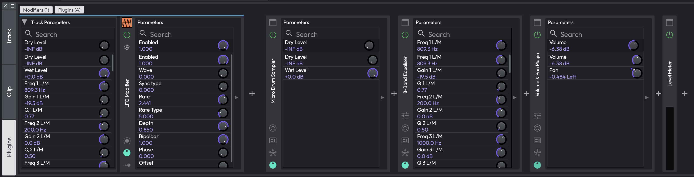
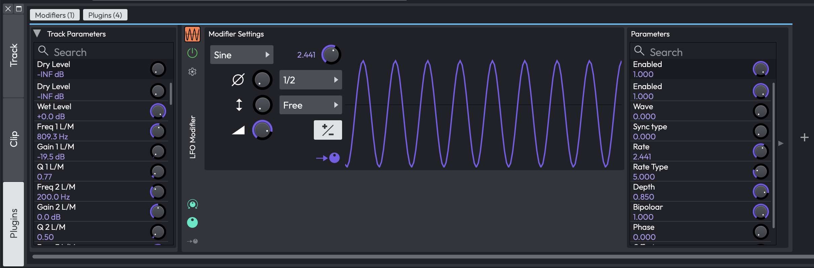
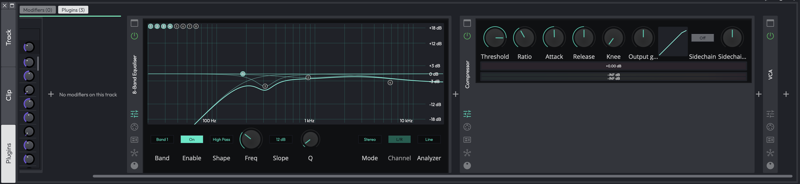

# The Plugins Detail Editor

The **Plugins** tab of the Detail editor lays a whole track's modifiers and plugins out side by side, as a row of panels you can open and close individually. Instead of opening one plugin's properties at a time, you can have a compressor's editor, a synth's parameter list and an LFO's settings all on screen together, and work across them without losing your place.

Nothing here is a new set of controls. Each panel opens the same pages you already get from the floating property panels and the modifier editor window (the Parameters list, the Faceplate, the Macro Parameters, the MIDI Controller Mappings), just docked into the Detail editor rather than floating above the arrangement. What is new is the layout: everything belonging to one track, in signal order, in one scrolling row.

*The Plugins tab, with the Modifiers section on the left and the track's plugin chain on the right, most panels showing their Parameters page*

> 📝 **Note:** The Plugins tab of the Detail editor is new in Waveform 14.

## Opening It

The Detail editor has a strip of mode buttons down its left-hand edge. **Plugins** is the third of them, below **Track** and **Clip**; when it is present the strip divides into thirds.

Which tab you last had open is saved with the Edit, so the Detail editor comes back on the Plugins tab next time you open the project.

If you float the Detail editor out into its own window, the Plugins tab comes with it and works exactly the same way.

### Which Track Is Shown

The tab follows the selection and resolves it to a track:

- Select a **track** and you get that track.
- Select a **clip** and you get the track it sits on.
- Select a **plugin** and you get the track that owns it. Plugins inside a Plugin Rack are the exception: a Rack's contents don't belong to a single track, so selecting one leaves the panel where it is.
- Select a **modifier** and you get the track it belongs to.

If your new selection doesn't resolve to a track at all (clicking an empty part of the arrangement, say), the panel keeps showing the track it was already on rather than emptying out.

Until something resolves for the first time, a dimmed overlay reads *Select a track, clip or plugin to edit*.

Selecting a plugin or a modifier anywhere else in the app (in the mixer, or the arranger's plugin chain) scrolls its panel into view here.

> 💡 **Tip:** The row only ever scrolls sideways; every panel is as tall as the Detail editor itself. Drag the Detail editor's top edge upwards to give the open pages more height.

## The Modifiers and Plugins Buttons

Two pill buttons sit at the top left of the tab: **Modifiers (n)** and **Plugins (n)**, where *n* counts the panels in that section. A pill dims when its count is zero, so you can see at a glance that a track has no modifiers without switching anything on.

The two buttons are **not** mutually exclusive. Either, both, or neither section can be shown, and hiding one gives the other the full width. Hide both and the tab reads *Both sections are hidden - use the Modifiers and Plugins buttons above*.

## The Modifiers Section

A strip in the track's own colour runs across the top of this section, from the Track Parameters card to the last modifier panel, so it stays clear which track you are editing.

If the track has no modifiers yet, the section reads *No modifiers on this track*.

### Track Parameters

The first card in the section is **Track Parameters**: every automatable parameter on every plugin in the track, with a search box at the top to find one quickly. This is the same list that appears down the right-hand side of a modifier's editor window, and it works the same way: it is the target you click when you have put a modifier into assignment mode, and each entry has its own knob setting how far that modifier moves the parameter. See [Assigning to Parameters](modifiers.md#assigning-to-parameters) in the Modifiers chapter.

The difference here is that it is shown **once for the whole track**, at the start of the section, rather than repeated inside every modifier's settings page. That leaves the modifier panels themselves narrower and lets several of them share the screen.

Use the arrow button in its top-left corner (*Show or hide the track parameters list*) to collapse the card down to a narrow strip with its title rotated into it, freeing up the width when you don't need it.

On the Master track the list covers the master plugins plus the master volume plugin.

### A Modifier Panel

*An LFO modifier panel with its Modifier Settings and Parameters pages open, next to the Track Parameters list*

Each modifier on the track gets its own panel. Down the left-hand strip, from top to bottom:

- The small **modifier tile**: the same object you see above the plugins in the track's mixer area.
- The **enable / bypass** power button (*Enable or bypass this modifier*).
- The **options** gear button (*Modifier options*), which opens the same Options menu described in the Modifiers chapter: Colour, Remap on Tempo Change, Highlight Controlled Plugins and Select Plugins.
- The modifier's name, rotated to run up the strip.
- Three page toggles at the bottom: **Modifier Settings**, **Parameters** and **Assignments**.

Switch a toggle on and that page opens to the right of the strip; switch it off and the panel shrinks back. Several pages can be open at once, and the panel gets wider.

The tile behaves exactly as it does in the mixer: click it to select the modifier, double-click to open the modifier's own editor window, and drag it to make an assignment.

Right-clicking **anywhere** on the panel (not just the tile) gives the modifier's usual menu: *Enable* / *Disable*, *Delete*, and a **Remove assignment** section listing every parameter this modifier currently drives, so you can unhook them one at a time.

The selected modifier's panel is drawn with a white outline, the same highlight used for a selected plugin in the mixer.

### Adding and Reordering Modifiers

The **+** button at the end of the section adds a modifier to the track. The LFO is always offered; the Breakpoint, Step, Envelope Follower, Random and MIDI Tracker modifiers appear in the menu in editions that include the full modifier set.

To reorder them, drag a modifier panel sideways. A coloured insert line shows where it will land. This is a reorder within the one track only. You can't drag a modifier in from a different track or out of a Rack this way.

To delete one, right-click its panel and choose **Delete**.

## The Plugins Section

### A Plugin Panel

*The 8-Band Equaliser and Compressor panels with their Editor pages open, beside a collapsed VCA panel showing just its strip*

There is one panel per plugin in the track's chain, in signal order. Unlike the mixer, nothing is hidden: the built-in Volume & Pan and Level Meter plugins that sit at the end of every track get panels here too.

Down the left-hand strip, from top to bottom:

- The **show / hide plugin window** button (*Show or hide the plugin's window*), which opens the plugin's own floating window and closes it again.
- The **enable / bypass** button (*Enable or bypass this plugin*).
- The plugin's name, rotated to run up the strip.
- A toggle for each page the plugin has, at the bottom.

The **name strip** does more than label the panel:

- **Click** it to select the plugin, which also shows its properties everywhere else in the app.
- **Double-click** it to rename the plugin. A *Rename Plugin* dialog appears; leave the box empty to go back to the plugin's own name.
- **Drag** it to move the plugin, either to another position in this row, or straight out to the mixer or the arranger's plugin chain. Hold a modifier key while you drag to copy the plugin instead of moving it.

Right-clicking a plugin panel gives the plugin's full standard menu, the identical menu you get on its mixer or arranger slot, with *Enabled*, *Add plugin to left*, *Delete plugin*, *Replace this plugin*, the preset and Rack items, and the rest. See [Working with Plugins](using-plugins.md#working-with-plugins).

A **Level Meter** plugin has no pages at all, so its strip shows a live output meter in the space the page toggles would have taken.

### The Pages

Only the pages a plugin actually has get a toggle, so a simple utility plugin may show one and a big instrument several.

**Editor**: the plugin's own interface, embedded inline in the panel. This is offered for Waveform's **built-in** plugins only: third-party VST and AU plugins always use their own window. Two more conditions apply: the plugin must have parameters, and its editor must be short enough to sit sensibly in the Detail editor. Tall editors such as 4OSC and the Guitar amp's IR loader stay window-only, and you reach them with the show/hide window button in the strip. Editors that can resize, like the 8-band EQ, stretch to fill the height you have given the Detail editor.

**Parameters**, **Macro Parameters**, **Faceplate** and **MIDI Controller Mappings**: the same pages as the plugin's floating property panel, and subject to the same edition gating, so Faceplates and Macro Parameters only appear where those features are available.

On the **Parameters** page the assignments half starts **collapsed** in this embedded view, which keeps the page narrow. Click the expander down its edge to open the assignments out; the page widens to make room, and closes back to its narrow width when you collapse it again.

### Adding, Reordering and Removing Plugins

A **+** button sits in the gap between every pair of panels (*Insert a plugin here*) and one more at the end of the row (*Add a plugin to this track*). Either opens the plugin selector, and the new plugin lands at that point in the chain.

You can also drag plugins in from the mixer or from the arranger's plugin chain, and drag them out of here to either. A vertical line shows where the drop will land.

To remove a plugin, right-click its panel and choose **Delete plugin**, or select it and press Delete.

## Assigning a Modifier to a Plugin

Because both sections are on screen at once, you can assign a modifier to a plugin parameter by dragging straight from one to the other.

Drag the **modifier tile** out of a modifier panel and across to the Plugins section. Any plugin panel you pass over is drawn with a white outline to show it will take the drop.

Drop it and the plugin's **parameter menu** opens: its macros in a submenu at the top, then all of its parameters. Pick one and the modifier is assigned to it, exactly as if you had dropped the modifier onto that plugin in the mixer.

The whole panel is the drop zone, including any pages you have open, so you don't have to aim for the narrow strip.

Plugins with no parameters of their own (the Level Meter is the obvious one) never highlight and never accept the drop.

> 📝 **Note:** Individual parameter rows inside an open **Parameters** page are not separate drop targets. To assign to one specific parameter, either use the drop menu above, or put the modifier into assignment mode and click the parameter in the **Track Parameters** list. See [Assigning to Parameters](modifiers.md#assigning-to-parameters).

## Controls

| Control | Type | Description |
| --- | --- | --- |
| Plugins | Mode button | The third button in the Detail editor's left-hand strip, below Track and Clip. Switches the Detail editor to this tab. |
| Modifiers (n) | Toggle pill | Shows or hides the Modifiers section. *n* is the number of modifier panels; the pill dims when it is zero. |
| Plugins (n) | Toggle pill | Shows or hides the Plugins section, with the same count and dimming. |
| Show or hide the track parameters list | Arrow button | Collapses the Track Parameters card to a narrow strip, or opens it again. |
| Enable or bypass this modifier | Power button | Turns an individual modifier on or off without deleting it or its assignments. |
| Modifier options | Gear button | Opens the modifier's Options menu (Colour, Remap on Tempo Change, Highlight Controlled Plugins, Select Plugins). |
| Modifier Settings / Parameters / Assignments | Page toggles | Open and close a modifier's three pages beside its strip. |
| Add a modifier to this track | + button | Adds a modifier at the end of the section. |
| Show or hide the plugin's window | Toggle button | Opens the plugin's own floating window, or closes it. |
| Enable or bypass this plugin | Power button | Bypasses the plugin, leaving it in the chain. |
| Plugin name strip | Rotated label | Click to select, double-click to rename, drag to move or copy the plugin. |
| Page toggles | Icon buttons | Open and close the plugin's Editor, Parameters, Macro Parameters, Faceplate and MIDI Controller Mappings pages. |
| Insert a plugin here | + button | Inserts a plugin at that point in the chain. |
| Add a plugin to this track | + button | Adds a plugin at the end of the chain. |

## Tips and Notes

> 💡 **Tip:** Open the **Parameters** page on a modifier and the **Editor** page on the plugin it drives, side by side, and you can watch the plugin's controls move as you change the modifier's depth or rate.

> 💡 **Tip:** Turn the **Modifiers** pill off when you are only working on the plugin chain. The Plugins section then gets the full width, which is worth doing when a plugin's Editor page is wide.

> 📝 **Note:** Which sections are shown, which pages you left open, whether each Parameters page's assignments were expanded, and how far the row was scrolled are all remembered for the rest of the session, but they are not saved into the Edit. Reopen the project and the tab starts with both sections shown and every panel collapsed. The tab you were last on *is* saved.

> ⚡ **Watch out:** Selecting a plugin that lives inside a Plugin Rack doesn't move the panel, because a Rack's plugins aren't owned by a single track. Select the Rack itself, or the track, to get back to the track's chain.

> ⚡ **Watch out:** Dragging a plugin's name strip moves the plugin for real. If you only meant to select it, click rather than drag. And if you drag one out of the row and onto the mixer, that is where it now lives.

## Moving On

For the modifiers themselves (what each type does and the controls they share), see [Modifiers](modifiers.md). For plugins in the mixer and the arranger's plugin chain, see [Using Plugins](using-plugins.md), and for the other two tabs of this panel see [The Detail Editor](detail-editor.md).
