# Quantizing MIDI Notes

The idea of quantizing is to correct the timing your MIDI performances.
At a basic level, quantizing snaps each note to the nearest correct note
on a virtual grid defined by the bars and beats of your song. Waveform
gives you tools to define that grid in musical increments like quarter
note, eighth note, but it does so using divisions of a beat.

Waveform takes quantizing further with groove templates. Groove
templates allow you to quantize in a way that's not perfectly aligned to
straight timing. An important use of this is to introduce musical swing
to the timing. You have all the tools needed to impart the desired feel
into your performance.

## How to Quantize

Within a MIDI clip, select all the notes you want to quantize. If you
want to quantize all of them, you can use select all (Cmd + A / Ctrl +
A). The quantize actions are available by clicking *Quantize* in
properties.

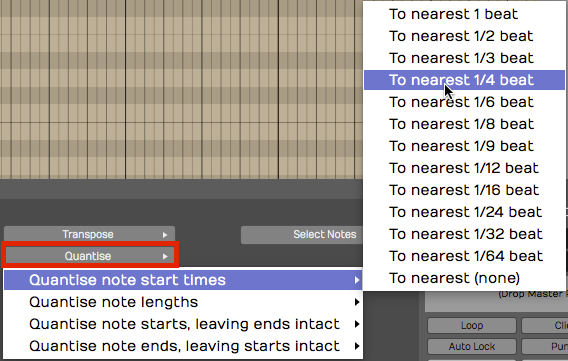

*MIDI Quantize Actions*

There are four different quantize actions available, as shown above. The
most common option is the first one - *Quantize note start times*. To
complete the action, you pick which beat division to use.

The beat division selection can be a little confusing. Musical divisions
in Waveform are represented as fractions of one beat. For example, if
you want to quantize to eighth notes and you're in 4/4 time, then you
select *To nearest 1/2.* One half of one beat would be an eighth note.
If you want to quantize to sixteenth notes, then select *To nearest 1/4
beat* from this menu.

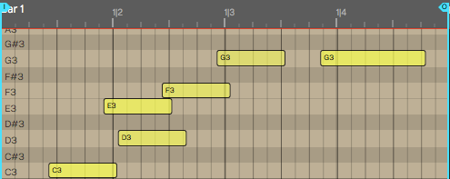

*MIDI Notes Before Quantizing*

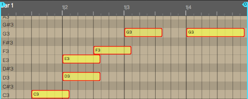

*MIDI Notes After Quantizing Note Starts to Nearest 1/2 Beat*

You'll will notice right away that quantizing perfectly tightens up up
the performance. It will snap the notes to the nearest increment of the
division that you selected.

> 📝 **Note:** If you're playing was so far off that it actually snaps it to
the wrong note, then you might need to do some MIDI editing to clean
that up!

> 💡 **Tip:** Some styles of music are based on perfectly quantized timing
while other styles aren't. To get a more natural feel but also fix
timing errors, you can always edit timing note-by-note manually with
*Snap* turned off. Groove quantizing also gives you other options for
"quantizing with feel". More on that later.

## Quantizing Note Lengths

If you choose the option to quantize the note lengths you'll see that
the notes become the full length of that particular note value.

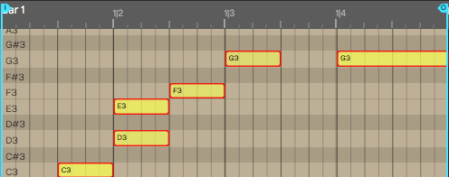

*Note Lengths Quantized to 1/2 beat*

With something like a piano part, this can lead to a choppy, unnatural
feel. You could try quantizing the note lengths to 1/4 beat (sixteenth
note) if the playing is that inconsistent.

In most cases, it's not really important to quantize the note lengths.
It can be useful for things like quantizing the note lengths on drum
parts, because it helps play out the full attack and decay of a drum
hit.

## Quantizing with Groove

Next let's look at how to quantize with groove. This feature can be as
simple a choosing a preset, or as complex as finely programming a groove
template. Groove can be applied to both MIDI clips and Step clips, which
we will cover in the next chapter.

First lets look at the basics:

Select the notes to quantize and click *Apply Groove* in properties.

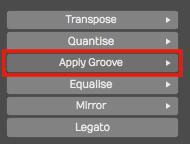

*Apply Groove in properties*

You will then get a large menu of groove presets. These are custom
templates that allow you to apply fine adjustments to the timing.

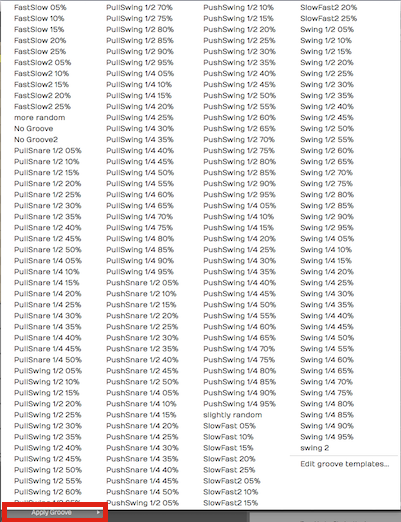

*Apply Groove Presets in Options*

The most common scenario is to apply swing: Delaying the eighth notes
that follow the four primary beats in a bar. To locate the groove
templates for standard swing, look at those starting with *Swing 1/2.*
Swing 1/2 as in half beat. In normal musical terms, that's eighth note
swing. To apply a nice groovy swing, try *Swing 1/2 60%*.

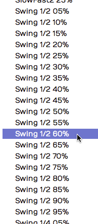

*Groove Presets for Swing*

> 📝 **Note:** In 4/4 music, eighth note timing is counted 1 & 2 & 3 & 4 &.
In swing timing, the "&" beats are delayed. The swing presets in
Waveform let you pick how much delay as a percentage from subtle (10%)
to dramatic (90%).

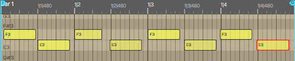

*Before Applying Groove*

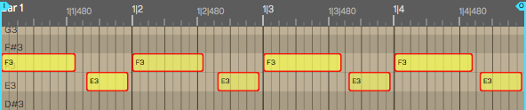

*After Applying Groove - *Swing 1/2 60*%*

After you apply swing, you'll see it lays back all of the "and" notes to
be a little late; groovy! Waveform will also adjust the note lengths
appropriately as shown above.

## Defining Groove Templates

To take groove to the next level, you can build grooves to your own
definition using the Groove Template Editor. At the bottom of the *Apply
Groove* menu, you'll find *Edit groove templates*. This is also
available in the Menu section under *Snapping > Edit Groove Templates*.

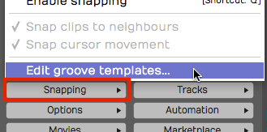

**Snapping > Edit groove templates**

Select this to open the groove template editor. Click on any of the
presets to see how the logic works.

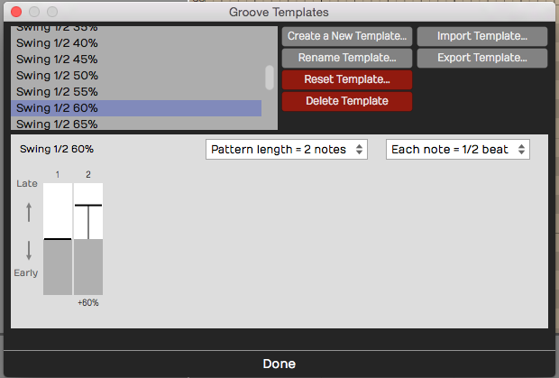

*Groove Template Editor*

In the image above, we have selected the *Swing 1/4 60*% template we
used for the examples in this chapter. A groove template consists of a
pattern length, note subdivision, and the timing for each note. For each
step of the pattern, you choose the amount that that note falls 'early'
or 'late' relative to perfect timing.

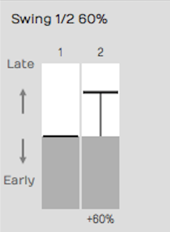

**Swing 1/2 60*% Template Example*

The example in the figure shown above is the setup for a basic swing
beat, with each 'and' eighth-note delayed. You can adjust the intensity
of the swing feel by how much delay you put on the eighth notes.

## Complex Groove Templates

Since you can create groove templates with as many steps as you want,
you can dial in exactly the feel you want. For example if you want to
vary the swing within the bar of music, you could create a template with
eight notes with each swing element slightly different.

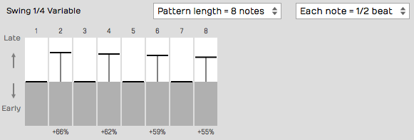

*Groove Template with Variable Swing*

Alternatively, you can create a groove that pushes the timing over two
bars, which will give excitement and tension like the FastSlow2 preset.

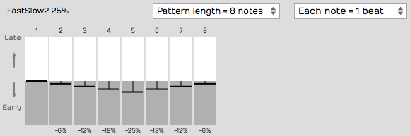

*FastSlow2 Groove Template*

> 💡 **Tip:** It can also be useful to create a 'No Groove' template to help
you remove the effect of groove. This is particularly useful when
applying groove templates to Step clips; more on that in the next
chapter!

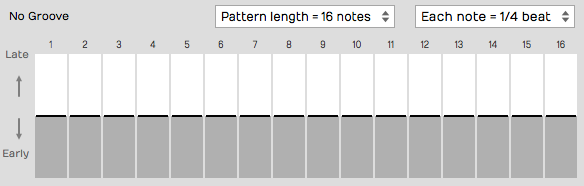

*Creating a 'No Groove' Template*

## Managing Groove Templates

Waveform gives you all the tools you need to create new groove
templates, rename them, and import and export them. Exported templates
have the `.trkgroove` file extension. This allows you to share them with
other Waveform users or installations.

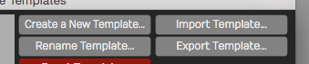

*Create, Rename, Import, or Export Groove Templates*

While editing a groove template, you may reset it. This removes the
late/early timing for the pattern, but doesn't change the length or note
division settings.

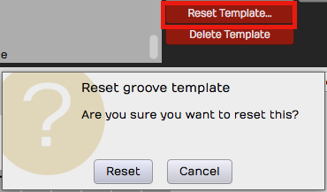

*Resetting a Groove Template*

Any groove template that you don't need, you can delete using *Delete
Template*.

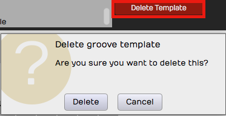

*Deleting a Groove Template*

## Moving On

You should now have a pretty good understanding of MIDI, MIDI recording,
MIDI editing, and even quantizing with MIDI. But there is one more
thing: Step clips. And that is up next!

