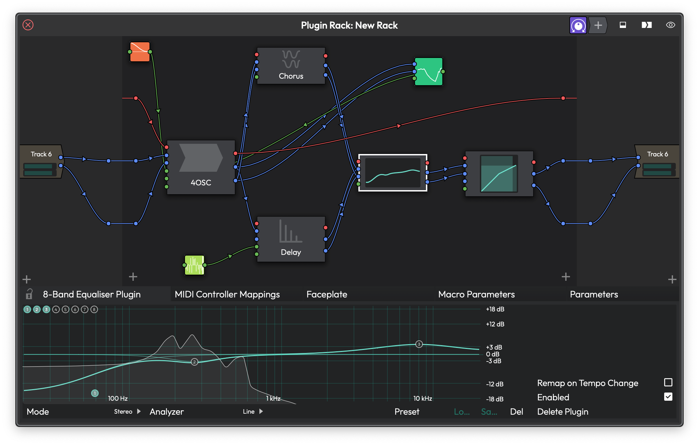

# Plugin Racks

Plugin Racks let you group multiple plugins inside a single container and wire them up however you like. If you have ever wanted to run effects in parallel, create a shared reverb bus, set up side-chain processing, or build a multi-channel effects unit, racks are how you do it.

*The Rack Editor showing a 4OSC synth routed through multiple effects in parallel, with a Step Modifier controlling parameters. The detail panel at the bottom shows the modifier's settings and its parameter assignments.*

## What Are Racks?

Instead of being limited to a simple linear chain of effects on a track, a rack gives you a 2D canvas where you can connect plugins in series, in parallel, or in any combination. You can feed one plugin's output into two others, mix signals back together, route side-chains between tracks, and more.

The key idea is the separation between the **Rack Type** and the **Rack Instance**.

The **Rack Type** is the definition -- it holds the actual plugins and all the connections between them. Think of it as the blueprint.

A **Rack Instance** is what you place on a track to use that rack. It is the bridge between your track's audio and the rack's processing. You can place multiple instances of the same rack on different tracks, and they all share the same plugin graph. Each instance just picks which of the rack's inputs and outputs it connects to, and can set its own levels and wet/dry mix independently.

This is particularly useful for things like multi-channel processing, shared reverb buses, or any scenario where you want several tracks feeding into the same set of effects without duplicating plugins.

## Creating a New Rack

There are several ways to create a rack, depending on your starting point.

### From Scratch

1. Open the **Plugin Browser**.
2. Find the **Plugin Racks** category.
3. Drag **Create New Empty Rack** onto a track's plugin area.

This creates a new empty Rack Type with a default stereo input pair (left and right), a MIDI input, and matching outputs. A Rack Instance is automatically placed on the track you dropped it onto.

### From a Preset

1. Open the **Plugin Browser**.
2. Look under **Plugin Racks > New from preset**.
3. Drag the preset onto a track.

This creates a new Rack Type pre-loaded with the preset's plugins and connections. Waveform ships with a few built-in rack presets, and any racks you have saved as presets will also appear here.

### By Wrapping Existing Plugins

If you already have plugins on a track that you would like to move inside a rack:

1. Select one or more plugins on a track's plugin chain.
2. Right-click and choose **Wrap this plugin in a new rack plugin** (or **Wrap these plugins in a new rack plugin** if you selected multiple).

Waveform creates a new rack, moves the selected plugins inside it, and automatically wires everything up to match the original signal flow. I find this the most natural way to create racks -- start with a working chain, then wrap it when you need more flexibility.

### Multi-Out Racks

For plugins with more than two outputs (like multi-output drum samplers or orchestral instruments):

1. Right-click the plugin on a track.
2. Choose **Create a multi-out Rack for this plugin**.

This creates a rack with enough output channels for all the plugin's outputs and places Rack Instances on sequential tracks below, one for each stereo pair. It is a quick way to set up multi-output routing without manually configuring everything.

> 💡 **Tip:** You can also import rack configurations by dragging .trkpreset files directly onto the main window or a track.

## The Rack Editor Views

Racks offer multiple ways to view and edit their contents. You can switch between them at any time using the view button (the eye icon) in the editor window's title bar.

### Rack Editor -- The Graphical Node View

This is the default view and the most flexible. It presents the rack as a 2D canvas where plugins appear as rectangular nodes and connections appear as curved lines between them.

The layout, from left to right:

- **Input panel** -- shows how each Rack Instance (each track using this rack) maps to the rack's input channels. Each track entry has level sliders for adjusting the input gain.
- **Central canvas** -- the main area where plugins live as draggable nodes with connection points (called nodules) on their left and right edges.
- **Output panel** -- the mirror of the input panel, showing output mappings and levels.

The title bar has toggle buttons for showing or hiding the I/O panels and a detail panel that appears at the bottom for inspecting the currently selected element.

### Stack Editor -- The Linear View

The **Stack Editor** presents plugins in a vertical list, one on top of another, like a traditional effects chain. This view works best when your rack's plugins are connected in a simple series -- one feeding into the next.

You can drag plugins up and down to reorder them, and the rack automatically rewires the connections to match the new order. Each plugin in the stack can be expanded to show its controls or minimized down to just its name bar.

> 📝 **Note:** If the rack has routing that is not a simple series chain -- for example, parallel connections or disconnected plugins -- the Stack Editor shows a warning triangle. In this case, automatic connection management will not work, and the stacked order may not reflect the actual signal flow.

I usually start with the Rack Editor for initial setup and wiring, then switch to the Stack Editor for day-to-day tweaking once everything is connected.

### Faceplate View

When available, the **Faceplate** view shows a custom parameter control surface for the rack. This provides a more streamlined, performance-oriented interface compared to the full editor views.

> 📝 **Note:** The Faceplate view and the Faceplate editor (in the property panel) are available in Waveform Pro.

### Default Plugin View

You can designate any single plugin inside the rack as the "default plugin." When you switch to this view, the rack window shows that plugin's native UI directly, as if you had opened the plugin on its own.

This is handy when your rack wraps a single main plugin with some auxiliary processing around it and you mostly just want quick access to the main plugin's controls.

To set or change the default plugin, use the view menu (eye icon) and look for the **Set default plugin** submenu. You will see a list of all plugins inside the rack -- select the one you want.

## Working with Connections

Connections are the heart of a rack. Each connection links an output pin on one element to an input pin on another.

### Connection Types

There are three types of connections, each drawn in a different color:

- **Audio connections** -- carry the audio signal between plugins or between the rack's I/O and plugins. These are the most common.
- **MIDI connections** -- route MIDI data. MIDI always uses pin 0.
- **Modifier connections** -- link modifiers (like LFOs or envelope followers) to plugin parameters for modulation. These appear in a distinct color to help you tell them apart from audio and MIDI wiring.

### Making Connections

To create a connection, click and drag from a nodule (the small circle on the edge of a plugin node) to another compatible nodule. Audio outputs connect to audio inputs, MIDI to MIDI, and so on.

To delete a connection, drag it away from its endpoint and release into empty space.

> 💡 **Tip:** Right-click a plugin inside the rack editor to find **Connect to Rack inputs** and **Connect to Rack outputs** -- these auto-wire the plugin to the rack's I/O channels, saving you from connecting each pin manually.

### Side-Chain Routing

To set up a side-chain from another track:

1. Right-click an input nodule on a plugin inside the rack.
2. Choose **Use this input as a side-chain from:** in the menu.
3. Select the track and channel (left or right) you want to feed in.

This lets you route audio from any audio or submix folder track in your edit into a specific plugin input within the rack. Waveform automatically creates a Rack Instance on the source track and wires up the appropriate channels for you.

### Bulk Wiring Operations

For complex racks, the right-click context menu on the editor background (or the property panel buttons when the Rack Type is selected) provides several time-saving operations:

- **Clear all wiring** -- removes every connection in the rack.
- **Clear all plugin wiring** -- removes only connections between plugins, leaving the rack's input and output mappings intact.
- **Clear all input wiring** / **Clear all output wiring** -- removes connections to or from the rack's I/O channels specifically.
- **Connect inputs sequentially** / **Connect outputs sequentially** -- auto-maps multiple rack instances to sequential channels. Handy when you are using a rack with many I/O channels spread across several tracks.

## Managing Input and Output Channels

Every rack starts with a default set of channels: a MIDI channel plus a stereo audio pair (left and right) for both inputs and outputs.

You can add more channels -- up to a maximum of 64 audio channels on each side. This is useful for multi-channel processing or for creating racks that accept side-chain inputs from other tracks.

To manage channels, right-click the rack editor background or use the buttons in the Rack Type's property panel. From there you can:

- **New Input Channel** / **New Output Channel** -- adds a named channel. You will be prompted to enter a name.
- **Rename Input** / **Rename Output** -- changes the channel name that appears in routing menus.
- **Delete Input** / **Delete Output** -- removes a channel and any connections to it.

> 📝 **Note:** Channel names are what you will see in the Rack Instance routing dropdowns on each track, so give them meaningful names -- "Kick Sidechain" is a lot more helpful than "Input 3."

## Adding Plugins Inside a Rack

There are a few ways to get plugins into a rack:

- **Drag from the Plugin Browser** onto the rack editor canvas or stack editor list.
- **Drag from a track's plugin chain** into the rack editor -- the plugin moves into the rack.
- **Right-click the editor background** and choose **Add plugin** to open the plugin selection menu.
- **Paste from the clipboard** if you have copied a plugin.

When you add the very first plugin to an empty rack, you will be asked: **"Do you want to auto-connect this plugin?"** Choosing yes automatically wires the rack's inputs to the plugin's inputs and the plugin's outputs to the rack's outputs, including MIDI. For a single-plugin rack, this is exactly what you want.

> 📝 **Note:** Not every plugin type can go inside a rack. Most notably, you cannot nest racks -- a Rack Instance cannot be placed inside another rack.

## Modifiers Inside Racks

Racks can contain **Modifiers** -- LFOs, envelope followers, random generators, step sequencers, breakpoint oscillators, and MIDI trackers. These are modulation sources that can automatically vary plugin parameters over time.

You add a modifier by dragging from the **New Modifier Generator** button in the rack editor's title bar onto the canvas.

Once placed, a modifier shows up as a draggable node with its own connection points. You connect a modifier's output to a plugin parameter by dragging from the modifier's output nodule to a parameter input on any plugin in the rack. Modifier connections appear as distinct colored curves to help distinguish them from audio and MIDI wiring.

To assign a modifier to a new parameter, drag to the **New modifier assignment** input on any plugin, which opens a parameter picker where you can search and select the parameter you want to modulate.

When you select a modifier in the rack editor, a detail panel appears at the bottom showing the modifier's settings on the left, a visual display of its parameters in the center, and its current assignments on the right (as shown in the screenshot above).

## Macro Parameters

**Macro Parameters** let you expose a set of hand-picked controls for a rack, so you can adjust multiple plugin parameters from a single knob or slider. This is especially useful when you want to simplify a complex rack down to a few key controls.

To set up macros, select the Rack Type in the editor and look for the **Macro Parameters** tab in the property panel. From there you can create new macros, name them, and assign each macro to one or more parameters from any plugin inside the rack.

> 📝 **Note:** Macro Parameters are available in Waveform Pro.

## Rack Instance Controls

When you select a Rack Instance on a track's plugin chain, the inspector panel shows its routing and level controls.

### Routing

**Left input goes to** -- Which of the rack's named input channels this track's left channel feeds into. (Default: first audio input)

**Right input goes to** -- Same, for the right channel. (Default: second audio input)

**Left output comes from** -- Which of the rack's named output channels feeds back into this track's left channel. (Default: first audio output)

**Right output comes from** -- Same, for the right channel. (Default: second audio output)

You can set any of these to "none" to disconnect a channel entirely.

### Levels

**Wet level** -- How much of the processed (rack output) signal comes through. (Default: 1.0 / full)

**Dry level** -- How much of the original unprocessed signal passes through. (Default: 0.0 / silent)

**Left input level** / **Right input level** -- Attenuate or boost the signal going into the rack, from -100 dB to +12 dB. (Default: 0 dB)

**Left output level** / **Right output level** -- Control the signal coming back from the rack, same range. (Default: 0 dB)

**Link inputs** -- When enabled, the left and right input levels move together. (Default: off)

**Link outputs** -- When enabled, the left and right output levels move together. (Default: off)

All of these parameters are fully automatable.

### Other Controls

**Rack name** -- Editable field that renames the Rack Type itself (affects all instances).

**Open window** -- Buttons to open the rack editor in each available view type.

**MIDI Controller Mappings** -- A property page where you can map MIDI controllers to the rack instance's parameters.

## Unwrapping a Rack

If you decide you no longer need the rack structure and just want the plugins back on your track as a normal chain:

1. Right-click the Rack Instance on the track's plugin chain.
2. Choose **Replace rack with plugins**.

This extracts all plugins from the rack (ordered by their left-to-right position on the rack editor canvas), inserts them sequentially into the track's plugin chain, and removes the Rack Instance. If this was the last instance of that Rack Type in the edit, Waveform asks whether you would like to remove the now-unused Rack Type as well.

You can also select individual plugins within the rack from the right-click menu using **Select one of the plugins in this rack**, which is helpful for quickly jumping to a specific plugin's settings.

## Presets

Rack configurations can be saved as presets and reloaded later. When you save, the entire rack state is captured -- all plugins, their settings, positions, and connections.

To save a rack as a preset, use the save option in the Rack Type's property panel. You will be prompted to give it a name and optionally add tags.

Saved presets appear in the Plugin Browser under **Plugin Racks > New from preset**. Loading a preset creates a new Rack Type in the current edit.

You can also duplicate an existing rack from the property panel, which creates a complete independent copy of the Rack Type with all its plugins and connections.

> ⚠️ **Warning:** Presets that contain modifier or macro assignments cannot be applied to an existing rack. If you try, you will see a message asking you to create a new rack from the preset instead. This is because modifier connections reference internal identifiers that cannot be reliably remapped onto an existing rack.

## ⚡ Things to Watch Out For

- **Racks cannot be nested.** You cannot add a Rack Instance inside another rack.

- **Maximum 64 audio channels.** This limit applies to both inputs and outputs on a single Rack Type.

- **Shared state with multiple instances.** Because all instances of a rack share the same Rack Type, any changes you make to the plugins or connections inside the rack affect every track using it. The only things that are per-instance are the I/O routing, levels, and wet/dry mix.

- **The Stack Editor assumes series wiring.** If your rack has parallel connections, the Stack Editor will show a warning and will not automatically manage connections when you reorder plugins. Switch to the full Rack Editor for complex routing.

- **Removing the last instance prompts for cleanup.** When you remove the last Rack Instance of a type from your edit, Waveform asks whether you would also like to delete the Rack Type itself. If you say no, the Rack Type remains in your edit but will not be actively used -- you can still create new instances of it later from the Rack Type's property panel by dragging the "Drag here to insert an instance of this rack" area onto a track.

- **Deleting a Rack Type is permanent.** When you delete a Rack Type from its property panel, all instances of that rack are also removed from every track in the edit. This action cannot be undone.

- **Side-chain routing is per-plugin-input.** You set up side-chains on individual input nodules within the rack, not on the rack as a whole. Waveform creates the necessary Rack Instance on the source track automatically.

- **Faceplates and Macros require Waveform Pro.** These features are not available in Waveform Free or OEM editions.

## Moving On

Racks give you a flexible way to build complex signal processing chains that go beyond what a simple linear plugin order can achieve. For more on how audio routing works across your project, see the Routing chapter. For details on the individual plugins you can use inside racks, see the Plugins chapter.
