# Recording Audio

Now it's time to learn how to record your own instrument or vocal tracks
into Waveform. First, you will learn how to configure track inputs for
recording. Next, you will learn how to use Waveform's built-in metronome
to provide a reference click, in order to to keep your recordings in
time.

## Configure the Input

We covered audio device setup back in [Audio Device
Setup](audio-device-setup.md). Refer back that chapter if you have any questions
about setting up your audio interface.

As a reminder, before recording with Waveform you need to use the
*Auto-Detect* feature to establish proper recording sync between
playback tracks and newly recorded tracks. This essential step,
calibrates the timing offset so that system latency doesn't throw off
the timing of your overdubs. Re-run *Auto-Detect* test anytime you
change your interface hardware or buffer setting. The [Auto-Detect
procedure] is explained in detail in Chapter 4.

> ⚠️ **Warning:** To configure Waveform for recording you must use the
Auto-Detect feature along with a hardware loopback. If you don't then
your overdubbed tracks will not be in sync with existing tracks. While
this is not difficult, it is essential to do this manual step anytime
you change the Audio Device Setup.

## The Input Object

At the far left of every track, you will find the input section. Each
track has an input object that looks like a rectangular arrow pointing
right.

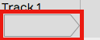

*Track Input Object*

> 💡 **Tip:** If you don't see the input objects, click the *Show/Hide
Inputs* (Shift + F12) button at the top right corner of the Edit tab.

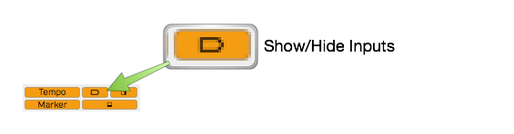

*Show/Hide Inputs Button*

Click on an input object to see a menu of options. From the menu, select
which hardware input to use for recording to this track. You can set it
to *No input* or select any input from your audio interface. In this
case it's set to *Input 1.*

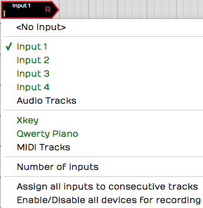

*Input Menu*

When you select an input, the input object shows the input name, a
real-time input meter, and the record arm "R" button. Also, a full set
of input properties appears in the Actions panel.

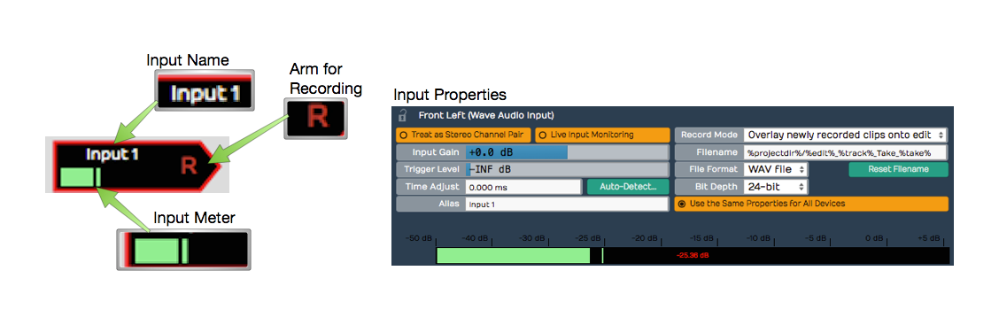

*Input Controls & properties*

## Customizing Input Names Globally

If you are happy with the default input names that's great, however, you
can customize them with friendlier names using the *Alias* property.

To change your hardware input alias names globally, go the Settings tab,
Audio Devices page. Select an input in the *Channels* list and edit the
*Alias* name in properties.

## Customizing Input Names for an Edit

There is another way to rename inputs, but only for the current Edit. In
the Edit, select an input and notice the *Alias* name in the Actions panel.
Change this to customize the input name for that particular
song. As an example, you could use this to indicate the microphone used
in the session.

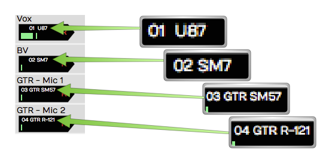

*Customized Input Names Using the Alias Property*

## About MIDI Inputs

Notice that on the input menu, you can choose MIDI interface inputs.
There's really no difference between an audio and a MIDI track. A track
can contain Audio clips or MIDI clips. You just need to set the input
appropriately and insert the correct kind of plugins.

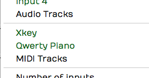

*MIDI Devices on the Inputs Menu*

In essence a track behaves like an audio track if you set an audio
input; it works like a MIDI track if you set a MIDI input and insert a
virtual instrument plugin.

## Setting Up Inputs for Multi-track Recording

It's very convenient to assign all inputs to consecutive tracks using
*Assign all inputs to consecutive tracks* from the inputs menu. It does
exactly what the name says, allowing you to quickly set up for
multi-track recording. This is great if you're setting up to record a
live performance through a digital mixer with a lot of inputs.

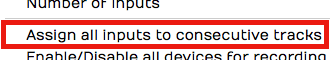

**Assign All Inputs* from the Input Menu*

## Number of Inputs

This feature is something uniquely Waveform. You can set up more than
one input on a single track, up to four inputs assigned to a track.

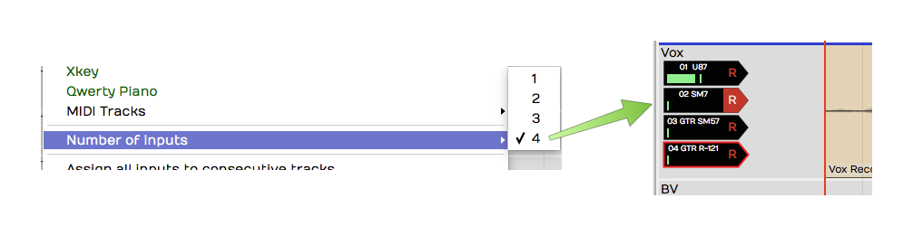

*Assign up to Four Inputs to One Track!*

Now, if you record with more than one input armed, you will get a
separate clip for each. This results in stack of audio clips.

A good use of this feature is to have several recording chains
configured and ready to go, when auditioning microphones and preamps.
Simply arm the input you want to try and away you go. It makes it super
efficient to switch to a different mic/preamp combination by simply
arming the desired input.

## Enable a Track for Recording

To enable (arm) a track for recording, click the *R* symbol on the input
object. The R illuminates to indicate that the track has been armed for
recording.

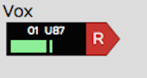

*Input Armed for Recording*

Test the input signal. If you're using a microphone or a guitar, play a
note or have the singer sing something. You should see the meter moving
on the input while testing. If not, check your input level on the
hardware and make sure phantom power is on if necessary for the mic.

> 💡 **Tip:** Once recording has started you can still click *R* to enable
and disable recording on the fly. This allows you to do manual punch-in
and punch-out style recording. Here is a video that explains [Punch
In/Out on the Fly.](https://w-edstrom.wistia.com/medias/wgjyszl1i6)

## Hit Record

With the input setup done, recording is a matter of clicking *Record*
(R) on the Transport. While recording, Waveform draws the waveform on
the track. To stop recording press Spacebar.

Recording always starts at the cursor position. There are several ways
and options to stop recording which will be explained in a bit.

## Enable Recording for All Inputs at Once

If you are doing multitrack recording with many inputs you can arm all
the tracks at once from the input menu using the option *Enable/Disable
all devices for recording* (Cmd + R / Ctrl + R). You can even use this
on the fly during recording to start and stop recording without stopping
the transport.

## Input Meters

Click on an input to select it. Notice the large meter in the Actions
panel. This gives you a good reference for setting up the input level.

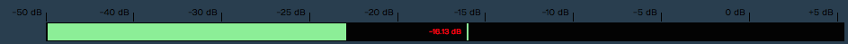

*Large input meter in the Actions panel*

> 💡 **Tip:** As a rule of thumb, you want to set input level to hover around
the middle of the range shown on this meter. The input level is adjusted
using the gain controls on your audio interface or preamp.

If you're doing multi-track recording and you want to see large meters
for all the tracks at once, press F12. Waveform will go into "big
meters" mode. This superimposes a very large meter onto each track.

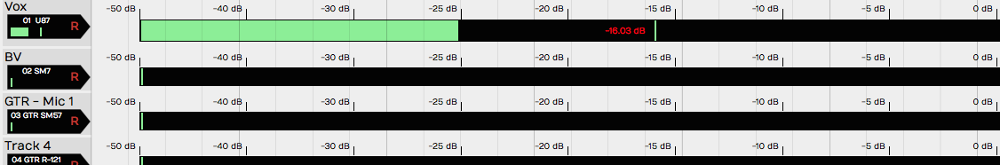

*Big Meters Mode*

> 📝 **Note:** The big meters obscure your view of clips on the tracks, so
you will want to toggle it off (F12) when not recording.

## Dragging the Input Object Track to Track

Here's a unique aspect of the input objects. You can drag the input
object from track to track. For example, say you recorded something on
track one, and now you want to record something else using the same
microphone onto track two. Simply, grab the input object and drag it
from track one to track two. The set up is done instantly.

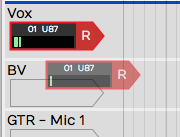

*Dragging and Input to other Track*

> 📝 **Note:** Dragging the input track to track is a really useful function
in Waveform. Once you start using this feature you will miss it when you
record with any other DAW!

## Renaming a Track

To rename a track, click directly on the track name, then edit the
*Name* property in the Actions panel. A really quick way to do this
is to click *Name*, press Tab, and start typing. As soon as you tab off
the *Name* property or click elsewhere in Waveform, the new track name
will be set.

## Recording Steps in Review

Here is a review of all the steps needed to test your recording setup:

1.  Arm the track or tracks for recording by clicking 'R' on the track
    input.
2.  Make sure *Loop* is turned off in the transport bar.

> 📝 **Note:** Waveform supports loop recording but we'll get into that in a
later chapter.

1.  Make sure the cursor is rewound to beginning by clicking
    *Return-to-zero* (Home) in the transport bar.
2.  Verify that *Click* (C) is turned off (for now) in the transport
    bar.
3.  Click *Record* (R) in the transport bar. Play something into the
    input using your instrument or your voice depending on the kind of
    input selected.

> 📝 **Note:** As you record, you'll see the meters and you'll also see the
waveform start to draw on the Audio clip.

1.  Press Spacebar to stop recording.
2.  To hear what you recorded, click rewind then press Spacebar to play.
    You should be able to hear what you just recorded.

> 💡 **Tip:** If your recorded take just isn't really going well, you can
press *Abort* or *Abort & Restart* on the transport. These options only
appear during recording.

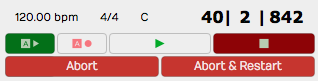

**Abort* and *Abort & Restart* During Recording*

## Working with the Click

While recording, it's often very helpful to have an audible timing
reference. Waveform has a built-in metronome that offers a steady click
for just this purpose.

## Enabling the Click Track

To enable the metronome click, turn on *Click* (C) in the Master
section. That turns it on but the setup is in the *Click Track* Menu.
Here are explanations for the options:

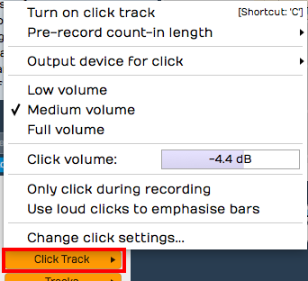

*Click Settings*

Enable Click
- Another way to enable or disable click is to open the *Click Track*
    menu and select *Turn on click track* or *Turn off click track*.
    That does the very same thing as pressing C or clicking the *Click*
    button in the transport bar.

Click Volume
- Adjust the volume of the click using the *Click Track > Volume
    slider*. There are also *Low volume* (-14dB) , *Medium volume*
    (-4.4dB), and *Full volume* (0dB) presets available.

> 📝 **Note:** Curiously, *Full volume* is not actually full. The Volume
slider goes to +3db. That's three more than *Full volume* if you are
keeping score.

Count-in
- While recording, you can have the click start a bit before the
    cursor position. This gives you time to get into the groove before
    performing. Enable the count-in from *Click Track > Pre-record
    count-in length*. Select from *none*, *one bar*, *two bar*, or *two
    beats* for the count-in length.

With count-in enabled, you will hear the click during recording. If the
cursor is at the beginning of the Edit, you will hear the count-in then
the cursor will start moving. If the cursor is not at the start, it will
actually jump back by the count-in length and play from there.

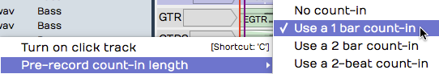

*Count-in Options*

Click During Playback
- If you want to hear the click during playback, make sure to leave
    *Click Track > Only click during recording* disabled.

Emphasize Bars
- To clearly hear the downbeat of each bar, enable *Click Track > Use
    loud clicks to emphasize bars*. With that enabled, Waveform uses a
    different sound for the first beat of each bar.

Click Sound
- To change what sounds are used for the click, select *Click Track >
    Change Click Settings*. This opens the *Click Track Settings* dialog
    box. From here, you can change the samples used to make the click
    sound. Just select the audio files for the normal and emphasized
    beats. If you leave the *File* properties blank, you will get the
    default sounds.

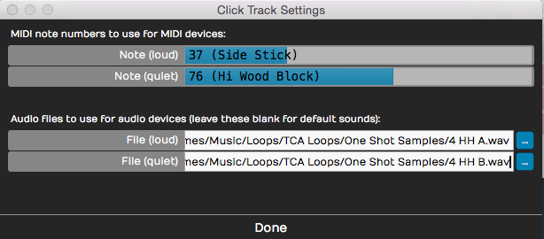

*Configuring the Click Sound*

Not too many people still do this, but it's possible to use an external
MIDI sound module for your click sound. If you are inclined to do that,
you can set the MIDI note numbers in the *Click Track Settings* dialog
box.

Click Output Device
- If you want to redirect your click so it's not coming through your
    main speakers, look at the click output device options (*Click Track
    > Output device for click*). Normally and by default this is set to
    *Default audio output*. You can pick any audio output on your system
    or even any MIDI output. If you select a MIDI output, it should be a
    sound module of some sort. When using MIDI for the click, you can
    set the click sound note numbers as explained in the previous
    section.

Using a click is an essential reference tool for studio recording, so it
is great to have a synchronized click built-in and ready to go.

## Listening on Headphones While Recording

Ideally, you will monitor what you're recording through headphones, and
set up the level and mix on your audio interface outside of Waveform.
Most audio interfaces give you the ability to mix your live input with
the playback from previous tracks. You use the mixer on the audio
interface to balance the live input sound with the sound being played
back by Waveform.

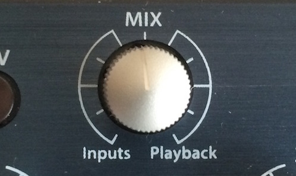

*Audio Interface Mix Knob*

Simple audio interfaces have a mix knob that allows you to mix between
the inputs (your mic) and playback (previously recorded tracks). For
example, when recording a vocal leave the mix knob just about in the
middle. Half of what you hear is the live input off your mic, the other
half is what's being played back from Waveform.

Some audio interfaces do not have a specific knob on the front panel to
control the mixer level, and instead have an application that you run
alongside Waveform that features a virtual mixer. These applications
allow you to set up the monitor mix in your headphones separately from
what's happening in the recording software.

## Live Input Monitoring

There are situations where you need to use live input monitoring through
Waveform, rather than through your interface. The two main use cases for
that that are when playing through virtual instruments, or virtual
guitar amps while recording. We will cover the details later in the
book, but here are a few points for those curious about such things.

Step 1. Disable Hardware Monitoring
- To try live monitoring through Waveform, first set up a track and
    arm it for recording. Now, play something into the input using a
    mic, guitar, or other instrument. At this point you shouldn't really
    hear anything through Waveform to your headphones or speakers.

Step 2. Enable Live Input Monitor
- Now make sure the input is selected and look for the *Live Input
    Monitoring* option in properties. Click to enable it. You should
    hear the input going through Waveform and back out to your speakers
    (or headphones).

The downside is latency. You might possibly notice a delay between when
you play a note and when you hear it. It's a time lag between you sing
and when you hear it in your headphones. At high buffer settings it will
sound like an annoying delay slap or echo. At lower buffer settings it
might sound like a hollowness if you are singing with headphones on.
When playing an instrument, you might not hear any problem at all.

To really hear the effect of latency, try turning the buffer size up to
1024 or even more. Then as you play you'll hear a noticeable delay
between when you sing, speak or play a note and when you hear it.

> 📝 **Note:** Latency delay is more of a problem for singers than it is for
somebody playing guitar or another instrument. The sound of your voice
is coupled through your skull right into your ear with zero latency.
When combined with your voice slightly delayed through the interface and
software the result might seem hollow or "phasey." This won't be
recorded, but might throw you off during recording.

Why then would you ever use live input monitoring? You need it for
guitar amp simulators and for virtual instruments. For normal vocal and
instrument recording, it may be preferable to use your audio interface
to provide zero latency monitoring.

## If at First You Don't Succeed

With a track armed, hit *Record* and record away. Press *Record* a
second time (or Spacebar) to stop recording. If you don't like what
you've recorded select the Audio clip and press Delete or Backspace.
Rewind and try again! You can alternatively press *Undo* (Cmd + Z /
Ctrl + Z) to undo the last recording take.

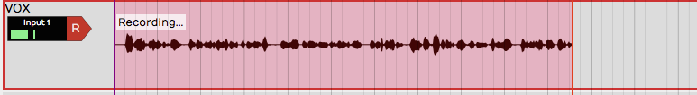

*Recording in Process*

## Abort Record and Delete the Take

If you are impatient to delete a failed recording take, then you will
love this feature: *Abort recording and delete the take.* With a single
keystroke you cancel the take, throw it out, rewind to the beginning,
and get set to try again. The *Abort* button on the transport does the
same thing.

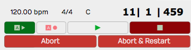

*Abort Buttons on the Transport During Recording*

There is a variation on this feature: *Abort recording, delete take, and
restart*. That does the same thing, but then drops right back into
recording. This action appears on the transport during recording as the
button \* \*.

## Recording a Stereo Signal

If you are recording a pair of microphones or a stereo source like a
keyboard, you can treat two adjacent inputs as a stereo pair. This is
done in the Settings tab, Audio Devices page. Click on an input then
enable *Treat as Stereo Pair* in properties.

Now instead of two inputs, you have one stereo input. This will appear
over in the Edit when you select inputs for a track. The pairs are
always created with the odd numbered input on the left and the even
numbered input on the right.

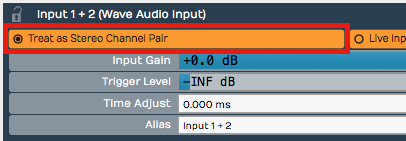

*Treat as Stereo Pair*

When you record from a stereo input, you'll wind up with a stereo clip
showing both the left and the right waveforms.

## Retrospective Record

You know how there are times where you wish you were recording because a
practice take was so amazing? Or maybe a singer sings a pickup just
before the downbeat. Waveform's "Retrospective Record" feature actually
keeps a recording buffer running for any track that has an input set up.

To enable this feature, from the Menu choose *Option > Retrospective*
record and select the buffer size. We find that the 30-second buffer is
usually enough to safe-guard against chopped off picks or endings. For
live shows or recording speeches, set it to 10 minutes.

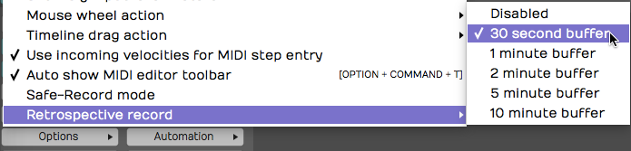

*Enabling Retrospective Record*

To recover lost audio, simply click the retrospective record icon in the
upper right corner of the Waveform window. The buffered audio will be
added as Audio clips to the appropriate tracks. If you click the icon
while the transport is still running, the audio will be synched to the
timeline. If you click the icon with the transport stopped, the audio
will be placed at the cursor. In that case you will need to manually
align the clip to the track.

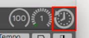

*Click Retrospective Record Icon*

Retrospective record doesn't consume much CPU and is a great safeguard
against losing important audio or a killer take.

## Safe-Record Mode

When recording shows, doing long recordings, or if you ever need to
leave your computer unattended while it's recording, consider enabling
Safe-Record (*Options > Safe-Record mode*).

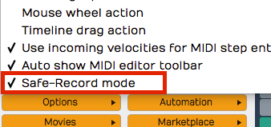

*Safe Record Mode*

In safe-record mode, you starting recording in the normal way. However,
as soon as recording starts, Waveform shows a the Safe Record modal
dialog box. You can't do anything in Waveform including stop the
recording without entering the four key shortcut.

Here is how to get out of safe-record mode:

OS X: Shift + Opt + Cmd + R Windows: Shift + Alt + Ctrl + R

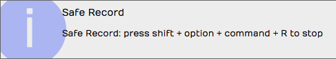

*How to Exit Safe Recording*

Those are the defaults, but you can change those to any other crazy key
combination you want.

## Moving On

That was a lot of information about recording audio in Waveform. In the
next chapter we will continue on with overdub recording.

