# Recording Overdubs

In this chapter we walk through an example of recording a simple song.
In the previous chapter, we explained how to use the *Click* feature to
hear a metronome tempo reference while recording. In this chapter we
will use a drum loop instead. Later you will learn the steps to overdub
guitars and bass, in order to create a simple tune.

> 💡 **Tip:** For overdub recording, you typically do all the recording
wearing headphones with your main speakers off. This prevents bleed from
one track to the next for cleaner mixing later on.

Here are the tracks we will have by the end of the chapter:

-   Track 1: Drum Loop
-   Track 2: Acoustic Guitar
-   Track 3: Acoustic Guitar - Double
-   Track 4: Bass

## Set up the Drum Loop

1.  First, set the desired tempo. Click on the tempo (e.g. 77 bpm) in
    the transport bar. Then edit the *BPM* value in the Actions panel and
    type in the tempo.

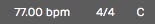

*Click BPM to Edit Tempo*

1.  Drag in a loop from the Browser, for example a two bar loop. This
    will create an Audio clip. The example shown uses Track 1 for the
    loop, which has been renamed to "DrumLoop."

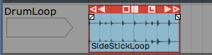

*Start With a 2-Bar Drum Loop*

> 💡 **Tip:** If the loop doesn't align to the bars correctly, hold Opt / Alt
and drag the right trim arrow until it does.

1.  Click the L icon on the Audio clip to convert it to looping mode.
    Now drag the right trim handle to roll out as many copies of the
    loop as you want.

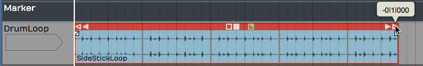

*Roll Out Repeats of the Drum Loop*

## Get Ready to Record

1.  Set up the input. In this example, the drum loop is on the first
    track, and the second track is used for recording the acoustic
    guitar rhythm part. We have selected *Input 1* where the mic is
    connected.

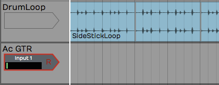

*Configure the Input*

1.  We won't use loop recording, so make sure the *Loop* button is
    turned off in the Transport section.
2.  Turn off *Click* because we are using the drum loop track for the
    timing reference.
3.  Let's use a two bar count-in. To set that up, select *Click Track >
    Prerecord count-in length > Use 2-bar count-in*.

## Record the Rhythm Guitar Part

1.  Use your audio interface mix knob or app to balance the level of the
    guitar mic with the level of the drum loop track. On the guitar mic
    input, make sure *Live Input Monitoring* is turned off.
2.  Next, arm the track for recording by clicking the R icon on the
    input. When you try this you will see the metering on the input
    moving if you play a chord.
3.  Test the input level by playing at the loudest level you plan to use
    for the track. Adjust the level using the gain control on the audio
    interface.
4.  Verify that the cursor is at the beginning of the edit. If not,
    press Home.
5.  Press *Record* (R) on the Transport to start recording. Now record a
    take of your song. At the end hit Spacebar to stop recording.

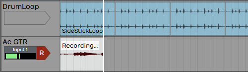

*Recording the Guitar Part*

> 💡 **Tip:** If recording doesn't go as planned, delete the Audio clip and
try again. We went over several ways to do this in Chapter 15.

> 📝 **Note:** If you hear some kind of weird phasing as you play your
instrument, then it probably means you have *Live Input Monitoring*
enabled while also monitoring through your audio interface. Disable
*Live Input Monitoring*.

## Doubling the Rhythm Guitar

1.  Following recording the initial rhythm guitar part, rewind and play
    it back. Use the Volume & Pan plugins in the mixer section to
    balance the signal with the drum loop.
2.  To double the rhythm guitar, drag the Input object to the the next
    track. Now track 3 is immediately ready to go for recording an
    overdub.

> 💡 **Tip:** You might want to lower the original track 3 to 6 dB using the
Volume & Pan plugin to better balance the recorded track with your live
mic.

1.  Rewind then click *Record* in the Transport.

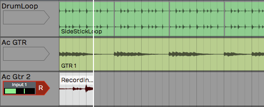

*Recording the Second Guitar Part*

1.  After recording, play back and balance the new recording with the
    original guitar track. To get a wide stereo effect from the doubled
    part, pan the tracks to opposite sides using the *Pan* slider from
    the Volume & Pan plugin.

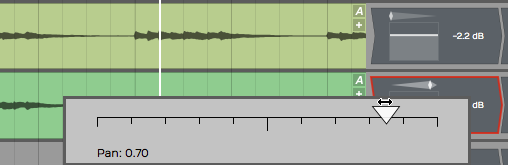

*Panning Guitar Parts Left and Right*

## Overdub a Bassline

You can record the bass by connecting it directly to the audio
interface; no amp, no mic.

**High Impedance Inputs**. Identify which input on your interface
supports a direct 1/4" high impedance input. This is often indicated by
the guitar, gtr, or hi-z. Sometime you need to engage a switch or button
for the high impedance mode. Your bass or electric guitar will sound
better if you have the hi-z mode enabled.

1.  Connect your bass to the interface using a normal 1/4" to 1/4"
    guitar cord.

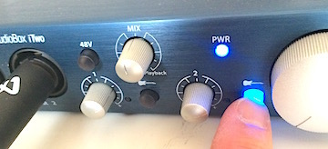

*Engage High Impedance Mode on Your Audio Interface*

1.  From this point, recording works exactly the same as with a mic.
    Select the correct input and adjust the input level. Make sure the
    bass has a good level but is not activating the clip LED on the
    interface using the gain knob on the audio interface.
2.  Arm the input for recording if it's not already. Adjust the levels
    of the existing tracks so that you can hear the the tracks. At the
    same time, you want to hear what you are playing on the bass.
3.  Rewind and hit *Record*. If if the take doesn't go well, stop, press
    *Undo* and try again.

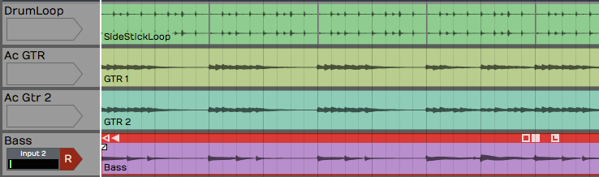

*Overedubbed Bass Line*

> 💡 **Tip:** If you get a good take but think you can do better, don't
delete the clip. You can drag the input to another track and try again.
Just mute the original track or clip so that you don't hear it while
recording the next take. The first take might wind up being the best
take!

## Rename Tracks

As you record overdubs, it's good idea to stay organized. One key is to
name the tracks appropriately. Click directly on the track name then
edit the *Name* property.

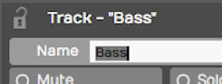

*Renaming a Track*

> 💡 **Tip:** It can get annoying when renaming several tracks. You keep
mousing between the track and the Actions panel. To avoid all the
extra mouse mileage, click the track name then press Tab. Tab puts the
focus directly on the *Name* property ready for typing.

## Adding Additional Tracks

If you get to this point and you do not have enough tracks in your
project, you can easily add tracks. There are several ways to do that.

1.  **Press T.** Select any existing track and press T. That creates a
    new track directly below the selected one.
2.  **Right-click**. Right-click in any blank space or on any track and
    select *Create new track*.
3.  **Track Menu**. Another way is to select *Tracks > Create a new
    track.* using the Tracks menu. Or, select *Tracks > Create several
    new tracks* to add up to sixteen new tracks in one go.

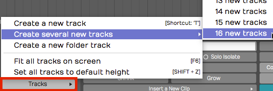

*Create Tracks from the Tracks Menu*

> 💡 **Tip:** Like most things in Waveform, you can undo creating tracks
using the *Undo* button (Cmd + Z / Ctrl + Z). To remove a track from
your project, select it and hit Delete or Backspace.

## Rearranging Tracks

To rearrange the tracks, drag the track from the track name area and
drop it in the new position. As you drag the track, a glowing bar will
appear between tracks showing you the target for your drop. When that
bar is in the right spot, let go of the drag and the track will be
repositioned.

## Adjust the Mix

At this point you can adjust the levels of all the recorded track or
continue to record and overdub vocals, keyboards, or other instruments.
As you add more tracks, you will need to reduce the level of each to
avoid overloading the master level.

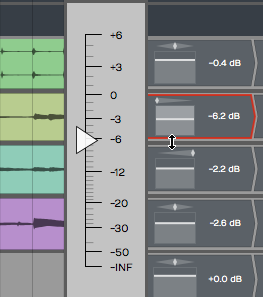

*Adjust the Mix*

> 💡 **Tip:** If you temporarily overload the master meter, you can reset the
overload indicators using the backslash key ( \\ ).

## Moving on

That was a walk-through of overdubbing. At this point, you should be
getting familiar with basic recording in Waveform and have a handle on
how to work with tracks in Waveform.

