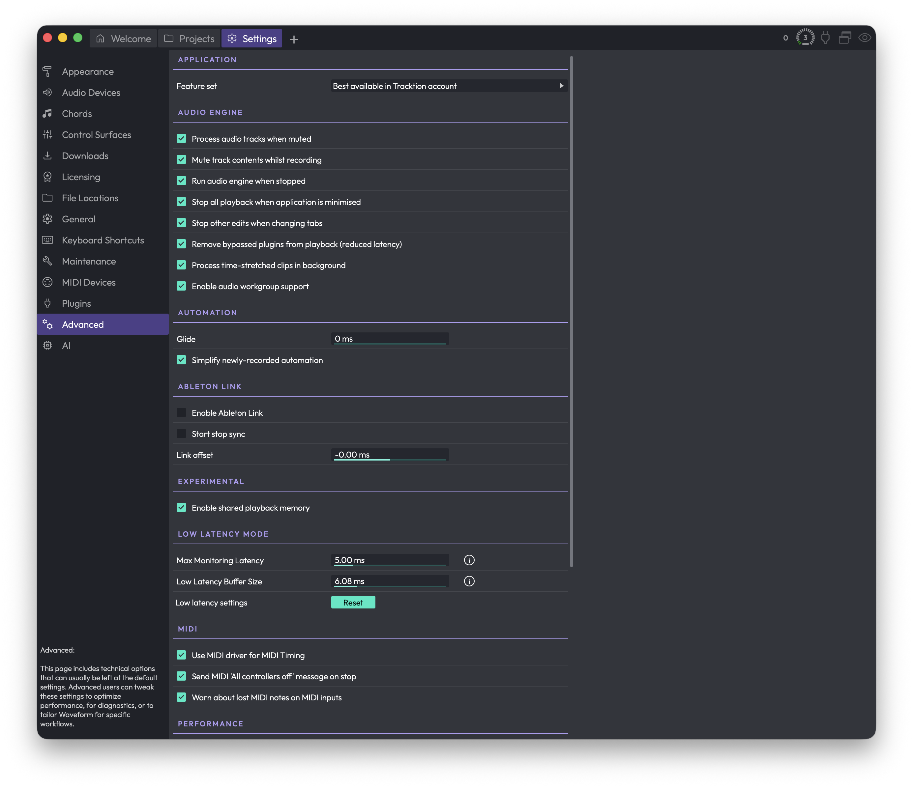

# Reference: Settings > Advanced

The **Advanced** page collects technical options that you can usually leave at their defaults. If you want to optimise performance, chase down a problem, or tailor Waveform to a specific workflow, this is where you do it. Most people never need to touch anything here.

*Settings > Advanced*

The page is divided into sections. Some controls only appear on certain platforms or when a particular feature is available in your edition, so your page may not show every item described below.

## Application

**Feature set** (Choices: Best available in Tracktion account, Pro, OEM, Free) — Forces Waveform to behave as a particular edition. Leave this on **Best available in Tracktion account** so you get every feature your account unlocks. The other choices exist mainly for testing, letting you preview a different edition without reinstalling or switching accounts. (Default: Best available in Tracktion account)

> 📝 **Note:** Changing the feature set only takes effect after you restart Waveform. You'll see a prompt reminding you to do so.

## Audio Engine

These options control how and when audio is processed.

**Process audio tracks when muted** — Keeps muted tracks running through the engine so they respond instantly when you unmute them. Turn this off to claw back some CPU, at the cost of a small delay when muting and unmuting.

**Mute track contents whilst recording** — Enables tape-style recording, where the clips on a track go silent while you're recording over them. This control only appears if your edition supports advanced record monitoring.

**Run audio engine when stopped** — Keeps the audio engine active even when transport is stopped. Best left on; it's mainly here for diagnostics.

**Stop all playback when application is minimised** — Pauses playback whenever you minimise Waveform. Turn this off if you want playback to continue while you switch to another app. (Default: enabled)

**Stop other edits when changing tabs** — When you switch tabs, any Edit you were playing in another tab stops. Leaving this on avoids the confusion of hearing a different Edit play in the background. (Default: enabled)

**Remove bypassed plugins from playback (reduced latency)** — Drops bypassed plugins out of the signal chain entirely instead of running them in a bypassed state. This can shave off a little latency. It may cause a brief hesitation in the interface when it kicks in.

**Process time-stretched clips in background** — Moves the work of time-stretching onto a background thread, which can reduce CPU load during playback.

**Enable audio workgroup support** (macOS only) — Uses macOS's Audio Workgroup system so Waveform's audio threads are scheduled more efficiently alongside the system's audio threads.

## Automation

**Glide** — The time over which newly recorded automation is cross-faded into any automation already on the track. It smooths the join between your new pass and the existing curve so you don't hear an abrupt jump or click. Set it to zero to apply no fade at all. (Range: 0–2000 ms. Default: 0 ms)

**Simplify newly-recorded automation** — Thins out recorded automation by removing redundant points, cleaning up the dense, jittery curves that a live hand tends to produce. Turn it off to keep every recorded point exactly as captured. (Default: enabled)

## Ableton Link

This section only appears when Ableton Link is available in your edition. Ableton Link keeps Waveform's tempo and playback position in sync with other Link-enabled apps and devices on the same network.

**Enable Ableton Link** — Shows the Ableton Link toggle so you can connect to a Link session. (Default: disabled)

**Start stop sync** — Synchronises starting and stopping the transport across all connected Link peers, so hitting play in one app starts the others too. (Default: disabled)

**Link offset** — A small timing offset, in milliseconds, to compensate for a driver that misreports its latency. Leave it at zero unless your Link timing is consistently early or late. (Default: 0.00 ms)

## Experimental

**Enable pooled memory** — Reduces memory use by pooling allocations during playback. This control only appears in debug builds, so most users will never see it.

**Enable shared playback memory** — Reduces memory use by reusing memory wherever possible during playback.

> 📝 **Note:** For background on how Waveform's audio engine handles delay compensation across plugins, racks and buses, see this video: [Waveform New Audio Engine](https://youtu.be/_VbPXJQMUjA).

## Low Latency Mode

These settings only have any effect once you actually engage low latency mode, which you do from the CPU usage window rather than from this page. Low latency mode temporarily reduces the delay between playing a software instrument and hearing it, by disabling high-latency plugins and shrinking the buffer.

**Max Monitoring Latency** — The most latency you'll tolerate through a record-enabled track in low latency mode. Waveform disables plugins, highest-latency first, until the track falls under this figure. (Range: 0–30 ms. Default: 5.00 ms)

**Low Latency Buffer Size** — The target audio buffer size to drop to while low latency mode is active. This is equivalent to temporarily lowering your audio buffer size; smaller buffers mean less delay but more CPU load and a greater risk of dropouts. (Range: 0–30 ms. Default: 5.80 ms)

> 💡 **Tip:** Click the small **i** icon next to *Max Monitoring Latency* or *Low Latency Buffer Size* for a full explanation of how low latency mode works. To actually switch low latency mode on, open the CPU usage window by clicking the CPU meter in the top-right corner of the Waveform window.

**Reset** — Resets all the low latency settings on this page back to their defaults. Waveform asks you to confirm first. (Label: Low latency settings)

## MIDI

**Use MIDI driver for MIDI Timing** — Uses your MIDI driver's timing for incoming MIDI rather than the system clock. This is usually the more accurate choice. If you hear timing jitter on incoming MIDI, try turning it off. (Default: enabled)

**Send MIDI 'All controllers off' message on stop** — Sends an all-controllers-off message to every MIDI device and plugin when playback stops, which helps avoid stuck notes. A few older devices react oddly to it. If something strange happens each time you stop, try turning it off. (Default: enabled)

**Warn about lost MIDI notes on MIDI inputs** — Shows a warning when MIDI notes arrive on an input that isn't routed to any track, so you can spot a misconfigured device. (Default: enabled)

## Performance

**CPU cores to use** — How many processor cores Waveform may use for audio. This control only appears if your machine has more than one core, and it ranges from one up to the number of cores available. Usually you'll want the maximum. Lower it if you're running other demanding software at the same time — for example, leaving a core or two free for screen recording or live streaming. (Default: maximum available)

> 📝 **Note:** On processors with simultaneous multithreading (Intel calls it Hyper-Threading), the reported maximum is doubled — a four-core chip will show up to eight. On macOS, if you've enabled audio workgroup support, the maximum may instead reflect the workgroup's thread count.

**Use 64-bit maths when mixing** — Adds track outputs together using 64-bit samples instead of 32-bit, which avoids a build-up of noise from rounding errors on Edits with many tracks. The difference is subtle and the extra cost is minimal on a modern computer. (Default: disabled)

**Use Realtime Priority Mode** (Windows only) — Makes Waveform run as a realtime-priority application so it takes precedence over everything else on the machine. With most modern audio drivers this isn't necessary and can actually make glitches worse, so leave it off unless you're troubleshooting playback problems. (Default: disabled)

**GUI Rendering Mode** — Sets the technology used to draw the interface, letting your computer use GPU acceleration for smoother, faster graphics. This control only appears on platforms that offer a choice of renderers, so macOS users won't see it. If you have a modern PC, it's worth trying the hardware-accelerated option.

## Plugin Processing

**Plugin scanning** — Chooses whether plugins are scanned in a **Separate process** or the **Main process**. Keep it on Separate process so a misbehaving plugin can't take Waveform down with it during a scan. Switch to Main process only as a troubleshooting step. (Default: Separate process)

**Number of simultaneous plugin scans** — How many plugins are scanned in parallel. This control only appears when plugin scanning is set to the Main process; with a separate process it's fixed at one. More parallel scans can speed up scanning but are mainly useful for diagnostics. (Default: 1)

**Reset to defaults** — Puts the plugin scanning options back to their defaults: a separate process, one scan at a time. (Label: Plugin scanning options)

## Source Files

**Audio clip import** (Choices: Ask if file should be copied into project, Always copy file into project, Only copy files from external drives into project) — Decides what happens when you bring an audio file into an Edit. **Always copy file into project** keeps everything in one place and is easiest to back up. **Ask** prompts you each time, which is flexible but can get repetitive. **Only copy files from external drives** copies files from USB, Thunderbolt or network drives while leaving local files where they are, saving disk space at the risk of breaking links if you later move a library. (Default: Ask if file should be copied into project)

**Renaming a clip also renames its source item** — When on, renaming a clip in the Edit also renames the matching entry in the project's item list. Most people leave this off. It's handy when you're labelling takes or authoring a loop library and want descriptive names in the item list. This change stays local to the project. (Default: disabled)

**Rename Mode** (Choices: Always rename source file, Only rename source file if it is in the project folder, Never rename source file) — Decides whether renaming a project item also renames the actual file on disk.

- **Always rename source file** renames the file wherever it lives. This is risky: if another project uses the same file, renaming it here breaks that project's link to it.
- **Only rename source file if it is in the project folder** only touches files that live inside the project folder, which is much safer.
- **Never rename source file** leaves files on disk untouched no matter what you rename in Waveform. This is the safest choice and the best one for most people.

(Default: Only rename source file if it is in the project folder)

> 📝 **Note:** "Source item" and "source file" are not the same thing. The source item is the name shown in the project's item list; the source file is the actual file on disk. A clip points at a source item, which in turn points at the file. These rename options control how far a rename travels along that chain.

## ⚡ Things to Watch Out For

- Changing the **Feature set** does nothing until you restart Waveform.
- **Low Latency Mode** settings on this page have no effect on their own — you switch the mode on from the CPU usage window (click the CPU meter, top-right).
- **Always rename source file** under Rename Mode can rename files that other projects depend on, breaking them. When in doubt, leave Rename Mode on Never rename source file.
- The **Only copy files from external drives** import option can leave an Edit pointing at files outside the project. If you later move or delete those files, the Edit loses them.
- Some controls here are platform-specific or edition-specific and simply won't appear if they don't apply to your setup.
