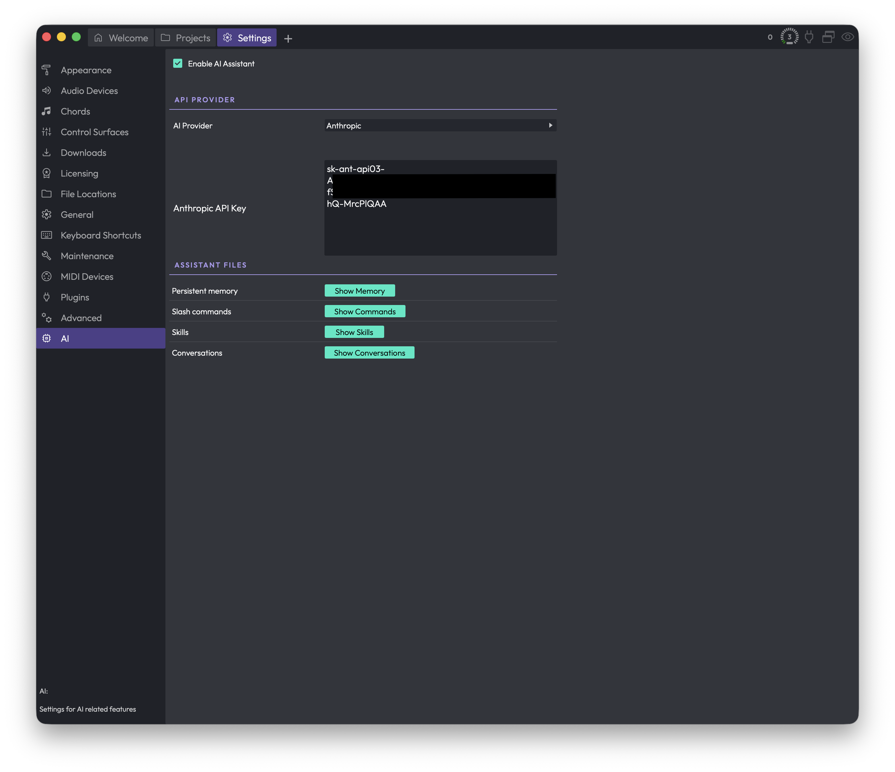

# Reference: Settings > AI

The AI page is where you switch on the AI Assistant, tell Waveform which AI provider to use, paste in the API key that lets the assistant talk to that provider, and reach the files the assistant uses to remember things and extend itself. If you never plan to use the assistant, you can leave this whole page alone. If you do, this is the one place you need to set up before it will work.

*Settings > AI*

To get here, open the **Settings** tab and choose **AI** from the list on the left.

## General

**Enable AI Assistant** — Turns the AI Assistant panel on or off in the sidebar. When this is on, the assistant becomes available as a sidebar panel where you can chat with it and ask it to help with your project. When it is off, the panel is hidden. (Default: on).

> 📝 **Note:** Even with the assistant enabled, it won't actually be able to respond until you have selected a provider and entered a valid API key (see below).

## API Provider

This section is where you choose the AI service the assistant talks to, and where you enter the key that authorises it.

**AI Provider** (Choices: OpenAI, Anthropic) — Picks which AI company's models power the assistant. (Default: OpenAI).

Changing this swaps the key field below it, because each provider needs its own key. Whichever provider you pick here is the one that will be used, and only the matching key field is shown.

Below the provider selector you'll see one of two key fields, depending on the provider you chose:

**OpenAI API Key** — The secret key from your OpenAI account. Shown only when the provider is set to OpenAI.

**Anthropic API Key** — The secret key from your Anthropic account. Shown only when the provider is set to Anthropic.

In the screenshot the provider is set to Anthropic, so the **Anthropic API Key** field is showing. The key is a long string you get from the provider's own website; you paste the whole thing into this multi-line box.

> 💡 **Tip:** You only ever need a key for the provider you've actually selected. If you switch providers, the page swaps to the other provider's key field, and any key you previously entered for the other provider is kept for when you switch back.

> ⚠️ **Warning:** Your API key is what your provider uses to bill you, so treat it like a password. Don't share screenshots of this page, and don't paste your key anywhere public.

## Assistant Files

The assistant keeps a few things on disk so it can remember details between sessions and so you can extend what it can do. The buttons in this section don't change any setting; each one simply opens a file or folder on your computer so you can look at it or edit it yourself.

**Show Memory** — Opens the assistant's persistent memory file. This is where the assistant stores notes it has chosen to keep across conversations, so it can remember context the next time you talk to it.

**Show Commands** — Opens the folder that holds your own custom slash commands. Anything you put here becomes a command the assistant can run.

**Show Skills** — Opens the folder that holds your own custom skills, which are reusable abilities you can give the assistant.

**Show Conversations** — Opens the folder where your saved assistant conversations are kept, so you can browse, back up, or revisit past chats.

> 💡 **Tip:** These buttons are handy when you want to inspect or hand-edit what the assistant remembers, or when you want to add your own commands and skills rather than relying only on the built-in ones.

## ⚡ Things to Watch Out For

- **The assistant needs both a provider and a matching key.** Enabling the assistant on its own isn't enough. Choose a provider in this section and paste in that provider's key, or the assistant won't be able to respond.

- **Each provider has its own separate key.** A key entered for OpenAI won't work for Anthropic, and vice versa. When you switch the **AI Provider**, the page shows the key field for the newly selected provider only.

- **Switching providers takes effect for the matching key only.** The provider you leave selected here is the one that's actually used. Make sure the provider showing on screen is the one you intend to use, and that its key field is filled in.

- **The Assistant Files buttons open things, they don't reset them.** Clicking **Show Memory**, **Show Commands**, **Show Skills**, or **Show Conversations** just reveals the file or folder on your computer. Editing or deleting what you find there changes what the assistant remembers or can do, so be deliberate about any changes you make.
