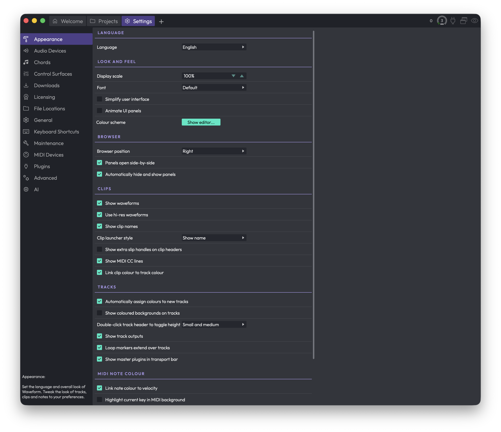

# Reference: Settings > Appearance

The Appearance page is where you set the language and overall look of Waveform, then fine-tune how tracks, clips, and notes are drawn to match your preferences. Everything here is cosmetic, so feel free to experiment — nothing on this page affects your audio.

*Settings > Appearance*

This video is a walkthrough of all the features in this chapter.

[Video: Explaining Appearance Settings](https://youtu.be/n9nwCpbyOI4)

## Language

**Language** — Sets the language used for Waveform's interface text. (Default: English)

Several other languages are available. They're contributed and maintained by users, so coverage varies a little from one language to the next.

## Look and Feel

**Display scale** — Scales the entire interface up or down in 5% steps, anywhere from 50% to 300%. Scale it up when you're working on a small laptop screen so controls are easier to hit; scale it down on a large monitor or TV to fit more on screen. (Default: 100%)

**Font** — Click this to pick the interface font from a menu of the fonts installed on your system. There's also a **Default** option and a **Default Unicode** option (handy if you need broader character coverage). Honestly, it's usually best to leave this on Default. (Default: Default)

**Simplify user interface** — Renders the interface with less detail, dropping things like colour gradients. It can make the app feel a touch more responsive on older or slower machines. (Default: disabled)

**Animate UI panels** — Animates panels as they slide in and out when they appear and disappear. Turn it off if you'd rather they just snap open and closed. (Default: disabled)

**Colour scheme** — Click **Show editor...** to open the Colour Scheme Editor, where you can choose from the built-in schemes or customise individual interface colours to suit your taste or mood.

## Browser

**Browser position** (Choices: Left, Right, Top) — Sets where the Browser side panel sits when you're working in the Edit tab. (Default: Right)

> 💡 **Tip:** You don't have to come back here to move the Browser. Inside an Edit you can drag its tab within the "eye" show/hide selector in the upper right to reposition it on the fly.

**Panels open side-by-side** — When enabled, you can open two or more panels next to each other; when disabled, panels stack on top of one another instead. I prefer to leave this on. (Default: disabled)

**Automatically hide and show panels** — When enabled, the Browser and Actions panels stay hidden to give you more screen space, and pop open automatically as your mouse pointer approaches the edge of the window. (Default: enabled)

> 💡 **Tip:** I prefer to turn this off and use keyboard shortcuts to open and close the panels instead — F11 for the Actions panel and B for the Browser.

## Clips

**Show waveforms** — Draws a graphic thumbnail of the audio inside each audio clip. This is standard in most DAWs and you'll almost certainly want it on, but you can switch it off if you'd rather not see waveforms. (Default: enabled)

**Use hi-res waveforms** — Renders clearer, more detailed waveform thumbnails. It may slow down older computers very slightly, but in most cases you'll want to leave it enabled. (Default: enabled)

**Show clip names** — Shows the name of each clip in its lower-left corner. Turn it off to hide clip names. (Default: enabled)

**Clip launcher style** (Choices: Show name, Show thumbnail) — Controls how small clips look in the Clip Launcher: showing their name, or showing a thumbnail of their contents. (Default: Show name)

> 📝 **Note:** This option only appears if your edition of Waveform includes the Clip Launcher.

**Show extra slip handles on clip headers** — Adds extra handles to clip headers for slipping the contents. The solid triangles at the left and right edges slip the audio from each edge; the open box in the centre slides the whole frame. These are handy for certain editing workflows. (Default: disabled)

**Show MIDI CC lines** — Shows continuous-controller (CC) lines on MIDI clips. Turn it off to simplify the view if you don't need them. The CC lines only appear on MIDI clips that aren't tall enough to be in full edit mode. (Default: enabled)

**Link clip colour to track colour** — When enabled, clips take on the colour of the track they sit on wherever possible. Turn it off if you'd rather colour clips independently of their tracks. (Default: enabled)

## Tracks

**Automatically assign colours to new tracks** — When enabled, each new track you add is given a colour automatically, cycling through the palette. Turn it off if you don't use track colours or prefer to assign them yourself. (Default: enabled)

**Show coloured backgrounds on tracks** — Tints each track's background with a subtle shade of its track colour. (Default: disabled)

**Double-click track header to toggle height** (Choices: Small and medium, Small and large, Small, medium, and large) — Sets which heights you cycle through when you double-click a track header. (Default: Small and medium)

**Show track outputs** — Adds a speaker icon to the right of each track's Mute and Solo buttons; click it to set the track's hardware or virtual output. Even with this off, the output assignment is still reachable from the plugins section whenever a track is tall enough — this option just makes it available on narrow tracks too. I usually leave it off. (Default: enabled)

**Loop markers extend over tracks** — When enabled, loop markers run the full height of the arrange area rather than sitting in a single strip. (Default: disabled)

**Show master plugins in transport bar** — When enabled, the transport bar shows the master volume, plugins, and meters. (Default: enabled)

> 📝 **Note:** This option only appears if your edition of Waveform includes the master track.

## MIDI Note Colour

**Link note colour to velocity** — Draws MIDI notes with low velocity darker than louder ones, so you can read dynamics at a glance. (Default: enabled)

**Highlight current key in MIDI background** — Normally the piano-roll background in the MIDI editor is shaded like a piano, with the same rows always light or dark. With this on, the lighter rows instead follow the key signature set in the Tempo track, and the shading shifts whenever the key changes — so you can use the background as a guide for staying in key. (Default: disabled)

The remaining swatches set the colours used to highlight notes against the current key and chords. The first two relate to the Chord track and only appear if your edition includes it.

**In-key chord note** — The colour for notes that are in the key and scale *and* part of the current chord (used with the Chord track). (Default: Green)

**Out-of-key chord note** — The colour for notes that are in the current chord but not naturally in the key and scale (used with the Chord track). (Default: Yellow)

**In-key scale note** — The colour for notes that are part of the key and scale at that point. (If a note is also part of the chord, it uses the chord colour instead.) You don't need the Chord track to get these. (Default: Light Blue)

**Out-of-key scale note** — The colour for notes that fall outside the key and scale at that point. When you're using the Chord track, seeing this colour means the note is part of neither the chord nor the scale. (Default: Red)

> 💡 **Tip:** To actually see the chord and scale colours in the piano roll, set MIDI notes to the multicolour option in the MIDI editor.

> 💡 **Tip:** Change the key and scale at any point on the timeline with *Insert Pitch Change* (Opt + P / Alt + P).

## ⚡ Things to Watch Out For

- **Display scale** changes the size of the whole interface, not just the text. If something suddenly looks too big or too small, this is the first setting to check.
- The chord-related note colours (**In-key chord note** and **Out-of-key chord note**) only appear and only matter when you're using the Chord track. Without it, the scale colours are what you'll see.
- A couple of options — **Clip launcher style** and **Show master plugins in transport bar** — only show up if your edition of Waveform includes those features, so don't worry if you can't find them.
