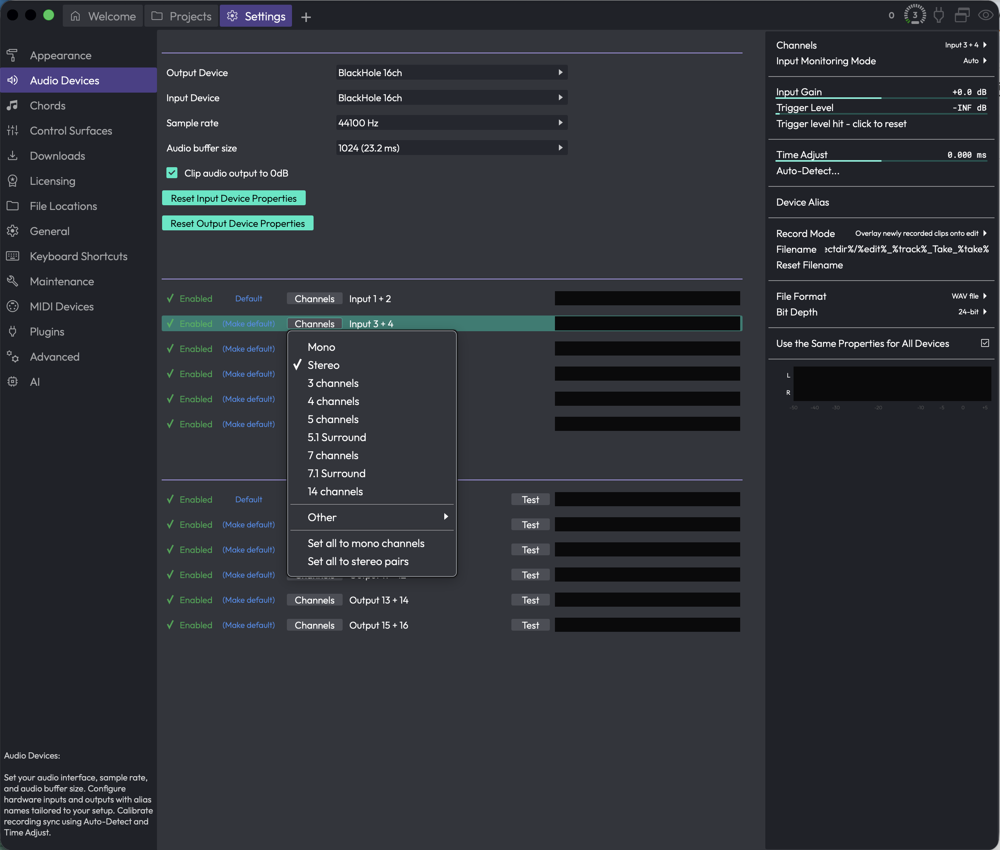

# Reference: Settings > Audio Devices

This page is where you choose your audio interface, set the sample rate and buffer size, and decide which physical inputs and outputs Waveform should use. It's also where you name your hardware and calibrate recording sync so recorded takes line up correctly.

*Settings > Audio Devices*

The page has three parts: a stack of settings at the top, lists of input and output channel groups below, and a tall **Channels** panel on the right that shows extra options for whichever input row you've selected.

## Audio I/O Devices

These controls sit at the top of the page and cover the big-picture setup: which driver, which device, what rate, and how big a buffer.

**Driver type** (Choices depend on your system, e.g. CoreAudio, ASIO, DirectSound, Windows Audio) — picks the audio driver technology Waveform talks to. This control only appears when more than one driver type is available on your machine. On macOS you'll usually have a single type and won't see this at all.

> 💡 **Tip:** On Windows, if your interface came with an ASIO driver, choose ASIO here. It generally gives you the lowest latency and the most reliable buffer sizes.

**Output Device** (Choices: your hardware outputs, or *none*) — the physical output Waveform plays through. Pick *none* if you don't want any audio output. The list shows whatever the selected driver type reports.

**Input Device** (Choices: your hardware inputs, or *none*) — the physical input Waveform records from. This row only appears when the current driver keeps inputs and outputs separate. For interfaces that bundle input and output together (a single ASIO device, for example), there's just one device choice and your input follows the output selection automatically.

**Sample rate** (Choices: the rates your device supports, shown in Hz) — the number of samples per second Waveform runs at. Higher rates can mean better fidelity at the cost of more CPU and disk. (Default: whatever your device is currently set to, e.g. 44100 Hz.)

> 📝 **Note:** Changing the sample rate resets the buffer size to your device's preferred value, so double-check the buffer size afterwards if you'd set it manually.

**Audio buffer size** (Choices: the sizes your device supports, shown as samples and the equivalent milliseconds, e.g. 1024 (23.2 ms)) — how much audio Waveform processes per block. Smaller buffers give you lower latency, which matters when monitoring live input, but they push CPU load up and risk audio glitches. Larger buffers are kinder to the CPU and good for mixing. (Default: your device's current size.)

> 💡 **Tip:** I usually keep the buffer small while tracking so I can monitor without noticeable delay, then bump it up for mixing once the CPU is busy with plugins.

**Clip audio output to 0dB** — clips Waveform's master output so it can't exceed 0dB, which protects your speakers and ears from accidental overloads. It's a safety net, not a mastering tool. (Default: off.)

### Driver buttons

Depending on your driver, a couple of extra buttons appear in this section:

**Show audio device control panel** — opens your audio driver's own settings window (most common with ASIO interfaces). This only appears if the current device provides one. After you close that window, Waveform reopens the device so any changes take effect.

**Reset audio device** — closes and reopens the current audio device. This is the first thing to try if your interface stops passing audio or gets into a confused state. Like the control-panel button, it only appears when the device supports it.

**Reset Input Device Properties** — resets your input devices back to their default settings. You'll get a confirmation prompt first.

**Reset Output Device Properties** — resets your output devices back to their default settings, again with a confirmation prompt.

## Input Channel Groups

Below the main settings, each available input appears as its own row. A channel group is just a named set of one or more physical input channels (a mono input, a stereo pair, and so on) that you can record from as a unit.

Each row has the same set of controls:

**Enabled / Disabled** — toggles whether this input is active. Enabled rows show a green tick; disabled rows show a red cross. Only enabled inputs show up elsewhere in Waveform as recording sources, and only enabled rows display a level meter.

**Default / (Make default)** — marks this input as the default recording source. The current default reads **Default**; the others read **(Make default)**, and clicking one promotes it.

**Channels** — opens a menu for choosing how the physical channels are grouped. You can pick **Mono**, **Stereo**, or a larger layout (3, 4, 5, 5.1 Surround, 7, 7.1 Surround, 14 channels, and more under **Other**). There are also shortcuts to **Set all to mono channels** or **Set all to stereo pairs**, which apply that layout across every input at once.

**Level meter** — the bar on the right of each enabled row shows incoming signal so you can confirm audio is arriving and gauge how hot it is.

Clicking anywhere on a row selects that input and fills the **Channels** panel on the right with its full settings (described below).

> 📝 **Note:** The row shows the device's name, and if you've given it an alias, the alias appears next to the name in quotes.

## Output Channel Groups

Outputs are listed the same way as inputs, with one addition.

**Enabled / Disabled**, **Default / (Make default)**, **Channels**, and the **level meter** all work exactly as they do for inputs.

**Test** — plays a short test tone through that output so you can confirm it's wired up and audible. This button only appears on enabled output rows.

## The Channels panel (selected input settings)

When you select an input row, the panel on the right shows everything about that one input. These settings apply to recording from that input, and (unless you've turned linking off) can be shared across all your inputs at once. There's no equivalent panel for outputs.

**Channels** — at the top, this repeats the channel grouping for the selected input, so you can change the layout from here too.

**Input Monitoring Mode** (Choices: On, Auto, Off) — controls whether the input signal is played back through Waveform while the input is active. *On* always passes it through, *Off* never does, and *Auto* passes it through only when it makes sense (such as when the track is armed). (Default: Auto.)

**Input Gain** — applies a gain boost or cut to the incoming signal, from -12dB to +12dB. Use this to bring a quiet source up or tame a hot one before it's recorded. (Default: 0.0 dB.)

**Trigger Level** — sets a level the input has to reach before recording actually starts, from -51dB up to 0dB. This is handy for hands-free recording: arm the take, and Waveform waits until sound crosses the threshold. (Default: the lowest/off position.)

**Trigger level hit - click to reset** — a status button that auditions the trigger. It shows *Waiting for trigger level...* until the threshold is crossed, then switches to *Trigger level hit - click to reset* so you can re-arm it. While a recording is actually running it reads *Recording...* and is disabled. You can't reset the gate mid-recording.

**Time Adjust** — shifts newly recorded clips in time to compensate for your hardware's round-trip latency, in milliseconds (roughly -500 to +500). Most people set this with the **Auto-Detect** tool rather than by hand. (Default: 0.000 ms.)

**Auto-Detect...** — opens the **Recording Synchronisation Test**, which measures your round-trip latency for you. See *Calibrating recording sync* below.

**Device Alias** — gives this input a friendly on-screen name (for example "Vocal Mic" instead of a generic interface label). The alias shows up wherever the input is referenced. Leave it blank to use the device's own name.

**Record Mode** (Choices: Overlay newly recorded clips onto edit, Replace old clips in edit with new ones, Don't make recordings from this device) — decides what happens when you record over existing material from this input. *Overlay* layers the new take on top, *Replace* swaps out what was there, and *Don't make recordings...* stops this input from recording at all. (Default: Overlay newly recorded clips onto edit.)

**Filename** — the naming pattern used for files recorded from this input. It supports placeholders for things like the edit name, track, and take number (right-click the field for the full list of tokens). 

**Reset Filename** — restores the filename pattern to its default.

**File Format** (Choices: the formats your install supports, e.g. WAV, AIFF, FLAC, Ogg) — the audio format new recordings are written in. (Default: WAV.)

**Bit Depth** (Choices: depend on the chosen format, e.g. 16-bit, 24-bit, 32-bit) — the number of bits per sample for new recordings. Higher depths capture more dynamic range at the cost of larger files. The available choices change when you switch format.

**Use the Same Properties for All Devices** — when ticked, all your input devices share one set of these settings, so changing one changes them all. When you turn it on, Waveform asks whether to copy the current device's settings to the others or leave them as they are. (Default: on.)

At the bottom of the panel there's a larger input level meter for the selected device.

## Calibrating recording sync

If recordings come back slightly early or late compared to what you played to, that's round-trip latency, and the **Auto-Detect...** button measures it precisely.

Clicking it opens the **Recording Synchronisation Test** dialog. The idea is simple: Waveform plays a test signal out and listens for it coming back in, then works out how long the round trip took.

For this to work, the output has to physically loop back into the input. The cleanest way is a cable from an output to an input on your interface. A microphone in front of a speaker can work too, but it's less reliable because the room adds noise and delay.

Click **Run Test** and Waveform plays the signal a few times and measures the delay. If it succeeds, it reports the detected delay in milliseconds. Click **Apply** to set that value as the recording offset, or **Cancel** to discard it.

If the test can't find the signal, it'll tell you so. That usually means the loopback isn't connected, or the signal is too quiet or noisy (common with the microphone-and-speaker approach). Fix the path and click **Run Test** again.

> 📝 **Note:** The test needs at least one active audio output device. If you have no output selected, the dialog says so and the **Run Test** button won't appear.

> 📝 **Note:** Applying a result sets the recording offset on your input devices for you, which is the same value you'd otherwise type into **Time Adjust** by hand.

## ⚡ Things to Watch Out For

- **Changing sample rate resets your buffer size.** After picking a new sample rate, glance at **Audio buffer size** in case it jumped back to the device default.

- **Disabled inputs and outputs disappear from the rest of Waveform.** If a device isn't showing up as a recording source or playback destination, check that its row reads **Enabled** here first.

- **Linked input settings change everything at once.** With **Use the Same Properties for All Devices** ticked, editing one input's gain, format, monitoring, and similar settings changes them on every input. Turn it off if you need per-input differences.

- **The sync test needs a real loopback.** Auto-Detect only works if the output is actually fed back into the input. Without that connection it can't measure anything.

- **(Windows) The Microsoft GS Wavetable synth can cause trouble.** If that MIDI device is enabled, Waveform warns you when you open this page, because it can interfere with some audio drivers. If your audio device won't open, try disabling the Microsoft synth. See the MIDI Devices chapter.

See the Settings overview chapter for how to reach this page, and the MIDI Devices chapter for configuring MIDI inputs and outputs.
