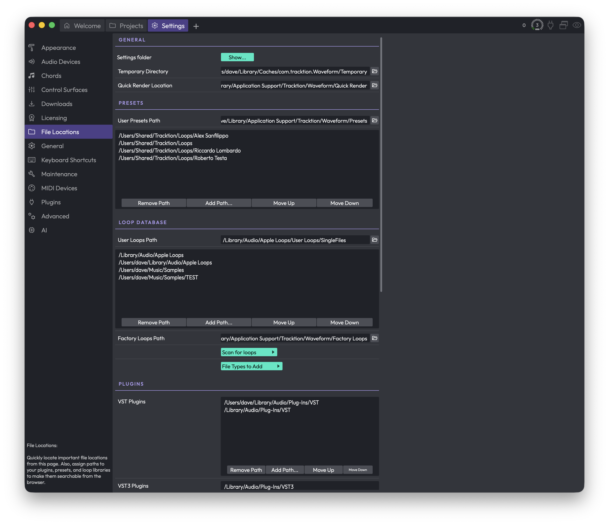

# Reference: Settings > File Locations

The **File Locations** page is where you tell Waveform where to keep its working files and where to go looking for your presets, loops, and plugins. Set these paths up once and the browser stays full of the right content, while temporary files end up on a drive you're happy to fill.

You'll find this page under **Settings**, in the list of pages down the left-hand side.

*Settings > File Locations*

The page is split into sections — General, Presets, Loop Database, Plugins, and (if your install supports them) Feature Extensions. Each path field shows the current location, and most have a small folder button at the right end that opens a file chooser so you can pick a new one.

> 💡 **Tip:** Many of the path fields and folder lists are underlined. Underlined items can be reset back to their default location — right-click them to find the reset option.

## General

**Settings folder** — Click the **Show** button to open the folder where Waveform stores your application settings and preferences in your system's file browser. This is handy when you need to back up your configuration or troubleshoot.

**Temporary Directory** — The working folder Waveform uses for thumbnails, frozen tracks, and other temporary files it generates while you work. Click the folder button to choose a new location.

> ⚠️ **Warning:** Everything inside the temporary directory is treated as disposable. Any files and subfolders in that location may be deleted automatically to free up space, so never point this at a folder containing files you care about. Waveform will warn you if the folder you choose isn't empty, and it won't let you use a drive's root folder — create a dedicated subfolder and use that instead.

**Quick Render Location** — The folder where files produced by quick render end up. Choose a location with plenty of free space if you render often.

## Presets

This section controls where your effect and instrument presets live and which folders the browser searches.

**User Presets Path** — The single folder where presets you create yourself are saved. Click the folder button to change it.

**Folders to search for presets** (the list box) — A list of folders the browser scans when showing presets. Use the buttons beneath the list to manage it:

- **Add Path...** — Opens a file chooser to add a folder to the list. If you pick a folder that doesn't exist yet, Waveform asks whether you still want to add it.
- **Remove Path** — Removes the currently selected folder from the list.
- **Move Up** / **Move Down** — Reorders the selected folder. Order can matter when the same preset name appears in more than one folder.

> 💡 **Tip:** You can edit an existing folder in any of these lists by double-clicking it (or pressing Return with it selected), which reopens the folder chooser for that row.

## Loop Database

These settings cover where your loops are stored, where Waveform searches for them, and how the loop database is built.

**User Loops Path** — The folder where loops you create are saved.

**Folders to search for loops** (the list box) — The directories Waveform scans for loops. It uses the same **Add Path...**, **Remove Path**, **Move Up**, and **Move Down** buttons described under Presets above.

**Factory Loops Path** — The folder containing the factory default loops that shipped with Waveform.

**Scan for loops** — Opens a small menu with two choices:

- **Scan for new and changed loops** — A quick scan that picks up anything added or modified since the last scan.
- **Clear database and rescan all loops** — Wipes the loop database and rebuilds it from scratch.

> ⚠️ **Warning:** Clearing the database and rescanning loses any custom loop tags you've added. Waveform asks you to confirm before doing this.

**File Types to Add** — Opens a menu of loop file types to include when scanning. You can toggle each type on or off:

- **Apple loops** (Default: on)
- **Acid loops** (Default: on)
- **REX** (Default: on)
- **WAV/AIFF** (Default: on)
- **MIDI** (Default: on)
- **MP3/Ogg/etc...** (Default: off)

> 📝 **Note:** Compressed formats like MP3 and Ogg are switched off by default because they're less common as loop material. Turn them on if your loop library includes them, then rescan.

## Plugins

This section is where you point Waveform at the folders containing your plugins so it can find and scan them. Each plugin format has its own folder list, controlled with the same **Add Path...**, **Remove Path**, **Move Up**, and **Move Down** buttons used elsewhere on this page.

The formats shown depend on your platform and which plugin types your build of Waveform supports. You may see any of:

- **VST Plugins** — Folders to search for VST (VST2) plugins.
- **VST3 Plugins** — Folders to search for VST3 plugins.
- **Ladspa Plugins** — Folders to search for LADSPA plugins (Linux only).
- **LV2 Plugins** — Folders to search for LV2 plugins.
- **Cmajor Patches** — Folders to search for Cmajor patches (only shown when Cmajor support is available).

> 📝 **Note:** Adding a folder here tells Waveform where to look, but it doesn't scan immediately on its own in every case. If a newly installed plugin doesn't appear, run a plugin scan from the Plugins settings page.

## Feature Extensions

This section only appears if your installation supports feature extension packs (such as stem separation).

**Feature extension packs folder** — Shows the folder where installed extension packs live. Clicking the folder button gives you a **Reveal folder** option that opens that location in your file browser.

**Installed feature extensions** — A read-only list of the extensions you currently have installed.

**Content pack** — Click this button to install a content pack manually. It opens a file chooser filtered to content pack files (`.content` and `.zip`), and installs the one you select.

## ⚡ Things to Watch Out For

- The temporary directory is genuinely temporary. Don't store anything you want to keep there, and don't point it at a folder that already holds important files.
- Adding a plugin or preset folder makes it *searchable*, but you may still need to run a scan before new content shows up in the browser.
- Rescanning the loop database from scratch discards custom loop tags — use the quick "new and changed" scan unless you specifically need a clean rebuild.
- When adding a path, Waveform lets you add a folder that doesn't exist yet (after a confirmation). Double-check the spelling, or that folder will simply never turn up any content.
- Reset options live on the right-click menus of the underlined fields and lists, not as separate buttons on the page.
