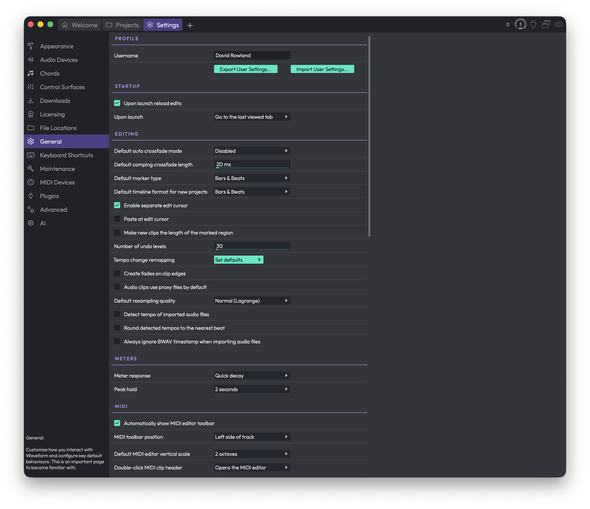

# Reference: Settings > General

The **General** page is where you shape how Waveform behaves day to day — your name, what happens at launch, editing defaults, metering, MIDI, mixing defaults, mouse behaviour, plugin windows, saving, and track inputs. It's a long page, and it's worth getting familiar with it: most of these settings define how new clips, tracks and projects start out, so a few minutes here saves you a lot of repetitive tweaking later.

*Settings > General*

Changes take effect immediately. Many of these are *defaults* — they affect things you create from now on, not items already in your Edit.

## Profile

**Username** — The name saved into the Edits and projects you work on. Limited to 32 characters; only letters, numbers, spaces, hyphens and underscores are kept.

**Export User Settings** — Saves your current user settings to a `.trksettings` file. Use it as a backup, or to copy your setup onto another computer.

**Import User Settings** — Loads settings back in from a `.trksettings` file you previously exported.

## Startup

**Upon launch reload edits** — When on, Waveform reopens the Edit tabs you had open last session. (Default: on)

**Upon launch** (Choices: Go to the Projects tab, Go to the Settings tab, Go to the last viewed tab, Go to the welcome tab) — Which tab Waveform shows right after it starts. The welcome tab option only appears if your edition includes it. (Default: Go to the welcome tab when available, otherwise Go to the Projects tab)

## Editing

**Default auto crossfade mode** (Choices: Disabled, Enabled) — When you drag an audio clip so it overlaps another, Waveform can automatically crossfade between them. This is a per-clip property, so enabling it here only affects clips you create from now on — existing clips are unchanged. (Default: Disabled)

**Default comping crossfade length** — The crossfade time, in milliseconds, used between comp sections when you swipe-comp takes. Range 0–500 ms. (Default: 20 ms)

**Default marker type** (Choices: Bars & Beats, Absolute timecode, Automatic) — The marker type used when you insert a new marker. (Default: Bars & Beats)

**Default timecode format for new projects** (Choices: Bars & Beats, Seconds, Frames 24 fps, Frames 25 fps, Frames 30 fps) — The timeline format new projects start with. (Default: Bars & Beats)

**Enable separate edit cursor** — Adds a second cursor that follows your mouse. Editing, zooming and pasting then act on this edit cursor instead of the playback cursor, so you don't have to keep moving the playhead for simple edits. (Default: off)

**Paste at edit cursor** — Makes paste operations happen at the edit cursor rather than after the source clip, giving you more control over where pasted clips land. This option only appears when **Enable separate edit cursor** is on.

**Make new clips the length of the marked region** — When on, newly created clips take the size of the current marked region. (Default: off)

**Number of undo levels** — How many actions you can undo and redo (Cmd/Ctrl + Z, or the undo buttons). Range 5–1000; raise it if you want a deeper history. (Default: 30)

**Tempo change remapping** (button: Remap audio clips, Remap auto-tempo audio clips, Remap MIDI clips, Remap plugin automation) — Click **Set defaults** to open a menu of toggles. Remapping stretches clip lengths and moves clips when the tempo changes so they stay in sync with the timebase. These switches let you decide exactly which clip types and plugin automation are allowed to remap.

**Create fades on clip edges** — Automatically adds a tiny fade in/out to new clips to avoid clicks at their edges. (Default: on)

**Audio clips use proxy files by default** — Controls whether newly added clips render a proxy file or timestretch in real time. Real-time timestretching uses more CPU but avoids the proxy render. Only appears if your edition supports real-time timestretching. (Default: on, i.e. use proxy files)

**Default resampling quality** (Choices: Normal (Lagrange), Good (Sinc Fast), Better (Sinc Medium), Best (Sinc Best)) — The default sample-rate conversion algorithm for audio clips. Higher qualities sound cleaner but cost more CPU. Only appears if your edition supports high-quality resampling. (Default: Normal (Lagrange))

**Detect tempo of imported audio files** — Turns on automatic tempo detection when you import audio.

**Round detected tempos to the nearest beat** — Rounds detected tempos to avoid small errors. Handy if you mostly import electronic music. (Default: off)

**Always ignore BWAV timestamp when importing audio files** — Places imported files at the cursor position instead of using any embedded broadcast-WAV timestamp. (Default: off)

## Meters

**Meter response** (Choices: Slow decay, Quick decay, Instant decay) — How quickly level meters fall back after a transient. (Default: Quick decay)

**Peak hold** (Choices: 2 seconds, 10 seconds, Until cleared) — How long meters keep the peak level lit after a hit. (Default: 2 seconds)

> 💡 **Tip:** In "Until cleared" mode, meters hold the highest peak indefinitely. Use the "Clear all meter peaks" keyboard shortcut to reset them.

## MIDI

**Automatically show MIDI editor toolbar** — Shows the toolbar automatically in the inline MIDI editor. With it off, the toolbar stays hidden until you toggle it (default shortcut Opt + Cmd + T / Alt + Ctrl + T). This only affects the *inline* editor — the toolbar is always visible in the full MIDI editor panel. (Default: on)

**MIDI toolbar position** (Choices: Left side of track, Left side of MIDI clips) — Where the MIDI pop-up keyboard and tool selector appear. "Left side of MIDI clips" usually works best, but some people prefer it pinned to the left of the track. (Default: Left side of MIDI clips)

**Default MIDI editor vertical scale** (Choices: 2 octaves, 4 octaves, 6 octaves, Full scale) — The starting vertical range for MIDI clips. You can always adjust it later by dragging the arrows at the top or bottom of the piano-roll keyboard. (Default: 4 octaves)

**Double-click MIDI clip header** (Choices: Expands for in-line editing, Opens the MIDI editor, Opens the MIDI editor (in-line editing disabled)) — What a double-click on a MIDI clip header does. "Opens the MIDI editor" is the most common choice. The last option lets you avoid the inline editor entirely. (Default: Expands for in-line editing)

**Set middle C to** (Choices: C3, C4, C5) — How MIDI note names are labelled. Best left at the default unless you have a reason to change it. (Default: C4)

**Use incoming velocities for MIDI step entry** — In step-entry mode, uses the velocity you actually play on your controller instead of the fixed value set in the MIDI toolbar. (Default: off)

## Mixing Defaults

**Default pan law** (Choices: Linear, -2.5 dB Center, -3.0 dB Center, -4.5 dB Center, -6.0 dB Center) — How left/right panning is balanced. Many classic consoles attenuate the centre to keep perceived loudness steady as you pan. With a linear pan law you may need to nudge the volume after panning. (Default: Linear)

**Auto freeze** (Choices: Manually freeze tracks, Freeze track when a freeze point is created or copied) — What triggers track freezing. Freezing renders a track's effects and instruments to free up CPU and reduce latency. (Default: Freeze track when a freeze point is created or copied)

**Freeze point** (Choices: Before plugins, Pre-fader, Post-fader) — Where the freeze point is inserted in the signal chain when a track is frozen. (Default: Pre-fader)

**Solo behaviour** (Choices: Cumulative solo, Exclusive solo) — How multiple soloed tracks interact. With cumulative solo, soloing more tracks adds them to what you hear; with exclusive solo, soloing a track replaces the previous solo. (Default: Cumulative solo)

## Mouse

There are a lot of options here for tuning mouse drag, click and wheel behaviour. Several exist to stay compatible with older versions. A reasonable approach is to start with the defaults, then adjust to taste.

**Allow clips to be resized without using the header buttons** — Lets you resize clips by dragging their edges directly, rather than using the header buttons. Only appears if your edition supports edge dragging. (Default: on)

**Allow tracks to be resized by dragging over the clip area** — Lets you change track height by dragging within the clip area. (Default: on)

**Move the cursor to the mouse position when clicking on track background** — When on, clicking in the arrangement area (including the body of a clip or the empty space between clips) moves the cursor there. Clicking a clip header still selects the clip without moving the cursor. (Default: on)

**Timeline drag** (Choices: Drag to scroll view, Drag to locate cursor) — What dragging left/right over the timeline does. "Drag to scroll view" pans the whole track view; "Drag to locate cursor" makes the cursor follow your drag. Either way, clicking the timeline positions the cursor. (Default: Drag to scroll view)

**Tracks area drag** (Choices: Drag to draw marked region, Drag to select clips, Drag to move playhead) — What a left-drag in the tracks area does.

- *Drag to draw marked region* gives you the I-beam range cursor — a powerful editing mode many users prefer. Hold Opt / Alt while dragging to select clips instead.
- *Drag to select clips* gives marquee-style clip selection, matching how you select MIDI notes. Hold Shift + Opt / Shift + Alt to draw ranges with the I-beam.
- *Drag to move playhead* is the legacy Tracktion behaviour — dragging just relocates the cursor.

(Default: Drag to select clips)

Video Tutorial: [Drag to Draw Marked Region](https://youtu.be/zTrAn9u_B18)

**Tracks area right drag** (Choices: Zoom horizontally, Scroll tracks) — What right-button dragging over the tracks area does. (Default: Scroll tracks)

**Mouse wheel** (Choices: Zooms horizontally (add shift to scroll), Scrolls the view (add shift to zoom)) — The default mouse-wheel action; the modifier swaps it to the other behaviour. (Default: Scrolls the view (add shift to zoom))

**Over tracks area** (Choices: Wheel scrolls vertically, Wheel scrolls horizontally) — What the wheel does when the pointer is over the tracks area. (Default: Wheel scrolls vertically)

**Allow wheel to scroll within MIDI clips** — When on, the wheel scrolls the inline MIDI editor up and down while the pointer is over a MIDI clip's piano roll. Turn it off if you'd rather always scroll the tracks vertically. (Default: on)

## Plugin Windows

**Open plugin windows by** (Choices: Single-clicking, Double-clicking) — Whether a single or double click opens a plugin's window. Choose double-click to avoid opening plugin UIs by accident. (Default: Single-clicking)

**New plugins open on** (Choices: Active Display, Display 1, Display 2, …) — On a multi-monitor setup, which display new plugin windows open on. The number of choices matches the displays you have connected. Below this control a small diagram shows your monitor layout, with the active one highlighted. Only appears if your edition supports the layout feature. (Default: Active Display)

## Saving

**Automatically backup entire project** — Backs up your project and Edit files automatically. (Default: on)

Backups are made at most once every 15 minutes. Older backups thin out over time and are eventually removed. You can also make a permanent backup yourself from File > Backup edit and project files — those are never auto-deleted.

To recover, go to the Projects page, pick a backup file, and click Restore Edit; the chosen Edit comes back into the current project named "Edit (Restored)". To bring back a whole project at a point in time, use Restore Project, which creates a new project and Edits from the backup.

> 📝 **Note:** Only your project file and Edits are backed up — not the audio files. If you delete the source audio, this feature can't bring it back.

**Enable autosave** — Periodically saves your Edit in the background while you work, so a crash costs you little. (Default: on)

**Generate audio preview files automatically** — Creates the audio previews shown with each Edit on the Welcome and Projects tabs, so you can hear what an Edit is before opening it. Generated when you close an Edit. (Default: on)

**When closing an edit** (Choices: Ask to save, Always save) — What happens when you close an Edit. Choose "Ask to save" if you'd rather confirm each time. (Default: Always save)

## Track Inputs

**Allow inputs to appear on multiple tracks** — Lets one input (a MIDI device or audio input) be assigned to more than one track. A specialised need — most users leave it off. Only appears if your edition supports multi-input. (Default: off)

**Default audio device follows selection** — When on, selecting a track moves the audio input to follow it. Handy when overdubbing the same input across several tracks. (Default: on)

**Default MIDI device follows selection** — When on, selecting a track moves the MIDI input to follow it. Handy when you want to start playing the same keyboard straight into whichever track you select. (Default: on)

## ⚡ Things to Watch Out For

- **Defaults only affect new items.** Settings like auto crossfade, resampling quality, fades on clip edges and pan law apply to clips and tracks you create *after* changing them. Existing material keeps whatever it already had.
- **Backups don't cover audio files.** Automatic backup protects only your project and Edit files. Keep your own copies of source audio.
- **"Until cleared" peak hold never resets on its own.** You'll need the "Clear all meter peaks" shortcut to reset the meters.
- **Some controls only appear in certain editions.** Real-time timestretching, high-quality resampling, multi-input, clip-edge dragging, the welcome tab and the multi-monitor plugin-window option each depend on your Waveform edition, so you may not see all of them.
