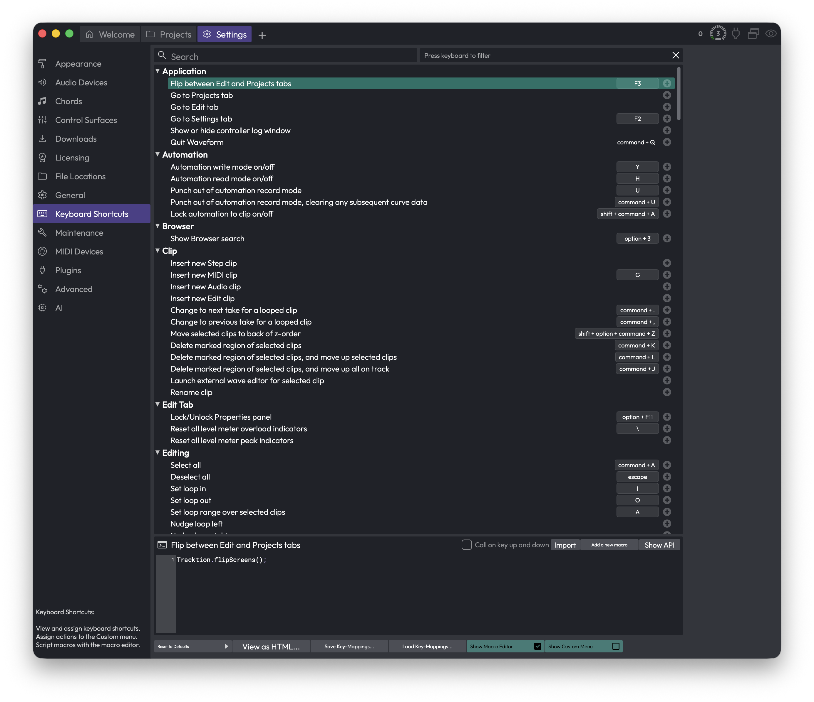

# Reference: Settings > Keyboard Shortcuts

This page is where you view and customise every keyboard shortcut in Waveform. Every action in the app — from flipping between tabs to inserting a clip — lives here as a command you can search for and bind to whatever key combination feels natural to you.

If you just want to learn the shortcuts that ship with Waveform, head to the **Keyboard Shortcuts** tutorial chapter. This reference page covers the editor panel itself: how to find a command, assign or remove keys, switch between preset key sets, and save your own setup.

*Settings > Keyboard Shortcuts*

## The Command List

The bulk of the page is a scrollable list of every command, grouped into expandable categories such as **Application**, **Automation**, **Browser**, **Clip**, **Edit Tab**, and **Editing**. Click a category's triangle to collapse or expand it.

Each row shows the command name on the left and its assigned key combinations on the right. A command can hold up to three key combinations at once, so you can give the same action both a "comfortable" shortcut and an alternative.

> 📝 **Note:** A handful of system commands — Cut, Copy, Paste, Delete, and Quit Waveform — are shown but locked. Their keys are fixed to the platform standards (Cmd + X / Ctrl + X, Cmd + C / Ctrl + C, and so on) and can't be changed here.

## Searching and Filtering

Two filter boxes sit across the top of the list. They work together, so you can narrow by name and by key at the same time.

**Search** — The text box on the left. Type any part of a command's name, its description, or its category, and the list instantly shows only matching commands. Clear it to see everything again.

**Press keyboard to filter** — The box on the right. Click it, then press a key combination. The list filters down to the single command currently bound to that combination — a quick way to answer "what does this shortcut already do?" Click the small **x** at the right end of the box to clear it.

> 💡 **Tip:** Use the key filter before assigning a new shortcut. If pressing your intended combination shows an existing command, you'll know it's already taken before you reassign it.

## Assigning a Key

Each command row ends with a small **+** button. Click it to add a new shortcut.

A window appears reading "Please press a key combination now...". Press the keys you want, then click **OK**. If you change your mind, click **Cancel**.

If the combination you press is already used by another command, the window warns you which command currently owns it. After you confirm, Waveform asks whether you want to re-assign the key. Choose **Re-assign** to move it to your new command (the old command loses it), or **Cancel** to back out.

## Changing or Removing a Key

Click an existing key combination shown on a row to open a short menu:

- **Change this key-mapping** — Opens the same "press a key combination" window so you can replace it.
- **Remove this key-mapping** — Deletes that combination, leaving the command unbound (or down to its remaining keys).

## Key Sets and Presets

The buttons along the bottom of the page handle whole-keyboard operations.

**Reset to Defaults** — Opens a menu of complete key sets. Picking any of these replaces *all* your current mappings, so Waveform asks you to confirm with an **Overwrite** prompt first. The options are:

- **Restore default Waveform key mappings** — Returns everything to Waveform's standard layout.
- **Clear all mappings** — Removes every shortcut, leaving you a blank slate to build from.
- **Use legacy Tracktion key-mappings** — The older Tracktion layout, for long-time users.
- **Use 'Ableton Live' style key-mappings** — A layout modelled on Ableton Live.
- **Use 'Cubase' style key-mappings** — A layout modelled on Cubase.

> ⚠️ **Warning:** Every option under this button overwrites your entire mapping set, including any custom shortcuts you've assigned. If you've built a setup you like, save it first (see below) before experimenting.

## Saving and Loading Your Setup

**Save Key-Mappings...** — Exports your current mappings to a file so you can back them up or move them to another machine. You choose where to save; Waveform warns you before overwriting an existing file.

**Load Key-Mappings...** — Imports a previously saved mappings file. Loading first restores Waveform's defaults and then applies the saved file on top, so you always get a clean, predictable result.

**View as HTML...** — Generates a printable web page listing every command and its shortcuts, and opens it in your browser. Handy for printing a cheat-sheet or reviewing your whole setup at a glance.

## Macros and the Custom Menu

Two buttons reveal extra editing areas for advanced users who want to build their own actions.

**Show Macro Editor** — Toggles a script editor at the bottom of the page where you can write JavaScript macros and bind them to keys like any other command. Selecting a macro in the list loads its script. Inside the editor you'll find:

- **Import** — Browse for and import script files. You can also drag script files directly onto the page.
- **Export** — Save the selected macro's script to a file.
- **Delete** — Remove the selected macro.
- **Add a new macro** — Create a fresh, empty macro to start writing.
- **Show API** — Opens the scripting API reference in your browser.
- **Call on key up and down** — When ticked, the macro runs on both the key press and the key release; otherwise it runs only on the press.

> 💡 **Tip:** Right-click inside the script editor to insert actions and see argument options for the call under your cursor.

**Show Custom Menu** — Toggles a panel on the right where you can build your own menu of actions. Drag commands or scripts from the list into this panel to add them. An empty panel prompts you to "Drag scripts here to begin...".

## ⚡ Things to Watch Out For

- **Three keys is the limit.** Each command holds at most three combinations. Once a row is full, the **+** button won't add a fourth — remove one first.
- **Reset and Load overwrite everything.** Both the preset menu and Load Key-Mappings replace your whole set, not just the visible commands. Save your work before using them.
- **Locked commands can't be rebound.** If a command's keys look greyed out, it's one of the protected system shortcuts (Cut, Copy, Paste, Delete, Quit) and is fixed by design.
- **Changes are saved automatically.** Your mappings are written out when you leave this page, so there's no separate "apply" step for the edits you make directly in the list.
