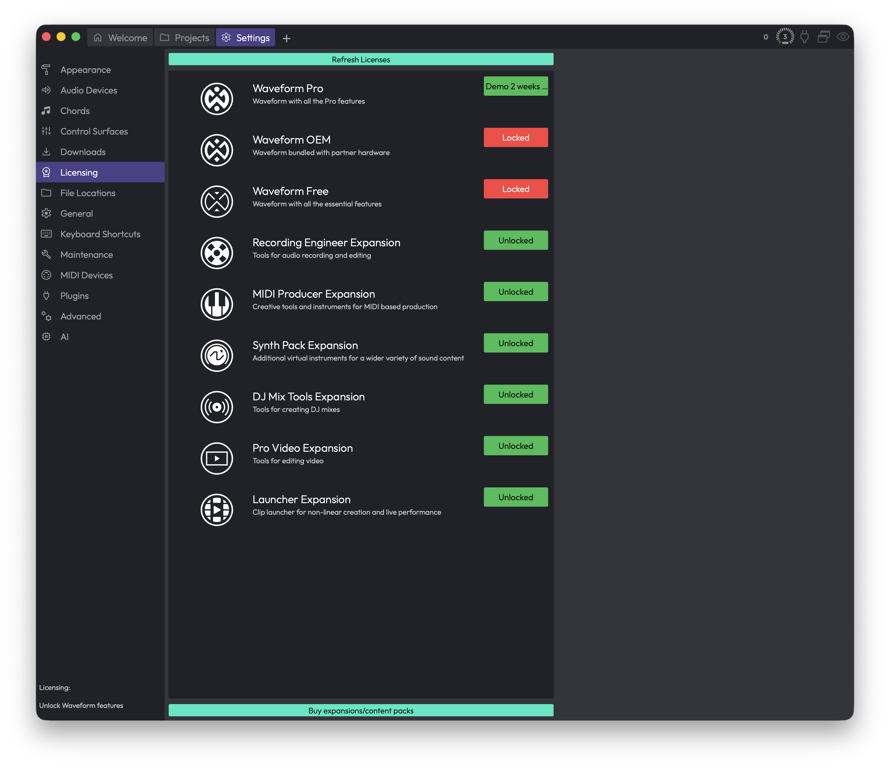

# Reference: Settings > Licensing

The Licensing page is where you unlock Waveform, register the expansions and content packs you own, and see at a glance what's active on this computer. Open it from the Settings tab and pick **Licensing** in the list on the left.

*Settings > Licensing*

Think of this page as your license dashboard. Everything Waveform knows it can run — the main app plus any expansions — is listed here with its current status. If something you bought isn't showing as unlocked, this is the place to fix it.

## The Feature List

The large list in the middle shows every Waveform edition and expansion the app is aware of. Each row has a thumbnail, a name, a short description, and a status badge on the right.

The status badge tells you exactly where that item stands:

- **Unlocked** (green) — You own it and it's authorised on this computer. Nothing more to do.
- **Demo** (green) — You're running it on a time-limited trial. The badge also shows roughly how long is left (for example, "Demo 2 weeks").
- **Expired** (red) — The demo period has run out. To keep using it you'll need to buy a license and refresh.
- **Locked** (red) — You don't have a license for this item on this computer yet.
- **Included** (orange) — The feature is bundled with your edition of Waveform, so it's available without a separate license.

> 📝 **Note:** The status reflects this computer specifically. A license that's unlocked on your studio machine will show as Locked on a laptop until you authorise that laptop too.

You can scroll the list if you have more items than fit on screen. The list is informational — there's nothing to click on the rows themselves. The action buttons live above and below it.

## Refresh Licenses

**Refresh Licenses** — Sits along the top of the page. Click it to log in to your tracktion.com account and pull down any licenses tied to it, then apply them to this computer.

This is the button you'll use most. When you click it, a window titled **Authorisation via tracktion.com** opens and asks you to log in with your tracktion.com account details. Once you sign in, Waveform fetches your licenses and unlocks anything you're entitled to.

When it finishes, you'll get a short summary telling you how many new licenses were found and naming each one. If everything was already current, it simply tells you your licenses are up to date. The list on this page updates immediately so you can confirm the new status.

> 💡 **Tip:** Use Refresh Licenses whenever you buy something new, set up Waveform on a different computer, or a feature you expect to own is still showing as Locked. It's the one-click way to sync this machine with your account.

If the login is cancelled or something goes wrong fetching your licenses, Waveform shows a warning explaining the problem and leaves your existing licenses untouched. You can simply try again.

## Buy expansions/content packs

**Buy expansions/content packs** — Sits along the bottom of the page. Click it to open the Tracktion store in your web browser, where you can purchase new expansions and content.

After you complete a purchase, come back to Waveform and click **Refresh Licenses** to bring the new content onto this computer.

## ⚡ Things to Watch Out For

- **Licenses are per-computer.** Buying a license adds it to your account, but it isn't active on a given machine until you run Refresh Licenses there. If a feature is Locked even though you own it, that's almost always the fix.
- **Demo time keeps counting.** A **Demo** badge with a time remaining is a countdown. Once it reads **Expired**, the feature stops working until you buy a license and refresh.
- **You need to log in to refresh.** Refresh Licenses talks to tracktion.com, so you'll need your account credentials and an internet connection. Have those ready before you click.
- **"Included" means no action needed.** An orange **Included** badge isn't a problem to solve — it just means that feature comes free with your edition of Waveform.

For related settings, see the General and Maintenance reference chapters, which also touch on authorising and maintaining your installation.
