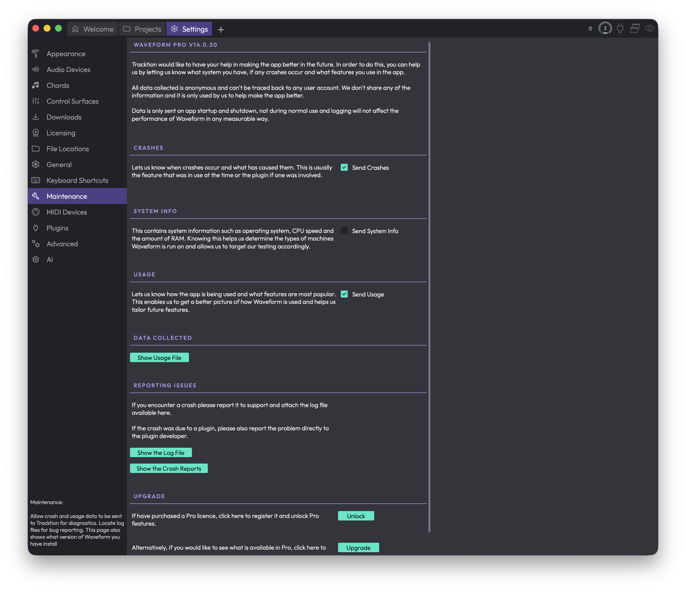

# Reference: Settings > Maintenance

The Maintenance page is where you decide how much you want to help Tracktion improve Waveform, and where you grab the files you'll need if you ever have to report a problem. It's also the quickest place to check exactly which version of Waveform you're running.

*Settings > Maintenance*

To get here, open the **Settings** tab and choose **Maintenance** from the list on the left.

Despite the name, this page isn't about clearing caches or purging projects. It's a small, low-risk page: most of it is about anonymous diagnostics reporting, plus a few buttons that reveal log and crash files so you can attach them to a support request.

## Your Waveform Version

The heading at the very top shows your edition and version number, for example "Waveform Pro v14.0.30". If you ever contact support, it's worth quoting this exactly.

Below the heading is a short explanation of why Tracktion collects data and how it's handled. The key points: everything sent is anonymous and can't be traced back to you, none of it is shared, and data is only sent when Waveform starts up and shuts down, never while you're working. The logging won't slow Waveform down.

## Diagnostics Reporting

There are three independent toggles here, and you can turn each one on or off as you like. They're all opt-in switches that control what gets sent to Tracktion.

**Send Crashes** — Reports when a crash happens and what was being used at the time, which is usually either a feature or a plugin. This is the single most useful thing to leave on if you want crashes you hit to actually get fixed.

**Send System Info** — Sends details about your machine, such as your operating system, CPU speed, and amount of RAM. This helps Tracktion understand what kind of hardware Waveform runs on so they can focus their testing.

**Send Usage** — Reports how the app is used and which features are most popular, so Tracktion can see what's worth investing in.

> 💡 **Tip:** If you only enable one of these, make it **Send Crashes**. Crash reports are the most directly useful for getting your problems resolved.

> 📝 **Note:** None of these toggles send anything during normal use. Data only goes out when you launch or quit Waveform.

## Data Collected

**Show Usage File** — Opens the file containing everything that would be sent to Tracktion, so you can see exactly what's collected before deciding what to enable. The button reveals the file in your system's file browser.

This is here purely for transparency. Nothing is hidden; if you're curious or cautious about what leaves your machine, look here.

## Reporting Issues

If you hit a crash, the advice on this page is simple: report it to support and attach the relevant file(s) from here. If the crash was caused by a plugin, it's also worth reporting it directly to that plugin's developer, since the fix usually has to come from them.

**Show the Log File** — Reveals the log file, which records what Waveform has been doing. Include this in any support query. (On Windows, you're also reminded to attach the crash report.)

**Show the Crash-Reports** — Reveals the crash report files. Include these alongside the log file when you report a crash.

> 📝 **Note:** The exact buttons you see depend on your platform. The crash report button appears on macOS and Windows. On other systems, only the log file is offered.

> 💡 **Tip:** Both of these buttons open your file browser rather than the file itself, so you can drag the files straight into an email or a support ticket.

## Upgrade

This section only appears if you're not already running a full, registered copy of Waveform Pro, for example if you're on a free edition, an unregistered install, or in demo mode. If you already have Pro, you won't see it at all.

**Unlock Waveform Pro** — If you've bought a Pro licence, this opens the registration dialog so you can enter it and unlock the Pro features.

**Visit the website to see get a tour of Waveform Pro** — Opens the Tracktion website in your browser so you can see what Pro adds before buying.

## ⚡ Things to Watch Out For

- The page name suggests cleanup tools, but there's nothing here that deletes projects, clears caches, or resets settings. If that's what you're after, it isn't on this page.
- The diagnostics toggles are independent. Turning one off doesn't affect the others, so check all three if you want to fully opt out.
- The reveal buttons (Show Usage File, Show the Log File, Show the Crash-Reports) open your file browser at the file's location rather than opening the file's contents inside Waveform.
- The Upgrade section is conditional. Don't be surprised if it's missing; that simply means you're already on registered Waveform Pro.
