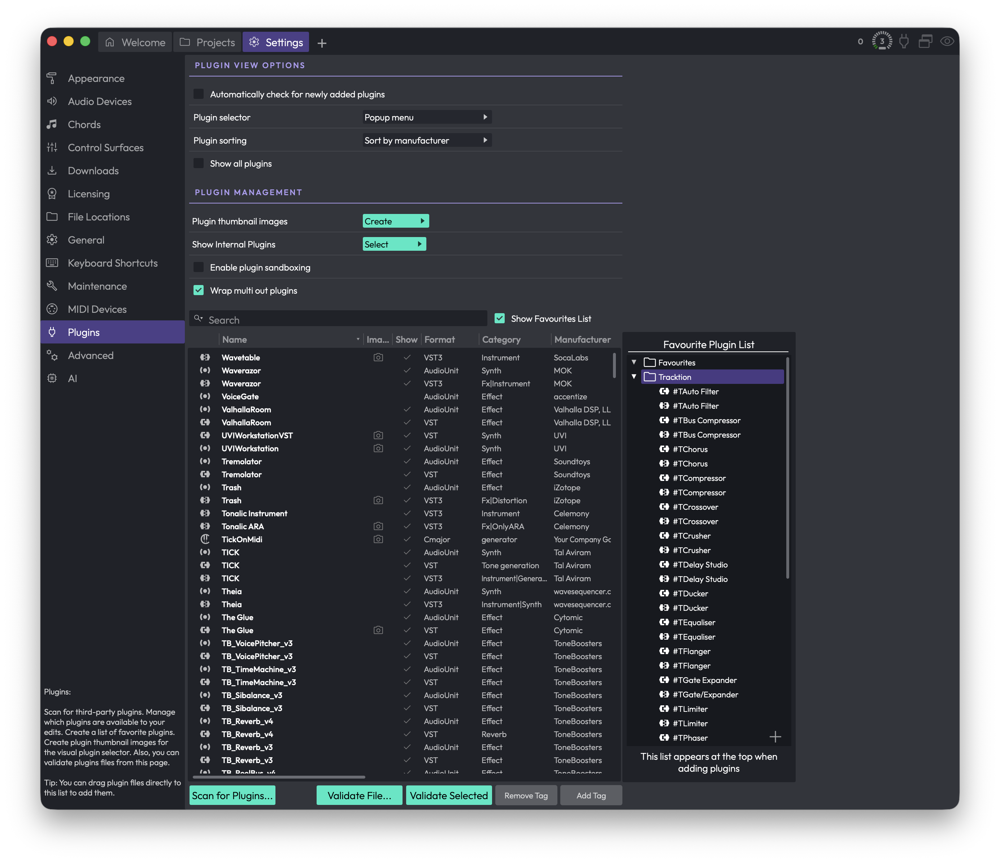

# Reference: Settings > Plugins

The **Plugins** page is where you scan for third-party plugins, decide which ones are available to your edits, build a list of favourites, generate thumbnail images for the visual plugin selector, and validate plugin files. Open it from the **Settings** tab and pick **Plugins** in the sidebar.

*Settings > Plugins*

> 💡 **Tip:** You can drag plugin files straight from your computer onto the plugin list to add them, without running a full scan.

## Plugin View Options

These settings control how the plugin menu behaves when you add a plugin elsewhere in Waveform.

**Automatically check for newly added plugins** — When enabled, Waveform notices when new plugins have been installed and offers to scan for them, so you rarely need to scan each format by hand. (Default: enabled)

**Plugin selector** (Choices: Popup menu, Popup tree, Custom popup menu, Custom popup tree, Tag menu, Browser) — Changes the type of plugin selector panel you get when adding a plugin. (Default: Browser when the browser feature is available, otherwise Popup menu)

- **Popup menu** — The standard context-menu style selector. A good default for most people.
- **Popup tree** — The same organisation shown as an expandable/collapsible tree.
- **Custom popup menu** — A context menu containing only what you have placed in the Favourite Plugin List. Choose this if you want to define the selector entirely by hand.
- **Custom popup tree** — As above, but in tree form.
- **Tag menu** — Builds the selector from your plugin tags, using each tag as a category. Another hand-curated approach.
- **Browser** — Presents the selector as a browser panel. Only appears when the browser feature is available.

[Video Tutorial: Plugin Selector and Favourite Plugins List](https://youtu.be/Ctw7KfCCo84)

**Plugin sorting** (Choices: Sort by disk location, Sort by category, Sort by manufacturer) — Chooses how the plugin list is organised inside the selector. (Default: Sort by manufacturer)

> 📝 **Note:** Plugin sorting is hidden when **Plugin selector** is set to one of the custom modes, since you control the order yourself in those cases.

**Show all plugins** — Forces every plugin to appear in the menus, ignoring the **Show** column in the list below. Leave this off if you want to be able to hide individual plugins. (Default: disabled)

## Plugin Management

**Plugin thumbnail images** (button: Create) — Opens a menu for generating the small pictures of plugin interfaces used by the visual plugin selector. You can create thumbnails **For all plugins**, **For plugins without thumbnails**, or **For selected plugins**. Each plugin is briefly opened so Waveform can capture an image.

> 💡 **Tip:** You can also create a thumbnail for a single plugin by clicking the camera icon in its window header while you have it open for normal use.

**Show Internal Plugins** (button: Select) — Opens a menu to enable or disable Waveform's built-in plugins:

- **Enable Legacy Plugins** — Shows the older FM Synth and Sampler. (Default: disabled)
- **Enable Artisan Collection Plugins** — Shows the Artisan Collection plugins (from Airwindows). This option only appears for editions that include the Artisan Collection, letting you hide them if you prefer. (Default: enabled)

> ⚠️ **Warning:** Both of these changes require you to quit and restart Waveform before they take effect.

**Enable plugin sandboxing** — Runs plugins in a separate process from the main application, so a misbehaving plugin is less likely to crash Waveform. There is some extra processing overhead, so for best performance leave this off and only turn it on if you have problematic plugins. With it enabled you can choose which plugins to sandbox using the **Sandbox** column in the list. This option only appears on editions that support sandboxing. (Default: disabled)

> 📝 **Note:** After changing the sandboxing setting, close and reopen any open edits for it to take effect.

[Video: Waveform Plugin Sandboxing](https://youtu.be/xOvgJW36VJc)

**Wrap multi out plugins** — When enabled, Waveform asks whether multiple-output plugins should be wrapped in a rack. (Default: enabled)

**Enable Rewire** — Lets Waveform act as a Rewire host so you can stream audio in real time from Rewire-compatible software. Only appears on editions with Rewire support. Turning it on may install the Rewire shared library, and a restart is required for the change to take effect. (Default: disabled)

## The Plugin List

The main table lists every registered plugin. Depending on your edition you may see the following columns: an icon, **Disabled**, **Name**, **Image**, **Show**, **Sandbox**, **Format**, **Category**, **Manufacturer**, **Version**, **ARA**, **Alias**, **Tags**, **Updated**, and **Description**.

- Drag the dividers between headers to resize columns, and drag a header to reorder columns. Your layout is remembered.
- Click a column header to sort by it (Name, Format, Category, Manufacturer, and Updated can be sorted).
- **Show** — Click the tick in this column to include or hide a plugin in the selector menus.
- **Sandbox** — When sandboxing is on, click here to run that plugin in a separate process.
- **Image** — A camera icon here means a thumbnail exists; click it to preview the captured image.
- **ARA** — A tick indicates the plugin supports ARA.
- **Disabled** — A warning triangle appears here when a plugin has been switched off after crashing. Click it to re-enable the plugin.
- **Alias** — Double-click this cell to type a friendly name for the plugin.

Right-click a row for quick actions: **Remove plugin from list**, **Show folder containing plugin**, and **Create thumbnails**. You can also select rows and press Delete to remove them. Select multiple plugins with Cmd-click / Ctrl-click, or Shift-click for a contiguous range.

Blacklisted plugins (ones that failed to initialise correctly) appear in red at the bottom of the list, marked as deactivated.

## Search

**Search** — Type to filter the list. Click the magnifier icon to choose which fields the search looks in: **Name**, **Type**, **Category**, and **Manufacturer**. If nothing matches, the list shows "No results found".

## Scanning for Plugins

**Scan for Plugins...** — Opens a menu of scanning and cleanup options. The exact entries depend on which plugin formats your system supports (for example AudioUnit, VST, VST3, SOUL Patch), so the format names below are examples.

- **Clear list** — Empties the entire plugin list.
- **Remove all [format] plug-ins** — Removes every plugin of a given format (one entry per supported format).
- **Remove selected plug-in from list** — Removes the plugins you have selected in the table.
- **Remove any plug-ins whose files no longer exist** — Cleans up entries for plugins that have been uninstalled.
- **Show folder containing selected plug-in** — Reveals the selected plugin's file on disk.
- **Scan for new or updated [format] plug-ins** — Scans for newly installed plugins of a given format (one entry per supported format).

> ⚠️ **Warning:** **Clear list** wipes the whole list and cannot be undone. You can always scan again, but any aliases, tags, or favourites tied to those entries will be lost.

> 📝 **Note:** With **Automatically check for newly added plugins** enabled, Waveform prompts you to scan when it detects new plugins, so you rarely need to run these per-format scans manually.

## Validating Plugins

Use these to check whether a plugin behaves correctly. The plugin sandboxing video above covers validation in more detail.

**Validate Selected** — Validates the plugin currently selected in the list.

**Validate File...** — Lets you browse to a plugin file on disk and validate it directly.

## Favourite Plugin List

**Show Favourites List** — Toggles a panel on the right where you build a curated **Favourite Plugin List**. Drag plugins from the table into this list to add them; the favourites appear at the top of the selector when you add a plugin. You can create folders, reorder items, and right-click a folder to sort it alphabetically (A to Z or Z to A). This list is what the **Custom popup menu** and **Custom popup tree** selector modes use.

## Tagging Plugins

Tags let you group plugins however you like for use in the **Tag menu** selector and elsewhere.

**Add Tag** — Drag plugins from the table (or favourites tree) onto this target to assign them a tag. You can pick an existing tag or create a new one.

**Remove Tag** — Drag plugins onto this target to take a tag away.

> 📝 **Note:** Tag names cannot contain the `|` character.

## ⚡ Things to Watch Out For

- **Restarts required:** Enabling legacy or Artisan plugins, and toggling Rewire, only take effect after you quit and restart Waveform.
- **Sandboxing needs a reopen:** Changing the sandboxing setting requires you to close and reopen any open edits.
- **Clear list is permanent:** There is no undo for clearing the plugin list.
- **Sandboxing has a cost:** It adds processing overhead, so only enable it if you actually need the crash protection.
