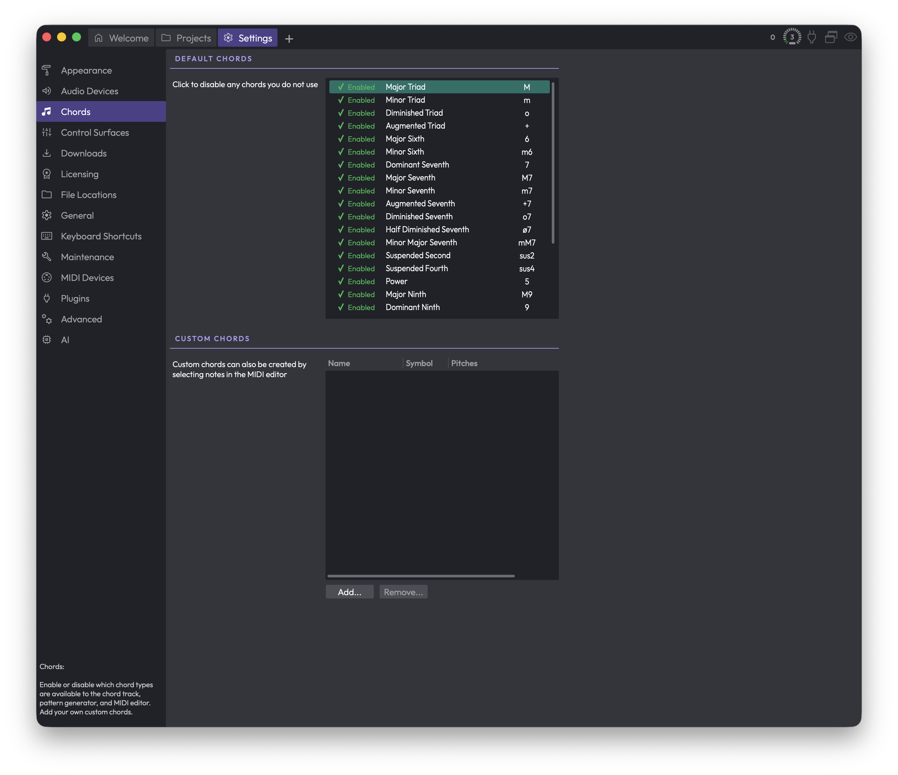
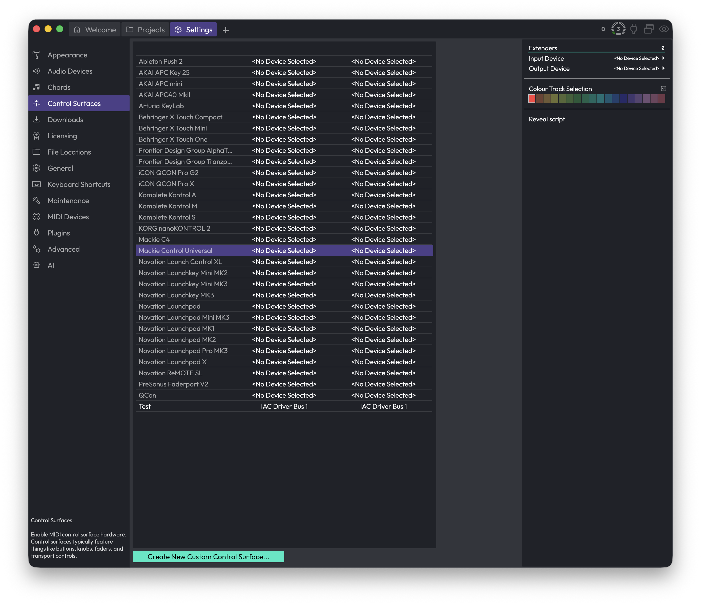
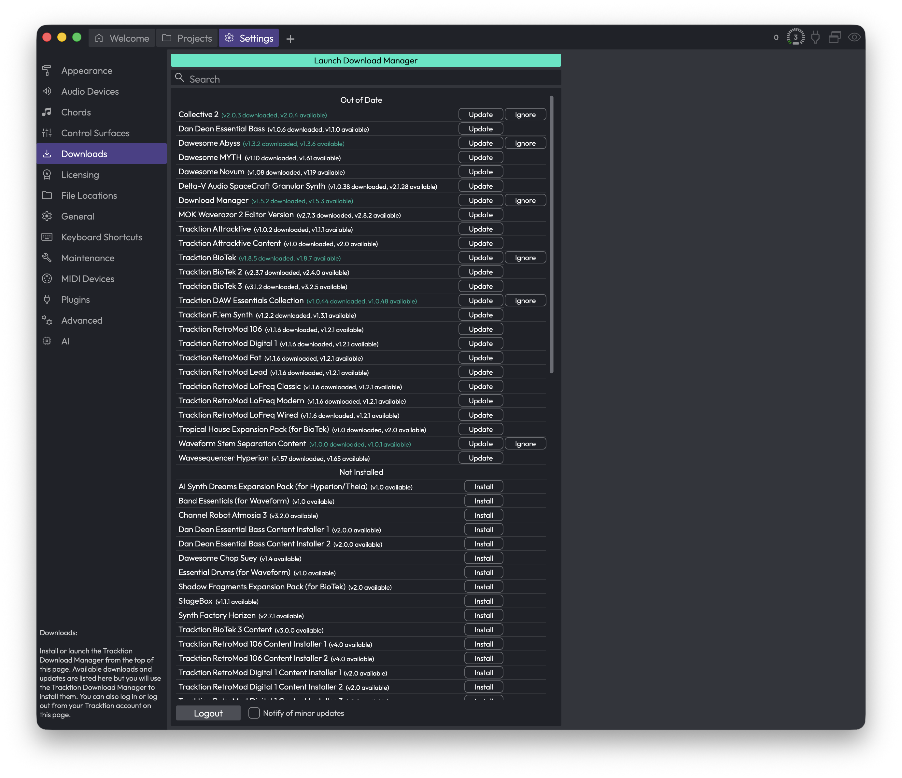
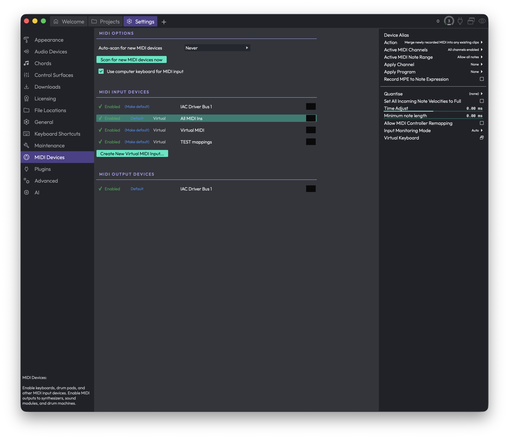

# Reference: Settings

This chapter documents every page of the Settings tab. Each section below corresponds to one page in **Settings**.

## Appearance

The Appearance page is where you set the language and overall look of Waveform, then fine-tune how tracks, clips, and notes are drawn to match your preferences. Everything here is cosmetic, so feel free to experiment — nothing on this page affects your audio.

*Settings > Appearance*

This video is a walkthrough of all the features in this chapter.

[Video: Explaining Appearance Settings](https://youtu.be/n9nwCpbyOI4)

### Language

**Language** — Sets the language used for Waveform's interface text. (Default: English)

Several other languages are available. They're contributed and maintained by users, so coverage varies a little from one language to the next.

### Look and Feel

**Display scale** — Scales the entire interface up or down in 5% steps, anywhere from 50% to 300%. Scale it up when you're working on a small laptop screen so controls are easier to hit; scale it down on a large monitor or TV to fit more on screen. (Default: 100%)

**Font** — Click this to pick the interface font from a menu of the fonts installed on your system. There's also a **Default** option and a **Default Unicode** option (handy if you need broader character coverage). Honestly, it's usually best to leave this on Default. (Default: Default)

**Simplify user interface** — Renders the interface with less detail, dropping things like colour gradients. It can make the app feel a touch more responsive on older or slower machines. (Default: disabled)

**Animate UI panels** — Animates panels as they slide in and out when they appear and disappear. Turn it off if you'd rather they just snap open and closed. (Default: disabled)

**Colour scheme** — Click **Show editor...** to open the Colour Scheme Editor, where you can choose from the built-in schemes or customise individual interface colours to suit your taste or mood.

### Browser

**Browser position** (Choices: Left, Right, Top) — Sets where the Browser side panel sits when you're working in the Edit tab. (Default: Right)

> 💡 **Tip:** You don't have to come back here to move the Browser. Inside an Edit you can drag its tab within the "eye" show/hide selector in the upper right to reposition it on the fly.

**Panels open side-by-side** — When enabled, you can open two or more panels next to each other; when disabled, panels stack on top of one another instead. I prefer to leave this on. (Default: disabled)

**Automatically hide and show panels** — When enabled, the Browser and Actions panels stay hidden to give you more screen space, and pop open automatically as your mouse pointer approaches the edge of the window. (Default: enabled)

> 💡 **Tip:** I prefer to turn this off and use keyboard shortcuts to open and close the panels instead — F11 for the Actions panel and B for the Browser.

### Clips

**Show waveforms** — Draws a graphic thumbnail of the audio inside each audio clip. This is standard in most DAWs and you'll almost certainly want it on, but you can switch it off if you'd rather not see waveforms. (Default: enabled)

**Use hi-res waveforms** — Renders clearer, more detailed waveform thumbnails. It may slow down older computers very slightly, but in most cases you'll want to leave it enabled. (Default: enabled)

**Show clip names** — Shows the name of each clip in its lower-left corner. Turn it off to hide clip names. (Default: enabled)

**Clip launcher style** (Choices: Show name, Show thumbnail) — Controls how small clips look in the Clip Launcher: showing their name, or showing a thumbnail of their contents. (Default: Show name)

> 📝 **Note:** This option only appears if your edition of Waveform includes the Clip Launcher.

**Show extra slip handles on clip headers** — Adds extra handles to clip headers for slipping the contents. The solid triangles at the left and right edges slip the audio from each edge; the open box in the centre slides the whole frame. These are handy for certain editing workflows. (Default: disabled)

**Show MIDI CC lines** — Shows continuous-controller (CC) lines on MIDI clips. Turn it off to simplify the view if you don't need them. The CC lines only appear on MIDI clips that aren't tall enough to be in full edit mode. (Default: enabled)

**Link clip colour to track colour** — When enabled, clips take on the colour of the track they sit on wherever possible. Turn it off if you'd rather colour clips independently of their tracks. (Default: enabled)

### Tracks

**Automatically assign colours to new tracks** — When enabled, each new track you add is given a colour automatically, cycling through the palette. Turn it off if you don't use track colours or prefer to assign them yourself. (Default: enabled)

**Show coloured backgrounds on tracks** — Tints each track's background with a subtle shade of its track colour. (Default: disabled)

**Double-click track header to toggle height** (Choices: Small and medium, Small and large, Small, medium, and large) — Sets which heights you cycle through when you double-click a track header. (Default: Small and medium)

**Show track outputs** — Adds a speaker icon to the right of each track's Mute and Solo buttons; click it to set the track's hardware or virtual output. Even with this off, the output assignment is still reachable from the plugins section whenever a track is tall enough — this option just makes it available on narrow tracks too. I usually leave it off. (Default: enabled)

**Loop markers extend over tracks** — When enabled, loop markers run the full height of the arrange area rather than sitting in a single strip. (Default: disabled)

**Show master plugins in transport bar** — When enabled, the transport bar shows the master volume, plugins, and meters. (Default: enabled)

> 📝 **Note:** This option only appears if your edition of Waveform includes the master track.

### MIDI Note Colour

**Link note colour to velocity** — Draws MIDI notes with low velocity darker than louder ones, so you can read dynamics at a glance. (Default: enabled)

**Highlight current key in MIDI background** — Normally the piano-roll background in the MIDI editor is shaded like a piano, with the same rows always light or dark. With this on, the lighter rows instead follow the key signature set in the Tempo track, and the shading shifts whenever the key changes — so you can use the background as a guide for staying in key. (Default: disabled)

The remaining swatches set the colours used to highlight notes against the current key and chords. The first two relate to the Chord track and only appear if your edition includes it.

**In-key chord note** — The colour for notes that are in the key and scale *and* part of the current chord (used with the Chord track). (Default: Green)

**Out-of-key chord note** — The colour for notes that are in the current chord but not naturally in the key and scale (used with the Chord track). (Default: Yellow)

**In-key scale note** — The colour for notes that are part of the key and scale at that point. (If a note is also part of the chord, it uses the chord colour instead.) You don't need the Chord track to get these. (Default: Light Blue)

**Out-of-key scale note** — The colour for notes that fall outside the key and scale at that point. When you're using the Chord track, seeing this colour means the note is part of neither the chord nor the scale. (Default: Red)

> 💡 **Tip:** To actually see the chord and scale colours in the piano roll, set MIDI notes to the multicolour option in the MIDI editor.

> 💡 **Tip:** Change the key and scale at any point on the timeline with *Insert Pitch Change* (Opt + P / Alt + P).

### ⚡ Things to Watch Out For

- **Display scale** changes the size of the whole interface, not just the text. If something suddenly looks too big or too small, this is the first setting to check.
- The chord-related note colours (**In-key chord note** and **Out-of-key chord note**) only appear and only matter when you're using the Chord track. Without it, the scale colours are what you'll see.
- A couple of options — **Clip launcher style** and **Show master plugins in transport bar** — only show up if your edition of Waveform includes those features, so don't worry if you can't find them.

## Audio Devices

This page is where you choose your audio interface, set the sample rate and buffer size, and decide which physical inputs and outputs Waveform should use. It's also where you name your hardware and calibrate recording sync so recorded takes line up correctly.

*Settings > Audio Devices*

The page has three parts: a stack of settings at the top, lists of input and output channel groups below, and a tall **Channels** panel on the right that shows extra options for whichever input row you've selected.

### Audio I/O Devices

These controls sit at the top of the page and cover the big-picture setup: which driver, which device, what rate, and how big a buffer.

**Driver type** (Choices depend on your system, e.g. CoreAudio, ASIO, DirectSound, Windows Audio) — picks the audio driver technology Waveform talks to. This control only appears when more than one driver type is available on your machine. On macOS you'll usually have a single type and won't see this at all.

> 💡 **Tip:** On Windows, if your interface came with an ASIO driver, choose ASIO here. It generally gives you the lowest latency and the most reliable buffer sizes.

**Output Device** (Choices: your hardware outputs, or *none*) — the physical output Waveform plays through. Pick *none* if you don't want any audio output. The list shows whatever the selected driver type reports.

**Input Device** (Choices: your hardware inputs, or *none*) — the physical input Waveform records from. This row only appears when the current driver keeps inputs and outputs separate. For interfaces that bundle input and output together (a single ASIO device, for example), there's just one device choice and your input follows the output selection automatically.

**Sample rate** (Choices: the rates your device supports, shown in Hz) — the number of samples per second Waveform runs at. Higher rates can mean better fidelity at the cost of more CPU and disk. (Default: whatever your device is currently set to, e.g. 44100 Hz.)

> 📝 **Note:** Changing the sample rate resets the buffer size to your device's preferred value, so double-check the buffer size afterwards if you'd set it manually.

**Audio buffer size** (Choices: the sizes your device supports, shown as samples and the equivalent milliseconds, e.g. 1024 (23.2 ms)) — how much audio Waveform processes per block. Smaller buffers give you lower latency, which matters when monitoring live input, but they push CPU load up and risk audio glitches. Larger buffers are kinder to the CPU and good for mixing. (Default: your device's current size.)

> 💡 **Tip:** I usually keep the buffer small while tracking so I can monitor without noticeable delay, then bump it up for mixing once the CPU is busy with plugins.

**Clip audio output to 0dB** — clips Waveform's master output so it can't exceed 0dB, which protects your speakers and ears from accidental overloads. It's a safety net, not a mastering tool. (Default: off.)

#### Driver buttons

Depending on your driver, a couple of extra buttons appear in this section:

**Show audio device control panel** — opens your audio driver's own settings window (most common with ASIO interfaces). This only appears if the current device provides one. After you close that window, Waveform reopens the device so any changes take effect.

**Reset audio device** — closes and reopens the current audio device. This is the first thing to try if your interface stops passing audio or gets into a confused state. Like the control-panel button, it only appears when the device supports it.

**Reset Input Device Properties** — resets your input devices back to their default settings. You'll get a confirmation prompt first.

**Reset Output Device Properties** — resets your output devices back to their default settings, again with a confirmation prompt.

### Input Channel Groups

Below the main settings, each available input appears as its own row. A channel group is just a named set of one or more physical input channels (a mono input, a stereo pair, and so on) that you can record from as a unit.

Each row has the same set of controls:

**Enabled / Disabled** — toggles whether this input is active. Enabled rows show a green tick; disabled rows show a red cross. Only enabled inputs show up elsewhere in Waveform as recording sources, and only enabled rows display a level meter.

**Default / (Make default)** — marks this input as the default recording source. The current default reads **Default**; the others read **(Make default)**, and clicking one promotes it.

**Channels** — opens a menu for choosing how the physical channels are grouped. You can pick **Mono**, **Stereo**, or a larger layout (3, 4, 5, 5.1 Surround, 7, 7.1 Surround, 14 channels, and more under **Other**). There are also shortcuts to **Set all to mono channels** or **Set all to stereo pairs**, which apply that layout across every input at once.

**Level meter** — the bar on the right of each enabled row shows incoming signal so you can confirm audio is arriving and gauge how hot it is.

Clicking anywhere on a row selects that input and fills the **Channels** panel on the right with its full settings (described below).

> 📝 **Note:** The row shows the device's name, and if you've given it an alias, the alias appears next to the name in quotes.

### Output Channel Groups

Outputs are listed the same way as inputs, with one addition.

**Enabled / Disabled**, **Default / (Make default)**, **Channels**, and the **level meter** all work exactly as they do for inputs.

**Test** — plays a short test tone through that output so you can confirm it's wired up and audible. This button only appears on enabled output rows.

### The Channels panel (selected input settings)

When you select an input row, the panel on the right shows everything about that one input. These settings apply to recording from that input, and (unless you've turned linking off) can be shared across all your inputs at once. There's no equivalent panel for outputs.

**Channels** — at the top, this repeats the channel grouping for the selected input, so you can change the layout from here too.

**Input Monitoring Mode** (Choices: On, Auto, Off) — controls whether the input signal is played back through Waveform while the input is active. *On* always passes it through, *Off* never does, and *Auto* passes it through only when it makes sense (such as when the track is armed). (Default: Auto.)

**Input Gain** — applies a gain boost or cut to the incoming signal, from -12dB to +12dB. Use this to bring a quiet source up or tame a hot one before it's recorded. (Default: 0.0 dB.)

**Trigger Level** — sets a level the input has to reach before recording actually starts, from -51dB up to 0dB. This is handy for hands-free recording: arm the take, and Waveform waits until sound crosses the threshold. (Default: the lowest/off position.)

**Trigger level hit - click to reset** — a status button that auditions the trigger. It shows *Waiting for trigger level...* until the threshold is crossed, then switches to *Trigger level hit - click to reset* so you can re-arm it. While a recording is actually running it reads *Recording...* and is disabled. You can't reset the gate mid-recording.

**Time Adjust** — shifts newly recorded clips in time to compensate for your hardware's round-trip latency, in milliseconds (roughly -500 to +500). Most people set this with the **Auto-Detect** tool rather than by hand. (Default: 0.000 ms.)

**Auto-Detect...** — opens the **Recording Synchronisation Test**, which measures your round-trip latency for you. See *Calibrating recording sync* below.

**Device Alias** — gives this input a friendly on-screen name (for example "Vocal Mic" instead of a generic interface label). The alias shows up wherever the input is referenced. Leave it blank to use the device's own name.

**Record Mode** (Choices: Overlay newly recorded clips onto edit, Replace old clips in edit with new ones, Don't make recordings from this device) — decides what happens when you record over existing material from this input. *Overlay* layers the new take on top, *Replace* swaps out what was there, and *Don't make recordings...* stops this input from recording at all. (Default: Overlay newly recorded clips onto edit.)

**Filename** — the naming pattern used for files recorded from this input. It supports placeholders for things like the edit name, track, and take number (right-click the field for the full list of tokens). 

**Reset Filename** — restores the filename pattern to its default.

**File Format** (Choices: the formats your install supports, e.g. WAV, AIFF, FLAC, Ogg) — the audio format new recordings are written in. (Default: WAV.)

**Bit Depth** (Choices: depend on the chosen format, e.g. 16-bit, 24-bit, 32-bit) — the number of bits per sample for new recordings. Higher depths capture more dynamic range at the cost of larger files. The available choices change when you switch format.

**Use the Same Properties for All Devices** — when ticked, all your input devices share one set of these settings, so changing one changes them all. When you turn it on, Waveform asks whether to copy the current device's settings to the others or leave them as they are. (Default: on.)

At the bottom of the panel there's a larger input level meter for the selected device.

### Calibrating recording sync

If recordings come back slightly early or late compared to what you played to, that's round-trip latency, and the **Auto-Detect...** button measures it precisely.

Clicking it opens the **Recording Synchronisation Test** dialog. The idea is simple: Waveform plays a test signal out and listens for it coming back in, then works out how long the round trip took.

For this to work, the output has to physically loop back into the input. The cleanest way is a cable from an output to an input on your interface. A microphone in front of a speaker can work too, but it's less reliable because the room adds noise and delay.

Click **Run Test** and Waveform plays the signal a few times and measures the delay. If it succeeds, it reports the detected delay in milliseconds. Click **Apply** to set that value as the recording offset, or **Cancel** to discard it.

If the test can't find the signal, it'll tell you so. That usually means the loopback isn't connected, or the signal is too quiet or noisy (common with the microphone-and-speaker approach). Fix the path and click **Run Test** again.

> 📝 **Note:** The test needs at least one active audio output device. If you have no output selected, the dialog says so and the **Run Test** button won't appear.

> 📝 **Note:** Applying a result sets the recording offset on your input devices for you, which is the same value you'd otherwise type into **Time Adjust** by hand.

### ⚡ Things to Watch Out For

- **Changing sample rate resets your buffer size.** After picking a new sample rate, glance at **Audio buffer size** in case it jumped back to the device default.

- **Disabled inputs and outputs disappear from the rest of Waveform.** If a device isn't showing up as a recording source or playback destination, check that its row reads **Enabled** here first.

- **Linked input settings change everything at once.** With **Use the Same Properties for All Devices** ticked, editing one input's gain, format, monitoring, and similar settings changes them on every input. Turn it off if you need per-input differences.

- **The sync test needs a real loopback.** Auto-Detect only works if the output is actually fed back into the input. Without that connection it can't measure anything.

- **(Windows) The Microsoft GS Wavetable synth can cause trouble.** If that MIDI device is enabled, Waveform warns you when you open this page, because it can interfere with some audio drivers. If your audio device won't open, try disabling the Microsoft synth. See the MIDI Devices chapter.

See the Settings overview chapter for how to reach this page, and the MIDI Devices chapter for configuring MIDI inputs and outputs.

## Chords

The Chords page lets you decide which chord types Waveform offers you when you're working with chords, and lets you build your own. Whatever you set here applies across the chord track, the pattern generator, and the MIDI editor.

*Settings > Chords*

### Default Chords

This is the full list of chord types that ship with Waveform — major and minor triads, sevenths, suspended chords, ninths, and so on. Each row shows whether the chord is enabled, its name (like **Major Triad** or **Dominant Seventh**), and its symbol (like M, m, or 7).

Every chord is **Enabled** by default. The idea here is to switch off the chords you never reach for, so the chord menus elsewhere in Waveform stay short and focused on the harmony you actually use.

To toggle a chord, click the **Enabled** / **Disabled** indicator at the left of its row. Enabled chords show a green tick and the word "Enabled"; disabled ones show a red cross and the word "Disabled". A disabled chord stays in this list — it's just hidden from the chord track, pattern generator, and MIDI editor until you switch it back on.

> 💡 **Tip:** There's no harm in disabling a long list of chords. Nothing in an existing project breaks, and you can re-enable any of them at any time.

### Custom Chords

Beneath the built-in list is the **Custom Chords** table, where any chords you've created yourself appear. It has three columns: **Name**, **Symbol**, and **Pitches** (the notes that make up the chord). When you first open this page it's usually empty.

Use **Add...** to create a new custom chord. You'll be offered a fresh blank chord, or you can base a new one on an existing chord — either one of the built-in types or another custom chord you've already made — which is handy when you only want to tweak a note or two.

> 📝 **Note:** As the on-screen hint says, you can also create custom chords by selecting notes in the MIDI editor. That's often the easiest route, since you can hear and play the voicing before saving it.

To get rid of a custom chord, select its row and click **Remove...**. The **Remove...** button only becomes available once you've selected a chord in the table.

You can also double-click a custom chord's row to reopen it for editing.

### ⚡ Things to Watch Out For

> ⚠️ **Warning:** Removing a custom chord is permanent — there's no undo for it. Waveform asks you to confirm before deleting, so read the prompt before clicking Delete.

Disabling a built-in chord doesn't remove it; it only hides it from the chord-picking tools. If a chord seems to have vanished from the chord track or MIDI editor, check here first to see whether it's been switched off.

## Control Surfaces

The Control Surfaces page is where you enable and configure external hardware controllers — the boxes full of motorised faders, knobs, buttons, and transport controls that let you drive Waveform with your hands instead of the mouse. You can use one of the many built-in presets for popular hardware, or roll your own custom surface over MIDI or OSC.

*Settings > Control Surfaces*

### The Device List

The large list in the middle of the page shows every control surface Waveform knows about. Each row has three columns:

- The **device name** on the left (for example, *Mackie Control Universal*, *Ableton Push 2*, *Novation Launchpad*).
- The **input** column in the middle, showing which MIDI input Waveform is listening to for that device.
- The **output** column on the right, showing the MIDI output (back-channel) Waveform sends to for that device — used to drive motorised faders, LEDs, and displays.

If a device has no port assigned yet, the column reads *<No Device Selected>*. A device whose name appears dimmed is not currently enabled.

Click a row to select it. Its settings appear in the panel on the right, and from there you choose ports, set options, and switch the device on.

> 📝 **Note:** The list only shows entries for surfaces Waveform supports out of the box, plus any custom surfaces you create. If your exact hardware isn't listed, look for a generic mode it can emulate (many controllers offer a "Mackie Control" or "HUI" mode), or create a custom surface.

> 💡 **Tip:** If you plug in a controller while this page is open, Waveform refreshes the available MIDI ports automatically when you return to the page, so a newly connected device should show up in the port menus without a restart.

### Setting Up a Device

Select a device in the list, then use the settings panel on the right. The exact controls depend on what the device needs, but the common ones are:

**Input Device** (Choices: your available MIDI inputs) — the MIDI port Waveform listens to for messages from this controller. Pick the port your hardware is connected to.

**Output Device** (Choices: your available MIDI outputs) — the MIDI port Waveform sends back to the controller, used for motorised faders, button LEDs, and on-device displays. Only appears for devices that have a back-channel.

**Enable** — switches the device on or off. (Default: off). This control appears for devices that don't require a MIDI input channel to be chosen; for devices that do, simply selecting a valid **Input Device** brings them to life.

**Extenders** — the number of extender units (extra banks of faders) attached to your main surface. (Default: 0). Only shown for hardware that supports extenders.

**Main** — when you have more than one unit, this picks which one is the "main" surface. Only appears once you've added extenders.

**Colour Track Selection** — when on, Waveform highlights the track or plugin currently under the surface's control using a colour you choose. (Default: off). Handy when you have banks of faders and want to see at a glance which tracks they're driving.

**Colour Clip Slot Selection** — same idea for clip slots, on grid-style controllers that have pads. (Default: off). Only appears for surfaces with trigger pads.

**Colour** — the highlight colour used by the two options above. Click the swatch to pick one.

**Hide MIDI Input Device** — when on, the MIDI input used by this surface is hidden from the rest of Waveform, so its messages don't accidentally get recorded as notes or trigger other things. (Default: off). Only appears for surfaces that can consume all their input.

> 💡 **Tip:** Leave **Hide MIDI Input Device** on for dedicated control surfaces. You almost never want fader and button messages from a control surface bleeding into your MIDI recordings.

### OSC Devices

Some surfaces talk to Waveform over a network using OSC instead of MIDI. For those, the port settings are different:

**Host** — the network address Waveform sends outgoing OSC messages to (your controller or app).

**Port (outgoing)** — the port Waveform sends OSC messages on. (Range: 1025–65535).

**Port (incoming)** — the port Waveform listens on for OSC messages coming back. (Range: 1025–65535).

**Local IP address** — read-only. Shows the IP address(es) of this computer on your network, so you know what to point your OSC controller at.

For OSC devices, the input and output columns in the device list show these addresses and ports rather than MIDI port names. A small activity indicator next to the ports flickers as messages flow, which is useful for confirming the connection is live.

### Scripted Surfaces

Some surfaces are driven by a script rather than built directly into Waveform. When you select one of these, you'll see:

**Reveal script** — opens a file browser showing the script file that powers this surface, so you can inspect or edit it. (Available only for scripted surfaces.)

**Notes** — read-only text describing the surface, shown when the script author included notes.

### Custom Control Surfaces

If your hardware isn't covered by a preset, you can build your own. Click **Create New Custom Control Surface...** at the bottom of the page.

You'll be asked for:

- A **Name** for the surface.
- A **Protocol** (Choices: MIDI, OSC) — how the surface communicates. (Default: MIDI).

Once created, the new surface appears in the device list. Select it to configure it. In addition to the common settings above, a custom surface gives you:

**Channels** — how many channel strips (for example, faders) your hardware has. (Range: 0–32).

**Parameters** — how many plugin parameters the surface can adjust at once. (Range: 0–32).

**Edit Control Mappings...** — opens the mappings editor, where you teach Waveform which physical control does what. You can "learn" a control by moving it on your hardware, then assign it to a Waveform function.

**Import Settings...** — loads a saved custom surface configuration from a file. Useful for sharing setups or moving them between machines.

**Export Settings...** — saves your custom surface configuration to a file for backup or sharing.

**Follows selection** — when on, the surface always controls whichever track is currently selected. (Default: off).

**Pick up mode** — prevents values jumping when you touch a control. With this on, a knob or fader won't take effect until you move it past its current value — useful for controllers without motorised faders, where the physical position may not match the on-screen value. (Default: off).

**Delete** — removes this custom surface. Waveform asks you to confirm first. (Custom surfaces only — built-in presets can't be deleted.)

> 💡 **Tip:** Once you've dialled in a custom surface, use **Export Settings...** straight away. It's the easiest way to back up the mapping work, and it lets you share a ready-made profile with anyone using the same hardware.

### Mappings Editor

The **Edit Control Mappings...** button opens a dedicated window listing every mapping on a custom surface. To learn a control, click a row's "learn" side and wiggle the physical knob or fader — Waveform picks up the incoming message. The other half of each row lets you choose which Waveform function the control drives. Double-click a row to edit it manually, and press Delete to remove a mapping.

### ⚡ Things to Watch Out For

- **A device won't respond until it's switched on.** Choosing an **Input Device** is what activates most MIDI surfaces; for the rest, toggle **Enable**. A device greyed out in the list is not active.
- **Motorised faders and LEDs need the output port too.** If your faders don't move or your buttons don't light up, check that **Output Device** is set, not just **Input Device**.
- **Two devices can't share one input port cleanly.** Assigning the same MIDI input to more than one surface will lead to confusing behaviour. Give each surface its own port.
- **Custom surfaces can be deleted; presets can't.** The **Delete** option only appears for surfaces you created yourself. There's no harm in leaving unused presets in the list — they do nothing until you assign a port.
- **OSC needs matching ports on both ends.** The **Port (incoming)** here must match the port your OSC controller sends to, and your controller must send to the **Local IP address** shown. A mismatch means no messages get through.

## Downloads

The **Downloads** page is where Waveform keeps you up to date. It signs in to your Tracktion account, checks for newer versions of Waveform and any add-ons you own, and lists extra content you can install. Anything that's actually downloaded and installed happens through a separate helper app called the Tracktion Download Manager, which you launch from the top of this page.

*Settings > Downloads*

You'll find this page under the **Downloads** entry in the Settings sidebar.

When you open the page, Waveform tries to sign in with the account email it already knows about and check for updates. If it can sign in, you'll see your available updates and downloads. If it can't, you'll be asked to log in first.

> 📝 **Note:** This page only shows updates for your current major version of Waveform. If a brand-new major version is released, you'll get that from the Tracktion website rather than here.

### Launch or Install the Download Manager

At the very top of the page is a single button that changes its label depending on what's on your computer.

**Launch Download Manager** — Opens the Tracktion Download Manager app so it can download and install your selected items. You'll see this label once the Download Manager is installed.

**Install Download Manager** — Appears instead when the Download Manager isn't installed yet. Clicking it downloads the installer and runs it for you. This is a one-time setup step; after that, the button switches to **Launch Download Manager**.

> 💡 **Tip:** The list below is just a catalogue. Browsing and clicking here tells Waveform *what* you want, but the actual downloading and installing is always handed off to the Download Manager. If it isn't installed, install it first or nothing will download.

If Waveform can't work out where to get the Download Manager, it'll point you at the Tracktion website to grab it manually.

### Searching the List

**Search** — The search box sits just under the button. Type part of a product's name to narrow the list down to matching items. Clear it to see everything again.

This is handy because the list can be long, especially if you own a lot of content packs and instruments.

### The Downloads List

The main area lists everything relevant to you, grouped into sections.

**Out of Date** — Items you already have installed that have a newer version available. Each row shows the product name along with version details, such as the version you have and the version on offer.

**Not Installed** — Content and products you own (or that are available to you) but haven't installed yet.

Each row has its own action buttons on the right.

**Update** — Hands the item off to the Download Manager to fetch and install the newer version. Shown on items in the **Out of Date** section.

**Install** — Same idea, but for items in the **Not Installed** section: it downloads and installs that item for the first time.

**Ignore** — Tells Waveform to stop nagging you about this particular update. The item stays in your list, but the update is marked as ignored so it no longer counts as something you need to act on. Use this for updates you're deliberately skipping.

> 📝 **Note:** Clicking **Update** or **Install** doesn't install anything by itself. It launches the Download Manager (if installed) and asks it to handle that item. The Download Manager opens in its own window to do the work.

### Account Controls

At the bottom of the page are the controls for your Tracktion account and update notifications.

**Logout** — Signs you out of your Tracktion account and returns you to the login screen. Use this if you need to sign in with a different account, or you're on a shared machine. After logging out, you'll log back in from this same page to see your downloads again.

**Notify of minor updates** — When ticked, Waveform also alerts you about smaller, minor-revision updates. With it unticked, you'll only be told about more significant updates and minor point releases won't flag themselves for your attention. (Default: off.)

> 💡 **Tip:** If you like to stay on the absolute latest build, turn **Notify of minor updates** on. If you'd rather only hear about meaningful updates and skip the small ones, leave it off.

### ⚡ Things to Watch Out For

- **Nothing installs without the Download Manager.** Every **Update** and **Install** button relies on the Tracktion Download Manager being present. If the top button still says **Install Download Manager**, sort that out first.

- **Updates are scoped to your major version.** This page won't offer you a jump to a new major version of Waveform. For that, head to the Tracktion website.

- **Ignored isn't the same as removed.** Choosing **Ignore** only silences an update; it doesn't uninstall anything or remove the item from your list. You can still install it later.

- **You need to be signed in.** If the list looks empty or stuck on a login screen, check your internet connection and that you're logged into the correct Tracktion account. Use **Logout** and sign back in if something seems off.

## File Locations

The **File Locations** page is where you tell Waveform where to keep its working files and where to go looking for your presets, loops, and plugins. Set these paths up once and the browser stays full of the right content, while temporary files end up on a drive you're happy to fill.

You'll find this page under **Settings**, in the list of pages down the left-hand side.

*Settings > File Locations*

The page is split into sections — General, Presets, Loop Database, Plugins, and (if your install supports them) Feature Extensions. Each path field shows the current location, and most have a small folder button at the right end that opens a file chooser so you can pick a new one.

> 💡 **Tip:** Many of the path fields and folder lists are underlined. Underlined items can be reset back to their default location — right-click them to find the reset option.

### General

**Settings folder** — Click the **Show** button to open the folder where Waveform stores your application settings and preferences in your system's file browser. This is handy when you need to back up your configuration or troubleshoot.

**Temporary Directory** — The working folder Waveform uses for thumbnails, frozen tracks, and other temporary files it generates while you work. Click the folder button to choose a new location.

> ⚠️ **Warning:** Everything inside the temporary directory is treated as disposable. Any files and subfolders in that location may be deleted automatically to free up space, so never point this at a folder containing files you care about. Waveform will warn you if the folder you choose isn't empty, and it won't let you use a drive's root folder — create a dedicated subfolder and use that instead.

**Quick Render Location** — The folder where files produced by quick render end up. Choose a location with plenty of free space if you render often.

### Presets

This section controls where your effect and instrument presets live and which folders the browser searches.

**User Presets Path** — The single folder where presets you create yourself are saved. Click the folder button to change it.

**Folders to search for presets** (the list box) — A list of folders the browser scans when showing presets. Use the buttons beneath the list to manage it:

- **Add Path...** — Opens a file chooser to add a folder to the list. If you pick a folder that doesn't exist yet, Waveform asks whether you still want to add it.
- **Remove Path** — Removes the currently selected folder from the list.
- **Move Up** / **Move Down** — Reorders the selected folder. Order can matter when the same preset name appears in more than one folder.

> 💡 **Tip:** You can edit an existing folder in any of these lists by double-clicking it (or pressing Return with it selected), which reopens the folder chooser for that row.

### Loop Database

These settings cover where your loops are stored, where Waveform searches for them, and how the loop database is built.

**User Loops Path** — The folder where loops you create are saved.

**Folders to search for loops** (the list box) — The directories Waveform scans for loops. It uses the same **Add Path...**, **Remove Path**, **Move Up**, and **Move Down** buttons described under Presets above.

**Factory Loops Path** — The folder containing the factory default loops that shipped with Waveform.

**Scan for loops** — Opens a small menu with two choices:

- **Scan for new and changed loops** — A quick scan that picks up anything added or modified since the last scan.
- **Clear database and rescan all loops** — Wipes the loop database and rebuilds it from scratch.

> ⚠️ **Warning:** Clearing the database and rescanning loses any custom loop tags you've added. Waveform asks you to confirm before doing this.

**File Types to Add** — Opens a menu of loop file types to include when scanning. You can toggle each type on or off:

- **Apple loops** (Default: on)
- **Acid loops** (Default: on)
- **REX** (Default: on)
- **WAV/AIFF** (Default: on)
- **MIDI** (Default: on)
- **MP3/Ogg/etc...** (Default: off)

> 📝 **Note:** Compressed formats like MP3 and Ogg are switched off by default because they're less common as loop material. Turn them on if your loop library includes them, then rescan.

### Plugins

This section is where you point Waveform at the folders containing your plugins so it can find and scan them. Each plugin format has its own folder list, controlled with the same **Add Path...**, **Remove Path**, **Move Up**, and **Move Down** buttons used elsewhere on this page.

The formats shown depend on your platform and which plugin types your build of Waveform supports. You may see any of:

- **VST Plugins** — Folders to search for VST (VST2) plugins.
- **VST3 Plugins** — Folders to search for VST3 plugins.
- **Ladspa Plugins** — Folders to search for LADSPA plugins (Linux only).
- **LV2 Plugins** — Folders to search for LV2 plugins.
- **Cmajor Patches** — Folders to search for Cmajor patches (only shown when Cmajor support is available).

> 📝 **Note:** Adding a folder here tells Waveform where to look, but it doesn't scan immediately on its own in every case. If a newly installed plugin doesn't appear, run a plugin scan from the Plugins settings page.

### Feature Extensions

This section only appears if your installation supports feature extension packs (such as stem separation).

**Feature extension packs folder** — Shows the folder where installed extension packs live. Clicking the folder button gives you a **Reveal folder** option that opens that location in your file browser.

**Installed feature extensions** — A read-only list of the extensions you currently have installed.

**Content pack** — Click this button to install a content pack manually. It opens a file chooser filtered to content pack files (`.content` and `.zip`), and installs the one you select.

### ⚡ Things to Watch Out For

- The temporary directory is genuinely temporary. Don't store anything you want to keep there, and don't point it at a folder that already holds important files.
- Adding a plugin or preset folder makes it *searchable*, but you may still need to run a scan before new content shows up in the browser.
- Rescanning the loop database from scratch discards custom loop tags — use the quick "new and changed" scan unless you specifically need a clean rebuild.
- When adding a path, Waveform lets you add a folder that doesn't exist yet (after a confirmation). Double-check the spelling, or that folder will simply never turn up any content.
- Reset options live on the right-click menus of the underlined fields and lists, not as separate buttons on the page.

## General

The **General** page is where you shape how Waveform behaves day to day — your name, what happens at launch, editing defaults, metering, MIDI, mixing defaults, mouse behaviour, plugin windows, saving, and track inputs. It's a long page, and it's worth getting familiar with it: most of these settings define how new clips, tracks and projects start out, so a few minutes here saves you a lot of repetitive tweaking later.

*Settings > General*

Changes take effect immediately. Many of these are *defaults* — they affect things you create from now on, not items already in your Edit.

### Profile

**Username** — The name saved into the Edits and projects you work on. Limited to 32 characters; only letters, numbers, spaces, hyphens and underscores are kept.

**Export User Settings** — Saves your current user settings to a `.trksettings` file. Use it as a backup, or to copy your setup onto another computer.

**Import User Settings** — Loads settings back in from a `.trksettings` file you previously exported.

### Startup

**Upon launch reload edits** — When on, Waveform reopens the Edit tabs you had open last session. (Default: on)

**Upon launch** (Choices: Go to the Projects tab, Go to the Settings tab, Go to the last viewed tab, Go to the welcome tab) — Which tab Waveform shows right after it starts. The welcome tab option only appears if your edition includes it. (Default: Go to the welcome tab when available, otherwise Go to the Projects tab)

### Editing

**Default auto crossfade mode** (Choices: Disabled, Enabled) — When you drag an audio clip so it overlaps another, Waveform can automatically crossfade between them. This is a per-clip property, so enabling it here only affects clips you create from now on — existing clips are unchanged. (Default: Disabled)

**Default comping crossfade length** — The crossfade time, in milliseconds, used between comp sections when you swipe-comp takes. Range 0–500 ms. (Default: 20 ms)

**Default marker type** (Choices: Bars & Beats, Absolute timecode, Automatic) — The marker type used when you insert a new marker. (Default: Bars & Beats)

**Default timecode format for new projects** (Choices: Bars & Beats, Seconds, Frames 24 fps, Frames 25 fps, Frames 30 fps) — The timeline format new projects start with. (Default: Bars & Beats)

**Enable separate edit cursor** — Adds a second cursor that follows your mouse. Editing, zooming and pasting then act on this edit cursor instead of the playback cursor, so you don't have to keep moving the playhead for simple edits. (Default: off)

**Paste at edit cursor** — Makes paste operations happen at the edit cursor rather than after the source clip, giving you more control over where pasted clips land. This option only appears when **Enable separate edit cursor** is on.

**Make new clips the length of the marked region** — When on, newly created clips take the size of the current marked region. (Default: off)

**Number of undo levels** — How many actions you can undo and redo (Cmd/Ctrl + Z, or the undo buttons). Range 5–1000; raise it if you want a deeper history. (Default: 30)

**Tempo change remapping** (button: Remap audio clips, Remap auto-tempo audio clips, Remap MIDI clips, Remap plugin automation) — Click **Set defaults** to open a menu of toggles. Remapping stretches clip lengths and moves clips when the tempo changes so they stay in sync with the timebase. These switches let you decide exactly which clip types and plugin automation are allowed to remap.

**Create fades on clip edges** — Automatically adds a tiny fade in/out to new clips to avoid clicks at their edges. (Default: on)

**Audio clips use proxy files by default** — Controls whether newly added clips render a proxy file or timestretch in real time. Real-time timestretching uses more CPU but avoids the proxy render. Only appears if your edition supports real-time timestretching. (Default: on, i.e. use proxy files)

**Default resampling quality** (Choices: Normal (Lagrange), Good (Sinc Fast), Better (Sinc Medium), Best (Sinc Best)) — The default sample-rate conversion algorithm for audio clips. Higher qualities sound cleaner but cost more CPU. Only appears if your edition supports high-quality resampling. (Default: Normal (Lagrange))

**Detect tempo of imported audio files** — Turns on automatic tempo detection when you import audio.

**Round detected tempos to the nearest beat** — Rounds detected tempos to avoid small errors. Handy if you mostly import electronic music. (Default: off)

**Always ignore BWAV timestamp when importing audio files** — Places imported files at the cursor position instead of using any embedded broadcast-WAV timestamp. (Default: off)

### Meters

**Meter response** (Choices: Slow decay, Quick decay, Instant decay) — How quickly level meters fall back after a transient. (Default: Quick decay)

**Peak hold** (Choices: 2 seconds, 10 seconds, Until cleared) — How long meters keep the peak level lit after a hit. (Default: 2 seconds)

> 💡 **Tip:** In "Until cleared" mode, meters hold the highest peak indefinitely. Use the "Clear all meter peaks" keyboard shortcut to reset them.

### MIDI

**Automatically show MIDI editor toolbar** — Shows the toolbar automatically in the inline MIDI editor. With it off, the toolbar stays hidden until you toggle it (default shortcut Opt + Cmd + T / Alt + Ctrl + T). This only affects the *inline* editor — the toolbar is always visible in the full MIDI editor panel. (Default: on)

**MIDI toolbar position** (Choices: Left side of track, Left side of MIDI clips) — Where the MIDI pop-up keyboard and tool selector appear. "Left side of MIDI clips" usually works best, but some people prefer it pinned to the left of the track. (Default: Left side of MIDI clips)

**Default MIDI editor vertical scale** (Choices: 2 octaves, 4 octaves, 6 octaves, Full scale) — The starting vertical range for MIDI clips. You can always adjust it later by dragging the arrows at the top or bottom of the piano-roll keyboard. (Default: 4 octaves)

**Double-click MIDI clip header** (Choices: Expands for in-line editing, Opens the MIDI editor, Opens the MIDI editor (in-line editing disabled)) — What a double-click on a MIDI clip header does. "Opens the MIDI editor" is the most common choice. The last option lets you avoid the inline editor entirely. (Default: Expands for in-line editing)

**Set middle C to** (Choices: C3, C4, C5) — How MIDI note names are labelled. Best left at the default unless you have a reason to change it. (Default: C4)

**Use incoming velocities for MIDI step entry** — In step-entry mode, uses the velocity you actually play on your controller instead of the fixed value set in the MIDI toolbar. (Default: off)

### Mixing Defaults

**Default pan law** (Choices: Linear, -2.5 dB Center, -3.0 dB Center, -4.5 dB Center, -6.0 dB Center) — How left/right panning is balanced. Many classic consoles attenuate the centre to keep perceived loudness steady as you pan. With a linear pan law you may need to nudge the volume after panning. (Default: Linear)

**Auto freeze** (Choices: Manually freeze tracks, Freeze track when a freeze point is created or copied) — What triggers track freezing. Freezing renders a track's effects and instruments to free up CPU and reduce latency. (Default: Freeze track when a freeze point is created or copied)

**Freeze point** (Choices: Before plugins, Pre-fader, Post-fader) — Where the freeze point is inserted in the signal chain when a track is frozen. (Default: Pre-fader)

**Solo behaviour** (Choices: Cumulative solo, Exclusive solo) — How multiple soloed tracks interact. With cumulative solo, soloing more tracks adds them to what you hear; with exclusive solo, soloing a track replaces the previous solo. (Default: Cumulative solo)

### Mouse

There are a lot of options here for tuning mouse drag, click and wheel behaviour. Several exist to stay compatible with older versions. A reasonable approach is to start with the defaults, then adjust to taste.

**Allow clips to be resized without using the header buttons** — Lets you resize clips by dragging their edges directly, rather than using the header buttons. Only appears if your edition supports edge dragging. (Default: on)

**Allow tracks to be resized by dragging over the clip area** — Lets you change track height by dragging within the clip area. (Default: on)

**Move the cursor to the mouse position when clicking on track background** — When on, clicking in the arrangement area (including the body of a clip or the empty space between clips) moves the cursor there. Clicking a clip header still selects the clip without moving the cursor. (Default: on)

**Timeline drag** (Choices: Drag to scroll view, Drag to locate cursor) — What dragging left/right over the timeline does. "Drag to scroll view" pans the whole track view; "Drag to locate cursor" makes the cursor follow your drag. Either way, clicking the timeline positions the cursor. (Default: Drag to scroll view)

**Tracks area drag** (Choices: Drag to draw marked region, Drag to select clips, Drag to move playhead) — What a left-drag in the tracks area does.

- *Drag to draw marked region* gives you the I-beam range cursor — a powerful editing mode many users prefer. Hold Opt / Alt while dragging to select clips instead.
- *Drag to select clips* gives marquee-style clip selection, matching how you select MIDI notes. Hold Shift + Opt / Shift + Alt to draw ranges with the I-beam.
- *Drag to move playhead* is the legacy Tracktion behaviour — dragging just relocates the cursor.

(Default: Drag to select clips)

Video Tutorial: [Drag to Draw Marked Region](https://youtu.be/zTrAn9u_B18)

**Tracks area right drag** (Choices: Zoom horizontally, Scroll tracks) — What right-button dragging over the tracks area does. (Default: Scroll tracks)

**Mouse wheel** (Choices: Zooms horizontally (add shift to scroll), Scrolls the view (add shift to zoom)) — The default mouse-wheel action; the modifier swaps it to the other behaviour. (Default: Scrolls the view (add shift to zoom))

**Over tracks area** (Choices: Wheel scrolls vertically, Wheel scrolls horizontally) — What the wheel does when the pointer is over the tracks area. (Default: Wheel scrolls vertically)

**Allow wheel to scroll within MIDI clips** — When on, the wheel scrolls the inline MIDI editor up and down while the pointer is over a MIDI clip's piano roll. Turn it off if you'd rather always scroll the tracks vertically. (Default: on)

### Plugin Windows

**Open plugin windows by** (Choices: Single-clicking, Double-clicking) — Whether a single or double click opens a plugin's window. Choose double-click to avoid opening plugin UIs by accident. (Default: Single-clicking)

**New plugins open on** (Choices: Active Display, Display 1, Display 2, …) — On a multi-monitor setup, which display new plugin windows open on. The number of choices matches the displays you have connected. Below this control a small diagram shows your monitor layout, with the active one highlighted. Only appears if your edition supports the layout feature. (Default: Active Display)

### Saving

**Automatically backup entire project** — Backs up your project and Edit files automatically. (Default: on)

Backups are made at most once every 15 minutes. Older backups thin out over time and are eventually removed. You can also make a permanent backup yourself from File > Backup edit and project files — those are never auto-deleted.

To recover, go to the Projects page, pick a backup file, and click Restore Edit; the chosen Edit comes back into the current project named "Edit (Restored)". To bring back a whole project at a point in time, use Restore Project, which creates a new project and Edits from the backup.

> 📝 **Note:** Only your project file and Edits are backed up — not the audio files. If you delete the source audio, this feature can't bring it back.

**Enable autosave** — Periodically saves your Edit in the background while you work, so a crash costs you little. (Default: on)

**Generate audio preview files automatically** — Creates the audio previews shown with each Edit on the Welcome and Projects tabs, so you can hear what an Edit is before opening it. Generated when you close an Edit. (Default: on)

**When closing an edit** (Choices: Ask to save, Always save) — What happens when you close an Edit. Choose "Ask to save" if you'd rather confirm each time. (Default: Always save)

### Track Inputs

**Allow inputs to appear on multiple tracks** — Lets one input (a MIDI device or audio input) be assigned to more than one track. A specialised need — most users leave it off. Only appears if your edition supports multi-input. (Default: off)

**Default audio device follows selection** — When on, selecting a track moves the audio input to follow it. Handy when overdubbing the same input across several tracks. (Default: on)

**Default MIDI device follows selection** — When on, selecting a track moves the MIDI input to follow it. Handy when you want to start playing the same keyboard straight into whichever track you select. (Default: on)

### ⚡ Things to Watch Out For

- **Defaults only affect new items.** Settings like auto crossfade, resampling quality, fades on clip edges and pan law apply to clips and tracks you create *after* changing them. Existing material keeps whatever it already had.
- **Backups don't cover audio files.** Automatic backup protects only your project and Edit files. Keep your own copies of source audio.
- **"Until cleared" peak hold never resets on its own.** You'll need the "Clear all meter peaks" shortcut to reset the meters.
- **Some controls only appear in certain editions.** Real-time timestretching, high-quality resampling, multi-input, clip-edge dragging, the welcome tab and the multi-monitor plugin-window option each depend on your Waveform edition, so you may not see all of them.

## Keyboard Shortcuts

This page is where you view and customise every keyboard shortcut in Waveform. Every action in the app — from flipping between tabs to inserting a clip — lives here as a command you can search for and bind to whatever key combination feels natural to you.

If you just want to learn the shortcuts that ship with Waveform, head to the **Keyboard Shortcuts** tutorial chapter. This reference page covers the editor panel itself: how to find a command, assign or remove keys, switch between preset key sets, and save your own setup.

*Settings > Keyboard Shortcuts*

### The Command List

The bulk of the page is a scrollable list of every command, grouped into expandable categories such as **Application**, **Automation**, **Browser**, **Clip**, **Edit Tab**, and **Editing**. Click a category's triangle to collapse or expand it.

Each row shows the command name on the left and its assigned key combinations on the right. A command can hold up to three key combinations at once, so you can give the same action both a "comfortable" shortcut and an alternative.

> 📝 **Note:** A handful of system commands — Cut, Copy, Paste, Delete, and Quit Waveform — are shown but locked. Their keys are fixed to the platform standards (Cmd + X / Ctrl + X, Cmd + C / Ctrl + C, and so on) and can't be changed here.

### Searching and Filtering

Two filter boxes sit across the top of the list. They work together, so you can narrow by name and by key at the same time.

**Search** — The text box on the left. Type any part of a command's name, its description, or its category, and the list instantly shows only matching commands. Clear it to see everything again.

**Press keyboard to filter** — The box on the right. Click it, then press a key combination. The list filters down to the single command currently bound to that combination — a quick way to answer "what does this shortcut already do?" Click the small **x** at the right end of the box to clear it.

> 💡 **Tip:** Use the key filter before assigning a new shortcut. If pressing your intended combination shows an existing command, you'll know it's already taken before you reassign it.

### Assigning a Key

Each command row ends with a small **+** button. Click it to add a new shortcut.

A window appears reading "Please press a key combination now...". Press the keys you want, then click **OK**. If you change your mind, click **Cancel**.

If the combination you press is already used by another command, the window warns you which command currently owns it. After you confirm, Waveform asks whether you want to re-assign the key. Choose **Re-assign** to move it to your new command (the old command loses it), or **Cancel** to back out.

### Changing or Removing a Key

Click an existing key combination shown on a row to open a short menu:

- **Change this key-mapping** — Opens the same "press a key combination" window so you can replace it.
- **Remove this key-mapping** — Deletes that combination, leaving the command unbound (or down to its remaining keys).

### Key Sets and Presets

The buttons along the bottom of the page handle whole-keyboard operations.

**Reset to Defaults** — Opens a menu of complete key sets. Picking any of these replaces *all* your current mappings, so Waveform asks you to confirm with an **Overwrite** prompt first. The options are:

- **Restore default Waveform key mappings** — Returns everything to Waveform's standard layout.
- **Clear all mappings** — Removes every shortcut, leaving you a blank slate to build from.
- **Use legacy Tracktion key-mappings** — The older Tracktion layout, for long-time users.
- **Use 'Ableton Live' style key-mappings** — A layout modelled on Ableton Live.
- **Use 'Cubase' style key-mappings** — A layout modelled on Cubase.

> ⚠️ **Warning:** Every option under this button overwrites your entire mapping set, including any custom shortcuts you've assigned. If you've built a setup you like, save it first (see below) before experimenting.

### Saving and Loading Your Setup

**Save Key-Mappings...** — Exports your current mappings to a file so you can back them up or move them to another machine. You choose where to save; Waveform warns you before overwriting an existing file.

**Load Key-Mappings...** — Imports a previously saved mappings file. Loading first restores Waveform's defaults and then applies the saved file on top, so you always get a clean, predictable result.

**View as HTML...** — Generates a printable web page listing every command and its shortcuts, and opens it in your browser. Handy for printing a cheat-sheet or reviewing your whole setup at a glance.

### Macros and the Custom Menu

Two buttons reveal extra editing areas for advanced users who want to build their own actions.

**Show Macro Editor** — Toggles a script editor at the bottom of the page where you can write JavaScript macros and bind them to keys like any other command. Selecting a macro in the list loads its script. Inside the editor you'll find:

- **Import** — Browse for and import script files. You can also drag script files directly onto the page.
- **Export** — Save the selected macro's script to a file.
- **Delete** — Remove the selected macro.
- **Add a new macro** — Create a fresh, empty macro to start writing.
- **Show API** — Opens the scripting API reference in your browser.
- **Call on key up and down** — When ticked, the macro runs on both the key press and the key release; otherwise it runs only on the press.

> 💡 **Tip:** Right-click inside the script editor to insert actions and see argument options for the call under your cursor.

**Show Custom Menu** — Toggles a panel on the right where you can build your own menu of actions. Drag commands or scripts from the list into this panel to add them. An empty panel prompts you to "Drag scripts here to begin...".

### ⚡ Things to Watch Out For

- **Three keys is the limit.** Each command holds at most three combinations. Once a row is full, the **+** button won't add a fourth — remove one first.
- **Reset and Load overwrite everything.** Both the preset menu and Load Key-Mappings replace your whole set, not just the visible commands. Save your work before using them.
- **Locked commands can't be rebound.** If a command's keys look greyed out, it's one of the protected system shortcuts (Cut, Copy, Paste, Delete, Quit) and is fixed by design.
- **Changes are saved automatically.** Your mappings are written out when you leave this page, so there's no separate "apply" step for the edits you make directly in the list.

## Licensing

The Licensing page is where you unlock Waveform, register the expansions and content packs you own, and see at a glance what's active on this computer. Open it from the Settings tab and pick **Licensing** in the list on the left.

*Settings > Licensing*

Think of this page as your license dashboard. Everything Waveform knows it can run — the main app plus any expansions — is listed here with its current status. If something you bought isn't showing as unlocked, this is the place to fix it.

### The Feature List

The large list in the middle shows every Waveform edition and expansion the app is aware of. Each row has a thumbnail, a name, a short description, and a status badge on the right.

The status badge tells you exactly where that item stands:

- **Unlocked** (green) — You own it and it's authorised on this computer. Nothing more to do.
- **Demo** (green) — You're running it on a time-limited trial. The badge also shows roughly how long is left (for example, "Demo 2 weeks").
- **Expired** (red) — The demo period has run out. To keep using it you'll need to buy a license and refresh.
- **Locked** (red) — You don't have a license for this item on this computer yet.
- **Included** (orange) — The feature is bundled with your edition of Waveform, so it's available without a separate license.

> 📝 **Note:** The status reflects this computer specifically. A license that's unlocked on your studio machine will show as Locked on a laptop until you authorise that laptop too.

You can scroll the list if you have more items than fit on screen. The list is informational — there's nothing to click on the rows themselves. The action buttons live above and below it.

### Refresh Licenses

**Refresh Licenses** — Sits along the top of the page. Click it to log in to your tracktion.com account and pull down any licenses tied to it, then apply them to this computer.

This is the button you'll use most. When you click it, a window titled **Authorisation via tracktion.com** opens and asks you to log in with your tracktion.com account details. Once you sign in, Waveform fetches your licenses and unlocks anything you're entitled to.

When it finishes, you'll get a short summary telling you how many new licenses were found and naming each one. If everything was already current, it simply tells you your licenses are up to date. The list on this page updates immediately so you can confirm the new status.

> 💡 **Tip:** Use Refresh Licenses whenever you buy something new, set up Waveform on a different computer, or a feature you expect to own is still showing as Locked. It's the one-click way to sync this machine with your account.

If the login is cancelled or something goes wrong fetching your licenses, Waveform shows a warning explaining the problem and leaves your existing licenses untouched. You can simply try again.

### Buy expansions/content packs

**Buy expansions/content packs** — Sits along the bottom of the page. Click it to open the Tracktion store in your web browser, where you can purchase new expansions and content.

After you complete a purchase, come back to Waveform and click **Refresh Licenses** to bring the new content onto this computer.

### ⚡ Things to Watch Out For

- **Licenses are per-computer.** Buying a license adds it to your account, but it isn't active on a given machine until you run Refresh Licenses there. If a feature is Locked even though you own it, that's almost always the fix.
- **Demo time keeps counting.** A **Demo** badge with a time remaining is a countdown. Once it reads **Expired**, the feature stops working until you buy a license and refresh.
- **You need to log in to refresh.** Refresh Licenses talks to tracktion.com, so you'll need your account credentials and an internet connection. Have those ready before you click.
- **"Included" means no action needed.** An orange **Included** badge isn't a problem to solve — it just means that feature comes free with your edition of Waveform.

For related settings, see the General and Maintenance reference chapters, which also touch on authorising and maintaining your installation.

## Maintenance

The Maintenance page is where you decide how much you want to help Tracktion improve Waveform, and where you grab the files you'll need if you ever have to report a problem. It's also the quickest place to check exactly which version of Waveform you're running.

*Settings > Maintenance*

To get here, open the **Settings** tab and choose **Maintenance** from the list on the left.

Despite the name, this page isn't about clearing caches or purging projects. It's a small, low-risk page: most of it is about anonymous diagnostics reporting, plus a few buttons that reveal log and crash files so you can attach them to a support request.

### Your Waveform Version

The heading at the very top shows your edition and version number, for example "Waveform Pro v14.0.30". If you ever contact support, it's worth quoting this exactly.

Below the heading is a short explanation of why Tracktion collects data and how it's handled. The key points: everything sent is anonymous and can't be traced back to you, none of it is shared, and data is only sent when Waveform starts up and shuts down, never while you're working. The logging won't slow Waveform down.

### Diagnostics Reporting

There are three independent toggles here, and you can turn each one on or off as you like. They're all opt-in switches that control what gets sent to Tracktion.

**Send Crashes** — Reports when a crash happens and what was being used at the time, which is usually either a feature or a plugin. This is the single most useful thing to leave on if you want crashes you hit to actually get fixed.

**Send System Info** — Sends details about your machine, such as your operating system, CPU speed, and amount of RAM. This helps Tracktion understand what kind of hardware Waveform runs on so they can focus their testing.

**Send Usage** — Reports how the app is used and which features are most popular, so Tracktion can see what's worth investing in.

> 💡 **Tip:** If you only enable one of these, make it **Send Crashes**. Crash reports are the most directly useful for getting your problems resolved.

> 📝 **Note:** None of these toggles send anything during normal use. Data only goes out when you launch or quit Waveform.

### Data Collected

**Show Usage File** — Opens the file containing everything that would be sent to Tracktion, so you can see exactly what's collected before deciding what to enable. The button reveals the file in your system's file browser.

This is here purely for transparency. Nothing is hidden; if you're curious or cautious about what leaves your machine, look here.

### Reporting Issues

If you hit a crash, the advice on this page is simple: report it to support and attach the relevant file(s) from here. If the crash was caused by a plugin, it's also worth reporting it directly to that plugin's developer, since the fix usually has to come from them.

**Show the Log File** — Reveals the log file, which records what Waveform has been doing. Include this in any support query. (On Windows, you're also reminded to attach the crash report.)

**Show the Crash-Reports** — Reveals the crash report files. Include these alongside the log file when you report a crash.

> 📝 **Note:** The exact buttons you see depend on your platform. The crash report button appears on macOS and Windows. On other systems, only the log file is offered.

> 💡 **Tip:** Both of these buttons open your file browser rather than the file itself, so you can drag the files straight into an email or a support ticket.

### Upgrade

This section only appears if you're not already running a full, registered copy of Waveform Pro, for example if you're on a free edition, an unregistered install, or in demo mode. If you already have Pro, you won't see it at all.

**Unlock Waveform Pro** — If you've bought a Pro licence, this opens the registration dialog so you can enter it and unlock the Pro features.

**Visit the website to see get a tour of Waveform Pro** — Opens the Tracktion website in your browser so you can see what Pro adds before buying.

### ⚡ Things to Watch Out For

- The page name suggests cleanup tools, but there's nothing here that deletes projects, clears caches, or resets settings. If that's what you're after, it isn't on this page.
- The diagnostics toggles are independent. Turning one off doesn't affect the others, so check all three if you want to fully opt out.
- The reveal buttons (Show Usage File, Show the Log File, Show the Crash-Reports) open your file browser at the file's location rather than opening the file's contents inside Waveform.
- The Upgrade section is conditional. Don't be surprised if it's missing; that simply means you're already on registered Waveform Pro.

## MIDI Devices

This is where you tell Waveform about every piece of MIDI gear you want to play, record, or sync with: keyboards, drum pads, control surfaces, synths, sound modules, and drum machines. If a device shows up here but isn't enabled, Waveform ignores it. If it's enabled, it's available to your tracks.

The page is split into three areas. On the left you enable and configure your input and output devices. On the right, a properties pane shows detailed settings for whichever device you've clicked on. Across the top sit a few global options that affect how Waveform discovers MIDI hardware.

*Settings > MIDI Devices*

To open this page, go to the **Settings** tab and choose **MIDI Devices** from the list on the left.

### MIDI Options

These settings sit at the top of the page and apply to all MIDI hardware, not to any one device.

**Auto-scan for new MIDI devices** (Choices: Never, Every 2 seconds, Every 5 seconds, Every 10 seconds, Every 30 seconds) — how often Waveform automatically looks for MIDI gear you've plugged in or switched on. More frequent scanning means newly connected devices appear faster, at the cost of a small amount of background work. (Default: Never)

> 💡 **Tip:** If you often hot-plug USB MIDI controllers mid-session, set this to one of the timed intervals so they show up without you having to do anything. If your rig stays the same, leaving it on Never is perfectly fine.

**Scan for new MIDI devices now** — forces an immediate one-time rescan. Use this when you've just connected something and don't want to wait for the next auto-scan (or you've turned auto-scan off entirely).

**Use computer keyboard for MIDI input** — lets your computer's typing keyboard act as a MIDI input so you can play notes without any hardware attached. (Default: on)

> 📝 **Note:** This option only appears if the feature is available in your edition of Waveform. When it's on, the typing keyboard is treated as a MIDI input source. See the separate Virtual Keyboard section further down for how to actually trigger notes.

### MIDI Input Devices

This list shows every MIDI input Waveform can see: your physical keyboards and pads, any virtual inputs you've created, and special entries like "All MIDI Ins". Each row has the same set of controls.

**Enabled / Disabled** — the toggle on the left of each row. A green tick and "Enabled" means the device is active and can send MIDI into Waveform; a red cross and "Disabled" means it's ignored. Click it to flip the state. (Default: depends on the device)

**(Make default) / Default** — sets this input as the default MIDI input. The default is the one Waveform reaches for when it needs an input without you having picked one. The current default reads "Default"; every other row offers "(Make default)" to promote it. Clicking it also selects the device so its settings appear on the right.

**Virtual** — a small tag shown next to virtual inputs you've created. Physical hardware doesn't show this tag.

**Activity meter** — the small meter at the right edge of each enabled row. It flickers when MIDI is arriving, which is a quick way to confirm a device is actually sending data.

Click anywhere on a row to select it and load its settings into the properties pane on the right.

**Create New Virtual MIDI Input...** — creates a virtual input device that merges incoming MIDI from one or more of your real devices into a single source. You'll be asked to type a name for it. This is handy when you want several controllers to feed one track as if they were one instrument. Virtual inputs you create can be deleted again from their properties pane (see below).

> 💡 **Tip:** The "All MIDI Ins" entry is a built-in virtual input that combines every connected MIDI device. Enable it when you just want anything you play, on any controller, to reach the focused track.

### MIDI Output Devices

This list shows the MIDI outputs Waveform can send to: hardware synths, sound modules, drum machines, and similar. Each row uses the same **Enabled / Disabled** toggle and **(Make default) / Default** control as the input list, so enable the outputs you want to drive and pick a default if you like.

Click a row to load its settings into the properties pane on the right.

### Device Settings (the right-hand pane)

When you select a device, its settings appear in the pane on the right. The list changes depending on whether you clicked an input or an output.

#### Settings for a MIDI input

**Device Alias** — a friendly on-screen name for this device. Type whatever you like (for example "Studio Keys" instead of a cryptic driver name) and that's what you'll see throughout Waveform.

**Select MIDI Inputs** — only appears for a virtual input you created. Opens a menu of your physical inputs so you can tick which ones feed into this virtual device.

**Active MIDI Channels** — chooses which of the 16 MIDI channels are allowed through. Opens a menu where you can allow all, block all, or toggle individual channels. The current state is summarised as a range (for example "1-4, 8") or as "All channels enabled". (Default: all channels enabled)

**Active MIDI Note Range** — limits which notes pass through. Opens a menu where you can allow all notes or drag sliders to set a start and end note. Useful for splitting a keyboard or ignoring stray low/high keys. (Default: all notes allowed)

**Input Monitoring Mode** (Choices: On, Auto, Off) — whether MIDI from this device is passed through into the plugins on its track so you can hear it live. On always monitors, Off never does, and Auto monitors only when it makes sense (for example when the track is armed). (Default: Auto)

**Action** (Choices: Merge newly recorded MIDI into any existing clips; Overlay new clips, containing newly recorded MIDI; Replace existing clips with newly recorded MIDI clips; Monitor live input from this device, but don't actually record) — what happens to MIDI you record from this device. The last option lets you play through the device live without ever creating a clip. (Default: Merge newly recorded MIDI into any existing clips)

**Apply Channel** — forces recorded MIDI onto a specific channel (1-16), or leave it as "None" to keep the channels as played. Opens a menu to choose. (Default: None)

**Apply Program** — sends a program (patch) change so the destination instrument switches sound. Opens a menu of banks and programs; you can also set how many banks to show. (Default: None)

**Record MPE to Note Expression** — when on, incoming MIDI is treated as MPE and its controller movements are recorded as per-note expression instead of plain controller data in the clip. Turn this on for expressive MPE controllers like the ROLI Seaboard. (Default: off)

> 📝 **Note:** If Waveform already recognises the device as an MPE controller, this row simply reads "MPE will be recorded to note expression" and there's nothing to toggle.

**Quantise** — applies timing correction to notes as they come in, snapping them to a musical grid. The list of grid values comes from the current project. Choose a value to quantise on the way in, or pick none to record exactly as played.

**Set All Incoming Note Velocities to Full** — when on, every note you play is recorded at maximum velocity (127), ignoring how hard you actually hit the keys or pads. Handy for drum programming where you want every hit at full strength. (Default: off)

**Time Adjust** — nudges recorded MIDI earlier or later in time, in milliseconds (range -100 to 100). Negative values are labelled "(Early)" and positive "(Late)". Use this to compensate for a controller that consistently feels ahead of or behind the beat. (Default: 0.00 ms)

**Minimum note length** — sets the shortest allowed gap between a note-on and its note-off, in milliseconds (range 0 to 100). This is mainly for drum controllers that fire note-on and note-off at the same instant, which would otherwise record as zero-length notes. (Default: 0.00 ms)

**Allow MIDI Controller Remapping** — when on, controller (CC) messages from this device become available to map onto plugin parameters. Turn it on if you want this device's knobs and faders to control plugins. (Default: off)

**Delete Virtual Device** — only appears for a virtual input you created. Removes it. This button is red because it's destructive; there's no undo for it.

**Virtual Keyboard** — a pop-out on-screen piano keyboard for this input. Click the keys to send notes as if they were coming from the real device, which is great for testing or for playing when no hardware is to hand.

#### Settings for a MIDI output

**Device Alias** — a friendly on-screen name for this output, exactly like the input alias above.

**Send MIDI Timecode** — when on, Waveform sends MIDI Timecode (MTC) out of this port so external gear can chase Waveform's position. Turn this on to sync a hardware recorder or other timecode-aware device to your transport. (Default: off)

**Send MIDI Clock** — when on, Waveform sends MIDI Clock out of this port so external gear (drum machines, arpeggiators, tempo-synced effects) stays locked to your project tempo. (Default: off)

**Pre-Delay** — shifts the timing of MIDI notes sent to this device, in milliseconds (range -250 to 250). Negative is labelled "(Early)", positive "(Late)". Use it to line up a hardware synth that responds slightly late, or to push notes early to cover its own latency. (Default: 0 ms)

**Program Names** — chooses the program (patch) name set used for this device, so the names you see match the sounds in your actual instrument. Alongside it you'll find buttons to add a new name set, edit the current one, or delete it (delete and edit only appear when they apply to the selected set).

> 💡 **Tip:** Send MIDI Clock and Send MIDI Timecode do different jobs. Clock keeps external gear in tempo and is what most drum machines and synced effects expect. Timecode carries an actual position and is for transport sync. Many setups only need one of the two.

### ⚡ Things to Watch Out For

- **Disabled means invisible.** A device that's listed but not enabled won't appear as an option anywhere else in Waveform. If a controller "isn't working", check that its row shows green "Enabled" first.
- **The default isn't automatic.** Enabling a device doesn't make it the default. If you want Waveform to pick a particular input or output by default, click "(Make default)" on that row.
- **Auto-scan is off out of the box.** With **Auto-scan for new MIDI devices** set to Never, gear you plug in mid-session won't appear until you press **Scan for new MIDI devices now** or change the auto-scan interval.
- **Channel and note filters silently drop MIDI.** If notes or whole channels seem to be missing, check **Active MIDI Channels** and **Active MIDI Note Range** for that input — a filter set earlier may be quietly blocking them.
- **Deleting a virtual input can't be undone.** The red **Delete Virtual Device** button removes it immediately. Built-in virtual inputs like "All MIDI Ins" can't be deleted, only disabled.
- **Sending Clock or Timecode to the wrong port does nothing useful.** These settings live on each output individually, so make sure you've enabled and configured them on the port that's actually wired to your external gear.

## Plugins

The **Plugins** page is where you scan for third-party plugins, decide which ones are available to your edits, build a list of favourites, generate thumbnail images for the visual plugin selector, and validate plugin files. Open it from the **Settings** tab and pick **Plugins** in the sidebar.

*Settings > Plugins*

> 💡 **Tip:** You can drag plugin files straight from your computer onto the plugin list to add them, without running a full scan.

### Plugin View Options

These settings control how the plugin menu behaves when you add a plugin elsewhere in Waveform.

**Automatically check for newly added plugins** — When enabled, Waveform notices when new plugins have been installed and offers to scan for them, so you rarely need to scan each format by hand. (Default: enabled)

**Plugin selector** (Choices: Popup menu, Popup tree, Custom popup menu, Custom popup tree, Tag menu, Browser) — Changes the type of plugin selector panel you get when adding a plugin. (Default: Browser when the browser feature is available, otherwise Popup menu)

- **Popup menu** — The standard context-menu style selector. A good default for most people.
- **Popup tree** — The same organisation shown as an expandable/collapsible tree.
- **Custom popup menu** — A context menu containing only what you have placed in the Favourite Plugin List. Choose this if you want to define the selector entirely by hand.
- **Custom popup tree** — As above, but in tree form.
- **Tag menu** — Builds the selector from your plugin tags, using each tag as a category. Another hand-curated approach.
- **Browser** — Presents the selector as a browser panel. Only appears when the browser feature is available.

[Video Tutorial: Plugin Selector and Favourite Plugins List](https://youtu.be/Ctw7KfCCo84)

**Plugin sorting** (Choices: Sort by disk location, Sort by category, Sort by manufacturer) — Chooses how the plugin list is organised inside the selector. (Default: Sort by manufacturer)

> 📝 **Note:** Plugin sorting is hidden when **Plugin selector** is set to one of the custom modes, since you control the order yourself in those cases.

**Show all plugins** — Forces every plugin to appear in the menus, ignoring the **Show** column in the list below. Leave this off if you want to be able to hide individual plugins. (Default: disabled)

### Plugin Management

**Plugin thumbnail images** (button: Create) — Opens a menu for generating the small pictures of plugin interfaces used by the visual plugin selector. You can create thumbnails **For all plugins**, **For plugins without thumbnails**, or **For selected plugins**. Each plugin is briefly opened so Waveform can capture an image.

> 💡 **Tip:** You can also create a thumbnail for a single plugin by clicking the camera icon in its window header while you have it open for normal use.

**Show Internal Plugins** (button: Select) — Opens a menu to enable or disable Waveform's built-in plugins:

- **Enable Legacy Plugins** — Shows the older FM Synth and Sampler. (Default: disabled)
- **Enable Artisan Collection Plugins** — Shows the Artisan Collection plugins (from Airwindows). This option only appears for editions that include the Artisan Collection, letting you hide them if you prefer. (Default: enabled)

> ⚠️ **Warning:** Both of these changes require you to quit and restart Waveform before they take effect.

**Enable plugin sandboxing** — Runs plugins in a separate process from the main application, so a misbehaving plugin is less likely to crash Waveform. There is some extra processing overhead, so for best performance leave this off and only turn it on if you have problematic plugins. With it enabled you can choose which plugins to sandbox using the **Sandbox** column in the list. This option only appears on editions that support sandboxing. (Default: disabled)

> 📝 **Note:** After changing the sandboxing setting, close and reopen any open edits for it to take effect.

[Video: Waveform Plugin Sandboxing](https://youtu.be/xOvgJW36VJc)

**Wrap multi out plugins** — When enabled, Waveform asks whether multiple-output plugins should be wrapped in a rack. (Default: enabled)

**Enable Rewire** — Lets Waveform act as a Rewire host so you can stream audio in real time from Rewire-compatible software. Only appears on editions with Rewire support. Turning it on may install the Rewire shared library, and a restart is required for the change to take effect. (Default: disabled)

### The Plugin List

The main table lists every registered plugin. Depending on your edition you may see the following columns: an icon, **Disabled**, **Name**, **Image**, **Show**, **Sandbox**, **Format**, **Category**, **Manufacturer**, **Version**, **ARA**, **Alias**, **Tags**, **Updated**, and **Description**.

- Drag the dividers between headers to resize columns, and drag a header to reorder columns. Your layout is remembered.
- Click a column header to sort by it (Name, Format, Category, Manufacturer, and Updated can be sorted).
- **Show** — Click the tick in this column to include or hide a plugin in the selector menus.
- **Sandbox** — When sandboxing is on, click here to run that plugin in a separate process.
- **Image** — A camera icon here means a thumbnail exists; click it to preview the captured image.
- **ARA** — A tick indicates the plugin supports ARA.
- **Disabled** — A warning triangle appears here when a plugin has been switched off after crashing. Click it to re-enable the plugin.
- **Alias** — Double-click this cell to type a friendly name for the plugin.

Right-click a row for quick actions: **Remove plugin from list**, **Show folder containing plugin**, and **Create thumbnails**. You can also select rows and press Delete to remove them. Select multiple plugins with Cmd-click / Ctrl-click, or Shift-click for a contiguous range.

Blacklisted plugins (ones that failed to initialise correctly) appear in red at the bottom of the list, marked as deactivated.

### Search

**Search** — Type to filter the list. Click the magnifier icon to choose which fields the search looks in: **Name**, **Type**, **Category**, and **Manufacturer**. If nothing matches, the list shows "No results found".

### Scanning for Plugins

**Scan for Plugins...** — Opens a menu of scanning and cleanup options. The exact entries depend on which plugin formats your system supports (for example AudioUnit, VST, VST3, SOUL Patch), so the format names below are examples.

- **Clear list** — Empties the entire plugin list.
- **Remove all [format] plug-ins** — Removes every plugin of a given format (one entry per supported format).
- **Remove selected plug-in from list** — Removes the plugins you have selected in the table.
- **Remove any plug-ins whose files no longer exist** — Cleans up entries for plugins that have been uninstalled.
- **Show folder containing selected plug-in** — Reveals the selected plugin's file on disk.
- **Scan for new or updated [format] plug-ins** — Scans for newly installed plugins of a given format (one entry per supported format).

> ⚠️ **Warning:** **Clear list** wipes the whole list and cannot be undone. You can always scan again, but any aliases, tags, or favourites tied to those entries will be lost.

> 📝 **Note:** With **Automatically check for newly added plugins** enabled, Waveform prompts you to scan when it detects new plugins, so you rarely need to run these per-format scans manually.

### Validating Plugins

Use these to check whether a plugin behaves correctly. The plugin sandboxing video above covers validation in more detail.

**Validate Selected** — Validates the plugin currently selected in the list.

**Validate File...** — Lets you browse to a plugin file on disk and validate it directly.

### Favourite Plugin List

**Show Favourites List** — Toggles a panel on the right where you build a curated **Favourite Plugin List**. Drag plugins from the table into this list to add them; the favourites appear at the top of the selector when you add a plugin. You can create folders, reorder items, and right-click a folder to sort it alphabetically (A to Z or Z to A). This list is what the **Custom popup menu** and **Custom popup tree** selector modes use.

### Tagging Plugins

Tags let you group plugins however you like for use in the **Tag menu** selector and elsewhere.

**Add Tag** — Drag plugins from the table (or favourites tree) onto this target to assign them a tag. You can pick an existing tag or create a new one.

**Remove Tag** — Drag plugins onto this target to take a tag away.

> 📝 **Note:** Tag names cannot contain the `|` character.

### ⚡ Things to Watch Out For

- **Restarts required:** Enabling legacy or Artisan plugins, and toggling Rewire, only take effect after you quit and restart Waveform.
- **Sandboxing needs a reopen:** Changing the sandboxing setting requires you to close and reopen any open edits.
- **Clear list is permanent:** There is no undo for clearing the plugin list.
- **Sandboxing has a cost:** It adds processing overhead, so only enable it if you actually need the crash protection.

## Advanced

The **Advanced** page collects technical options that you can usually leave at their defaults. If you want to optimise performance, chase down a problem, or tailor Waveform to a specific workflow, this is where you do it. Most people never need to touch anything here.

*Settings > Advanced*

The page is divided into sections. Some controls only appear on certain platforms or when a particular feature is available in your edition, so your page may not show every item described below.

### Application

**Feature set** (Choices: Best available in Tracktion account, Pro, OEM, Free) — Forces Waveform to behave as a particular edition. Leave this on **Best available in Tracktion account** so you get every feature your account unlocks. The other choices exist mainly for testing, letting you preview a different edition without reinstalling or switching accounts. (Default: Best available in Tracktion account)

> 📝 **Note:** Changing the feature set only takes effect after you restart Waveform. You'll see a prompt reminding you to do so.

### Audio Engine

These options control how and when audio is processed.

**Process audio tracks when muted** — Keeps muted tracks running through the engine so they respond instantly when you unmute them. Turn this off to claw back some CPU, at the cost of a small delay when muting and unmuting.

**Mute track contents whilst recording** — Enables tape-style recording, where the clips on a track go silent while you're recording over them. This control only appears if your edition supports advanced record monitoring.

**Run audio engine when stopped** — Keeps the audio engine active even when transport is stopped. Best left on; it's mainly here for diagnostics.

**Stop all playback when application is minimised** — Pauses playback whenever you minimise Waveform. Turn this off if you want playback to continue while you switch to another app. (Default: enabled)

**Stop other edits when changing tabs** — When you switch tabs, any Edit you were playing in another tab stops. Leaving this on avoids the confusion of hearing a different Edit play in the background. (Default: enabled)

**Remove bypassed plugins from playback (reduced latency)** — Drops bypassed plugins out of the signal chain entirely instead of running them in a bypassed state. This can shave off a little latency. It may cause a brief hesitation in the interface when it kicks in.

**Process time-stretched clips in background** — Moves the work of time-stretching onto a background thread, which can reduce CPU load during playback.

**Enable audio workgroup support** (macOS only) — Uses macOS's Audio Workgroup system so Waveform's audio threads are scheduled more efficiently alongside the system's audio threads.

### Automation

**Glide** — The time over which newly recorded automation is cross-faded into any automation already on the track. It smooths the join between your new pass and the existing curve so you don't hear an abrupt jump or click. Set it to zero to apply no fade at all. (Range: 0–2000 ms. Default: 0 ms)

**Simplify newly-recorded automation** — Thins out recorded automation by removing redundant points, cleaning up the dense, jittery curves that a live hand tends to produce. Turn it off to keep every recorded point exactly as captured. (Default: enabled)

### Ableton Link

This section only appears when Ableton Link is available in your edition. Ableton Link keeps Waveform's tempo and playback position in sync with other Link-enabled apps and devices on the same network.

**Enable Ableton Link** — Shows the Ableton Link toggle so you can connect to a Link session. (Default: disabled)

**Start stop sync** — Synchronises starting and stopping the transport across all connected Link peers, so hitting play in one app starts the others too. (Default: disabled)

**Link offset** — A small timing offset, in milliseconds, to compensate for a driver that misreports its latency. Leave it at zero unless your Link timing is consistently early or late. (Default: 0.00 ms)

### Experimental

**Enable pooled memory** — Reduces memory use by pooling allocations during playback. This control only appears in debug builds, so most users will never see it.

**Enable shared playback memory** — Reduces memory use by reusing memory wherever possible during playback.

> 📝 **Note:** For background on how Waveform's audio engine handles delay compensation across plugins, racks and buses, see this video: [Waveform New Audio Engine](https://youtu.be/_VbPXJQMUjA).

### Low Latency Mode

These settings only have any effect once you actually engage low latency mode, which you do from the CPU usage window rather than from this page. Low latency mode temporarily reduces the delay between playing a software instrument and hearing it, by disabling high-latency plugins and shrinking the buffer.

**Max Monitoring Latency** — The most latency you'll tolerate through a record-enabled track in low latency mode. Waveform disables plugins, highest-latency first, until the track falls under this figure. (Range: 0–30 ms. Default: 5.00 ms)

**Low Latency Buffer Size** — The target audio buffer size to drop to while low latency mode is active. This is equivalent to temporarily lowering your audio buffer size; smaller buffers mean less delay but more CPU load and a greater risk of dropouts. (Range: 0–30 ms. Default: 5.80 ms)

> 💡 **Tip:** Click the small **i** icon next to *Max Monitoring Latency* or *Low Latency Buffer Size* for a full explanation of how low latency mode works. To actually switch low latency mode on, open the CPU usage window by clicking the CPU meter in the top-right corner of the Waveform window.

**Reset** — Resets all the low latency settings on this page back to their defaults. Waveform asks you to confirm first. (Label: Low latency settings)

### MIDI

**Use MIDI driver for MIDI Timing** — Uses your MIDI driver's timing for incoming MIDI rather than the system clock. This is usually the more accurate choice. If you hear timing jitter on incoming MIDI, try turning it off. (Default: enabled)

**Send MIDI 'All controllers off' message on stop** — Sends an all-controllers-off message to every MIDI device and plugin when playback stops, which helps avoid stuck notes. A few older devices react oddly to it. If something strange happens each time you stop, try turning it off. (Default: enabled)

**Warn about lost MIDI notes on MIDI inputs** — Shows a warning when MIDI notes arrive on an input that isn't routed to any track, so you can spot a misconfigured device. (Default: enabled)

### Performance

**CPU cores to use** — How many processor cores Waveform may use for audio. This control only appears if your machine has more than one core, and it ranges from one up to the number of cores available. Usually you'll want the maximum. Lower it if you're running other demanding software at the same time — for example, leaving a core or two free for screen recording or live streaming. (Default: maximum available)

> 📝 **Note:** On processors with simultaneous multithreading (Intel calls it Hyper-Threading), the reported maximum is doubled — a four-core chip will show up to eight. On macOS, if you've enabled audio workgroup support, the maximum may instead reflect the workgroup's thread count.

**Use 64-bit maths when mixing** — Adds track outputs together using 64-bit samples instead of 32-bit, which avoids a build-up of noise from rounding errors on Edits with many tracks. The difference is subtle and the extra cost is minimal on a modern computer. (Default: disabled)

**Use Realtime Priority Mode** (Windows only) — Makes Waveform run as a realtime-priority application so it takes precedence over everything else on the machine. With most modern audio drivers this isn't necessary and can actually make glitches worse, so leave it off unless you're troubleshooting playback problems. (Default: disabled)

**GUI Rendering Mode** — Sets the technology used to draw the interface, letting your computer use GPU acceleration for smoother, faster graphics. This control only appears on platforms that offer a choice of renderers, so macOS users won't see it. If you have a modern PC, it's worth trying the hardware-accelerated option.

### Plugin Processing

**Plugin scanning** — Chooses whether plugins are scanned in a **Separate process** or the **Main process**. Keep it on Separate process so a misbehaving plugin can't take Waveform down with it during a scan. Switch to Main process only as a troubleshooting step. (Default: Separate process)

**Number of simultaneous plugin scans** — How many plugins are scanned in parallel. This control only appears when plugin scanning is set to the Main process; with a separate process it's fixed at one. More parallel scans can speed up scanning but are mainly useful for diagnostics. (Default: 1)

**Reset to defaults** — Puts the plugin scanning options back to their defaults: a separate process, one scan at a time. (Label: Plugin scanning options)

### Source Files

**Audio clip import** (Choices: Ask if file should be copied into project, Always copy file into project, Only copy files from external drives into project) — Decides what happens when you bring an audio file into an Edit. **Always copy file into project** keeps everything in one place and is easiest to back up. **Ask** prompts you each time, which is flexible but can get repetitive. **Only copy files from external drives** copies files from USB, Thunderbolt or network drives while leaving local files where they are, saving disk space at the risk of breaking links if you later move a library. (Default: Ask if file should be copied into project)

**Renaming a clip also renames its source item** — When on, renaming a clip in the Edit also renames the matching entry in the project's item list. Most people leave this off. It's handy when you're labelling takes or authoring a loop library and want descriptive names in the item list. This change stays local to the project. (Default: disabled)

**Rename Mode** (Choices: Always rename source file, Only rename source file if it is in the project folder, Never rename source file) — Decides whether renaming a project item also renames the actual file on disk.

- **Always rename source file** renames the file wherever it lives. This is risky: if another project uses the same file, renaming it here breaks that project's link to it.
- **Only rename source file if it is in the project folder** only touches files that live inside the project folder, which is much safer.
- **Never rename source file** leaves files on disk untouched no matter what you rename in Waveform. This is the safest choice and the best one for most people.

(Default: Only rename source file if it is in the project folder)

> 📝 **Note:** "Source item" and "source file" are not the same thing. The source item is the name shown in the project's item list; the source file is the actual file on disk. A clip points at a source item, which in turn points at the file. These rename options control how far a rename travels along that chain.

### ⚡ Things to Watch Out For

- Changing the **Feature set** does nothing until you restart Waveform.
- **Low Latency Mode** settings on this page have no effect on their own — you switch the mode on from the CPU usage window (click the CPU meter, top-right).
- **Always rename source file** under Rename Mode can rename files that other projects depend on, breaking them. When in doubt, leave Rename Mode on Never rename source file.
- The **Only copy files from external drives** import option can leave an Edit pointing at files outside the project. If you later move or delete those files, the Edit loses them.
- Some controls here are platform-specific or edition-specific and simply won't appear if they don't apply to your setup.

## AI

The AI page is where you switch on the AI Assistant, set up the profiles that tell Waveform which AI service to talk to, decide which model the assistant's auto mode reaches for, and reach the files the assistant uses to remember things and extend itself. If you never plan to use the assistant, you can leave this whole page alone. If you do, this is the one place you need to set up before it will work.

*Settings > AI*

To get here, open the **Settings** tab and choose **AI** from the list on the left.

### General

**Enable AI Assistant** — Turns the AI Assistant panel on or off in the sidebar. When this is on, the assistant becomes available as a sidebar panel where you can chat with it and ask it to help with your project. When it is off, the panel is hidden. (Default: on).

> 📝 **Note:** Even with the assistant enabled, it won't actually be able to respond until you have a profile that can connect (see below).

### Profiles

A profile is a named connection to an AI service: where to send messages, how to authorise them, and which models are on offer. Waveform ships with three built-in profiles, and you can add your own for any OpenAI-compatible server, including one running on your own computer.

**Active Profile** — Picks the profile new chats use. It's also the fallback for any Auto Mode Routing tier you've left on *(Automatic)*.

The three built-in profiles are always present and can't be removed:

- **OpenAI API** — OpenAI's hosted service, authorised with your own OpenAI API key.
- **Anthropic API** — Anthropic's hosted service, authorised with your own Anthropic API key.
- **ChatGPT (Codex)** — OpenAI's ChatGPT service, reached through the sign-in already present on this computer from the Codex CLI or the ChatGPT desktop app. There's no key to enter.

**Add Profile** — The **Create New** button asks you for a name and creates a new custom profile, then selects it so you can fill in its settings. Use this for a local LLM server such as LM Studio or Ollama, or for any other service that speaks the OpenAI API.

**Remove Profile** — The **Remove Permanently** button deletes the selected custom profile after asking you to confirm. It only appears when a custom profile is selected; the three built-ins can't be deleted.

What appears below these buttons depends on which profile is selected.

#### Built-in profile settings

Each built-in profile shows the one thing it needs from you:

**OpenAI API Key** — The secret key from your OpenAI account. Shown when the **OpenAI API** profile is selected.

**Anthropic API Key** — The secret key from your Anthropic account. Shown when the **Anthropic API** profile is selected.

The key is a long string you get from the provider's own website; you paste the whole thing into this multi-line box. Each provider's key is stored separately, so a key you entered for one is still there when you switch back to it.

**Codex Sign-in** — Shown when the **ChatGPT (Codex)** profile is selected. This is a read-only status line, not something you fill in: it tells you whether Waveform found a usable ChatGPT sign-in on this computer, and if not, that you need to sign in with the Codex CLI (`codex login`) or the ChatGPT desktop app first.

> ⚠️ **Warning:** Your API key is what your provider uses to bill you, so treat it like a password. Don't share screenshots of this page, and don't paste your key anywhere public.

#### Custom profile settings

When a profile you added yourself is selected, you get the full set of connection settings instead:

**Profile Name** — The display name for this profile. It's what appears in the **Active Profile** selector, and what prefixes this profile's models in the assistant's model selector.

**API Dialect** (Choices: OpenAI-compatible (Chat Completions), OpenAI Responses (newer LM Studio)) — The wire format the server speaks. *Chat Completions* is the one to use unless you know otherwise; it works with LM Studio, Ollama, llama.cpp and vLLM. Newer LM Studio versions also support the Responses API.

**Server URL** — The server's base address, for example `http://localhost:1234/v1`. Your server software tells you what this is when you start it.

**API Key (optional)** — A bearer token, if the server needs one. Local servers usually don't, so this can normally be left empty.

> ⚠️ **Warning:** Like the built-in providers' keys, anything entered here is stored unencrypted in the Waveform settings file. It's intended for a local server that wants a token, rather than for a key with money behind it.

**Limit Models** — Restricts which of the server's models the assistant offers you, one per line. Leave it empty to offer everything the server lists. This is worth using when a server exposes models that aren't chat models at all, such as embedding models.

**Default Model** — The model used when a chat's model selector doesn't name one, and the last fallback for Auto Mode Routing's tiers. Leave it empty to use the first model the server offers.

**Connection Status** — A read-only report on this profile, filled in when you test it. It tells you whether the server could be reached, lists the models it offers, and warns you if a loaded model's context window is too small for the assistant to use — it needs at least 16k tokens, and 32k or more is better. Until you've tested, it reads *"Not checked yet - click Test"*.

**Test Connection** — The **Test** button contacts the server, refreshes this profile's model list, and updates **Connection Status**. Use it after changing the URL, and again after loading a different model on the server.

> 💡 **Tip:** A local model that's reachable but loaded with too small a context window is the most common problem here, and it doesn't fail until you're mid-conversation. **Test Connection** catches it up front, so run it before assuming a profile is ready.

### Auto Mode Routing

The assistant's model selector includes an **auto** option that picks a model for each message based on how demanding the request looks. This section is where you say which model each of those three levels should actually use. Every one of them can be left on *(Automatic)*, which is the default and means "let the active profile decide" — the label shows you which model that currently works out to.

Each selector lists every model on every profile that's currently working, grouped under the profile it belongs to.

**Fast Requests** — The profile and model auto mode uses for quick, simple requests.

**Standard Requests** — The profile and model auto mode uses for ordinary requests.

**Heavy Requests** — The profile and model auto mode uses for demanding, complex requests.

> 💡 **Tip:** This is what makes a mixed local-and-cloud setup work. Point the fast and standard tiers at a model running on your own computer and the heavy tier at a cloud model, and most of your conversation costs nothing and stays on your machine, while the hard questions still go somewhere capable.

If a pinned model isn't currently available — its server is down, or the profile was removed — the selector marks it *(unavailable)* rather than quietly forgetting it. The mapping is kept, and requests fall back to the active profile until it comes back.

### Assistant Files

The assistant keeps a few things on disk so it can remember details between sessions and so you can extend what it can do. The buttons in this section don't change any setting; each one simply opens a file or folder on your computer so you can look at it or edit it yourself.

**Show Memory** — Opens the assistant's persistent memory file. This is where the assistant stores notes it has chosen to keep across conversations, so it can remember context the next time you talk to it.

**Show Commands** — Opens the folder that holds your own custom slash commands. Anything you put here becomes a command the assistant can run.

**Show Skills** — Opens the folder that holds your own custom skills, which are reusable abilities you can give the assistant.

**Show Conversations** — Opens the folder where your saved assistant conversations are kept, so you can browse, back up, or revisit past chats.

> 💡 **Tip:** These buttons are handy when you want to inspect or hand-edit what the assistant remembers, or when you want to add your own commands and skills rather than relying only on the built-in ones.

### ⚡ Things to Watch Out For

- **Enabling the assistant isn't enough on its own.** The profile you leave selected as **Active Profile** also has to be able to connect — a valid API key, a usable Codex sign-in, or a reachable server — or the assistant won't respond.

- **Each built-in provider has its own separate key.** A key entered for OpenAI won't work for Anthropic, and vice versa. Each profile shows only its own key field; the other keys are kept for when you switch back.

- **The Active Profile is the one that's actually used.** The rest of the page changes to show the selected profile's settings, so it's easy to fill in a profile and then leave a different one active. Check the **Active Profile** row is the one you intend before you go looking for problems elsewhere.

- **Keys are stored unencrypted.** Every key on this page, built-in or custom, is saved as plain text in the Waveform settings file. Treat it as you would any password kept in a config file, and be careful about sharing screenshots of this page.

- **Removing a profile is permanent.** **Remove Permanently** deletes the profile and its settings outright; there's no undo, and any auto-mode tier pinned to it falls back to the active profile.

- **Local models need a big context window.** A model loaded with less than 16k tokens of context will connect fine and then fail once a conversation gets going. **Test Connection** warns you about this; it's the first thing to check when a local profile misbehaves.

- **The Assistant Files buttons open things, they don't reset them.** Clicking **Show Memory**, **Show Commands**, **Show Skills**, or **Show Conversations** just reveals the file or folder on your computer. Editing or deleting what you find there changes what the assistant remembers or can do, so be deliberate about any changes you make.
