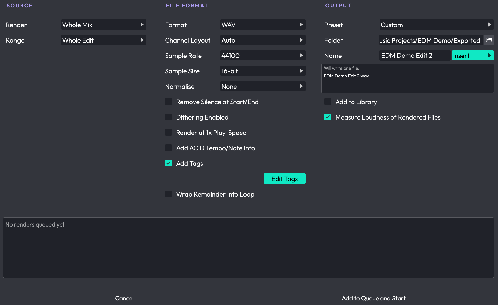
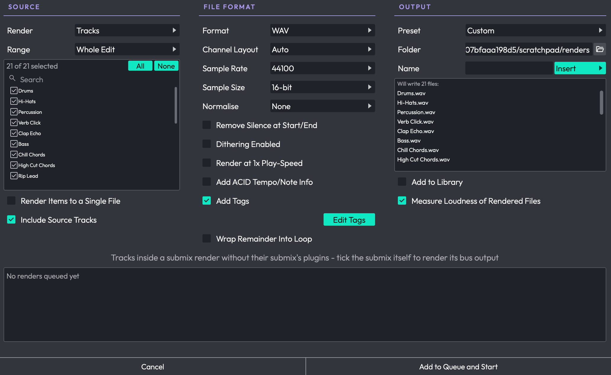
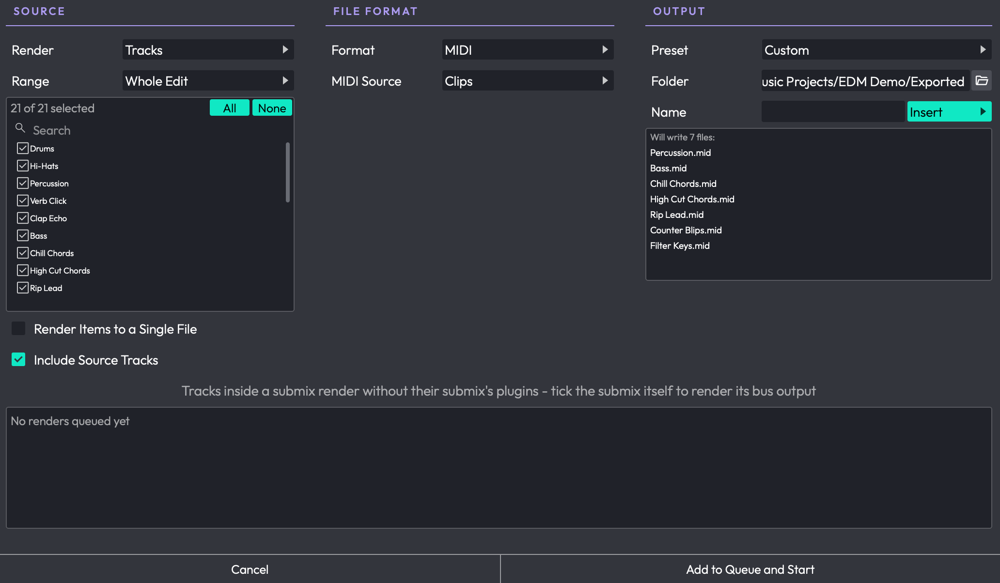
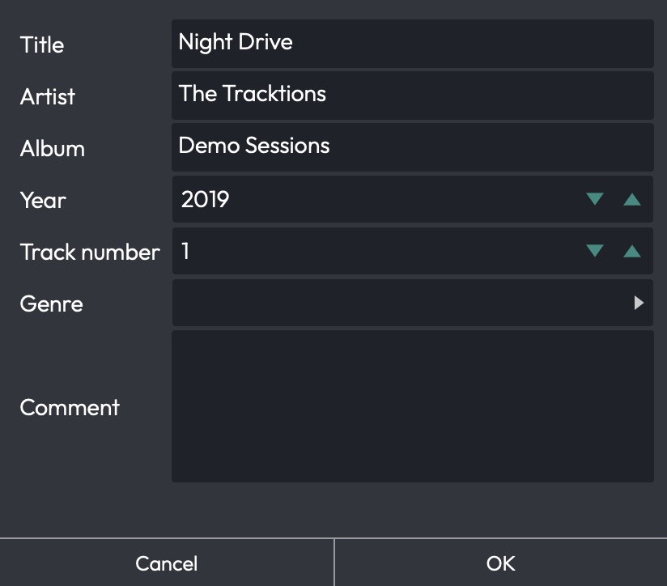
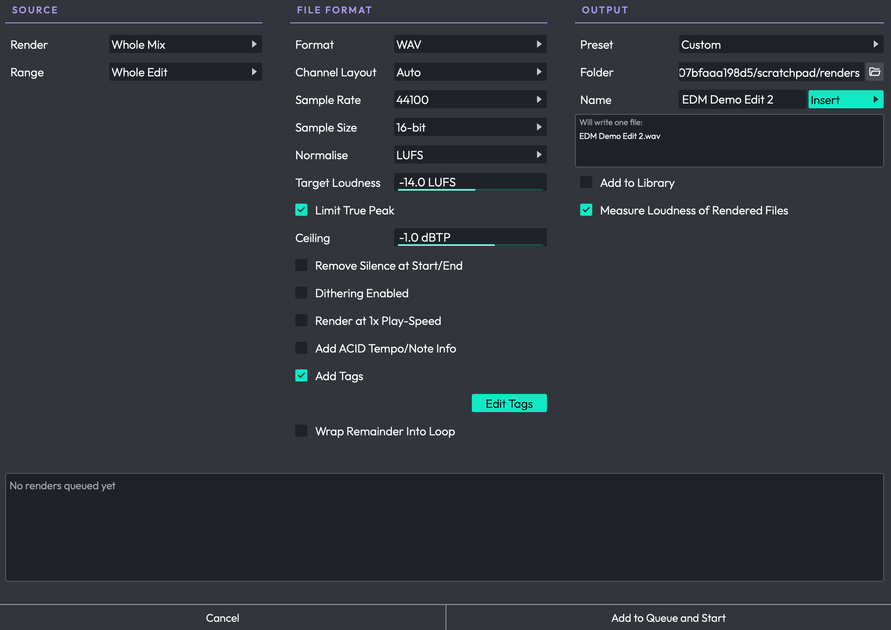
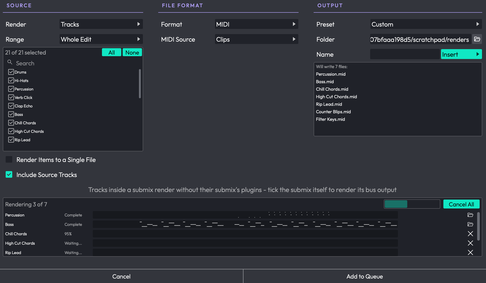
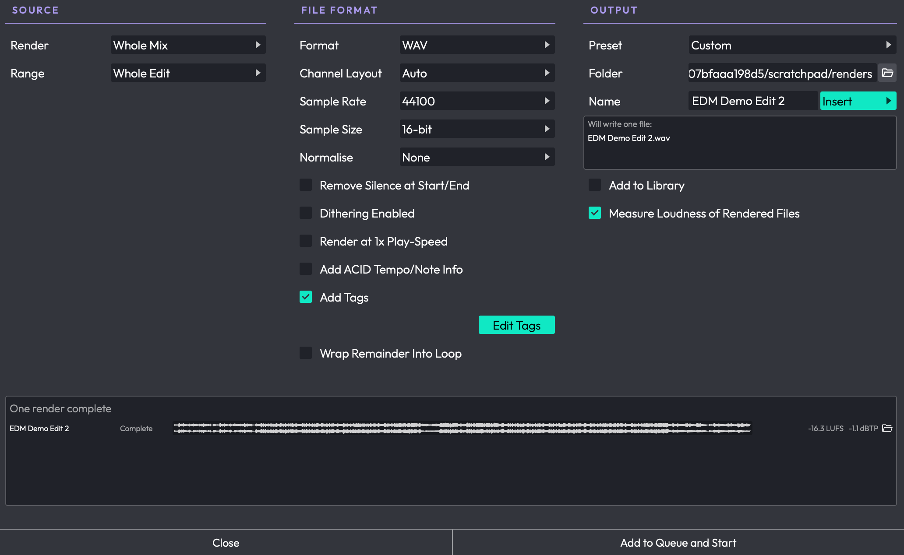
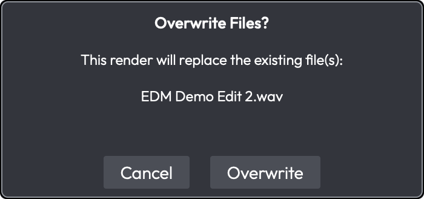

# Rendering and Stems

This chapter covers the Render dialog: the single place you go to write files out
of an Edit, whether that's one stereo mixdown, a folder of stems for someone
else's session, a MIDI file of your arrangement, or a batch of loops cut at your
markers. It also covers the render queue, file name patterns, render presets,
loudness normalising, rendering tracks and clips back into the Edit, and
rendering from the command line without opening Waveform at all.

The Mixing Down chapter covers what to do *before* you get here (master
processing, checking your levels) and how to find your files afterwards. This
chapter is about the dialog itself.



*The Render dialog: Source, File Format and Output zones, with the render queue
underneath*

## Opening the Render Dialog

Choose *File > Export: Render to a file...*. Opening the dialog stops playback,
and any plugin windows you had open are hidden while it's up. The track panel's
**Render Track** button and the clip panel's **Render Clip** menu open the same
dialog, set up for their job (see *Render Track* and *Rendering Clips* below).

The dialog is laid out in three zones, side by side:

- **Source**: what gets rendered, and how much of the Edit each file covers.
- **File Format**: what kind of file gets written, and how it's processed on
  the way out.
- **Output**: where the files go, what they're called, and what happens once
  they're written.

Underneath those sits the **render queue**, which fills up as you add renders.

Two things are worth knowing before you start. First, everything you set is
remembered with the Edit, so the dialog opens next time exactly as you left it.
Second, some of the choices depend on what you had selected in the arrangement
*when you opened the dialog*, so select your tracks or clips first, then open
it.

## Simple and Advanced Modes

The dialog has two views. **Simple** shows the settings a straightforward
mixdown needs, and **Advanced** shows every render option. Everyone starts in
Simple.

**Mode** <span class="pro">PRO</span> (Choices: Simple, Advanced): The row at
the top of the Source zone that switches between the two views. The choice is
remembered for the whole application rather than per Edit, so the dialog opens
in the mode you last used. Switching back to Simple doesn't clear your Advanced
settings; they are just not shown, and not used, until you switch back.
(Default: Simple)

Advanced mode is part of Waveform Pro. In Waveform Free the Mode row isn't
shown and the dialog is always in Simple mode.

Simple mode renders the whole mix, every track, or the selected tracks, over the
whole Edit, the marked region or the selected clips. It has every File Format
option except *Wrap Remainder Into Loop*, plus the folder, name, file list and
*Add to Library*. Everything else in this chapter marked
<span class="pro">PRO</span> needs Advanced mode: the Submixes, Groups, Tags and
Outputs scopes and the track list, *Include Source Tracks*, the per-section
ranges, *Wrap Remainder Into Loop*, render presets, the Destination row for
ordinary renders, and loudness measurement.

## Rendering the Whole Mix

The default setup renders the whole Edit to a single file, which is what you
want most of the time.

1. Set **Render** (in the Source zone) to *Whole Mix*.
2. Set **Range** to *Whole Edit*, or to *Marked Region* if you've set an
   In/Out marker range you want to bounce.
3. Pick your **Format**, **Sample Rate** and **Sample Size** in the File Format
   zone.
4. Check the **Folder** and the **Name** in the Output zone. The list underneath
   shows you exactly what's about to be written.
5. Click **Add to Queue and Start**.

The render appears as a row in the queue with a progress percentage and a
waveform that draws itself as the audio is written. When it finishes, the row
shows *Complete* and a folder button that reveals the file on your computer.

> 💡 **Tip:** The list under the Name row is the fastest way to catch a mistake.
> If it says *Nothing to render*, or names three files when you expected
> twenty-two, fix it there rather than after a ten-minute render.

## The Source Zone: Choosing What to Render

**Render** (Choices: Whole Mix, Tracks, Selected Tracks, Submixes, Groups, Tags,
Outputs): What gets rendered. *Whole Mix* writes one file for the whole Edit.
Every other choice writes one file per item. (Default: Whole Mix)

- **Tracks**: every audio track in the Edit, each to its own file. In Simple
  mode that's every track; in Advanced mode they're listed for you to tick.
- **Selected Tracks**: the tracks that were selected in the arrangement when
  you opened the dialog. There's no list to tick for this one: selecting a clip
  counts as selecting its track, a submix renders as itself, and a plain folder
  stands for the audio tracks inside it.
- **Submixes** <span class="pro">PRO</span>: every submix folder track.
- **Groups** <span class="pro">PRO</span>: every Edit Mix Group. See the Edit
  Mix Groups chapter.
- **Tags** <span class="pro">PRO</span>: every tag used on a track, so a tag
  acts as an ad-hoc stem group. Tag three tracks *Drums* and you get one *Drums*
  stem containing all three. Tags live on the tracks themselves and are saved
  with the Edit.
- **Outputs** <span class="pro">PRO</span>: the audio output devices the Edit
  plays to, with each one rendering the tracks routed to it.

In Advanced mode, choosing anything other than *Whole Mix* or *Selected Tracks*
adds a checklist of the items in that category. Its header tells you how many are ticked, and the
**All** and **None** buttons tick or untick everything currently shown. Once the
list is long enough to scroll, a filter box appears above it. Type into it to
narrow the list, then use **All** to tick just that subset. Items covering a
track you had selected in the arrangement are marked with a coloured tab down
their left edge, so you can find them quickly in a long list.



*The Tracks scope, with all 21 tracks ticked and the file list showing what the
batch will write*

If a category has nothing in it, the list says so and tells you what you'd have
to make first, for example *No tracks are tagged. Add tags to a track's
properties and each tag renders as its own stem.*

**Range** (Choices: Whole Edit, Marked Region, Selected Clips Range, Selected
Clips in Marked Region, Each Selected Clip Range, Each Marker Region, Each
Arranger Clip Region): How much of the Edit each rendered file covers.
(Default: Whole Edit)

- **Whole Edit**: start to end.
- **Marked Region**: the range between the In and Out markers.
- **Selected Clips Range**: renders the clips you had selected, and nothing
  else, into one file spanning from the first to the last. Only offered when
  clips were selected.
- **Selected Clips in Marked Region**: the same, cut down to the part of the
  clips inside the marked region. Only offered when clips were selected.
- **Each Selected Clip Range** <span class="pro">PRO</span>: renders each
  selected clip to its own file, named after the clip. This is how you turn a
  handful of clips into a set of samples in one pass. Only offered when clips
  were selected.
- **Each Marker Region** <span class="pro">PRO</span>: one file per marker
  clip, named after the marker.
- **Each Arranger Clip Region** <span class="pro">PRO</span>: one file per
  arranger clip, named after the clip, so an arrangement built on the Arranger
  track exports section by section. Only offered where the Arranger track is
  available. See the Arranger Track chapter.

> 📝 **Note:** The clip ranges render the clips themselves (nothing else on
> those tracks sounds, even if it overlaps), so they ignore the **Render** choice
> entirely. Only arrangement clips on audio tracks count; clips in Launcher slots
> and on the global tracks are left out.

**Render Items to a Single File**: Mixes everything you've ticked into one file
instead of writing one file per item. Use it to bounce a handful of chosen
tracks down to a single stem. In Simple mode it's only offered for *Selected
Tracks*, where it chooses between one file for the selection and one file per
track. (Default: off)

**Include Source Tracks** <span class="pro">PRO</span>: Also processes the tracks that feed the chosen items'
sidechains, aux buses and racks, keeping them silent in the output. This is what
makes a stem sound the way it does in the full mix: the kick still ducks the bass
through the sidechain compressor even though the kick isn't in the bass stem. Leaving
this on suits most renders, and Simple mode always leaves it on. (Default: on)

### Rendering Stems <span class="pro">PRO</span>

Rendering stems is the reason most of this zone exists. In Simple mode,
*Tracks* and *Selected Tracks* already give you a file per track; Advanced mode
adds the groupings. Pick the one that matches how you want the stems to arrive:

- Sending your song to someone mixing in another DAW? Use **Tracks**, so they
  get every track as its own file, all starting at the same point on the
  timeline.
- Delivering to a mastering engineer or a stem-mastering service? Use
  **Submixes** or **Tags**, so you hand over six or eight musical groups rather
  than sixty tracks.
- Making a live backing track set? Use **Groups** or **Tags** for the parts you
  want separate faders for on the night.
- Just need the four tracks you're looking at? Select them in the arrangement
  before you open the dialog and use **Selected Tracks**.

The dialog warns you about the one thing that catches people out. If you include
tracks that live inside a submix, it says *Tracks inside a submix render without
their submix's plugins - tick the submix itself to render its bus output*. A
track inside a submix, rendered on its own, skips whatever compression or EQ is
on the submix bus, so those stems won't add back up to your mix. Render the
submix instead when that matters.

Tracks with nothing to play are skipped rather than queued as jobs that fail, so
an Edit full of empty placeholder tracks doesn't produce a queue full of red
rows. For a MIDI render, "nothing to play" means no MIDI clips, so audio tracks
drop out of a MIDI stem batch automatically.

## The File Format Zone

**Format** (Choices: WAV, AIFF, FLAC, Ogg Vorbis, MP3, MIDI): The file format
the render is written in. Changing it keeps your sample rate, bit depth and
quality valid for the new format and swaps the file extension for you.
(Default: WAV)

### Rendering a MIDI File

Choosing **MIDI** writes the notes rather than audio, so every audio setting
below disappears: sample rate, bit depth, normalising, dithering and the rest
mean nothing to a MIDI file. In their place you get one choice:

**MIDI Source** (Choices: Clips, After MIDI Plugins): Which MIDI is written.
*Clips* writes the notes as they sit in your MIDI clips. *After MIDI Plugins*
writes the MIDI leaving each track's plugin chain instead, which bakes in
arpeggiators, chord players and other MIDI effects. (Default: Clips)

> ⚠️ **Warning:** *After MIDI Plugins* is lost if an instrument doesn't pass MIDI
> through, and many don't. If your exported MIDI file comes out empty, switch back
> to *Clips*.



*With MIDI chosen, the audio settings give way to a single MIDI Source choice,
and the 21 ticked tracks resolve to the 7 that actually hold MIDI*

Everything else works the same for MIDI as for audio: scopes, ranges, name
patterns, the queue and presets. The queue draws a small piano roll of the notes
that were written instead of a waveform. *Add to Library* and *Measure Loudness*
are hidden, since neither means anything for a MIDI file.

### Audio Settings

**Channel Layout** (Choices: Auto, Mono, Stereo, and 5.1 and 7.1 where surround
is available): How many channels each file has. *Auto* follows the source, so
leave it there unless you specifically need to force mono or a surround layout.
(Default: Auto)

**Sample Rate**: The rate the files are written at, which doesn't have to match
the Edit's. The list is whatever the chosen format supports. (Default: 44100)

**Sample Size**: Bits per sample. 32-bit float can't clip and needs no
dithering, which makes it the safe choice for files that are going on to be
processed further; 16-bit is the CD standard. (Default: 16-bit)

**Quality**: Only shown for compressed formats. Trades file size against
quality. (Default: the format's own default)

**Remove Silence at Start/End**: Trims silence from both ends of each file, so
it starts where the audio does. (Default: off)

**Dithering Enabled**: Allows the output to be dithered when it's less than 32
bits. If you don't know what dithering is, leaving this on is the right answer.
(Default: off)

**Include Tails**: Keeps rendering past the end of the range, for up to 10
seconds, so reverb and delay tails aren't cut off. It stops as soon as the
output falls silent, never runs into the next clip on the tracks being
rendered, and adds nothing if a clip is still playing across the end of the
range. Turn it off when a file has to end exactly at the end of the range, such
as a loop or a section that has to line up with others. Hidden while *Wrap
Remainder Into Loop* is ticked, since that handles the tail itself.
(Default: on)

**Render at 1x Play-Speed**: Renders in real time, taking as long as the song
does. You need this if you're mixing through outboard gear with the Insert
plugin, or if a plugin misbehaves when pushed faster than real time. Otherwise
leave it off. (Default: off)

**Add ACID Tempo/Note Info**: WAV only. Writes the tempo and root note into the
file so loop browsers and other DAWs can match it to their project.
(Default: off)

**Wrap Remainder Into Loop** <span class="pro">PRO</span>: Renders the plugin tail that runs past the end of
the range and mixes it back onto the start of the file, so the file loops
cleanly. This is the setting that turns a reverb-tailed bar into a usable
loop instead of one that stutters at the loop point. It forces *Remove Silence
at Start/End* off, since trimming would undo the effect. (Default: off)

### Tags

Tags are the track information a music player shows: title, artist, album and so
on. Waveform can write them into your rendered files, so a mixdown arrives
already labelled rather than as *Untitled* by *Unknown Artist*.

**Add Tags**: Writes this Edit's tags into the rendered files. It's ticked
automatically when the Edit already has tags, and unticking it renders without
them. (Default: on when the Edit has tags)

**Edit Tags**: Opens the tag editor. It sits at the right-hand end of the *Add
Tags* row.

The row only appears for formats that can actually carry tags: **WAV** (in a
RIFF INFO chunk), **Ogg Vorbis** (Vorbis comments) and **MP3** (ID3). AIFF and
FLAC have no tag support in their writers, and a MIDI file has nowhere to put
them, so it's hidden for those.



*The tag editor, reached from the render dialog or the Edit's properties*

The tag editor holds seven fields:

- **Title**: The track title.
- **Artist**: The artist.
- **Album**: The album the track belongs to.
- **Year**: The year. Leave it at 0 and no year is written. (Default: 0)
- **Track number**: The track's position on the album, 0 to 255. Leave it at 0
  and no track number is written. (Default: 0)
- **Genre**: Chosen from the standard genre list.
- **Comment**: A free-text comment.

> 📝 **Note:** The tags belong to the **Edit**, not to one render, so they're
> saved with your project and reused by every render you do from it. You can
> also reach the same editor without opening the render dialog: select the Edit
> and choose *Edit Tags...* in its properties.

Entering tags for the first time ticks **Add Tags** for you, and clearing them
all again unticks it, so the checkbox follows what you've actually filled in.

> ⚠️ **Warning:** The **Genre** here is the tag written into the file. It is not
> the Edit's own *Genre* property, which describes your project to the AI
> assistant. They're separate settings that happen to share a name.

### Normalising and Loudness

**Normalise** (Choices: None, Peak, RMS, LUFS): Scales the finished file's
level to a target. (Default: None)

- **Peak** shows a **Peak Level** field (−30 to 0 dB, default 0 dB) and scales
  the file so its loudest peak lands there.
- **RMS** shows an **RMS Level** field (−30 to 0 dB, default −12 dB) and scales
  the file so its average level lands there.
- **LUFS** shows a **Target Loudness** field (−30 to 0 LUFS, default −14 LUFS)
  and scales the file so its *integrated loudness*, measured to the BS.1770-4
  standard, lands there. This is the number streaming platforms care about.

The three modes share one level field, so a level you chose yourself carries
across when you switch modes; a level still sitting at the old mode's default is
replaced with the new mode's.

In LUFS mode you also get:

**Limit True Peak**: Holds the gain back so the true peak stays under the
ceiling, even if that leaves the file quieter than the loudness target. This is
the behaviour you want for anything going to a streaming platform, where an
over-the-ceiling file gets clipped by their encoder. (Default: on)

**Ceiling**: The true peak the file is kept under, from −3 to 0 dBTP.
(Default: −1.0 dBTP)



*LUFS mode, with a −14 LUFS target held under a −1 dBTP ceiling*

> 📝 **Note:** With *Limit True Peak* on, a loud target can land quieter than you
> asked for. That's the ceiling doing its job. When it happens, the queue row
> says *Limited* rather than *Complete*, and its tooltip explains why. The
> measured figures next to it tell you where the file actually ended up.

## The Output Zone

**Preset** <span class="pro">PRO</span>: Applies a saved render preset, or
saves, renames and deletes them. The row always tells you where you stand: it
shows the name of the preset your current settings match, or **Custom** when
they match none. See *Render Presets* below.

**Destination** <span class="pro">PRO</span> (Choices: File, New Track, plus
Replace Source Tracks or This Track and Replace Clips where they apply): Where
the finished files go. *File* just writes them to the folder below. The other
choices also bring each file back into the Edit, on a new track after its
source, or in place of the source tracks or clips. See *Render Track* and
*Rendering Clips* below for what each does. The row only appears for an Edit
that belongs to a project. (Default: File)

When the Destination brings the render back into the Edit, the Folder and Name
rows, the file list, *Add to Library* and *Measure Loudness* are hidden. The
file goes to the project's **Rendered** folder, named after the Edit and the
first track being rendered, for example *My Song Bass Render 1*.

**Folder**: The folder the rendered files are written to. Type a path, or use
the folder button's menu: *Browse...* picks a folder, and *Reset to Default*
goes back to the project's Exported folder. Note that this row is the *folder* only; the
file name comes from the row below. By default it's your project's **Exported**
folder; an Edit with no project falls back to the folder the Edit file is in.

**Recent**: The button beside the folder lists the last 10 folders renders went
to, from any Edit. Pick one to render there again.

Wherever the folder is, each finished file is added to the project as an
*Exported* item, so it turns up on the Projects tab alongside your other
exports.

**Name**: What the rendered files are called. How this behaves depends on how
many files you're writing:

- Rendering the **whole mix** writes one file, so plain text here is that
  file's name.
- Every other scope writes a file per item, so the text is treated as a
  *pattern* and expanded once per file.

Text containing a token is always treated as a pattern, in either mode and for
any scope.

Leave it empty and Waveform names the files after the Edit and the items being
rendered.

The **Insert** button beside the field lists the tokens a pattern understands
and appends the one you pick:

| Token | Expands to |
| --- | --- |
| `$edit` | The Edit's name |
| `$track` | The track being rendered |
| `$group` | The submix, group, tag or output being rendered |
| `$marker` | The marker, arranger clip or clip naming the rendered section |
| `$type` | master, track, stem, submix, group, output, clip or clips |
| `$samplerate` | The sample rate (dropped from a MIDI render's name) |
| `$bitdepth` | The bit depth (dropped from a MIDI render's name) |
| `$date` | Today's date, e.g. 29Jul2026 |
| `$time` | The time of the render, e.g. 140233 |
| `$index` | The file's position in the batch |

So a pattern of `$edit - $track` gives *My Song - Bass.wav*, *My Song -
Drums.wav* and so on. A token with nothing to fill it also swallows the
separator next to it, so the same pattern used for a whole-mix render gives just
*My Song.wav* rather than *My Song - .wav*.

The spellings used for recorded file names, `%edit%`, `%track%` and `%date%`,
work too, as aliases for `$edit`, `$track` and `$date`.

Under the Name row is the list of files the render will write, headed *Will
write one file:* or *Will write 22 files:*. It updates as you change anything
above it.

**Add to Library**: Adds each finished file to your loop library so you can
search for it and use it in other projects. Audio formats only. (Default: off)

**Measure Loudness of Rendered Files** <span class="pro">PRO</span>: Reads each finished file back and shows
its integrated loudness and true peak on its queue row. The measuring happens on
a background thread, one file at a time, so it doesn't compete with the render
itself, and it never affects the audio that was written. Audio formats only.
(Default: on)

## The Render Queue

Renders don't block the dialog. The queue panel at the bottom holds a row per
render job, and you can keep changing settings and adding more while earlier
ones are still running.

The action button changes to match: it reads **Add to Queue and Start** when
nothing is running, and just **Add to Queue** when a batch is already going.

Jobs run strictly one at a time, in order, so a 22-stem batch doesn't fight
itself for CPU.



*A batch part-way through: two done, one at 95%, the rest waiting, and a piano
roll of each finished MIDI file*

Each row shows:

| Column | What it shows |
| --- | --- |
| Name | The track, stem or mix being rendered |
| Status | *Waiting...*, a live percentage, then *Complete*, *Limited*, *Failed* or *Cancelled*. A render brought back into the Edit shows *Added*, *Replaced* or *Not added* instead of *Complete* |
| Preview | A waveform that draws in as the file is written (or a piano roll of the notes for a MIDI render), so you can see at a glance that something actually landed. Once the job is done it shows the finished file, after any trimming and normalising. A failed job shows its error here instead |
| Loudness | The measured integrated loudness and true peak of the finished file, e.g. *-14.2 LUFS   -1.0 dBTP*. Only filled in when *Measure Loudness of Rendered Files* is on in Advanced mode |
| Button | Cancels a job that's waiting or running; reveals the file once it's done |

The header line above the rows answers "how much is left" without scrolling:
*Rendering 4 of 22* while it runs, then *22 renders complete*, with *, 1 did not
finish* appended if anything failed or was cancelled. A progress bar and a
**Cancel All** button sit beside it while the queue is running.



*A finished render, measured: −16.3 LUFS at −1.1 dBTP*

## Render Presets <span class="pro">PRO</span>

Presets are global: they're saved with the application rather than with an
Edit, so a preset you make in one project is there in all of them.

To save one, set the dialog up how you want it, open the **Preset** dropdown and
choose *Save preset...*, then give it a name. The same dropdown gains *Rename
preset* and *Delete preset* entries once a preset is active.

The Preset row keeps itself honest: change any setting and it switches to
**Custom**, and set things back to what a preset holds and its name reappears.
The destination folder takes no part in that comparison, so working in a
different project doesn't stop a preset from matching.

Applying a preset restores everything except the destination folder, which stays
as it is. The folder is specific to the machine and the project you're working
on, and a preset shouldn't drag your files somewhere else. If a preset was saved
from a different Edit and names tracks or submixes that don't exist here,
Waveform drops the ones it can't find rather than failing.

Good candidates for presets: *Streaming master* (WAV, 24-bit, LUFS −14 with a
−1 dBTP ceiling), *Stems for mixing* (Tracks, all ticked, Include Source Tracks
on, 24-bit), *MP3 reference* (MP3 320, whole mix), *MIDI for the arranger* (MIDI,
Tracks, source *Clips*).

## Render Track

The **Render Track** button in a track's properties opens the Render dialog set
up to mix the selected tracks into one file and bring it back into the Edit.
It's set to *Selected Tracks* with *Render Items to a Single File* ticked.

**Destination** (Choices: File, New Track, Replace Source Tracks): What happens
to the rendered file. *New Track* puts it on a new track after the source
tracks. *Replace Source Tracks* puts it in place of them, and asks you to
confirm before the render starts. *File* just writes the file.
(Default: New Track)

To render the tracks' MIDI instead of audio, set **Format** to *MIDI* and choose
the **MIDI Source** as usual.

Render Track remembers its own settings from one render to the next, separately
from the settings the Edit uses for ordinary renders, so setting it up doesn't
change your mixdown settings. In Waveform Pro it opens in Advanced mode, without
changing the mode your ordinary renders use. In Waveform Free it opens in Simple
mode but keeps its Destination row.

## Rendering Clips

The **Render Clip** button in a clip's properties opens a menu of render
entries: render the selected clips, render just their marked region, either of
those *and replace* the clips, and, for MIDI clips, the same four under *Render
MIDI*. Each entry opens the Render dialog set up for it, so you can check or
change the options before rendering.

The Range is set to *Selected Clips Range*, or *Selected Clips in Marked Region*
for the marked-region entries.

**Destination** (Choices: File, New Track, This Track, Replace Clips): Where the
render ends up. *This Track* puts it on the track of the last selected clip and
leaves the clips where they are. *Replace Clips* puts it in place of the clips,
and asks you to confirm before the render starts. *New Track* puts it on a new
track, and *File* just writes the file. (Default: This Track, or Replace Clips
for the *and replace* entries)

The clips render through their own tracks and the track each one outputs
into, and nothing else on those tracks sounds. The new clip takes the colour
of the clips it came from. Like Render Track, the clip entries remember their
own settings, open in Advanced mode in Waveform Pro, and open in Simple mode in
Waveform Free with the clip range and destinations kept.

*Flatten the selected clip*, *Merge the selected clips* and the Chord Player's
render don't open the dialog. They bounce with fixed settings behind a progress
bar and replace the clips.

## Rendering From the Command Line

Waveform can render without opening its interface at all, which is useful for
batch jobs, overnight renders and build servers. Run the Waveform application
with `render` and an Edit file:

```
Waveform render MySong.tracktionedit --output /tmp/mixes --format wav --bit-depth 24
```

There are four commands:

- **render**: renders the Edit using the settings you give it.
- **list-items**: prints the renderable items (tracks, submixes, groups, tags,
  outputs) and the markers, so you know what you can ask for. In Waveform Free
  it lists only tracks.
- **validate-config**: checks the settings and renders nothing.
- **run-tests**: runs Waveform's own test suite headlessly.

The options mirror the dialog: `--format` (including `midi`), `--sample-rate`,
`--bit-depth`, `--channels`, `--midi-after-plugins`, `--normalise`,
`--normalise-rms`, `--normalise-lufs`, `--normalise-level`,
`--true-peak-ceiling`, `--no-true-peak-limit`, `--trim-silence`, `--dither`,
`--real-time`, `--no-tails`, `--wrap-remainder`, `--add-acid`,
`--separate-files`, `--category`, `--items`, `--together`, `--marker-clips`,
`--start`, `--end`, `--name-pattern` and `--force`. Add `--json` for
machine-readable output.

`--no-tails` turns off *Include Tails*, so each file ends exactly at the end of
its range. In a config file, and in the scripting API's `render.renderToFile`,
the same setting is the `includeTails` key, which defaults to true.

In Waveform Free, `--category` only accepts `tracks`, and `--together`, `--marker-clips` and
`--wrap-remainder` need Waveform Pro: a render that asks for them is refused
with an error naming the option, rather than rendering something different.

Settings are layered, with later layers winning per setting: built-in defaults,
then `WAVEFORM_RENDER_*` environment variables, then any `--preset` you name,
then each `--config` JSON file in order, then individual flags. Because config
files use the same format the dialog saves in, a preset you made in the dialog
can be handed straight to the command line.

> 💡 **Tip:** `validate-config` is the cheap way to check a long batch before you
> start it. It resolves everything and reports problems without rendering a
> single sample.

## Rendering From the AI Assistant

The assistant can render for you, and can measure what it rendered. Ask it for
"a 24-bit WAV of the whole mix", "stems for each submix" or "a MIDI file of the
drum track" and it uses the same render engine this dialog does. It can also
analyse a finished file and report its loudness, true peak, loudness range,
clipped samples and frequency balance, useful for a quick "is this loud enough
for Spotify?" check.

In Waveform Pro it can also measure your project directly, without you
rendering anything: the whole mix, a time range, or each track as a separate
stem. It renders to a temporary file, measures loudness, dynamics, spectrum and
stereo field, and deletes the file. Type **`/mixcheck`** in the assistant for a
one-step release check against streaming targets, or `/mixcheck` followed by a
platform name for a specific one. See *Checking your mix* in The AI Assistant
chapter, and the **Loudness Meter** in Utility Plugins for the same readings
live.

## ⚡ Things to Watch Out For

**Selections are read when the dialog opens.** *Selected Tracks* and the
selected-clip ranges all use what was selected at that moment.
Changing the selection behind the dialog does nothing. If you picked *Selected
Tracks* with nothing selected, it tells you: *No tracks were selected when this
window opened - select some and reopen it*.

**"Each Marker Region" and "Each Arranger Clip Region" need a scope other than
Whole Mix.** Pick one of the item categories first, or the dialog will tell you
it can't do it.

**Simple mode renders what it shows, not what Advanced mode was set to.** If
you set up a Submixes, Groups, Tags or Outputs render in Advanced mode and then
switch to Simple, the render falls back to the whole mix. *Tracks* renders every
track, whatever was ticked in Advanced mode's list.

**Marked Region with no marked region renders everything.** If you choose
*Marked Region* without having set one, the dialog warns you that the whole Edit
will be rendered instead.

**Generated names never overwrite; a name you chose might.** Names built from a
pattern are made unique against each other and against what's already on disk,
so a second batch lands beside the first rather than on top of it. A file name
you typed yourself can collide, and when it does you get an *Overwrite Files?*
confirmation listing exactly which files would be replaced.



*The confirmation names the files a render would replace*

**Closing the dialog cancels renders that are still going.** If anything is
still queued or running, you're asked to confirm, with *Stop and Close* and
*Keep Rendering* to choose between.

**A cancelled or failed render leaves no half-file behind.** Partial files are
cleaned up rather than left on disk to be mistaken for finished ones.

## Moving On

See the Mixing Down chapter for the master-processing side of getting a mix
ready to render, the Edit Mix Groups and Submix Tracks chapters for setting up
the groupings the stem categories use, the Using Markers and Arranger Track
chapters for defining the regions the per-region ranges render, and the Working
With Loops chapter for what *Add to Library* does with your renders.
