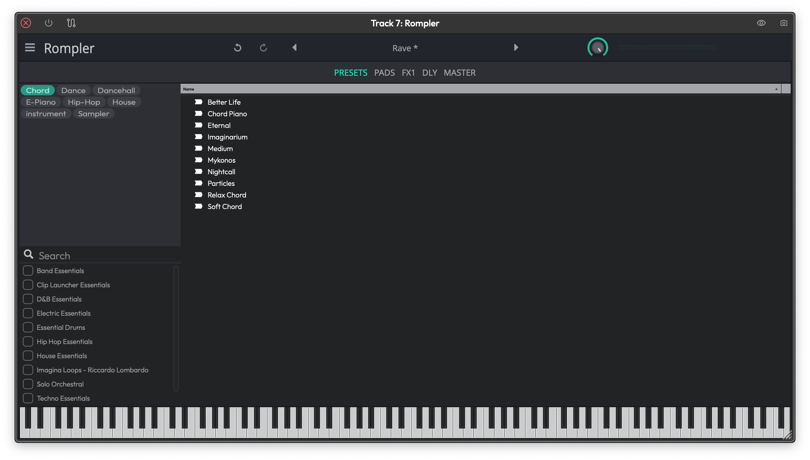
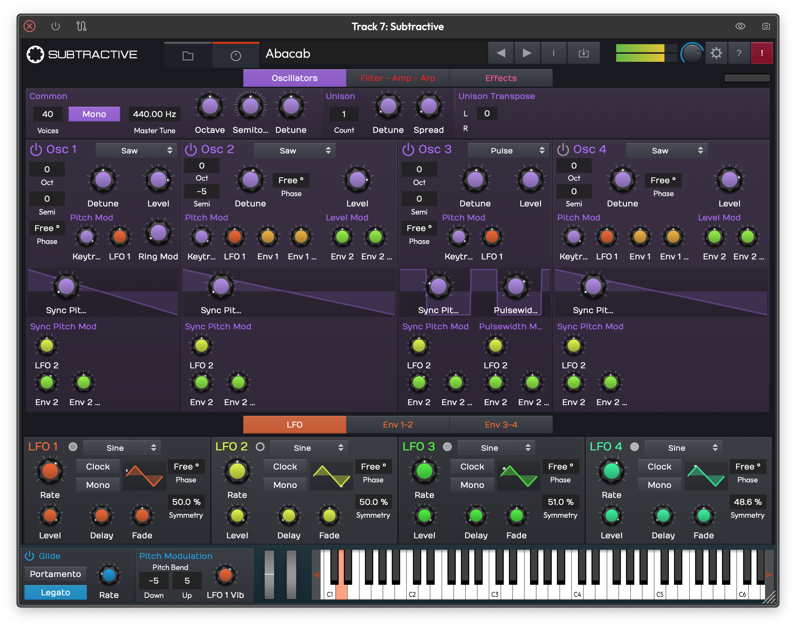

# Samplers and Instruments

Waveform includes a family of built-in samplers — from a simple free-tier drum pad to a full multi-layer keyboard sampler — plus a multi-oscillator subtractive synthesizer called **Subtractive**. All of these live in the **Instruments** category of the plugin picker. This chapter walks through each one and explains when you'd reach for it.

## The Sampler Family at a Glance

There are five built-in samplers, and it's worth knowing which is which before loading one up:

| Plugin | What it is | Available in |
|---|---|---|
| **Micro Drum Sampler** | Pad-based, one-shot only, 64 pads | All editions (Free, OEM, Pro) |
| **Micro Sampler** | Keyboard sampler, single layer | All editions (Waveform 12+) |
| **Rompler** | Factory preset playback, keyboard-style | All editions (Waveform 12+) |
| **Drum Sampler** | Full pad sampler with velocity layers and note repeat | Pro (or MIDI Producer / Synth Pack expansions) |
| **Multi Sampler** | Full keyboard sampler, up to 32 layers, SFZ/SF2, per-layer FX | Pro (or MIDI Producer / Synth Pack expansions) |

The **legacy Sampler** (the original simple sampler) is a separate, older plugin — it's described in the Legacy Plugins chapter.

---

## Pad-Based Samplers: Drum Sampler and Micro Drum Sampler

*The Drum Sampler showing the 4×4 pad grid with bank selector and per-pad controls.*

The **Drum Sampler** and **Micro Drum Sampler** are built around a 4×4 pad grid. They work like a hardware drum machine: each pad holds a sample, and you trigger pads via MIDI notes or by clicking them.

### Pads and Banks

Each sampler has **four banks** (A, B, C, D), each containing 16 pads — 64 pads total. Switch banks using the bank selector buttons. Pads in different banks map to different MIDI notes, so you can spread a full kit across all four banks if you need more than 16 sounds.

To load a sample onto a pad, drag an audio file from the Browser directly onto the pad. You can also click a pad to select it, then use the file browser to choose a sample.

Each pad has a **Solo** and **Mute** button for quick auditioning.

### Micro Drum Sampler vs Drum Sampler

*The Micro Drum Sampler, a cut-down one-shot version of the Drum Sampler.*

The **Micro Drum Sampler** is a cut-down version and is available in all editions of Waveform. It supports one-shot playback only — the sample plays through to the end whenever the pad is triggered, regardless of how long you hold the note.

The **Drum Sampler** (Pro only) adds:

- **Velocity layers** — assign different samples to play at different velocity ranges on the same pad, for more expressive drum sounds
- **Note Repeat** — holds down a pad and automatically re-triggers it at a tempo-synced rate (see below)
- **MIDI Learn** — right-click a pad to assign it to an incoming MIDI note

### Note Repeat

The **Note Repeat** feature is available on the Drum Sampler. When enabled, holding a pad triggers it repeatedly at a tempo-synced rate while the note is held. Use the **Repeat Rate** control to set the subdivision (e.g. 1/8, 1/16). This is useful for rolls and fills.

> 💡 **Tip:** Note Repeat is great for building fills on the fly during live performance. Hold a snare pad, enable Note Repeat, and sweep the rate to create a build-up effect.

---

## Keyboard Samplers: Multi Sampler, Micro Sampler, and Rompler

*The Multi Sampler zone grid showing multiple layers mapped to note and velocity ranges.*

The keyboard-style samplers let you map samples across the note and velocity range of your keyboard. Each sample assignment is called a **layer**, and each layer covers a note range and a velocity range.

### The Zone Grid

The zone grid is the central view in the Multi Sampler and Micro Sampler. It shows a grid with:

- **Horizontal axis** — note range (low to high pitch)
- **Vertical axis** — velocity range (soft to hard)

Each layer appears as a rectangle on the grid. You define the rectangle by setting a **low note**, **high note**, **low velocity**, and **high velocity** for that layer. If a played note falls inside a layer's rectangle, that layer's sample plays.

You can have **up to 32 layers** in the Multi Sampler. Layers can overlap — if multiple layers match a played note, all of them sound, which is how round-robin and velocity crossfade works.

To add a layer, drag an audio file directly onto the zone grid. Waveform creates a new layer at the position you drop it.

### Supported Sample Formats

In addition to standard audio files (WAV, AIFF), the keyboard samplers support loading complete multi-sample instruments:

- **SFZ** — open-format text-based sample maps
- **SF2** (SoundFont 2) — widely used bank format
- **ZIP** — a packaged collection of samples with a map

Drag any of these formats onto the sampler to load the full instrument in one step.

### Per-Layer Controls

Once you've selected a layer, you can fine-tune how it plays:

**Root Note** — the pitch at which the sample plays at its original pitch. Notes above or below this will pitch the sample up or down accordingly.

**Gain** — volume of this layer. (Default: 0 dB)

**Pan** — stereo position. (Default: center)

**Fine Tune** — pitch offset in cents. Use this to correct slightly out-of-tune samples. (Default: 0)

**Sample In / Out** — sets the start and end point within the audio file. Drag the waveform display's handles to trim the sample. (Default: full file)

**Loop In / Out** — sets the loop region within the sample. Requires looping to be enabled.

**Choke Group** — assign a choke group number so that triggering one layer silences others in the same group (e.g. open hi-hat choked by closed hi-hat). (Default: none)

### Filter (Per Layer)

Each layer has an optional filter. Enable it with the filter toggle, then set:

**Filter Mode** — choose between lowpass, highpass, bandpass, and other types.

**Cutoff** — the filter's cutoff frequency. (Default: open / no filtering)

**Q** — resonance. Higher values create a sharper peak at the cutoff. (Default: 0)

### Envelope (Per Layer)

Each layer has an amplitude envelope with adjustable curve shapes:

**Attack** — time to reach full volume. (Default: 0)

**Attack Shape** — curve shape of the attack ramp (linear to logarithmic).

**Decay** — time to fall from peak to sustain. (Default: 0)

**Decay Shape** — curve shape of the decay.

**Sustain** — volume level held while the note is held. (Default: full)

**Release** — time to fall to silence after the note is released. (Default: short)

**Release Shape** — curve shape of the release.

### LFOs (Per Layer — Multi Sampler)

The **Multi Sampler** gives each layer **two LFOs** for modulation. Each LFO has:

**Shape** — waveform type (sine, triangle, saw, square, etc.)

**Rate** — speed of the LFO in Hz. Can be synced to host tempo.

**Level** — depth of the modulation. (Default: 0)

**Phase** — starting phase. (Default: 0)

**Delay** — time before the LFO kicks in after note-on. Useful for delayed vibrato. (Default: 0)

**Fade** — time for the LFO to fade in after its delay. (Default: 0)

### Per-Layer FX Buses (Multi Sampler, Pro only)

The **Multi Sampler** (Pro, Waveform 12+) adds a per-layer **FX chain** with six effect slots. These require the `samplerFX` feature, which is available in Pro editions.

Available effects per layer:

- **Reverb** — Natural, Non-linear, or Plate types. Controls: pre-delay, size, decay, diffusion, low/high cut, low/high damping, pan, mix.
- **Distortion** — Drive, post gain, tone, emphasis, mix.
- **Chorus** — Delay, depth, rate, mix.
- **Compressor** — Threshold, ratio, attack, release, knee, output.
- **Delay** — Low cut, high cut, feedback, delay time, mix.
- **EQ** — Three-band (low/mid/high) with per-band frequency and gain.
- **Filter** — Shape, slope, frequency, gain, Q.

> 💡 **Tip:** Per-layer FX lets you put reverb on your pads and a compressor on your kick simultaneously, all inside a single plugin instance. I use this to keep my template tracks tidy.

### Micro Sampler vs Multi Sampler

*The Micro Sampler, a single-layer keyboard sampler.*

The **Micro Sampler** is a simpler keyboard sampler available in all editions. It supports a single layer (not a full zone grid) and doesn't have the per-layer LFOs, FX buses, or multi-format import. It's a good choice if you just need to load one sample and play it across the keyboard without the overhead of the full Multi Sampler.

### Rompler

*The Rompler, a preset-based keyboard instrument.*

The **Rompler** is a preset-based instrument: it plays back factory sample banks without letting you edit the zone grid directly. Think of it as a read-only Multi Sampler, designed for quickly loading and playing pre-built instruments. It has the same keyboard layout view as the other samplers, but you can't drag new samples onto it — just pick a preset and play.

---

## Subtractive Synthesizer

*The Subtractive synthesizer showing oscillators, filters, and the arpeggiator.*

**Subtractive** is Waveform's built-in multi-oscillator synthesizer. It's a traditional subtractive/hybrid design: oscillators generate a raw waveform, filters shape the tone, and envelopes and LFOs add movement. It's a Pro-only instrument (or available with the MIDI Producer or Synth Pack expansions).

> 📝 **Note:** **Collective**, which is a related instrument, ships with its own dedicated manual and is not covered here.

### Oscillators

Subtractive has **four oscillators**. Each oscillator has a type selector — choose from the available waveforms (saw, square, triangle, and others). The sine and granular waveform types are not available in Subtractive (they're used in the companion Collective instrument).

Each oscillator has pitch, level, and pan controls, and you can route each oscillator independently through the filter and amp section.

### Filters

The synth has **two filters** that can run in parallel or series. Each filter has the standard controls: cutoff, resonance, and envelope amount. Use the two filters together to create complex, multi-layered tone-shaping — for example, a lowpass on one and a bandpass on the other.

### Envelopes and LFOs

Subtractive provides **two envelopes** and **four LFOs** as modulation sources. Envelopes follow standard ADSR shapes. LFOs offer multiple waveform shapes, rate control (free or tempo-synced), phase offset, delay, and fade.

### Arpeggiator

The built-in **arpeggiator** takes the notes you hold and re-plays them in a pattern. Toggle it with the Arp enable button. Key controls:

**Mode** — pattern direction (up, down, alternate, random, chord).

**Rate** — tempo-synced speed.

**Latch** — when enabled, the arpeggio keeps playing after you release the keys.

### FX Page

Subtractive includes a dedicated **FX page** with built-in effects — the equivalent of the effects chains found in the Wavetable synthesizer. Switch to the FX page from the main navigation tabs.

### Drive and EQ

A **Drive** section adds harmonic saturation to the output before the effects chain. A global **EQ** gives you final tonal shaping.

### Preset Browser

Subtractive ships with a library of factory presets. Use the preset browser at the top of the plugin to navigate categories (basses, leads, pads, arps, keys) and audition sounds. You can save your own patches alongside the factory library.

### Unison

**Unison** stacks multiple voices per note for a thicker, wider sound. You can set the number of unison voices and the detune spread per voice. More voices means more CPU, so dial it back if you're running many instances.

### Bass Osc

*The Bass Osc, a compact single-oscillator bass synthesizer.*

**Bass Osc** is a small single-oscillator synth built for bass sounds. A single **Wave** control morphs the oscillator shape, while **Tune** and **Detune** set its pitch. The signal passes through one resonant filter with **Cutoff**, **Res**, and **Drive** controls, and decay-based amp and filter envelopes (each with a velocity amount) shape the sound over time. A **Glide** control gives smooth pitch slides between notes for classic bass lines, and it ships with a set of factory presets.

---

## ⚡ Things to Watch Out For

- **Edition gating.** The Drum Sampler and Multi Sampler are Pro-only. If you open a project that uses them in a Free or OEM edition, the plugins will be present in the chain but won't produce sound. Check the plugin's status indicator if a sampler seems silent.

- **Micro Drum Sampler is one-shot only.** Samples always play to their end — there's no way to cut them short by releasing the MIDI note. If you need note-length control, use the Drum Sampler (Pro).

- **Per-layer FX require Pro.** Even if you have a Multi Sampler loaded, the per-layer effects chain requires the `samplerFX` feature. In Free/OEM editions, those effect slots will be inactive.

- **Zone overlaps are intentional.** The zone grid allows layers to overlap. If you're hearing two samples at once when you expected one, check whether two layers cover the same note/velocity area. Overlapping is by design for crossfades and round-robin setups, but it can be surprising the first time.

- **SFZ/SF2 imports may be large.** Loading a full SFZ or SF2 instrument bank can bring in a large number of audio files at once. On older or slower drives, the initial load may take a moment.

- **The legacy "Sampler" plugin is different.** There's still an older plugin named simply "Sampler" in the Legacy category. It's a different plugin with a different interface. If you're looking for the new family described in this chapter, choose from the **Instruments** category in the plugin picker.

## Moving On

The built-in samplers cover everything from a quick one-shot pad hit to a fully mapped keyboard instrument with per-layer effects. The Multi Sampler in particular is worth exploring if you're building your own instruments from sample libraries or SFZ banks. For step-sequenced drum patterns, see the **Step Clips** chapter — it has tips on combining step clips with the Drum Sampler for beat programming. For the synthesizer side, the **4OSC Synthesizer** and **Wavetable Synthesizer** chapters cover the other built-in synths.
