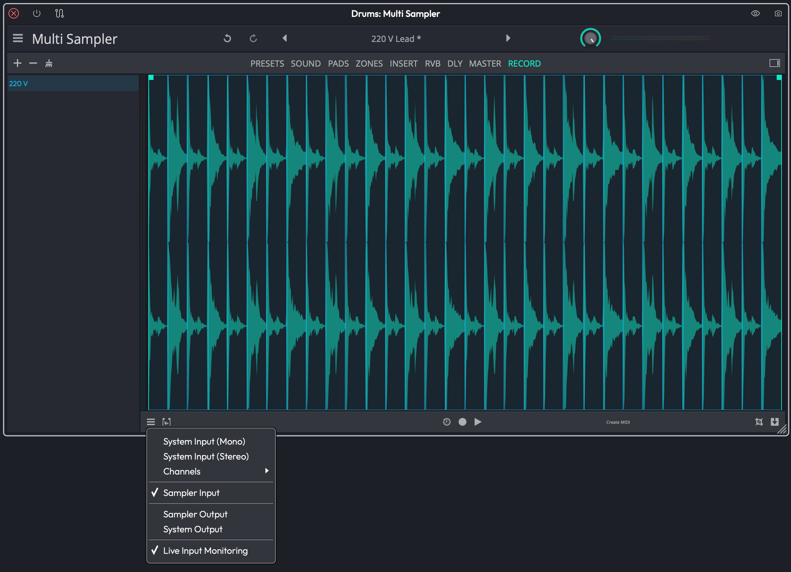
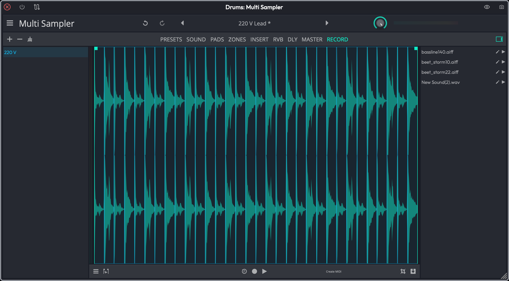
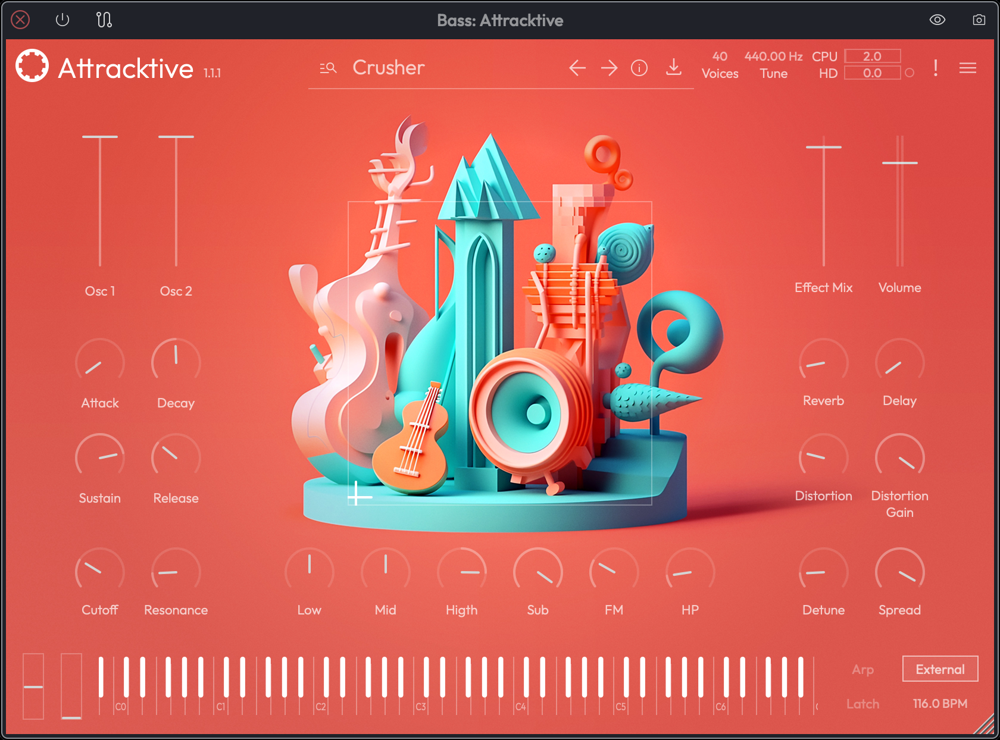

# Samplers and Instruments

Waveform has a family of built-in samplers, from the Micro Drum Sampler (in every edition) to a full multi-layer keyboard sampler. Alongside them are the **Subtractive** and **Bass Osc** synthesisers and **Attracktive**, a free player for Tracktion's sound packs. All of these are in the *Waveform > Instruments* folder of the plugin picker.

## The Sampler Family at a Glance

There are five built-in samplers:

| Plugin | What it is | Available in |
|---|---|---|
| **Micro Drum Sampler** | Pad-based, one-shot only, 64 pads | All editions (Free, OEM, Pro) |
| **Micro Sampler** | Keyboard sampler, note zones, WAV/AIFF | All editions |
| **Rompler** | Factory preset playback, keyboard-style | All editions |
| **Drum Sampler** | Full pad sampler with velocity layers and note repeat | Waveform Pro, or the MIDI Producer Expansion or the Synth Pack Expansion |
| **Multi Sampler** | Full keyboard sampler, up to 32 layers, SFZ/SF2 | Waveform Pro, or the MIDI Producer Expansion or the Synth Pack Expansion |

The **legacy Sampler** (the original simple sampler) is a separate, older plugin. It's described in [Legacy Plugins](legacy-plugins.md).

---

## Pad-Based Samplers: Drum Sampler and Micro Drum Sampler

*The Drum Sampler showing the 4×4 pad grid with bank selector and per-pad controls.*

The **Drum Sampler** and **Micro Drum Sampler** are built around a 4×4 pad grid. They work like a hardware drum machine: each pad holds a sample, and you trigger pads with MIDI notes or by clicking them.

### Pads and Banks

Each sampler has **four banks** (A, B, C, D), each containing 16 pads (64 pads total). Switch banks with the bank selector buttons. Pads in different banks map to different MIDI notes, so you can spread a full kit across all four banks if you need more than 16 sounds.

To load a sample onto a pad, drag an audio file from the Browser onto the pad. You can also click a pad to select it and choose a sample with the file browser.

Each pad has a **Solo** and **Mute** button for quick auditioning.

### Micro Drum Sampler vs Drum Sampler

*The Micro Drum Sampler, a cut-down one-shot version of the Drum Sampler.*

The **Micro Drum Sampler** is a cut-down version and is available in all editions of Waveform. It supports one-shot playback only: the sample plays through to the end whenever the pad is triggered, however long you hold the note.

The **Drum Sampler** PRO (Waveform Pro, or the MIDI Producer Expansion or the Synth Pack Expansion) adds:

- **Velocity layers**: assign different samples to play at different velocity ranges on the same pad, for more expressive drum sounds
- **Note Repeat**: re-triggers a held pad automatically at a tempo-synced rate (see [Note Repeat](#note-repeat))

On both drum samplers, the **Toggle MIDI learn** button in the pad header assigns a pad to an incoming MIDI note. Right-clicking a pad opens its menu instead: **Drum Icon**, **Colour** and **Clear**. On the Micro Drum Sampler, the menu button on the pad's sound row has **Drum Icon**, **Colour**, **Choke group** and **Delete**.

### Note Repeat PRO { #note-repeat }

> 📝 **Edition:** Waveform Pro, or with the MIDI Producer Expansion or the Synth Pack Expansion.

Note Repeat is on the Drum Sampler. When it's on, holding a pad triggers it repeatedly at a tempo-synced rate for as long as the note is held. Use the **Repeat Rate** control to set the subdivision (for example 1/8 or 1/16). This is useful for rolls and fills: hold a snare pad and sweep the rate for a build-up.

### Pad Layouts and Pad Settings

The **Load / Save pad layout preset** button, next to **Toggle MIDI learn**, opens a menu:

- **Load Pad Layout...**: loads a saved `.padpreset` file onto the pads.
- **Save Pad Layout...**: saves the current pads. Choose what to store: **MIDI Note** (ticked by default), **Name**, **Icon** and **Colour**.
- **Default Pad Layout**: picks a saved layout to apply whenever the sampler sets up its default pads, or **None**.

On the Drum Sampler and the Multi Sampler's PADS page, the top row of the list to the right of the pads holds the selected pad's sound settings, plus:

**Spread Zones**: Divides the velocity range evenly between the pad's sound layers, so each layer plays for its own slice of velocities.

**Choke**: Puts the pad in a choke group (Group 1 to Group 16, or **None**). Triggering a pad silences the other pads in the same group, for example a closed hi-hat cutting off an open one.

**Stereo Out**: Sends the pad to one of the sampler's 16 stereo outputs, so you can process it on its own.

The Multi Sampler also has a **PADS** page. Whenever you open it with no pads set up, Waveform offers to set up default pads (**Setup Pads**).

---

## Keyboard Samplers: Multi Sampler, Micro Sampler, and Rompler

*The Multi Sampler zone grid showing multiple layers mapped to note and velocity ranges.*

The keyboard-style samplers let you map samples across the note and velocity range of your keyboard. Each sample assignment is called a **layer**, and each layer covers a note range and a velocity range.

### The Zone Grid

The zone grid is the central view in the Multi Sampler and Micro Sampler. It shows a grid with:

- **Horizontal axis**: note range (low to high pitch)
- **Vertical axis**: velocity range (soft to hard)

Each layer appears as a rectangle on the grid. You define the rectangle by setting a **low note**, **high note**, **low velocity**, and **high velocity** for that layer. If a played note falls inside a layer's rectangle, that layer's sample plays. In the Micro Sampler, layers only have a note range.

You can have **up to 32 layers** in the Multi Sampler. Layers can overlap. By default, if multiple layers match a played note, all of them sound. The play mode in the Options menu (see [Layer and Zone Tools](#layer-and-zone-tools)) can change that to Round Robin or Random.

To add a layer, drag an audio file onto the zone grid. Waveform creates a new layer where you drop it.

### Layer and Zone Tools

Right-click a sound layer, in the zone grid or the layer list, for these options:

- **Remove**, **Rename** and **Duplicate**.
- **Duplicate: Pitch shifted up** / **Duplicate: Pitch shifted down**: for a layer mapped to a single note, makes 1x to 12x copies on the notes above or below, each pitched to its note.
- **Quick Zones**: maps the layer to a single drum note: **Kick**, **Snare**, **Hi Hat Closed**, **Hi Hat Open**, **Clap**, **Low Tom**, **Hi Tom** or **Ride**.

The menu button in the sampler's title bar opens the Options menu:

**MPE**: Turns on MPE (MIDI Polyphonic Expression) input, for MPE controllers.

**Voice Stealing**: Lets a new note take over a playing voice when every voice is in use.

**Mono**: Plays one note at a time.

**Select sound layer on note on**: Selects the layer you play, so its settings show as you play.

**All** / **Round Robin** / **Random**: What happens when several layers match a note. **All** plays every one of them, **Round Robin** takes turns, and **Random** picks one at random. (Default: All; Round Robin on the Drum Sampler)

**Panic**: Stops every sounding note.

The Micro Drum Sampler's Options menu only has **Voice Stealing** and **Panic**.

### Supported Sample Formats

As well as standard audio files (WAV, AIFF), the Multi Sampler can load complete multi-sample instruments:

- **SFZ**: open-format text-based sample maps
- **SF2** (SoundFont 2): widely used bank format
- **ZIP**: a packaged collection of samples with a map

Drag any of these formats onto the sampler to load the full instrument in one step.

### Per-Layer Controls

Select a layer to fine-tune how it plays:

**Root Note**: the note at which the sample plays at its original pitch. Notes above or below it pitch the sample up or down.

**Gain**: volume of this layer. (Default: 0 dB)

**Pan**: stereo position. (Default: centre)

**Fine Tune**: pitch offset in cents. Use it to correct slightly out-of-tune samples. (Default: 0)

**Sample In / Out**: sets the start and end point within the audio file. Drag the waveform display's handles to trim the sample. (Default: full file)

**Loop In / Out**: sets the loop region within the sample. Only applies when looping is on.

**Loop** (Choices: Loop: None, Loop: Until Release, Loop: Until End): turns looping on. **Until Release** loops while the note is held, then plays on to the end. **Until End** keeps looping until the note's release has finished.

**Key tracking mode** (Choices: Fixed Pitch, Resample, Pitch Shift): how the layer follows the notes you play. **Fixed Pitch** plays the sample at its own pitch on every note, which suits drums. **Resample** speeds the sample up or slows it down, like a tape machine. **Pitch Shift** changes the pitch without changing the length.

**Reverse**: plays the sample backwards.

**Offline pitch shift** and **Offline timestretch**: process the sample itself, shifting its pitch in semitones or changing its length. The Micro Sampler doesn't have these two.

**Choke Group**: assign a choke group number so that triggering one layer silences others in the same group (for example, a closed hi-hat cutting off an open one). (Default: none)

### Filter (Per Layer)

Each layer has an optional filter, off by default. Turn it on with the filter toggle, then set:

**Filter Mode**: choose between lowpass, highpass, bandpass, and other types.

**Cutoff**: the filter's cutoff frequency. (Default: 20 kHz)

**Q**: resonance. Higher values create a sharper peak at the cutoff. (Default: 0.001)

### Envelope (Per Layer)

Each layer has an amplitude envelope with adjustable curve shapes:

**Attack**: time to reach full volume. (Default: 1 ms)

**Attack Shape**: curve shape of the attack ramp (linear to logarithmic).

**Decay**: time to fall from peak to sustain. (Default: 285 ms)

**Decay Shape**: curve shape of the decay.

**Sustain**: the volume while the note is held. (Default: 100%)

**Release**: time to fall to silence after the note is released. (Default: 1 ms)

**Release Shape**: curve shape of the release.

### LFOs (Per Layer, Multi Sampler) PRO { #lfos-per-layer-multi-sampler }

> 📝 **Edition:** Waveform Pro, or with the MIDI Producer Expansion or the Synth Pack Expansion.

The **Multi Sampler** gives each layer **two LFOs** for modulation. Each LFO has:

**Shape**: waveform type (sine, triangle, saw, square, etc.)

**Sync**: switches the rate between a free rate in Hz and a tempo-synced rate.

**Rate**: speed of the LFO, in Hz or as a tempo division depending on Sync. (Default: 1 Hz)

**Depth**: depth of the modulation, from -1 to +1. (Default: 1.0)

**Phase**: starting phase. (Default: 0)

**Symmetry**: skews the shape of the waveform within each cycle. (Default: 50%)

**Delay**: time before the LFO starts after note-on, for delayed vibrato. (Default: 0)

**Fade**: time for the LFO to fade in after its delay. (Default: 0)

Each layer also has two modulation envelopes, **ENV1** and **ENV2**, with the same controls as the amplitude envelope.

### Effects (INSERT, FX1, FX2, MASTER)

Every sampler except the Micro Sampler has built-in effects, on these pages:

- **INSERT**: an effects chain on the selected layer.
- **FX1** and **FX2**: two send buses. Each layer has **Dry**, **FX1** and **FX2** knobs that set how much of it goes to each.
- **MASTER**: an effects chain on the sampler's whole output.

The Rompler has the FX1, FX2 and MASTER pages, but no INSERT page.

Each chain can hold these effects:

- **Reverb**: Natural, Non-linear, or Plate types. Controls: pre-delay, size, decay, diffusion, low/high cut, low/high damping, pan, mix.
- **Distortion**: Drive, post gain, tone, emphasis, mix.
- **Chorus**: Delay, depth, rate, mix.
- **Compressor**: Threshold, ratio, attack, release, knee, output.
- **Delay**: Low cut, high cut, feedback, delay time, mix.
- **EQ**: Three-band (low/mid/high) with per-band frequency and gain.
- **Filter**: Shape, slope, frequency, gain, Q.
- **Gain**: Level.

> 💡 **Tip:** Because the INSERT chain works on one layer, you can put reverb on one sound and a compressor on the kick inside a single sampler instance.

### Recording a Sample PRO { #recording-a-sample }

> 📝 **Edition:** Waveform Pro, or with the MIDI Producer Expansion or the Synth Pack Expansion.

The Multi Sampler's **RECORD** page records audio straight into the sampler. You can also drag an audio file onto the page to edit it the same way.

1. Choose what to record with the **Input source** menu: **System Input (Mono)** or **System Input (Stereo)** (pick the channels from **Channels**), **Sampler Input** (the audio coming into the plugin on its track), **Sampler Output** (the sampler itself) or **System Output** (everything your computer plays). Turn on **Live Input Monitoring** in the same menu to hear an input while you record.
2. Click **Record** to start, and again to stop.
3. Drag the in and out flags to the part you want, and click **Play** to audition it. **Trim** cuts the recording down to the flags.
4. Use the **Load / save** menu to keep it: **Create New Sound Layer...** adds it to the sampler, **Save to Scratchpad...** stores it on the Scratchpad, and **Save As...** saves a WAV file. **Load...** opens an audio file instead.

*The Multi Sampler RECORD page with slices marked and the Input source menu open*

**Retrospective Record** grabs the audio Waveform has been buffering from your inputs, even if you weren't recording. Every captured file is saved to the Scratchpad, which opens to show them, and the first file also opens on the page.

> 📝 **Note:** On macOS, recording the System Output needs the Tracktion Virtual Device audio driver. If it isn't installed, Waveform offers to install it when you choose System Output. System Output isn't offered on Linux.

### Slicing a Sample PRO { #slicing-a-sample }

> 📝 **Edition:** Waveform Pro, or with the MIDI Producer Expansion or the Synth Pack Expansion.

On the RECORD page, drag across the waveform to mark a slice. The slice button (its tooltip reads *Crop*) opens a menu with more options:

- **Automatically create slices on beat**: finds the hits in the sample and marks a slice on each. The unlabelled Beat Sensitivity slider in the same menu sets how many hits it finds, and re-marks the slices as you move it.
- **Clear all slices**.
- **Save each slice to scratchpad...**: saves every slice as its own file.
- **Create sound layer with each slice...**: asks for a name, then makes one layer per slice, each on its own note starting from the bottom of the note range, with Fixed Pitch key tracking.

To slice a drum loop from the arrangement, select its Audio clip and use **Slice drum loop and open in sampler** in the Actions panel. Choose **Slice drum loop** to put each hit on its own note, or **Beat replace drum loop** to play one sound in the loop's rhythm. Waveform adds a Multi Sampler to the track and marks the slices. Adjust them, then click **Create MIDI** to replace the Audio clip with a MIDI clip that plays the slices.

### The Scratchpad

The Scratchpad is temporary storage for samples, shared by the samplers. Click the **Scratchpad** button in the sampler's toolbar to show it down the right-hand side. Drag audio files onto it, or save recordings and slices to it, then drag them onto pads or the zone grid. Each row has play and edit buttons. Right-click a row to **Delete** it (it moves to the Trash or Recycle Bin) or, on macOS and Windows, **Show in Finder** / **Show in Explorer**. The Rompler and Micro Drum Sampler have no Scratchpad.

*The Scratchpad column down the right of the sampler*

### Presets

The preset name in the sampler's title bar opens the preset menu: pick a preset, or use **Save**, **Save as...**, **Delete**, **Copy samples into Edit** (when any layer uses a sample file that isn't stored in the Edit) or **Reset to default**.

**Save as...** opens **Create Sampler Preset**, with a name, an optional description, tags and **Save audio preview** (on by default). With the preview option on, a **Preset Preview** window then asks you to *Play one or more notes to record a preset preview*. Click **Use As Preview** to keep it, or **Discard**. The Multi Sampler, Drum Sampler and Rompler also have a **PRESETS** page for browsing them.

### Micro Sampler vs Multi Sampler

*The Micro Sampler, a simpler keyboard sampler with SOUND and ZONES pages.*

The **Micro Sampler** is a simpler keyboard sampler available in all editions. It has SOUND and ZONES pages and can hold several sound layers, each mapped to a note range, but you can't set velocity ranges. It only loads WAV and AIFF files (no SFZ or SF2) and has no PRESETS or effects pages, though the preset menu in the title bar still works. It suits loading a few samples and playing them across the keyboard when you don't need the full Multi Sampler.

### Rompler

*The Rompler, a preset-based keyboard instrument.*

The **Rompler** is a preset-based instrument: it plays back factory sample banks without letting you edit the zone grid directly. It's designed for loading and playing pre-built instruments quickly. It has the same keyboard layout view as the other samplers, but you can't drag new samples onto it: pick a preset and play.

---

## Subtractive Synthesiser PRO { #subtractive-synthesizer }

> 📝 **Edition:** Waveform Pro, or with the MIDI Producer Expansion or the Synth Pack Expansion.

*The Subtractive synthesiser showing the Oscillators page and the LFOs.*

**Subtractive** is a four-oscillator subtractive synthesiser. Each voice runs through a fixed chain: the oscillators feed **Filter 1**, then **Drive**, then **Filter 2**, a four-band **EQ** and the **Amp**. The mixed voices then go through up to four effects.

> 📝 **Note:** Collective is a separate Tracktion product with its own manual, so it isn't covered here.

### Pages

The two buttons at the left of Subtractive's top bar switch between the preset browser and the edit view. The edit view has three page tabs, **Oscillators**, **Filter - Amp - Arp** and **Effects**, and a modulation area along the bottom with its own tabs: **LFO**, **Env 1-2** and **Env 3-4**.

Many sections have a small modulation box (for example **Pitch Mod**, **Cutoff Mod** or **Vol Mod**). Each knob in it sets how much of one fixed source reaches that control, such as LFO 3, Env 3, the mod wheel (**MW**), pitch bend or key tracking.

### Oscillators

Each of the four oscillators has a power button and a type menu: **Triangle**, **Pulse**, **Saw**, **White Noise**, **Pink Noise** or **Spinal Saw** (a stacked, detuned saw). There is no Sine type in Subtractive.

Every oscillator has **Octave**, **Semitone**, **Detune**, **Level** and a start **Phase**. The pitched types add **Sync Pitch** for hard-sync sounds, Pulse adds **Pulsewidth**, and Spinal Saw adds **Cluster** and **Detune** for its stack. Oscillator 1 also has a **Ring Mod** knob.

The **Common** section sets the overall **Octave**, **Semitone** and **Detune**, the number of **Voices**, **Mono** mode and **Master Tune**.

### Unison

**Unison** stacks several voices per note for a thicker, wider sound. **Count** sets how many (1 to 16), **Detune** spreads their pitch and **Spread** spreads them across the stereo field. The **Unison Transpose** slots shift individual unison voices in pitch. More voices use more CPU, so reduce them if you're running many instances.

### Filters, Drive and EQ

These are on the **Filter - Amp - Arp** page. **Filter 1** and **Filter 2** each have a power button, a type menu, **Cutoff**, **Resonance** and **FM**. The types are LP 6, HP 6, LP, BP, HP and BS (band stop) at 12 or 24 dB, Comb, Redux, Ladder LP 6, 12, 18 and 24, and Sallen-Key LP. In each filter's cutoff modulation box, the **Env 3** knob sets the envelope amount and **Keytrack** makes the cutoff follow the notes you play.

**Drive** sits between the two filters and adds saturation, with a **Drive** amount and a **Type**: Light, Medium, Hard, Clip, Tube or Fuzz.

The **EQ** has four bands, **Low**, **Mid 1**, **Mid 2** and **High**, each with **Freq**, **Q** and **Gain**. The low band can be a Low Shelf, Bell or Low Cut, and the high band a High Shelf, Bell or High Cut.

The **Amp** section sets **Volume**, **Pan** and **Effects** (how much of the sound goes through the effects).

### Envelopes and LFOs

Subtractive has **four envelopes**, two on each of the **Env 1-2** and **Env 3-4** tabs. Each is a multi-stage envelope that you shape in its graph: set how many **Stages** it has and which stage is the **Sustain** point, and turn on a loop to repeat part of it while the note is held or after release. **Env 4** shapes the volume of each note, and **Env 3** is the one wired to the filter cutoffs.

The **LFO** tab shows all **four LFOs**. Each has a shape menu (Sine, Triangle, Pulse, Pulse +, Saw Up, Saw Dn, 4 and 8 step shapes, S & H and Noise), a **Rate** in Hz or, with **Clock** on, a tempo-synced rate, plus **Level**, **Delay**, **Fade**, **Symmetry** and **Phase**. **Mono** runs one LFO for all voices instead of one per voice. LFO 1 is wired to oscillator pitch, LFO 2 to sync pitch and pulse width, LFO 3 to the filter cutoffs and LFO 4 to volume and pan.

### Arpeggiator

The built-in **arpeggiator** is also on the **Filter - Amp - Arp** page. It takes the notes you hold and re-plays them in a pattern. Turn it on with its power button, then set:

**Direction** (Choices: Up, Down, Cascade, Alt 1, Alt 2, Random, Chord 1 Oct, Chord All Oct): the order the notes play in.

**Clock**, **Length** and **Octaves**: the step rate, how long each note lasts, and how many octaves the pattern covers.

**Latch**: when on, the arpeggio keeps playing after you release the keys. **Freeze** holds the current arpeggio notes so you can play them at a different transposition.

**Input**: the order held notes are sorted in (As Played, Ascending or Descending), a fixed velocity (**Fix**), **Max Notes**, how notes outside the **Key Limits** are handled, and the low and high key limits.

**Pattern** and **Timing**: the **Step Count**, a **Load** menu of stored patterns, and **Swing**, **Rand Pos**, **Rand Len** and **Rand Vel** for a looser feel.

**External** syncs the arpeggiator to the Edit's tempo. With External off, it follows its own tempo setting.

### Effects

The **Effects** page has four effect slots, each with a power button and a type menu: Distortion, Chorus, Phaser, Compressor, Filter, Delay, Reverb Natural, Reverb Plate or Reverb Non-Linear. The controls below each slot change with the type you pick.

### Preset Browser

Subtractive ships with a library of factory presets. Click the browse button at the left of the top bar to open the preset browser, and use the arrows in the top bar to step through presets. The macro knobs under the browser give quick access to the filter and amp envelopes, the filter **Cutoff**, **Resonance** and **Env** amount, the pitch, and the master **Volume** and **Effect Mix**. Use the save button in the top bar to store your own patches alongside the factory library.

## Bass Osc PRO { #bass-osc }

> 📝 **Edition:** Waveform Pro, or with the MIDI Producer Expansion or the Synth Pack Expansion.

*The Bass Osc, a compact single-oscillator bass synthesiser.*

**Bass Osc** is a small single-oscillator synth built for bass sounds. A single **Wave** control morphs the oscillator shape, and **Tune** and **Detune** set its pitch. The signal passes through one resonant filter with **Cutoff**, **Res** and **Drive** controls, and decay-based amp and filter envelopes (each with a velocity amount) shape the sound over time. A **Glide** control slides the pitch between notes for classic bass lines. Bass Osc ships with a set of factory presets.

## Attracktive

**Attracktive** is a free instrument, in every edition, that plays Tracktion's Attracktive, BioTek, BioTek 2 and BioTek 3 sound packs. Each sound brings its own set of controls, background and colours, so the main panel changes with what you load. The bar along the top and the keyboard stay the same.

*Attracktive with a factory sound loaded*

### Installing the Sounds

Attracktive doesn't include its sounds. Install the factory content from the Download Manager: open *Settings > Downloads*, click **Launch Download Manager** and install the Attracktive content (see [Downloads](reference-settings.md#downloads)). Attracktive installs and lists new packs while its window is open and Waveform is in the foreground, showing an *Installing Content Pack* overlay while it works. Click the **Refresh** button in Attracktive's **Browser** if a pack doesn't appear.

Until content is installed, Attracktive's **Browser** shows a **Missing Content** page. It lists the **Preset Instruments** and **Preset Samples** folders it looks in, with **Select**, clear (x) and **Reveal** buttons, and an **Install Content Pack** button for a pack you have downloaded from the website.

### Loading and Saving Sounds

- Click the arrows beside the instrument name to step through the instruments.
- Click the Browse button (a list with a magnifying glass) to open Attracktive's **Browser**. Filter by author, pack, category, style or character, or search by name or tag, then double-click an instrument to load it. Click the star on the selected instrument to make it a favourite, and tick **Show only favourites** to list just those.
- Click the Save button, beside the instrument name, to store your changes. It opens a **Save Instrument** dialog in your User Instruments folder.

### Common Controls

**Voices**: The most notes Attracktive plays at once. Lower it to save CPU. (Range: 1 to 256, Default: 40)

**Tune**: The tuning reference for A, in Hz. (Range: 400 to 500 Hz, Default: 440 Hz)

**Effect Mix** and **Volume**: Every sound has these two in the top-right of the main panel. Effect Mix balances the dry sound against the effects.

**External**, **Tempo**, **Arp** and **Latch**: Beside the keyboard. External syncs the arpeggiator and other timed parameters to the Edit's tempo. With External off, they follow **Tempo** instead (Range: 30 to 300 BPM, Default: 120 BPM). Arp and Latch are greyed out unless the sound uses the arpeggiator (and, for Latch, arpeggiator latching).

The settings button at the right of the top bar opens the **Global** panel, with **Author**, **Zoom** (75%, 100% or 150%), **Control Behaviour**, **MPE** and **Multiple Cores**, **Sample Streaming** (**Prefer Streaming** and **Streaming Buffer Size**), **Install Content Pack** and the content **Locations** (**Preset Instruments**, **Preset Samples** and **User Instruments**).

---

## ⚡ Things to Watch Out For

- **Edition gating.** The Drum Sampler and Multi Sampler need Waveform Pro, or the MIDI Producer Expansion or the Synth Pack Expansion. If you open an Edit that uses them in Waveform Free or Waveform OEM, the plugins stay in the chain but make no sound. Check the plugin's status indicator if a sampler seems silent.

- **SFZ/SF2 imports may be large.** A full SFZ or SF2 instrument bank can bring in a large number of audio files at once, so on older or slower drives the first load may take a moment.

- **The legacy "Sampler" plugin is different.** An older plugin named "Sampler" is still in the Legacy category, with a different interface. For the samplers in this chapter, choose from the **Instruments** category in the plugin picker.

## Moving On

For step-sequenced drum patterns, see [Step Clips](step-clips.md), which has tips on programming beats with Step clips and the Drum Sampler. The [4OSC Synthesiser](4osc.md) and [Wavetable Synthesiser](wavetable.md) chapters cover the other built-in synths.
